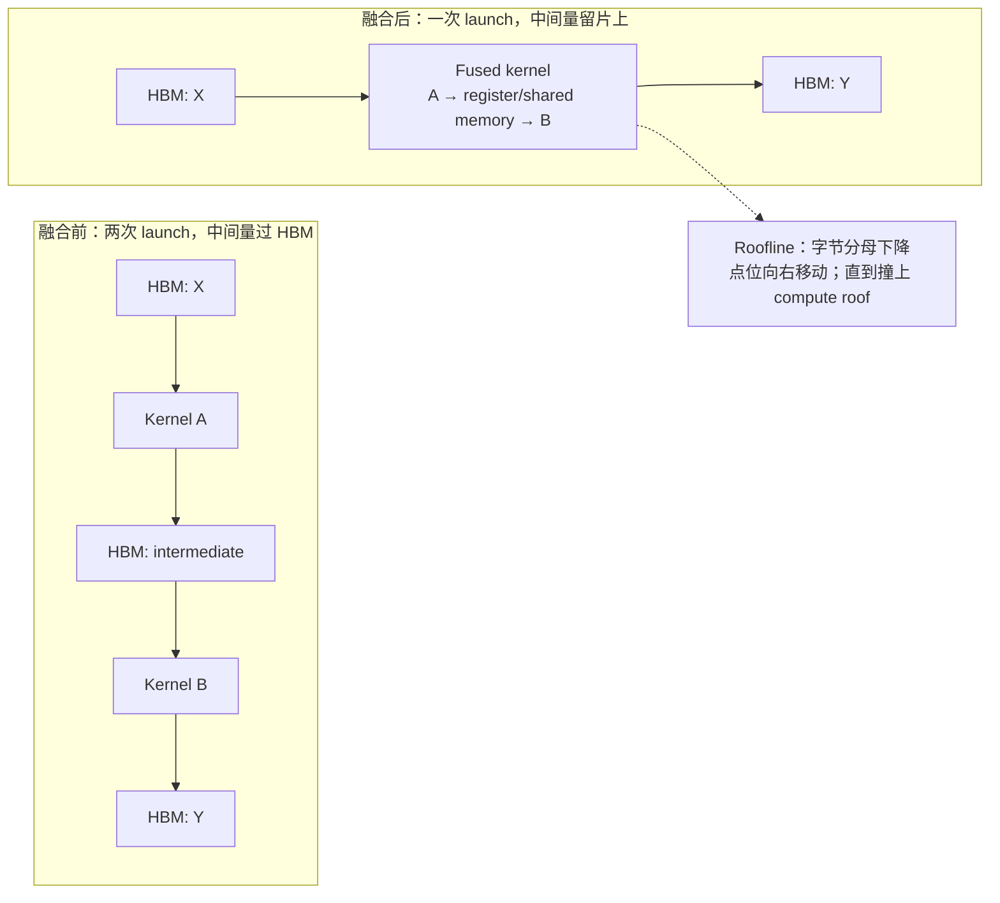
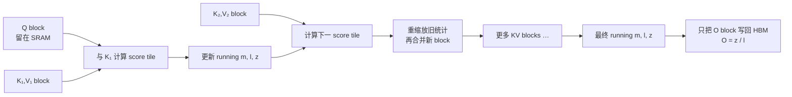
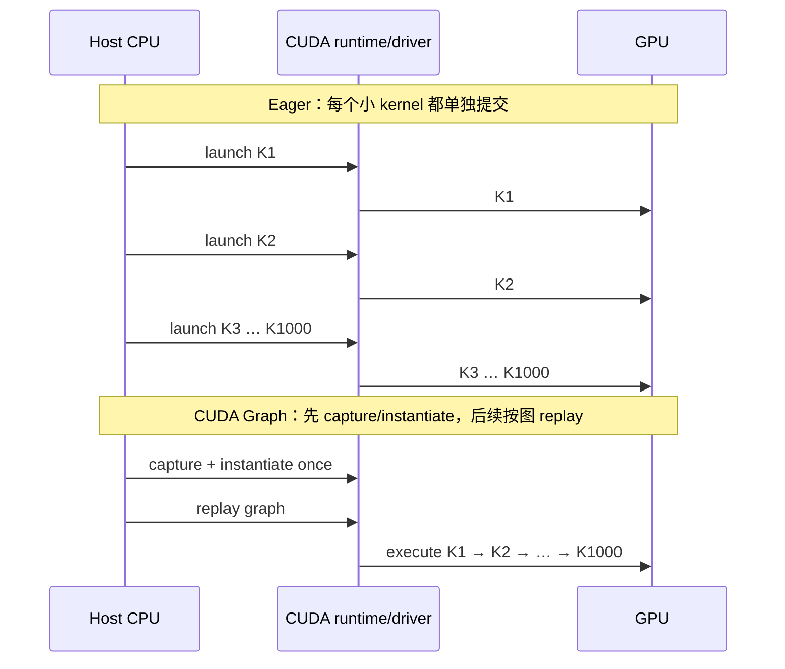

# L51 算子优化与FlashAttention：少搬一次，快的不止一点

> [!abstract] 本课速览
> 读完你将能够：
> 1. 用 Roofline 解释 kernel fusion 为什么能同时减少 HBM 流量与 launch 开销，也能判断什么时候融合无效；
> 2. 用分块和 online softmax 推导 FlashAttention 为什么保持 exact attention，却不把 $S\times S$ 矩阵写回 HBM；
> 3. 独立复算 $S=8192,h=32$ 时朴素 attention 与 FlashAttention 的简化 HBM 流量和带宽时间下界；
> 4. 区分 CUDA Graph 的 capture/replay 与 `torch.compile` 的图编译，说明二者各自消灭哪一类开销；
> 5. 在论文看到 “custom fused kernels” 时，追问融合边界、流量账与 Roofline 点位，而不是只接受一个 speedup 数字。
>
> 前置：[[L23 Roofline模型]] · [[L11 注意力机制]] · 预计 55 分钟

## 论文里的这段话，你现在可能读不懂

> [!quote]
> “Our **IO-aware** attention kernel applies **SRAM tiling** and **online softmax** so that the quadratic score matrix is never materialized in HBM. The resulting **fused kernel** reduces **memory traffic** while preserving exact attention, and recomputes local score tiles during backward. We use **SDPA** for backend dispatch, while **torch.compile** and **Triton** fuse surrounding pointwise operators. For repeated decode shapes, CUDA Graph **capture/replay** amortizes host-side kernel launch overhead.”（改写自典型系统论文与框架表述）

这段话没有说“换了一个更聪明的模型”，而是在说：数学答案基本不变，GPU 执行这道数学题的顺序变了。关键词也不是某个神秘 CUDA 指令，而是两本账：==中间结果在 HBM 与片上存储之间搬了几次，CPU 又为多少个小 kernel 逐个发了车。==

## 一、朴素 attention：算式不贵，落地中间稿很贵

[[L11 注意力机制]] 给出的单头 scaled dot-product attention 是

$$
O=\operatorname{softmax}\!\left(\frac{QK^T}{\sqrt{d_{head}}}\right)V.
$$

按框架中的算子边界直译，GPU 会先算 $QK^T$，把 $S\times S$ score 写到 HBM；softmax 再把它读出、归一化并写回；最后与 $V$ 相乘时又读一次 probability。不同实现的具体遍数会不同，但共同问题是：一个只为“接力”服务的二次方中间量反复穿过 HBM。

这里的 **memory traffic**（内存流量）指内存层级之间实际搬运的字节数，不是 tensor 最终占了多少显存，也不是数学 FLOPs。一个中间矩阵只占 4 GB，如果先写、后读、再改写，流量账就已经不止 4 GB。

回到 [[L23 Roofline模型]]：operational intensity 是“每搬 1 Byte 做多少 FLOPs”。把大中间量落到 HBM 会放大分母，使算子向 Roofline 左侧的 memory-bound 区域移动。今天的关键直觉不是“计算免费”，而是：==当算力增长快于数据搬运能力时，能不落地的中间稿就不要落地。==

> [!tip] 类比：厨房流水线
> 厨师 A 切完菜，先装盘送到仓库；厨师 B 再从仓库取回调味；厨师 C 又取回下锅——每位厨师都很快，菜却一直在路上。算子优化常做的不是换厨师，而是让几道工序共用台面上的那盆菜。

## 二、kernel fusion：把接力棒留在片上

**kernel fusion**（kernel 融合）把原本由多个 GPU kernels 完成、存在 producer-consumer 关系的 ops 合成一个 **fused kernel**（融合 kernel）。中间值尽量留在 register/shared memory 中，或者刚算出就被下一步消费，不再完整写回 HBM。它通常同时省两项：

1. 省中间结果的一写一读，降低 memory traffic；
2. 减少 kernel 数量，少付几次 host-side launch 固定开销。

你会在框架日志里反复见到这些名字：

| fused 算子 | 融合边界 | 主要省什么 |
|---|---|---|
| bias + GeLU | bias add 后立刻做 activation | 中间 activation 的 HBM 往返与一次 launch |
| fused LayerNorm | 归约统计、归一化、scale/bias | 多次逐元素扫描与小 kernel launches |
| fused AdamW | 多个逐元素 optimizer 更新步骤，常再跨多个 tensors 批处理 | optimizer state 反复读写与碎 launch |
| fused RoPE | Q/K 生成或写出时完成位置旋转 | 单独读写 Q/K 与额外 launch |

矩阵乘还有一种常见的 **epilogue fusion**（尾声融合）：GEMM 累加结束后，在结果写回 HBM 之前顺手完成 bias、activation 或量化等 epilogue。大 GEMM 本身可能已是 compute-bound，融合不会让 Tensor Core 凭空更快；收益来自取消 GEMM 输出与后续逐元素 op 之间的往返。

> [!warning] fusion 不是越大越好
> 1. compute-bound 的大 GEMM 若没有可省的中间写回，融合收益很小；先看 Roofline，别见 op 就粘。
> 2. 融合可能增加 register/shared-memory 压力，降低 occupancy，甚至让原本更快的库 kernel 无法使用。
> 3. 融合边界还必须保持 mask、dropout、dtype、随机数与 backward 语义；“结果大致相同”不是训练 kernel 的正确性标准。

## 三、FlashAttention：不保存整张表，也能做 exact softmax

### 3.1 先分块：Q 块留在片上，逐块扫描 K/V

[[L21 GPU内存体系]] 已经画过 HBM、L2 与片上存储的距离。**FlashAttention** 是一种 **IO-aware algorithm**（IO 感知算法）：设计算法时显式把 HBM 与片上 SRAM 之间的读写次数当作优化目标，而不只数 FLOPs。它用 **tiling**（分块）把 $Q,K,V$ 切成能放入片上存储的小块；具体到 GPU 内存层级，这种做法常称 **SRAM tiling**（SRAM 分块）。

固定一个 $Q$ block 后，kernel 依次载入 $K_1,V_1$，$K_2,V_2$……每次只产生一个小 score tile。这个 tile 在片上完成 softmax 局部统计和对 $V$ 的加权，消费完就可以丢掉，因此 HBM 中不需要一张完整的 $S\times S$ score/probability 矩阵。

### 3.2 再流式归一化：新最大值来了，就修正旧账

困难在 softmax：一行所有 score 没看完之前，怎么知道全局最大值和归一化分母？答案是 **online softmax**（在线 softmax）。对已经处理的 blocks，维护三个逐行状态：

- $m$：目前见过的最大 score；
- $\ell=\sum_i e^{x_i-m}$：以当前最大值为基准的指数和；
- $z=\sum_i e^{x_i-m}v_i$：同一尺度下的加权值之和。

新 block 自己算出 $m_b,\ell_b,z_b$ 后，新的共同最大值为

$$
m'=\max(m,m_b).
$$

旧账和新账分别乘尺度修正，再相加：

$$
\ell'=e^{m-m'}\ell+e^{m_b-m'}\ell_b,
$$

$$
z'=e^{m-m'}z+e^{m_b-m'}z_b.
$$

扫描完全部 KV blocks，输出就是 $O=z/\ell$。这和“月底才拿全部流水算总账”得到的是同一个 softmax 数学结果；区别只是每来一批流水就把旧账按新的最大值重标尺。因此 FlashAttention 对 dense attention 是 exact 的，不是丢 token、低秩近似或 linear attention。浮点加法归约顺序改变会造成末位差异；若使用 FA-3 的 FP8 路径，还要另计低精度量化误差，不能把“数学不近似”误读成 bitwise identical。

### 3.3 backward：宁可重算 tile，也不把 $S^2$ 中间量常驻

backward 需要 softmax probability，朴素实现会在 forward 保存它。FlashAttention 选择保存每行归一化统计等 $O(S)$ 状态，backward 再按 tile 重算局部 score/probability。这正是 [[L50 显存优化技术]] 的思想下沉到 kernel 层：用便宜、局部的 recomputation 换掉昂贵的 HBM residency 和 traffic。

所以要把两条复杂度分开说：attention 的数学计算量仍是 $O(S^2)$；不再物化完整 score/probability 后，额外 HBM memory 从 $O(S^2)$ 降为随序列线性增长的量级。FlashAttention 没把二次计算“变没”，它把二次方中间稿从远处仓库搬回了片上工作台。

## 四、算一算：$12.9\ \text{GB}$ 的中间流量怎样降到约 $0.5\ \text{GB}$

> [!example] 算一算：$S=8192,h=32$ 的简化 HBM 流量账
> 采用 [[03 约定与符号]] 的 Llama-2-7B 教学形状：$d=4096,h=32$；令 $S=8192$、BF16 每元素 2 B。容量和带宽按 SI 口径，H100 HBM 带宽取 $3.35\ \text{TB/s}=3350\ \text{GB/s}$。
>
> **第一步：一份全头 $S\times S$ 中间量有多大。**
>
> $$
> hS^2\times2\ \text{B}
> =32\times8192^2\times2
> =4{,}294{,}967{,}296\ \text{B}
> \approx4.295\ \text{GB}.
> $$
>
> 设计稿采用“三个整遍等效中间量”的简化账，代表 score 写出、softmax 读写、probability 再读等主要往返：
>
> $$
> T_{\text{naive}}
> \approx3\times4.295
> =12.885\ \text{GB}.
> $$
>
> **第二步：只看线性大小的 Q/K/V/O operands。**四个 $S\times d$ BF16 tensors 的一遍总大小为
>
> $$
> 4Sd\times2\ \text{B}
> =4\times8192\times4096\times2
> =0.268\ \text{GB}.
> $$
>
> 为与设计稿的“约 $0.5\ \text{GB}$ 级”口径一致，取两遍 Q/K/V/O 大小作为教学代理量：
>
> $$
> T_{\text{FA,proxy}}\approx2\times0.268=0.537\ \text{GB}.
> $$
>
> 因而简化流量比为
>
> $$
> \frac{T_{\text{naive}}}{T_{\text{FA,proxy}}}
> =\frac{12.885}{0.537}
> \approx24,
> $$
>
> 也就是约 $20\times$ 的数量级。若只把带宽当瓶颈，payload-only 时间下界为
>
> $$
> t_{\text{naive}}\ge\frac{12.885}{3350}\ \text{s}
> \approx3.85\ \text{ms},
> $$
>
> $$
> t_{\text{FA,proxy}}\ge\frac{0.537}{3350}\ \text{s}
> \approx0.16\ \text{ms}.
> $$
>
> 这不是“FlashAttention 一层实测 0.16 ms”。真实 kernel 还要做 $O(S^2)$ 计算，有限 SRAM 也可能让 Q/K/V tiles 重读；mask、causal 模式、head dimension、tile size 与 backward 都会改变 traffic。这里可复算的结论只有：==取消 $S^2$ 中间量的 HBM 物化，足以把主导流量从十几 GB 推到亚 GB/GB 量级，带宽下界相差约一个数量级以上。==

## 五、版本与生态：FA-2、FA-3、SDPA、xFormers 各是什么

- **FlashAttention-2 (FA-2)** 主要改进并行度与工作划分：减少非矩阵乘工作，让单个 head 也能更好地跨 thread blocks 并行，并调整 warps 间分工。核心仍是 IO-aware exact attention，不是新的注意力公式。
- **FlashAttention-3 (FA-3)** 面向 Hopper 的异步能力：用 warp specialization 与 TMA/Tensor Core 异步流水重叠搬运、matmul 和 softmax，并提供利用 FP8 的路径。FP8 是额外的低精度选择，不能和 BF16/FP16 路径的 exact 语义混成一句话。
- **SDPA**（scaled dot-product attention）是 PyTorch 的标准入口 `torch.nn.functional.scaled_dot_product_attention`。它会按 device、dtype、shape、mask 等条件选择可用的 fused backend，条件不满足时可以回退到 math 实现；调用了 SDPA 不等于一定命中 FlashAttention，应该检查 backend 或 profiler。
- **xFormers** 是提供可组合 Transformer 组件和 optimized operators 的库，`memory_efficient_attention` 是日志与旧代码里常见的入口。它与 FlashAttention、PyTorch SDPA 是相邻生态名词，不是 attention 数学的三个新分支。

官方材料可对照 [FlashAttention 原论文](https://proceedings.neurips.cc/paper/2022/hash/67d57c32e20fd0a7a302cb81d36e40d5-Abstract-Conference.html)、[FA-2 论文](https://arxiv.org/abs/2307.08691)、[FA-3 论文](https://arxiv.org/abs/2407.08608)、[PyTorch SDPA 文档](https://docs.pytorch.org/docs/stable/generated/torch.nn.functional.scaled_dot_product_attention) 与 [xFormers optimized operators 文档](https://facebookresearch.github.io/xformers/components/ops.html)。读性能图时仍要核对 GPU、dtype、causal、head dimension、forward/backward 与 baseline，不能把一个 shape 的倍数搬到另一台机器。

## 六、CUDA Graph：把一千次“发车手续”录成一次重放

[[L20 GPU体系结构入门]] 已经算过：kernel 已经很短时，CPU/driver 为每个 kernel 单独准备和提交工作的固定成本会冒出来。**CUDA Graph**（CUDA 图）把一串 kernels、memcpy 及其依赖先定义/捕获并实例化，之后反复提交同一 executable graph。这个过程常概括为 **graph capture/replay**（图捕获/重放）：capture 录下工作与依赖，replay 低开销重复提交。

> [!example] 算一算：launch 为什么能吃掉半步时间
> [[03 约定与符号]] 给出的 kernel launch 开销量级为约 $3$–$10\ \mu\text{s}$。按设计稿在区间内取 $4\ \mu\text{s}$，若一个 decode step 发射 1000 个小 kernels：
>
> $$
> t_{\text{launch}}=1000\times4\ \mu\text{s}=4000\ \mu\text{s}=4\ \text{ms}.
> $$
>
> 再设一个明确的教学场景：这些 kernels 在 GPU 上的纯执行时间合计约 $5\ \text{ms}$。那么 eager step 约为 $4+5=9\ \text{ms}$，launch 占总时间
>
> $$
> \frac{4}{4+5}\approx44.4\%,
> $$
>
> 确实接近半步。CUDA Graph 不会省掉 kernels 自己的 $5\ \text{ms}$，也不是把 1000 个 kernels 融成一个 kernel；它主要把逐个提交的约 $4\ \text{ms}$ 固定开销压到一次 graph replay 的较小开销。$5\ \text{ms}$ 是场景假设，不是任意模型或 GPU 的统一 decode 时间。

代价是可重放性约束。常用 PyTorch capture 路径要求操作、控制流、shape 和内存地址足够稳定，CPU-GPU 同步或 capture 不兼容操作也会打断它。服务系统面对动态 batch，常用 padding/bucketing 为若干 shape 各录一张图，或者在 full、piecewise 与 eager 之间 dispatch。vLLM 的 [CUDA Graph 设计文档](https://docs.vllm.ai/en/stable/design/cuda_graphs/) 就把 pure decode 与混合 batch 分开处理。==“静态”不是请求永远一样，而是给 replay 找到一组可复用的执行外形。==

## 七、`torch.compile`、Inductor 与 Triton：自动融合能做到哪里

[[L26 加速器生态与软件栈]] 已经给过这些组件的地图；这里把执行路径拆开。`torch.compile` 与 CUDA Graph 解决的不是同一层问题：

| 机制 | 看见什么 | 主要动作 | 主要省什么 |
|---|---|---|---|
| `torch.compile` + TorchInductor | PyTorch 程序与可捕获计算图 | 图优化、调度、fusion、code generation | Python/framework overhead、中间 HBM traffic、kernel launches |
| CUDA Graph capture/replay | 一次具体执行的 CUDA 工作与依赖 | 录制、实例化、重复提交 | host/driver 逐 kernel launch overhead 与 jitter |

**torch.compile** 是 PyTorch 的图编译入口：先捕获可编译区域，再交给默认 backend **TorchInductor** 做调度、自动融合和代码生成。GPU 上，Inductor 常生成 **Triton** kernel。Triton 是面向 tiled parallel program 的 Python DSL 与编译器：对研究者来说，它像“写 GPU kernel 的白话文”，屏蔽了不少 CUDA 线程级样板；但 tile、layout、数据复用、并行划分和 benchmark 仍要人做，写成 Triton 不等于自动写快。

编译器擅长融合相邻 pointwise ops、简单 reduction/producer-consumer 链，以及把 bias/activation 融进已有 template 的 epilogue；它不保证跨 graph break、动态控制流、不支持的自定义 op 或通信边界做全局融合。FlashAttention 这类需要新 online algorithm、片上存储账和硬件特化的 kernel，也不会仅靠把朴素 attention 外面套一层 `torch.compile` 就自动出现。

因此不要问“自动编译能达到手写 kernel 的几成”这种没有 shape、硬件和 baseline 的问题。现实评估应当是：先检查 graph breaks 与生成 kernel 数，再按目标 shapes benchmark eager/compiled/custom 三条路径，同时核对编译冷启动、显存和数值正确性。编译器覆盖规则子图，手写/Triton kernel 攻特殊热点，两者长期是分工，不是淘汰关系。

## 八、读到 “we implement custom fused kernels” 时追问什么

对 MLSys × 网络研究，这句话不能只翻译成“作者写了 CUDA”。至少追问三件事：

1. **融合了什么边界？** 是 pointwise chain、GEMM epilogue、normalization、optimizer，还是 attention 全子图？mask、dropout、精度与 backward 语义是否一致？
2. **省了几次往返和 launches？** 列出融合前后的中间 tensors、每个 tensor 的 bytes、HBM 读写遍数与 kernel 数；峰值显存和 memory traffic 要分开报告。
3. **Roofline 点位挪了多远？** operational intensity 是否真的提高，瓶颈是否从 memory/launch 转向 compute；收益能否跨 batch、sequence length、dtype 与 GPU 代际成立？

还要做一次端到端复诊：kernel 快了以后，原来被计算遮住的 NCCL 可能暴露，数据加载或 pipeline bubble 也可能成为新瓶颈。单 kernel 快 2× 不等于多机训练 step 快 2×；下一课 [[L52 性能剖析与MFU核算]] 会用 timeline 判断加速最终落到了哪里。

## 回到开头那段话

现在逐句回读：

1. “IO-aware ... SRAM tiling and online softmax ... never materialized in HBM。”——FlashAttention 固定 Q block、扫描 KV blocks，用 running $m,\ell,z$ 修正旧账；因此保持 dense attention 数学结果，却不把全头 $S\times S$ 中间量落到 HBM。
2. “fused kernel reduces memory traffic ... recomputes ... backward。”——fusion 把 tile 的 score、softmax 与乘 $V$ 放进同一片上流水；backward 重算局部 tile，正是 kernel 级 recomputation。$S=8192,h=32$ 的教学账从约 12.885 GB 降到约 0.537 GB 代理量，约 24×。
3. “SDPA for backend dispatch ... torch.compile and Triton fuse surrounding ...。”——SDPA 是 attention 标准入口并按条件选 backend；`torch.compile`/Inductor 捕获并优化周围图，GPU codegen 常落到 Triton，但不保证自动发明 FlashAttention 这样的新算法。
4. “CUDA Graph capture/replay amortizes ... launch overhead。”——它不融合 1000 个 kernels 的数学工作，而是把逐个提交变成一张可重放图；按 $4\ \mu\text{s}$ 教学口径，1000 次 launch 就是 4 ms。

开场那段话现在可以压成一句系统判断：==FlashAttention 省的是二次方中间量的 HBM 往返，kernel fusion 省的是算子边界，CUDA Graph 省的是重复提交，图编译则尝试自动发现前两类机会的一部分。==

## 术语卡片

| 术语 | 中文 | 一句话解释 |
|---|---|---|
| kernel fusion | kernel 融合 | 把有 producer-consumer 关系的多个 ops 合进更少 kernels，减少中间 HBM 往返与 launch。 |
| fused kernel | 融合 kernel | 在一次 kernel 执行中完成多个原本分离的 ops。 |
| memory traffic | 内存流量 | 内存层级之间实际搬运的总字节数，不等于 tensor 驻留容量。 |
| FlashAttention | IO 感知精确注意力 | 用 tiling、online softmax 与重计算避免在 HBM 物化完整 attention 矩阵。 |
| tiling | 分块 | 把大 tensor/计算域拆成适合片上存储和并行执行的小块。 |
| online softmax | 在线 softmax | 增量维护运行最大值、指数和与加权和，逐块合并出完整 softmax。 |
| IO-aware algorithm | IO 感知算法 | 把不同内存层级间的读写复杂度纳入算法设计目标。 |
| SRAM tiling | SRAM 分块 | 让工作集按 tile 进入片上 SRAM/shared memory，减少 HBM 往返。 |
| FlashAttention-2 (FA-2) | FlashAttention 2 | 通过更好的并行度和 thread block/warp 工作划分改进 FA。 |
| FlashAttention-3 (FA-3) | FlashAttention 3 | 面向 Hopper 异步流水与 FP8 能力进一步特化 attention。 |
| SDPA | scaled dot-product attention 入口 | PyTorch 中可按输入条件 dispatch 到 fused 或 math backend 的标准 attention API。 |
| xFormers | Transformer 优化组件库 | 提供可组合组件和 memory-efficient attention 等 optimized operators。 |
| CUDA Graph | CUDA 图 | 把一串 CUDA 工作及依赖实例化为可低开销重复提交的图。 |
| graph capture/replay | 图捕获/重放 | 先记录可复用 GPU 工作图，再反复提交同一图实例。 |
| torch.compile | PyTorch 图编译入口 | 捕获可编译程序区域并交给 Inductor 等 backend 优化与生成代码。 |
| Triton | GPU kernel 语言与编译器 | 用 Python DSL 表达 tiled parallel kernels 并生成 GPU 代码。 |
| epilogue fusion | 尾声融合 | 在 GEMM 结果写回 HBM 前融合 bias、activation 或量化等尾部操作。 |

## 自测

1. memory traffic 与显存占用量有什么区别？为什么同一个 4 GB tensor 可能产生超过 4 GB 的 traffic？
2. kernel fusion 在 Roofline 图上通常怎样移动点位？为什么 compute-bound GEMM 不一定因 fusion 变快？
3. online softmax 为什么在看到更大的新 score 后仍能修正旧 blocks？请解释 $e^{m-m'}$ 的作用。
4. **计算题**：$S=8192,h=32$、BF16 时，一份全头 $S\times S$ 矩阵多少 GB？按三个整遍等效 traffic 和 H100 3.35 TB/s，payload-only 时间下界是多少？
5. FlashAttention 为什么可以说 exact、显存随 $S$ 线性增长，却不能说计算量变成 $O(S)$？
6. 1000 个 kernels、每次 launch $4\ \mu\text{s}$，GPU 纯执行 6 ms。eager 教学 step 多久，launch 占比多少？CUDA Graph 省掉和省不掉的分别是什么？
7. 论文声称 custom fused kernel 快 2×，你会要求作者补充哪三类证据？为什么分布式训练还要重新看 NCCL timeline？

> [!note]- 参考答案
> 1. 占用量是某时刻驻留多少 bytes；traffic 是执行期间跨层级累计搬多少 bytes。同一 tensor 若被写一次、读两次，就会累计约三倍于其容量的 traffic。
> 2. fusion 减少 bytes 分母，使 operational intensity 增大，点位通常向右移，memory-bound 时可提高性能；compute-bound GEMM 已撞算力屋顶，若没有中间往返可省，融合不会提高 Tensor Core 峰值，还可能因资源压力变慢。
> 3. $m'$ 是新旧 blocks 的共同最大值。旧指数原按 $m$ 缩放，乘 $e^{m-m'}$ 就换到以 $m'$ 为基准的尺度；新 block 同理，二者才能在同一标尺上相加。
> 4. $32\times8192^2\times2=4.295$ GB；三遍为 $12.885$ GB，时间下界 $12.885/3350\ \text{s}\approx3.85$ ms。它不含计算与协议/实现开销，不是 kernel 实测。
> 5. 分块和 online softmax 取消了完整 $S^2$ 中间量的 HBM residency，所以辅助 memory 可线性随 $S$ 增长；每个 query 仍要和 $S$ 个 keys 交互，dense attention 数学工作仍为 $O(S^2)$。
> 6. launch 为 $1000\times4\ \mu\text{s}=4$ ms，教学 eager step 为 $4+6=10$ ms，launch 占 40%。CUDA Graph 减少逐 kernel host/driver 提交开销与 gap，不省 6 ms kernel 执行，也不自动融合 kernels。
> 7. 至少要融合边界与语义正确性、前后 bytes/往返/launch 账、跨 shape/硬件的 Roofline 与端到端结果。kernel 加速会缩短 compute window，使原先隐藏的 NCCL 可能变成 exposed communication，所以要重看完整 timeline。

## 延伸阅读

- [《FlashAttention: Fast and Memory-Efficient Exact Attention with IO-Awareness》](https://proceedings.neurips.cc/paper/2022/hash/67d57c32e20fd0a7a302cb81d36e40d5-Abstract-Conference.html)（NeurIPS 2022）：精读第 3.1 节算法框，逐项对应本课的 tile、running max/sum 与 backward recomputation。
- [FlashAttention-2](https://arxiv.org/abs/2307.08691) 与 [FlashAttention-3](https://arxiv.org/abs/2407.08608)：先只读摘要和主架构图，辨认“工作划分改进”与“Hopper 异步/FP8 特化”两条演进线。
- [Making Deep Learning Go Brrrr From First Principles](https://horace.io/brrr_intro.html)：带着 [[L23 Roofline模型]] 重读 fusion、overhead 与 memory bandwidth，把“GPU 忙”拆成可测的瓶颈。
- [CUDA Programming Guide: CUDA Graphs](https://docs.nvidia.com/cuda/cuda-programming-guide/04-special-topics/cuda-graphs.html) 与 [PyTorch `torch.compile` 文档](https://docs.pytorch.org/docs/stable/generated/torch.compile.html)：对照两种“graph”分别捕获什么、优化什么。
- [Triton 官方 Tutorials](https://triton-lang.org/main/getting-started/tutorials/)：从 Vector Addition 开始，再看 Fused Softmax；重点是学 tile 与验证/benchmark 方法，不必在本课手写 attention。

---
上一课：[[L50 显存优化技术]] ← · → 下一课：[[L52 性能剖析与MFU核算]]
