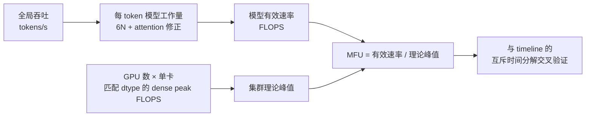
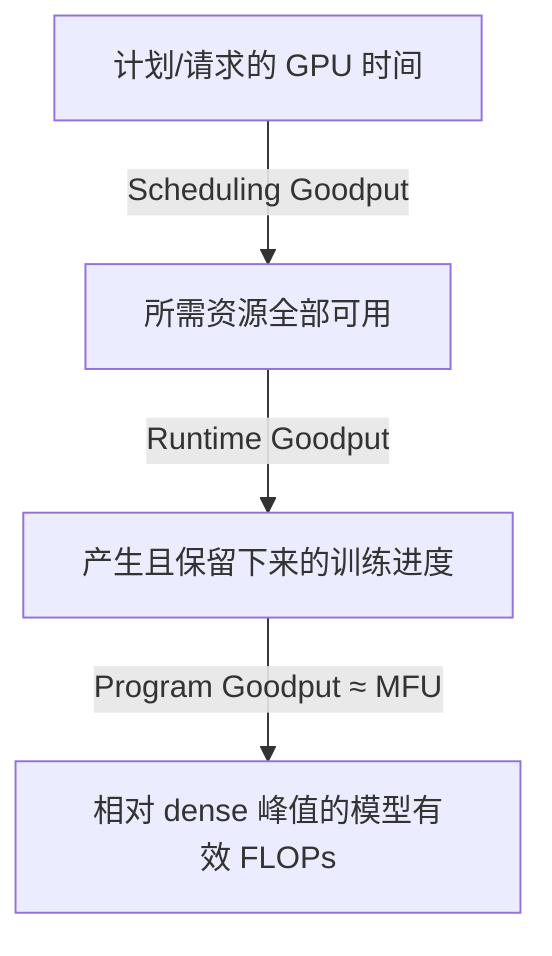

# L52 性能剖析与MFU核算：从一条timeline到瓶颈诊断

> [!abstract] 本课速览
> 读完你将能够：
> 1. 按“框架算子 → 系统全景 → 单 kernel → 集群遥测”选择 profiler，不再把所有慢都归给 GPU 或网络；
> 2. 从多 rank timeline 正面识别 dataloader stall、exposed communication、pipeline bubble、launch-bound 和 straggler/desync 五类病征；
> 3. 从全局 tokens/s 独立核算 70B 训练的 MFU，并用互斥的时间分解交叉验证；
> 4. 区分 MFU 与 goodput：前者问“跑起来时有多高效”，后者还扣掉排队、故障和恢复造成的可用性损失；
> 5. 用一段可在 CPU 或 CUDA 上运行的 `torch.profiler` 模板导出 trace，并在 10 分钟内完成首轮排查。
>
> 前置：[[L22 算力度量与MFU]] · [[L38 NCCL解剖]] · [[L44 流水线并行]] · 预计 55 分钟

## 论文里的这段话，你现在可能读不懂

> [!quote]
> “We first use **torch.profiler** to export a **Chrome trace**, then inspect CPU threads and **CUDA streams** in **Nsight Systems**. Cross-rank **timelines** reveal **dataloader stalls**, **launch-bound** regions, **exposed communication**, pipeline bubbles, and **stragglers** that cause **desynchronization**. We finally audit **MFU** from global token throughput and report **goodput** over useful elapsed time; on collective timeouts, a NCCL **flight recorder** preserves the recent communication history.”（改写自典型训练系统、PyTorch 与 NVIDIA profiler 表述）

这段话真正描述的是一条诊断链：先保存现场，再按时间因果找病征，最后用 MFU 和 goodput 两本总账验收。没有这条链，“训练慢”通常会退化成三句猜测：GPU 没打满、网络有问题、再加几张卡试试。

## 一、先选对尺子：四层工具箱各回答一个问题

**profiling**（性能剖析）不是“打开一个监控面板”，而是记录程序在一段时间内的事件、持续时间和资源指标，再把端到端症状归因到具体执行层。先用宽视角定位，再逐层放大：

| 层次 | 工具 | 最擅长看什么 | 何时切到下一层 |
|---|---|---|---|
| 框架级 | **torch.profiler**（PyTorch profiler） | PyTorch op、shape、CPU/CUDA 时间、调用栈；可导出 **Chrome trace**（Chrome trace 事件文件） | 已知慢 step，但还不知道是哪类 op、CPU 还是 GPU |
| 系统级 | **Nsight Systems**（Nsight 系统级剖析器） | CPU threads、CUDA API、各 GPU/stream 的 kernels 与 memcpy、NVTX 区间及其时间相关性 | 已定位某个慢 kernel，要追 SM、HBM、stall 原因 |
| kernel 级 | **Nsight Compute**（Nsight kernel 级剖析器） | 单 kernel 的 compute/memory throughput、occupancy、warp stall 等指标 | 找到 kernel 内部机制后，回端到端 trace 验证收益 |
| 集群级 | **DCGM**（Data Center GPU Manager）/`nvidia-smi` | 低开销连续遥测、设备健康、温度、功耗、SM/显存活动与节点间异常 | 找到异常主机或时间窗后，对目标 rank 做精细 trace |

[PyTorch Profiler 官方 recipe](https://docs.pytorch.org/tutorials/recipes/recipes/profiler_recipe.html)展示了 op 统计与 trace 导出；[Nsight Systems 用户指南](https://docs.nvidia.com/nsight-systems/UserGuide/index.html)明确把 CPU API、GPU kernel、memcpy 和各 stream 放在同一时间视图中；[Nsight Compute](https://docs.nvidia.com/nsight-compute/NsightCompute/index.html)则是交互式 kernel profiler。[DCGM 文档](https://docs.nvidia.com/datacenter/dcgm/latest/learn/modules/profiling.html)也强调：它的连续指标是时间区间平均，不是 kernel trace，适合先找异常设备，再下钻。

> [!warning] `GPU-Util=100%` 只是“诊室门口一直有人”
> [[L22 算力度量与MFU]] 已经说明，`nvidia-smi` 的 GPU utilization 只问采样窗内是否有 kernel 在执行。一个低吞吐通信 kernel 或一串小 kernel 也能占满时间轴；它证明 GPU 没完全睡着，不能证明 Tensor Core 高效，更不能替代 MFU。

## 二、timeline 怎么读：先认行，再找洞，最后追因果

**timeline**（时间线）横轴是时间，纵轴是资源或软件实体。它像医院心电图：块的名字说明“谁在干活”，宽度说明“干了多久”，上下对齐说明“CPU 发起、GPU 执行、通信等待”是否发生在同一时段。颜色随工具与主题变化，==不要背颜色；看事件名、所在行和持续时间。==

从上到下先认五类行：

1. CPU/Python/PyTorch op 或 NVTX 行：step、forward、backward、optimizer、DataLoader 在何时执行；
2. CUDA API 行：`cudaLaunchKernel`、同步与内存 API 是何时由 host 发出的；
3. 每张 GPU 下的 **CUDA stream**（CUDA 流）行：同一 stream 内按序执行，不同 streams 在资源和依赖允许时可重叠；
4. kernel 块：GEMM、attention、逐元素 kernel，以及名字带 `nccl` 的通信 kernel；
5. memcpy/memset 行：H2D、D2H、D2D copy 是否挤在关键路径上。

块与块之间没有 GPU 工作的空白称为 **gap**（时间空隙）。但 gap 只是症状，不是病名：可能是 DataLoader 没供上、CPU 没及时 launch、同步依赖未满足，或另一个 rank 还没到。读 trace 的固定动作是：==在 GPU 行圈出 gap → 垂直向上找 CPU/API 事件 → 横向比较其他 streams → 再比较其他 ranks。==

> [!tip] 三个缩放级别
> 先看多个稳态 steps，判断周期与长尾；再放大一个典型 step，找关键路径；最后才放大一个 kernel。直接从纳秒级细节开看，像拿显微镜找失踪的整节火车。

## 三、五大病征图谱：长什么样、怎么确诊、药方在哪

下面的块宽仅表示相对时长，是注释版示意图，不是某次实测。`GAP` 表示设备没有可执行工作；NCCL 块若和 compute 位于不同 stream 且横向重叠，才可能被隐藏。

```mermaid
flowchart TB
    subgraph A[① dataloader stall：step 之间断粮]
        direction LR
        A1[Step k compute] --> A2[GAP<br/>CPU 等 batch] --> A3[Step k+1 compute]
    end
    subgraph B[② exposed communication：通信露在关键路径]
        direction LR
        B1[Backward compute] --> B2[NCCL<br/>无 compute 覆盖] --> B3[Next work]
    end
    subgraph C[③ pipeline bubble：stage 没有 micro-batch]
        direction LR
        C1[Stage work] --> C2[BUBBLE<br/>等待相邻 stage] --> C3[Stage work]
    end
    subgraph D[④ launch-bound：碎 kernel 海]
        direction LR
        D1[k] --> D2[gap] --> D3[k] --> D4[gap] --> D5[k] --> D6[gap] --> D7[k]
    end
    subgraph E[⑤ straggler/desync：多 rank 参差]
        direction LR
        E1[rank 0 compute] --> E2[rank 0 wait]
        E3[rank 1 compute compute compute] --> E4[rank 1 arrives late]
    end
    classDef compute fill:#b7e4c7,stroke:#2d6a4f,color:#111;
    classDef comm fill:#a9d6e5,stroke:#2c7da0,color:#111;
    classDef idle fill:#ffd6a5,stroke:#bc6c25,color:#111;
    class A1,A3,B1,B3,C1,C3,D1,D3,D5,D7,E1,E3 compute;
    class B2 comm;
    class A2,C2,D2,D4,D6,E2,E4 idle;
```



| 病征 | timeline 上的长相 | 确诊法 | 常见药方 |
|---|---|---|---|
| **dataloader stall**（数据加载停顿） | 相邻 steps 间有大块 GPU gap，CPU 的取 batch/I/O 区间拖到临界点 | 用预生成 device tensor 替代真实输入做 A/B；看 CPU worker、I/O 与 H2D 是否晚到 | 增加/调优 worker、prefetch、pinned memory、本地缓存与数据分片；见 [[L34 存储与数据供给]] |
| **exposed communication**（暴露通信） | NCCL kernel 落在计算之后，横向没有 compute 覆盖，直接拉长 step | 比较 collective 总时长与“未重叠并进入关键路径”的时长；改变 bucket/并行映射做消融 | 提前启动 bucket、调整切分/拓扑映射、减少或重排 collective；见 [[L41 数据并行与DDP]]、[[L43 张量并行]] |
| pipeline bubble | 某 PP stage 有周期性空窗，而别的 stage 正在算；填充/排空最明显 | 对齐所有 stages 与 micro-batch ID；核对是否符合 [[L44 流水线并行]] 的理论气泡率 | 增加 micro-batch、均衡 stage、interleaving 或调整 schedule |
| **launch-bound**（受 kernel 发射限制） | 大量极短 kernels，中间夹着规则 host gap；CPU launch/API 行很密 | 汇总 kernel 时长与 launch latency；用 fusion、CUDA Graph 或 compiled 路径做 A/B | kernel fusion、`torch.compile`、CUDA Graph；见 [[L51 算子优化与FlashAttention]] |
| **straggler**（掉队者）/ **desync**（不同步推进） | 多 rank 的相同阶段结束时间参差，快 rank 在 collective/依赖处等待 | 按 rank 比较同名区间分布；结合 token load、网络/温度/降频与 collective 序号定位最慢者 | 负载均衡、亲和性/拓扑修正、隔离故障设备；MoE 见 [[L46 专家并行与MoE训练]] |

其中 desync 描述“时间轴或 collective 进入次序不再对齐”，straggler 描述“谁完成得最晚”。慢 rank 可以造成 desync，但 desync 也可能来自控制流分叉或不同 rank 调用了不一致的 collectives；两词不能互换。

## 四、多机 profile：只看 rank 0，常会把受害者当凶手

多机分析的第一步是 **clock synchronization**（时钟同步）：让不同主机的时间戳可比较。否则 rank 3 看似“晚到 2 ms”，可能只是两台机器的时钟基准偏了。采集前应维护集群时钟同步，并在 trace 中加入同一逻辑 barrier/step ID/NVTX 标记作二次对齐；报告里要写清使用了绝对时间、相对 step 时间还是后处理对齐。

只看 rank 0 的陷阱是：rank 0 常显示一段 NCCL wait，但真正的慢点可能在 rank 317 的 DataLoader、热点 expert、拥塞路径或降频 GPU。首轮不一定全量长时间 profile 所有 ranks；可以先用 DCGM/step-time 分位数找代表 rank、慢 rank 和不同故障域，再对同一稳态窗口做短 trace。比较时至少绑定 `rank → host → GPU → NIC → parallel group`，否则“rank 号”无法落到物理资源。

`NCCL_DEBUG=INFO` 能提供 communicator、拓扑选择和错误线索；遇到 hang/timeout 时，**flight recorder**（飞行记录器）更像黑匣子。PyTorch 的 NCCL flight recorder 用环形缓冲保留近期 collective 元数据、时间与可选调用栈，并可在 watchdog/timeout 时按 rank dump；[官方教程](https://docs.pytorch.org/tutorials/unstable/flight_recorder_tutorial.html)列出了 `TORCH_NCCL_TRACE_BUFFER_SIZE`、`TORCH_NCCL_DUMP_ON_TIMEOUT` 和 timing/stack 选项。它主要回答“最近各 rank 进入了哪些 collective、卡在哪一个”，不是替代 Nsight 的常态性能全景；具体变量和默认值要按所用 PyTorch 版本核对。[[L53 大规模训练可靠性]] 会把 timeout、故障检测和恢复串起来。

## 五、MFU accounting：从吞吐到可审计报告

**MFU accounting**（MFU 核算）是把训练吞吐、模型工作量与硬件峰值统一到同一本账。端到端模板是：



设全局吞吐为 $R_{tok}$、每 token 模型工作量为 $F_{tok}$、卡数为 $G$、单卡匹配 dtype 的稠密峰值为 $P_{dense}$：

$$
\text{MFU}=\frac{R_{tok}F_{tok}}{GP_{dense}},
\qquad
F_{tok}\approx6N+C_{attention}.
$$

普通上下文可先用 [[03 约定与符号]] 的 $6N$；长序列要按 [[L16 Scaling Law与算力账]] 加回 attention 修正。报告没给 $S$ 和 FLOPs 公式时，只能复算 $6N$ 粗估，不能擅自补一个“精确 attention 项”。

> [!example] 算一算：70B、512 张 H100 的 MFU 审计
> 题设：70B dense 模型、512 张 H100 SXM、BF16 训练，全局实测吞吐 $4.2\times10^5$ tokens/s。按 [[03 约定与符号]]，取 $N=70\times10^9$、每 token 训练工作量 $6N$，H100 BF16 **dense** 峰值约 $989\ \text{TFLOPS}=989\times10^{12}\ \text{FLOPS}$。题目没有给序列长度，因此本题明确不加 attention 修正。
>
> **① 每 token 模型 FLOPs**
> $$
> F_{tok}=6N=6\times70\times10^9
> =4.2\times10^{11}\ \text{FLOPs/token}.
> $$
>
> **② 全局模型有效速率**
> $$
> P_{model}=4.2\times10^5\times4.2\times10^{11}
> =1.764\times10^{17}\ \text{FLOPS}.
> $$
>
> **③ 集群 BF16 dense 峰值**
> $$
> P_{peak}=512\times989\times10^{12}
> =5.06368\times10^{17}\ \text{FLOPS}.
> $$
>
> **④ 相除**
> $$
> \text{MFU}=\frac{1.764\times10^{17}}{5.06368\times10^{17}}
> =0.34836\approx\boxed{34.8\%}.
> $$
>
> 若误用 H100 BF16 的 2:4 sparse 营销峰值作分母，结果会被压到约一半；这是口径错误，不是系统突然慢了一倍。

### 用时间分解交叉验证：百分比能不能直接相加

再给同一算例一份明确的教学假设：在稳态窗口里，把关键路径切成互斥类别——pipeline bubble 12%、exposed communication 15%、dataloader/host gap 8%、launch gap 5%，其余 60% 是实际执行模型有效 kernels 的窗口。假设这些 kernels 在窗口内平均交付 dense 峰值的 58% 模型有效 FLOPS，则：

$$
12\%+15\%+8\%+5\%=40\%,
$$

$$
\text{MFU}_{decomp}\approx(1-40\%)\times58\%=34.8\%.
$$

它与吞吐法的 34.8% 对上，说明这份分解至少账面自洽。注意：通信与计算若重叠，不能把 NCCL kernel 总时长直接加到损失；desync wait 也可能已经包含在 exposed communication 中。==只加互斥的关键路径时间，重叠区取并集，不重复收费。==

### 审计别人 MFU 声明的错误清单

| 错误 | 会怎样错 | 正确追问 |
|---|---|---|
| 用 sparse 峰值或错 dtype | 分母常差约一倍 | GPU 形态、训练 dtype、dense/sparse 行是哪一项？ |
| 把 sequences/s 当 tokens/s | 漏乘序列中的有效 token 数 | 吞吐是全局 token、sample 还是 sequence？padding 是否计入？ |
| 把单卡吞吐当全局吞吐，或反之 | 分子多/少乘一次卡数 | 测量边界覆盖多少 ranks？ |
| 长序列仍只用 $6N$ | 低估 attention 工作量 | $S$、架构 config 与逐项 FLOPs 公式是什么？ |
| MoE 用总参数代替 active 参数 | 严重高估模型有效 FLOPs | 每 token active parameters 与路由口径是什么？ |
| 把重计算计入 MFU | 用额外工作“奖励”系统 | 模型必要 FLOPs 是 MFU；硬件实际执行量属于 HFU |
| 只 profile 编译/warmup/checkpoint step | 不代表稳态吞吐 | 统计窗口、排除项与 step-time 分布是什么？ |

## 六、goodput：MFU 之上还有可用性折扣

**goodput**（有效吞吐）在不同论文里定义并不唯一，共同点是只统计真正推进目标的工作。本课采用可复算的训练时间分层：

- Scheduling Goodput：请求/计划运行的时间中，所需全部资源可用的比例；
- Runtime Goodput：资源已可用的时间中，产生并保留有效训练进度的比例，故障后丢失的未 checkpoint 工作不算；
- Program Goodput：推进训练时，从硬件峰值中提取的比例，在该口径下近似对应 MFU。

这套 `Scheduling / Runtime / Program Goodput` 分层来自 [Google Cloud 的 ML Productivity Goodput 定义](https://cloud.google.com/blog/products/ai-machine-learning/goodput-metric-as-measure-of-ml-productivity/)，不是 Meta 专属术语。三层可写成：



$$
G_{end\text{-}to\text{-}end}
\approx G_{sched}\times G_{runtime}\times \text{MFU}.
$$

如果只从“已经分配到作业的 GPU 时间”开始计，集群真实产出系数约为 $G_{runtime}\times\text{MFU}$。因此 MFU 34.8% 的作业也可能因频繁故障而交付更低的长期产出；反过来，100% Runtime Goodput 只说明不掉线，不代表 kernels 高效。

《[The Llama 3 Herd of Models](https://arxiv.org/abs/2407.21783)》报告其大规模预训练的 effective training time 高于 90%，并将其定义为 useful training time / elapsed time；它可视为与 Runtime Goodput 相近的可用性指标，但论文没有使用上述完整三层命名。下一课会继续讨论 checkpoint、恢复和故障怎样改变这层折扣。

## 七、实操附录：导出一份可读 trace

下面模板依赖 PyTorch 2.x。无 NVIDIA GPU 或 Apple Silicon 会走 CPU 路径；有 CUDA 时同时采集 CPU/CUDA activity。它跳过一个 wait step、做一个 warmup step，再记录三个稳态 steps，最终生成 `trace.json`。

```python
import torch
from torch import nn
from torch.profiler import ProfilerActivity, profile, record_function, schedule

device = torch.device("cuda" if torch.cuda.is_available() else "cpu")
activities = [ProfilerActivity.CPU]
if device.type == "cuda":
    activities.append(ProfilerActivity.CUDA)

model = nn.Sequential(
    nn.Linear(512, 2048), nn.GELU(), nn.Linear(2048, 512)
).to(device)
optimizer = torch.optim.AdamW(model.parameters(), lr=1e-3)

with profile(
    activities=activities,
    schedule=schedule(wait=1, warmup=1, active=3, repeat=1),
    record_shapes=True,
    on_trace_ready=lambda p: p.export_chrome_trace("trace.json"),
) as prof:
    for step in range(5):
        with record_function("input_pipeline"):
            x = torch.randn(64, 512).to(device)
        with record_function("train_step"):
            optimizer.zero_grad(set_to_none=True)
            loss = model(x).square().mean()
            loss.backward()
            optimizer.step()
        prof.step()

print(f"device={device}; wrote trace.json")
```

用 Perfetto/Chrome trace viewer 打开后，按这份“10 分钟检查清单”走：

1. **0–1 分钟**：确认记录的是多个稳态 steps，不是编译、warmup 或 checkpoint；
2. **1–2 分钟**：用 `train_step`/NVTX 找 step 边界，先记 p50 与最慢 step；
3. **2–3 分钟**：圈出 GPU gap，向上追 CPU、DataLoader 和 CUDA API；
4. **3–4 分钟**：展开所有 CUDA streams，检查 compute、NCCL、memcpy 的依赖；
5. **4–5 分钟**：只统计 exposed communication，不把已重叠 NCCL 重复记损失；
6. **5–6 分钟**：按 PP stage/micro-batch 找周期性 bubble；
7. **6–7 分钟**：看是否存在大量短 kernel 与规则 launch gap；
8. **7–8 分钟**：对齐代表 ranks，找最慢 rank，而非只看 rank 0；
9. **8–9 分钟**：用 DCGM/NIC/温度/频率数据解释异常 rank；
10. **9–10 分钟**：写下一个可证伪假设与 A/B 实验，再用 tokens/s、MFU 收口。

多 rank trace 数量很大时，可选用 [Holistic Trace Analysis（HTA）](https://github.com/facebookresearch/HolisticTraceAnalysis)批量计算各 rank 的 compute/communication/idle 分解、通信计算重叠、kernel 分布和 launch 统计；它加速找异常，不替代对关键 trace 的人工因果阅读。

> [!warning] profiler 也会改变被测对象
> 记录 shape、stack、memory 或硬件 counters 都可能增加开销；精细模式应缩短窗口并做“开 profiler / 不开 profiler”的 step-time 对照。一次 profile 一个 step 也不够：编译首步、warmup、周期性 checkpoint 和偶发 straggler 都可能伪装成稳态。

## 回到开头那段话

现在逐句回读：

1. “use torch.profiler ... Chrome trace ... CPU threads and CUDA streams in Nsight Systems。”——先用框架级 trace 把 op、CPU 与 device activity 对上，再用 Nsight Systems 检查 CPU API、每条 stream、kernel 与 memcpy 的系统级因果；单 kernel 细节才交给 Nsight Compute。
2. “Cross-rank timelines reveal ... five symptoms。”——dataloader stall 是 step 间断粮，launch-bound 是短 kernel 与 host gap 交替，exposed communication 是 NCCL 没藏住，pipeline bubble 是 stage 无 micro-batch，straggler/desync 则要靠多 rank 对齐找最慢者。
3. “audit MFU ... report goodput ... flight recorder。”——MFU 把全局 tokens/s 乘模型 FLOPs，再除卡数与匹配 dtype 的 dense 峰值；goodput 继续扣排队、故障与丢失进度。collective timeout 时，flight recorder 留下近期通信黑匣子，帮助判断谁最后进入了哪次 collective。

整条方法论可以压成一句话：==timeline 负责定位“时间丢在哪”，MFU 负责核对“跑起来有多高效”，goodput 负责追问“长期到底产出了多少”。==

## 术语卡片

| 术语 | 中文 | 一句话解释 |
|---|---|---|
| profiling | 性能剖析 | 采集一段执行的事件、时长和资源指标，并把端到端症状归因到执行层。 |
| torch.profiler | PyTorch profiler | 记录 PyTorch ops 与 CPU/device activity，并可导出 trace 的框架级工具。 |
| Chrome trace | Chrome trace 事件文件 | 用统一时间事件格式保存 op、kernel 与区间，可在 trace viewer 中浏览。 |
| Nsight Systems | Nsight 系统级剖析器 | 把 CPU threads、CUDA API、GPU kernels、memcpy 和 streams 放到同一 timeline。 |
| Nsight Compute | Nsight kernel 级剖析器 | 针对单个 CUDA kernel 收集 compute、memory、occupancy 与 stall 等细粒度指标。 |
| DCGM | Data Center GPU Manager | 面向集群的低开销 GPU 遥测、健康、诊断与作业统计框架。 |
| timeline | 时间线 | 以时间为横轴、资源或软件实体为纵轴排列执行事件的视图。 |
| CUDA stream | CUDA 流 | 保持操作顺序的 GPU 命令队列，不同 streams 在条件允许时可并发。 |
| gap | 时间空隙 | timeline 中目标资源没有可执行工作的空白区间，是症状而非根因。 |
| dataloader stall | 数据加载停顿 | 下一 batch 未及时就绪，使相邻训练 steps 之间出现 GPU 空等。 |
| exposed communication | 暴露通信 | 未被计算重叠、直接进入训练关键路径的通信时间。 |
| launch-bound | 受 kernel 发射限制 | 大量短 kernels 使 host/driver 的逐次 launch 固定开销主导性能。 |
| desync | 不同步推进 | 不同 ranks 的阶段时间或 collective 进入次序不再对齐。 |
| straggler | 掉队者 / 慢 rank | 在同步阶段完成最晚并迫使其他 ranks 等待的参与者。 |
| MFU accounting | MFU 核算 | 用全局 token 吞吐、每 token 模型 FLOPs、卡数和 dense 峰值复算 MFU。 |
| goodput | 有效吞吐 | 单位计划或可用时间内真正推进并保留的训练工作，定义必须注明边界。 |
| clock synchronization | 时钟同步 | 让不同主机的时间戳处于可比较基准，并用逻辑标记校正剩余偏差。 |
| flight recorder | 飞行记录器 | 用环形缓冲保留近期 collective 元数据、时间和可选调用栈的通信黑匣子。 |

## 自测

1. `torch.profiler`、Nsight Systems、Nsight Compute 与 DCGM 分别适合回答哪一层问题？
2. timeline 中发现 GPU gap 后，为什么不能立刻断言是 DataLoader？正确的追因顺序是什么？
3. NCCL kernel 总时长为 20 ms，为什么 exposed communication 可能远小于 20 ms？
4. 如何从 timeline 区分 dataloader stall、pipeline bubble 与 launch-bound？
5. **计算题**：70B dense 模型在 256 张 H100 SXM 上以 BF16 训练，全局吞吐为 $2.1\times10^5$ tokens/s。按 $6N$ 与 989 TFLOPS dense 峰值，MFU 是多少？
6. 某 trace 的互斥关键路径分解为 bubble 10%、exposed communication 18%、host/data gap 7%、launch gap 5%；其余模型 kernel 窗口内交付 dense 峰值的 60%。分解法 MFU 是多少？
7. 为什么只看 rank 0 可能把“通信慢”误诊为根因？你会怎样设计一次最小多 rank 采集？
8. MFU、Runtime Goodput 和端到端真实产出分别回答什么问题？

> [!note]- 参考答案
> 1. `torch.profiler` 看框架 op 与 CPU/device 关联；Nsight Systems 看进程、CPU API、streams、kernels 和 memcpy 的系统全景；Nsight Compute 解剖单 kernel；DCGM 做集群连续遥测、健康和异常设备筛查。
> 2. gap 也可能来自 host launch、同步依赖或慢 rank。应先在 GPU 行圈 gap，再向上找 CPU/API，横向比较其他 streams，最后对齐其他 ranks。
> 3. 若 NCCL 与 compute 在不同 streams 上重叠，被覆盖部分不增加关键路径；只统计未被计算覆盖并推迟下一依赖的时间。
> 4. dataloader stall 常跨 step，CPU 取 batch/H2D 晚到；pipeline bubble 按 stage/micro-batch 周期出现，其他 stages 可能在算；launch-bound 是大量短 kernels 与规则 host gap 交替。
> 5. 分子 $2.1\times10^5\times6\times70\times10^9=8.82\times10^{16}$ FLOPS；分母 $256\times989\times10^{12}=2.53184\times10^{17}$ FLOPS；MFU 约 $34.8\%$。卡数与吞吐都减半，所以比例与正文算例相同。
> 6. 非模型时间为 $10\%+18\%+7\%+5\%=40\%$，模型窗口为 60%；MFU $\approx60\%\times60\%=36\%$。前提是四类时间互斥。
> 7. rank 0 的 NCCL wait 可能是在等另一个慢 rank。先用 step-time/DCGM 找典型、最慢和不同故障域的 ranks，在同一稳态窗口短采集，并记录 rank 到 host/GPU/NIC/parallel group 的映射与同步标记。
> 8. MFU 衡量推进训练时模型有效 FLOPs 相对 dense 峰值；Runtime Goodput 衡量资源可用时间里保留下来的有效进度比例；端到端产出还要乘 Scheduling Goodput，近似为 $G_{sched}G_{runtime}\text{MFU}$。

## 延伸阅读

- [PyTorch Profiler recipe](https://docs.pytorch.org/tutorials/recipes/recipes/profiler_recipe.html)：跑一遍 op 汇总与 trace 导出；重点理解 `wait/warmup/active` 为什么比只录首步可靠。
- [Nsight Systems User Guide](https://docs.nvidia.com/nsight-systems/UserGuide/index.html)：先读 CUDA trace 与 timeline correlation，学会从 CPU launch 追到 GPU kernel，而不是浏览所有菜单。
- [《The Llama 3 Herd of Models》](https://arxiv.org/abs/2407.21783)：选读预训练基础设施、MFU、effective training time 与 flight recorder 段，分清程序效率和可靠性折扣。
- [Holistic Trace Analysis README](https://github.com/facebookresearch/HolisticTraceAnalysis)：看 temporal/idle breakdown、communication-computation overlap 与 launch statistics，理解多 rank trace 怎样批量归因。
- [PyTorch NCCL Flight Recorder 教程](https://docs.pytorch.org/tutorials/unstable/flight_recorder_tutorial.html)：需要排查 timeout/hang 时再读，变量名与 dump 格式以项目实际 PyTorch 版本为准。

---
上一课：[[L51 算子优化与FlashAttention]] ← · → 下一课：[[L53 大规模训练可靠性]]
