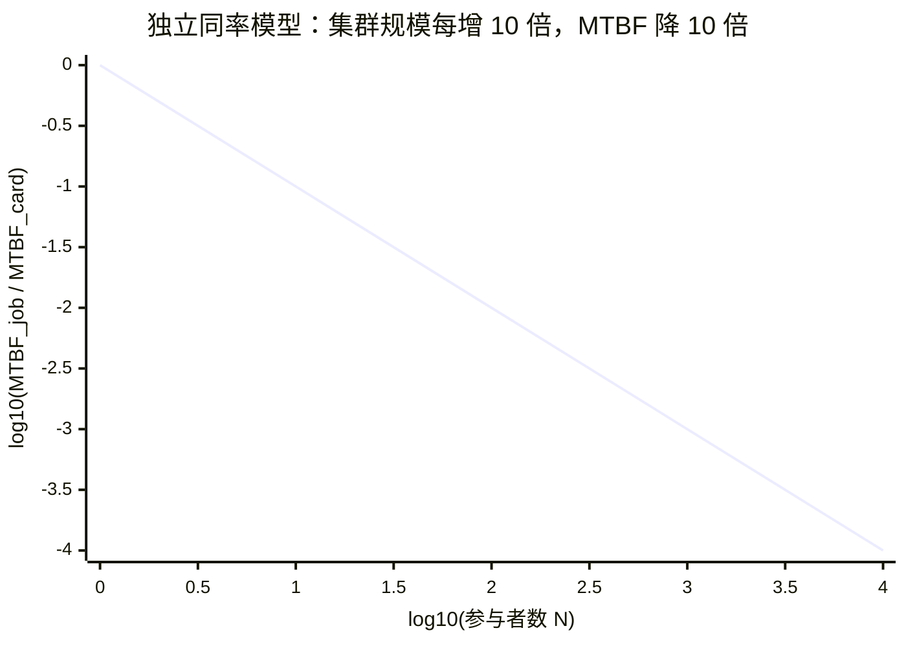
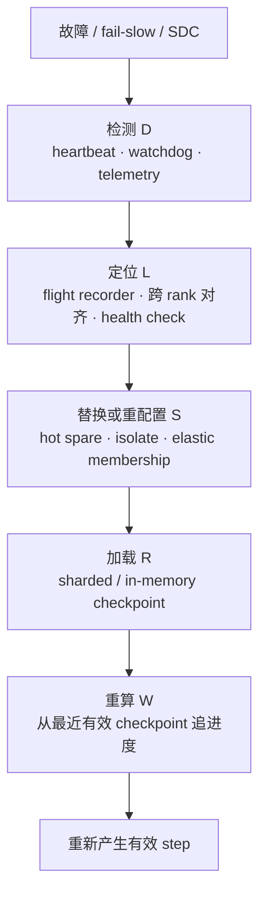
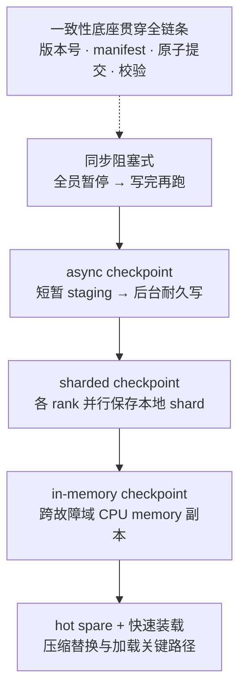

# L53 大规模训练可靠性：把故障变成可预算的日常事件

> [!abstract] 本课速览
> 读完你将能够：
> 1. 用 failure rate 与 MTBF 解释为何单设备“小概率”故障会被万卡同步训练放大成数小时一次的常态中断；
> 2. 区分 fail-stop、fail-slow 与 SDC，并解释为何 NCCL timeout 的报错 rank 不一定是根因；
> 3. 把一次故障拆成检测、定位、替换、加载和重算五段，判断 heartbeat、flight recorder、hot spare 与不同 checkpoint 技术各压缩哪一段；
> 4. 推导 Young/Daly checkpoint interval 的一阶近似，并独立复算两种恢复方案相差约 17 个百分点的 Runtime Goodput；
> 5. 说明 elastic training 能做什么、不能做什么，并把可靠性研究落到“故障下 goodput 不塌”的可测目标。
>
> 前置：[[L52 性能剖析与MFU核算]] · [[L34 存储与数据供给]] · [[L38 NCCL解剖]] · 预计 55 分钟

## 论文里的这段话，你现在可能读不懂

> [!quote]
> “At 16K-GPU scale, the job-level **MTBF** collapses because one rank can interrupt the entire synchronous worker group. A **NCCL timeout** is only a symptom: cross-rank **flight recorder** traces and out-of-band **health checks** are needed to distinguish a **link flap**, a **fail-slow straggler**, and a true **fail-stop** failure. Frequent **sharded asynchronous checkpoints**, in-memory replicas, and a **hot spare** shorten rollback and restart, while **elastic training** may resume with a changed membership. The real objective is **goodput**, not merely high MFU while the job happens to be healthy.”（改写自《The Llama 3 Herd of Models》与 MegaScale 的可靠性表述）

这四句把“统计、检测、恢复、指标”挤在了一起。初读时最容易犯的错，是把 timeout 当根因、把 checkpoint 当一份文件、把“能自动重启”当作“可靠性已经解决”。本课逐层拆开。

## 一、规模暴击：小概率故障为何变成数小时一次

### 1. 从单设备 failure rate 到作业 MTBF

**failure rate**（故障率）通常记为 $\lambda$，表示单位时间发生故障的速率；**MTBF**（Mean Time Between Failures，平均故障间隔）表示相邻两次故障之间的平均时间。只有在“故障到达近似独立、危险率近似恒定”的指数模型里，二者才可直接写成：

$$
\mathrm{MTBF}=\frac{1}{\lambda}.
$$

若一张卡一年内至少故障一次的概率是 $p=x/100$，指数模型对应

$$
\lambda_{card}=-\frac{\ln(1-p)}{1\ \mathrm{year}}
\approx \frac{p}{1\ \mathrm{year}}\quad(p\ll1).
$$

若作业同时依赖 $N$ 个独立、同率的参与者，而且任一参与者故障都会停作业，那么速率相加：

$$
\lambda_{job}=N\lambda_{card},
\qquad
\mathrm{MTBF}_{job}=\frac{\mathrm{MTBF}_{card}}{N}.
$$

这就是同步训练的规模税。它采用 [[L35 GPU集群调度]] 的 gang 语义：训练不是“一万多人里少一个也能开会”，而是一万多人共同抬一块长板，任何一人松手，当前同步步骤都无法按原成员继续。

图是归一化双对数曲线，不绑定某款 GPU：斜率为 $-1$。现实中的同机箱、同交换机、同供电故障还会相关，独立模型不是保证，只是第一把尺子。

### 2. Llama 3 的公开数据：3.09 小时不是口号

《[The Llama 3 Herd of Models](https://arxiv.org/abs/2407.21783)》报告：Llama 3 405B 预训练的一段 54 天快照中共有 466 次 job interruptions，其中 47 次为计划维护，余下 **419 次为意外中断**。因此意外中断的作业级平均间隔是：

> [!example] 算一算：由公开中断数复算作业级 MTBF
> $54$ 天共有
> $$
> 54\times24=1296\ \mathrm{h}.
> $$
> 对 419 次意外中断取观测平均：
> $$
> \widehat{\mathrm{MTBF}}_{job}
> =\frac{1296}{419}
> \approx\boxed{3.09\ \mathrm{h}}.
> $$
> 这就是“约每 3.1 小时一次”的来源。论文还指出，约 78% 的意外中断归因于确认或疑似硬件问题。这是该 54 天窗口的 root-cause 统计，不是所有集群的普适分布。论文正文另称 GPU issues 合计 58.7%，但 Table 5 的 counts 与百分比列存在内在不一致；下文会按 counts 重新归一化。

若把 16,384 个参与者和全部 419 次意外中断强行塞进“独立同率单元”模型，会反推出等效单元 MTBF：

$$
\mathrm{MTBF}_{unit,eq}
=16384\times3.093\ \mathrm{h}
\approx 50{,}677\ \mathrm{h}
\approx5.79\ \mathrm{years}.
$$

对应的一年故障概率约为 $1-e^{-8760/50677}\approx15.9\%$。==这个 15.9% 不是论文测得的“单卡年故障率”==：419 次里混有 GPU、host、network、software 与未知根因，还有共享故障域和相关性。反推的价值，是检查“数小时一次”与规模公式是否在同一数量级；不能越界给 GPU 做寿命认证。

### 3. MTTR、interruption 与 blast radius

**interruption**（训练中断）是作业停止产生有效训练进度的事件。故障发生后到恢复有效训练的平均时间常用 **MTTR**（Mean Time To Repair/Recovery，平均修复/恢复时间）描述；报告时要说清边界是“告警到节点修好”，还是“故障发生到重新产生有效 step”。在简单的交替运行—恢复模型中：

$$
A\approx\frac{\mathrm{MTBF}}{\mathrm{MTBF}+\mathrm{MTTR}}.
$$

但 availability 还不是 goodput，因为 checkpoint 之后尚未保存的训练进度即使重算成功，也消耗过 GPU 时间。

**blast radius**（故障爆炸半径）描述一次故障波及的资源、作业或服务范围。同步 gang 作业中，一张卡可能让全部 ranks 停下，资源半径接近整个 job；分层副本或缩小 collective group 的研究，本质上是在缩 blast radius。

## 二、故障分类：停掉、拖慢，还是悄悄算错

Llama 3 的 Table 5 中 18 行 interruption counts 恰好合计 419，但所列百分比只合计 94.9%。最明显的一行是 Faulty GPU：count 为 148，按总数 419 应为 $148/419\approx35.3\%$，表中却写成 30.1%；因此正文所称 GPU issues 合计 58.7% 也与六个 GPU 类 counts 的 $268/419\approx64.0\%$ 不一致。为保证可复算，下面按 **counts** 重新分组归一化：

| 根因组（该 54 天窗口） | count | 按 419 复算 | 系统提示 |
|---|---:|---:|---|
| GPU issues（含 HBM/SRAM、处理器、SDC 等） | 268 | 64.0% | 计算与显存数据路径都要诊断 |
| software bug | 54 | 12.9% | 自动重启若不改变条件，可能重复失败 |
| network switch/cable | 35 | 8.4% | timeout 可能只是链路故障的上层表象 |
| unplanned host maintenance | 32 | 7.6% | 维护也应进入容量与恢复预算 |
| NIC | 7 | 1.7% | 需要旁路遥测和端到端链路测试 |
| NCCL watchdog timeout（根因未知） | 7 | 1.7% | timeout 本身不能完成归因 |
| 其他七行 | 16 | 3.8% | 长尾根因要求保留现场 |

### 1. fail-stop 与 fail-slow：后者往往更难缠

| 模式 | 外在表现 | 同步训练中的伤害 | 典型定位信号 |
|---|---|---|---|
| **fail-stop**（停止型故障） | 进程、设备或节点明确退出/失联 | 作业很快停止，进度中断 | exit code、XID、heartbeat 消失、链路 down |
| **fail-slow**（慢故障） | 还能返回结果，但 step、通信或 I/O 显著变慢 | 形成 **straggler**（掉队 rank），所有同步参与者被拖慢 | 跨 rank step 分位数、频率/温度、NIC retransmit、collective 时长偏离 |

fail-stop 像有人直接举手说“我退出”；fail-slow 像队伍里有人仍在走，但速度降到十分之一。后者没有清晰故障时刻，常先被看到成“通信变慢”，并在超时后才升级成 interruption。

**link flap**（链路抖动）是链路在 up/down 或可用/不可用状态间短时反复切换。它既可能直接触发重连和超时，也可能只造成丢包、重传与 fail-slow。一次 flap 消失后再测“现在链路正常”，不代表训练期间没有发生过；因此需要带时间戳的交换机、NIC 与作业侧记录。

### 2. SDC：最可怕的不是停，而是错着跑

**SDC**（Silent Data Corruption，静默数据损坏）指数据或计算结果已经错误，却没有同步抛出可见错误。Llama 3 的表中有 6 次 SDC，占 419 次意外中断的 1.4%；数量不大，却说明它在真实大规模训练里不是纯理论问题。

SDC 可能来自存储/传输位错误、显存或计算数据路径异常，也可能表现为极少数错误数值。它危险在三点：

1. **故障时刻不清楚**：loss 可能晚很多 step 才异常，回滚到“最新 checkpoint”可能仍然带毒；
2. **普通校验覆盖有限**：文件 checksum 能发现写入/传输后字节变化，却不能证明 GPU 最初算出的 tensor 就正确；
3. **错误会被训练放大**：坏梯度进入 optimizer state 后，后续正常计算也会沿错误状态继续。

因此检测要分层：ECC/XID/遥测发现已被硬件暴露的问题；[DCGM Diagnostics](https://docs.nvidia.com/datacenter/dcgm/latest/learn/modules/dcgm-diagnostics.html) 等主动 **health check**（健康检查）用已知结果和压力测试筛查 compute/framebuffer data path；训练内再加 finite-value、loss/gradient norm、状态 hash 与关键不变量；高价值路径可用冗余计算、抽样复算或 canary workload。任何单项都不是“SDC 全捕获器”。检测到可疑窗口后，应隔离相关 checkpoint，回退到经过验证的更早版本。

> [!warning] 常见误区：fail-slow 好过 fail-stop
> 对同步训练未必如此。fail-stop 容易划定故障时刻并触发恢复；fail-slow 会先长时间降低 MFU/goodput，再让健康 ranks 在 collective 中陪等，而且 timeout 的受害者常被误认成凶手。SDC 更糟：它甚至可能让作业以正常速度产出错误进度。

## 三、NCCL timeout 解剖：报错者往往只是最先喊疼的人

一个 collective 只有所有预期 ranks 按兼容的次序和 shape 参与，且底层 GPU/NVLink/NIC/network 都能推进，才会完成。**NCCL timeout**（NCCL 集合通信超时）只表示某个 collective 在配置窗口内没有完成；它没有自动证明“这个报错 rank 的网卡坏了”。

常见因果链包括：

- rank 7 先被 DataLoader、GPU kernel 或 OOM 卡住，根本没进入 collective；其他 ranks 进入后等待并 timeout；
- 两个 ranks 走了不同控制流，collective 序号或 tensor shape 不一致；
- 某段 NVLink、NIC、cable 或 switch path 故障/抖动，数据无法推进；
- 一个 fail-slow rank 仍在通信，但慢到超过 watchdog 阈值。

**flight recorder**（飞行记录器）用环形缓冲保留近期 collective 的序号、开始/结束状态、时间和可选调用栈。真正有用的读法是跨 ranks 对齐：谁最后完成同一个 collective？谁根本没进入下一个？谁的 pending transfer 指向同一故障域？只读报错进程最后一行日志，像只问堵车队尾“你为什么不走”。

旁路 heartbeat 与 **health check** 则补足“训练进程已经卡住，自己无法自证健康”的问题。MegaScale 在 NSDI 2024 正式论文中给出的工作流，就是 driver 汇总 heartbeat、日志与 RDMA 指标，异常后暂停作业、运行轻量诊断、隔离故障节点并补入健康节点，再从 checkpoint 恢复。

一次 interruption 的端到端损失可以记为：

$$
T_{loss}=D+L+S+R+W.
$$

工程上“换卡只要几分钟”并不代表 MTTR 只有几分钟：若定位花一小时，替换再快也救不了 goodput。Llama 3 报告强调 flight recorder 与自动化，MegaScale 强调 heartbeat、诊断与 checkpoint/recovery，原因都在这条时间线。

## 四、checkpoint 工程：不是“存文件”，而是移动恢复边界

**checkpointing**（检查点机制）保存足以重建一致训练状态的快照。对 Adam 混合精度训练，[[03 约定与符号]] 统一估算一份 checkpoint 约为 $14\ \mathrm{B/参数}$，包含 BF16 参数、FP32 master weights 和两个 FP32 optimizer moments，不存梯度。模型越大，单个“文件”的想象越不现实：它通常是多个 ranks 的 shards 加 manifest 与提交协议。

这张“谱系”表示恢复路径越来越短，不表示后者淘汰前者；它们位于不同维度，可以组合：

- **同步阻塞式 checkpoint**：所有 ranks 停下，写入并提交一致版本后继续。语义直观，但暴露在关键路径上的暂停最大；
- **async checkpoint**（异步检查点）：先把训练状态快速 staging 到 host/local buffer，让 GPU 恢复训练，再由后台写入耐久存储。必须处理 buffer 生命周期、版本一致性，以及“故障发生时后台版本尚未 durable”的情况；
- **sharded checkpoint**（分片检查点）：每个 rank 保存自己持有的 state shard，依靠 manifest 组成逻辑版本。它把 I/O 并行化，但恢复到不同 parallel mesh 时需要 reshard；
- **in-memory checkpoint**（内存检查点）：把 checkpoint 放到 host CPU memory，并在其他故障域放副本，绕过较慢的远端持久存储读取。内存不是天然耐久层，副本与放置策略决定能承受哪些同时故障；
- **hot spare**（热备节点）：预留已通过健康检查的计算节点，故障后可立即替换。它压缩 $S$，但若 checkpoint 加载仍慢，$R$ 仍是瓶颈。

《[MegaScale: Scaling Large Language Model Training to More Than 10,000 GPUs](https://www.usenix.org/conference/nsdi24/presentation/jiang-ziheng)》（NSDI 2024）采用两阶段 checkpoint：先从 GPU 状态写到 host memory，让训练尽快继续；后台再异步写 HDFS。恢复时由一个 worker 读取 DP 组共享的 state partition，再 broadcast 给组内其他 workers，减少集中存储读取压力。

**Gemini**（内存检查点恢复系统；《[Gemini: Fast Failure Recovery in Distributed Training with In-Memory Checkpoints](https://www.amazon.science/publications/gemini-fast-failure-recovery-in-distributed-training-with-in-memory-checkpoints)》，SOSP 2023）进一步把 CPU memory 作为快速恢复层：冗余放置提高 checkpoint 在节点故障后的可取回概率，通信调度减少 checkpoint traffic 对训练 traffic 的干扰；论文报告 checkpoint retrieval 可到秒级，并在其实验中相对对比方案实现超过 $13\times$ 的整体恢复加速。它不是“随便复制给邻居”四个字：故障域、放置和网络调度才是系统贡献。

### checkpoint interval：太勤和太懒都会浪费

**checkpoint interval**（检查点间隔）记为 $T$，这里指两次 checkpoint 之间推进的有效计算时间；$C$ 是一次 checkpoint 暴露在训练关键路径上的时间，$M$ 是作业 MTBF。采用独立故障、恒定故障率、失败在区间内近似均匀、$C\ll M$ 的一阶模型：

$$
\mathrm{Waste}(T)
\approx \underbrace{\frac{C}{T}}_{\text{存得太勤}}
+\underbrace{\frac{T}{2M}}_{\text{失败后平均重算 }T/2}
+\underbrace{\frac{D+L+S+R}{M}}_{\text{每次固定恢复成本}}.
$$

最后一项与 $T$ 无关。对前两项求导并令零：

$$
-\frac{C}{T^2}+\frac{1}{2M}=0
\quad\Longrightarrow\quad
\boxed{T^*\approx\sqrt{2MC}}.
$$

这就是核实后的 Young/Daly 常用一阶近似；系数是 $2$。Daly 的高阶模型会细化 failure、restart 与 interval 定义，工程中应先对齐论文口径，不能把不同版本的 $-C$ 或 recovery 修正项随意拼接。对 async checkpoint，$C$ 应取 exposed staging pause 加上后台 I/O/网络干扰折算的等效成本，而不是把整段后台 flush 时间全部算成阻塞。

> [!tip] 直觉
> checkpoint interval 像拍游戏存档：每秒存一次会被存档动画拖死，一小时不存又会在断电后重打一小时。$T^*\propto\sqrt{M}$ 表示系统可靠 4 倍时，最优间隔只放宽 2 倍；$T^*\propto\sqrt{C}$ 表示 checkpoint 成本降到四分之一时，适合把间隔缩到一半。

## 五、弹性训练：换成员继续，不等于原地无损续跑

**elastic training**（弹性训练）允许 worker membership 在运行期间变化。故障后不一定等原规模热备全部到齐：如果变化落在可调整的 DP 维，可以缩小 DP，重新 rendezvous、建立 process groups/parallel mesh，从 checkpoint 恢复后继续；资源回来后也可能扩容。

**TorchElastic**（PyTorch 弹性运行控制）是这类控制平面的代表。官方文档的关键语义是：worker failure 或 membership change 会停止现有 worker group，重新 rendezvous，并以新的 `RANK` / `WORLD_SIZE` 重启 workers。它提供发现、重启和成员变更，不自动替你解决以下问题：

- checkpoint 是否完整、与新 world size 是否能 reshard；
- TP/PP/CP/EP 维度的整除和拓扑约束是否仍满足；
- DP 改变后，怎样通过 gradient accumulation 保持 [[03 约定与符号]] 的 $B=b\times\mathrm{DP}\times\mathrm{GA}$，以及学习率/数据采样语义是否改变；
- 故障 step 是否已对 optimizer state 造成 SDC 污染。

因此“缩编继续”通常只改最外层可复制维度。若失去的是 TP group 中一张卡，而新规模无法重组完整 TP/PP mesh，elastic runtime 也不能凭空让半个模型 shard 工作。[[L66 弹性算力与资源效率]] 会继续讨论 spot/preemption 场景下的弹性；本课只记住：elasticity 主要压缩等待替换的 $S$，checkpoint 仍负责状态恢复。

## 六、恢复经济学：checkpoint 工程值约 17 个 goodput 点

沿用 [[L52 性能剖析与MFU核算]] 的边界，本课用 Runtime **goodput**（有效吞吐）表示“已经拿到资源的时间里，有多少真正变成并保留的训练进度”。先忽略 checkpoint 自身的暴露开销以及检测、定位、替换时间，只计算题设给出的平均重算与加载恢复；当每 $M$ 分钟发生一次故障、间隔为 $T$、恢复为 $R$ 时：

$$
G_{runtime}\approx1-\frac{T/2+R}{M}.
$$

> [!example] 算一算：16K 卡下，两套方案差多少
> **统一题设（不是硬件实测）**：16K 卡作业平均每 $M=3\ \mathrm{h}=180\ \mathrm{min}$ 一次故障，故障在 checkpoint 区间内均匀发生。
>
> **方案 A：** 每 $T_A=30\ \mathrm{min}$ 向 PFS 保存一次，恢复 $R_A=20\ \mathrm{min}$。
>
> 平均丢失进度：
> $$
> W_A=\frac{T_A}{2}+R_A
> =\frac{30}{2}+20
> =35\ \mathrm{min}.
> $$
> 因而
> $$
> G_A\approx1-\frac{35}{180}
> =0.8056\approx\boxed{80.6\%}.
> $$
>
> **方案 B：** async + in-memory checkpoint，$T_B=5\ \mathrm{min}$，恢复 $R_B=2\ \mathrm{min}$。
>
> $$
> W_B=\frac{5}{2}+2=4.5\ \mathrm{min},
> $$
> $$
> G_B\approx1-\frac{4.5}{180}
> =0.975\approx\boxed{97.5\%}.
> $$
>
> 两者相差
> $$
> 97.5\%-80.6\%=\boxed{16.9\ \text{个百分点}}\approx17\ \text{个点}.
> $$
> 这 17 个点来自更短的回滚距离和加载时间，不是 GPU kernel 变快。真实系统还要扣 checkpoint 暴露开销、后台 traffic 干扰以及 $D+L+S$；所以它是隔离恢复项的一阶账，不是生产 goodput 保证。

把全课技术映射回时间线，就得到一张研究问题表：

| goodput 损失项 | 主要手段 | 可测指标 |
|---|---|---|
| 检测 $D$ | heartbeat、watchdog、telemetry | detection latency、漏报/误报率 |
| 定位 $L$ | flight recorder、跨 rank trace、health check | localization time、root-cause accuracy |
| 替换/重配置 $S$ | hot spare、隔离、elastic membership | replacement/rendezvous time、blast radius |
| 加载 $R$ | sharded/async/in-memory checkpoint | staging/load time、恢复带宽、可恢复概率 |
| 重算 $W$ | 缩短 checkpoint interval、验证最新版本 | lost steps、rollback distance |
| fail-slow 期间的慢 | straggler 检测、降级/重组 | step p99、MFU、Runtime Goodput |
| SDC 的错误进度 | 校验、冗余、checkpoint quarantine | detection coverage、false positive、corruption escape rate |

Meta 的 Llama 3 报告把 effective training time 定义为 useful training time / elapsed time，并报告高于 90%；它与本课 Runtime Goodput 的思想接近，但不是 Google 三层 goodput 术语的来源。==MFU 问健康运行窗口里算力用得怎样；goodput 问整段墙钟时间最终保住多少进度；生存性研究则问故障和负载波动下，goodput 能否维持。==

## 七、从课程到研究：别只做“自动重启”

一个可研究的可靠性方案至少要交代五件事：故障模型覆盖哪些 GPU/NIC/link/switch/host 事件；检测信号能否区分 fail-stop、fail-slow 与 SDC；状态恢复跨哪些故障域；故障时是否允许缩编或降级；评估是否同时报告 steady-state overhead、MTTR、lost work、goodput 与 false positive。

网络与系统方向尤其要追问：flight recorder 与交换机/NIC 遥测怎样对时？collective group 与物理 failure domain 怎样映射？一次 link flap 会让整个 16K job 重启，还是只重组一个较小副本域？这正是“网络机制—任务调度—资源分配—故障恢复”的交叉面。

训练侧到这里收束。推理服务没有全局 step，也未必“一卡挂全员停”；它面对的是副本路由、KV cache 状态、请求重试、尾时延和 SLO 降级。请到 [[L65 推理服务生存性]] 继续，不要把本课的 gang recovery 原样套过去。

## 回到开头那段话

现在逐句回读：

1. “At 16K-GPU scale, the job-level MTBF collapses ...”——独立同率模型给出 $\mathrm{MTBF}_{job}=\mathrm{MTBF}_{card}/N$；Llama 3 的 54 天、419 次意外中断复算为约 3.09 小时一次。同步 gang 语义把单点故障的 blast radius 放大到整个 worker group。
2. “A NCCL timeout is only a symptom ...”——timeout 只说明 collective 没按时完成；根因可能是没入场的慢 rank、控制流不一致、GPU/NVLink/NIC/network 或 link flap。要用跨 rank flight recorder、旁路 heartbeat 和 health check 找最早偏离者，并区分 fail-stop 与 fail-slow。
3. “Frequent sharded asynchronous checkpoints ... elastic training ...”——async 缩短暴露暂停，sharded 并行 I/O，in-memory 副本缩短加载，hot spare 缩短替换；elastic membership 可在约束允许时重组 DP，但仍需一致 checkpoint、reshard 与训练语义调整。
4. “The real objective is goodput ...”——MFU 只看有效计算相对 dense 峰值；可靠性还要扣检测、定位、替换、加载和重算。题设中的 checkpoint 工程把隔离恢复项的 Runtime Goodput 从 80.6% 提到 97.5%，约 17 个百分点。

如果你能解释清楚“谁 timeout 不等于谁有病”，并能把一项容错技术落到 $D+L+S+R+W$ 的具体项，开头这段就不再是术语堆砌。

## 术语卡片

| 术语 | 中文 | 一句话解释 |
|---|---|---|
| MTBF | 平均故障间隔 | 相邻故障之间的平均运行时间；恒定故障率模型下为 $1/\lambda$。 |
| MTTR | 平均修复/恢复时间 | 从指定故障起点到修复或恢复有效工作的平均时间，必须说明测量边界。 |
| failure rate | 故障率 | 单位时间发生故障的速率，常记为 $\lambda$。 |
| interruption | 训练中断 | 作业停止产生有效训练进度的一次事件。 |
| link flap | 链路抖动 | 链路在可用/不可用状态间短时反复切换的现象。 |
| SDC | 静默数据损坏 | 数据或计算已经错误，却没有同步错误信号。 |
| fail-stop | 停止型故障 | 组件明确停止、退出或失联，故障时刻通常较清楚。 |
| fail-slow | 慢故障 | 组件仍能响应但显著变慢，常以 straggler 或通信等待表现。 |
| NCCL timeout | NCCL 集合通信超时 | collective 未在配置窗口内完成的症状，报错 rank 未必是根因。 |
| flight recorder | 飞行记录器 | 用环形缓冲保留近期 collective 元数据、时间和可选调用栈的通信黑匣子。 |
| health check | 健康检查 | 用旁路遥测或主动测试判断组件是否满足继续参与作业的条件。 |
| hot spare | 热备节点 | 预留且已验证健康、可在故障后快速补入作业的备用节点。 |
| checkpointing | 检查点机制 | 周期性保存一致训练状态，以便失败后从已提交版本恢复。 |
| checkpoint interval | 检查点间隔 | 相邻 checkpoint 之间推进的有效计算时间。 |
| async checkpoint | 异步检查点 | 快速 staging 状态后恢复训练，由后台完成耐久写入。 |
| sharded checkpoint | 分片检查点 | 各 ranks 并行保存本地 state shards，由 manifest 组成一个逻辑版本。 |
| in-memory checkpoint | 内存检查点 | 把恢复副本放在 host memory 等快速层，并靠跨故障域冗余保障可取回。 |
| Gemini | 内存检查点恢复系统 | 用 CPU memory、冗余放置与 traffic scheduling 加速分布式训练恢复的 SOSP 2023 系统。 |
| elastic training | 弹性训练 | worker membership 变化后重新组网、恢复并继续训练的运行方式。 |
| TorchElastic | PyTorch 弹性运行控制 | 监控 worker、处理失败/成员变化并重新 rendezvous 与重启 worker group 的控制平面。 |
| goodput | 有效吞吐 | 单位统计时间内真正推进并保留下来的训练工作，必须注明边界。 |
| blast radius | 故障爆炸半径 | 一次故障波及的资源、作业、同步组或服务范围。 |
| straggler | 掉队者 / 慢 rank | 在同步阶段完成最晚并迫使其他 ranks 等待的参与者。 |

## 自测

1. 在独立、恒定故障率模型下，为什么参与者数扩大 $N$ 倍会让 job MTBF 缩短到 $1/N$？现实中哪些相关故障会破坏这个假设？
2. Llama 3 的 54 天、419 次意外中断怎样得到约 3.09 小时？为什么不能由此直接宣布“单卡年故障率是 15.9%”？
3. fail-stop、fail-slow 与 SDC 分别怎样影响训练？为什么后两者通常更难定位？
4. rank 3 报 NCCL timeout，列出至少三种“rank 3 是受害者而非根因”的可能因果链，并说明 flight recorder 怎么帮助判断。
5. 同步、async、sharded 与 in-memory checkpoint 分别优化什么？为什么 hot spare 不能替代 checkpoint？
6. **计算题**：作业 MTBF 为 240 min，checkpoint interval 为 20 min，恢复为 10 min；忽略其他开销，用本课一阶式计算 Runtime Goodput。若把 interval 缩到 4 min、恢复缩到 2 min，提升多少个百分点？
7. 从 $\mathrm{Waste}(T)=C/T+T/(2M)+K/M$ 推导 $T^*$；若 checkpoint 的有效暴露成本降为原来的 $1/4$，最优 interval 怎样变化？
8. 设计一个训练生存性实验：至少给出故障注入、检测信号、恢复策略、steady-state overhead 与 goodput/MTTR 指标，说明怎样控制 blast radius。

> [!note]- 参考答案
> 1. 每个参与者故障过程独立且速率同为 $\lambda$ 时，任一故障的作业级速率为 $N\lambda$，所以 MTBF 为 $1/(N\lambda)$。同机供电、同 switch/cable、共享软件 bug、温度和运维事件会产生相关故障，使简单相加失真。
> 2. $54\times24/419=1296/419\approx3.09$ h。把该数乘 16,384 得到的只是把 GPU、host、network、software 和未知根因都等效成独立单元后的 sanity check；它不是单卡故障样本统计。
> 3. fail-stop 明确停止，容易触发恢复；fail-slow 仍响应但拖慢同步组，故障时刻模糊；SDC 错着跑且可能污染后续 optimizer/checkpoint。后两者缺少清晰错误信号。
> 4. 例如 rank 7 没进入 collective、rank 5 走错 collective 序号、rank 3 到某 peer 的 network path 阻塞、某 GPU/NVLink kernel 不推进。跨 rank 对齐 recorder 的 collective 序号、开始/结束与 pending transfer，找最早分叉而不是最后报错者。
> 5. 同步 checkpoint 语义直接但阻塞；async 把耐久写移出关键路径；sharded 并行 I/O；in-memory 缩短取回路径但需要冗余。hot spare 只提供健康算力，不包含模型和 optimizer 的一致状态。
> 6. 第一种平均损失 $20/2+10=20$ min，$G_1=1-20/240=91.67\%$；第二种损失 $4/2+2=4$ min，$G_2=1-4/240=98.33\%$；提升约 $6.67$ 个百分点。
> 7. 求导得 $-C/T^2+1/(2M)=0$，故 $T^*=\sqrt{2MC}$；$K/M$ 与 $T$ 无关。$C$ 降到 $1/4$ 后，$T^*$ 变为原来的 $1/2$。
> 8. 示例：对一个 DP replica group 注入进程退出、限速与受控 tensor corruption；用 heartbeat、跨 rank trace、数值 invariant 检测；分别比较全作业重启、hot spare 与缩 DP；报告无故障 overhead、detection/localization/load/replay 分段、MTTR、lost steps、Runtime Goodput、误报率，并把故障限制在 replica group 而非整集群。

## 延伸阅读

- [《The Llama 3 Herd of Models》](https://arxiv.org/abs/2407.21783)：精读预训练基础设施的 Reliability and Operational Challenges；重点看 54 天 interruption 表、effective training time、flight recorder 与 straggler 定位。
- [《MegaScale: Scaling Large Language Model Training to More Than 10,000 GPUs》](https://www.usenix.org/conference/nsdi24/presentation/jiang-ziheng)（NSDI 2024）：精读第 4 节，把 heartbeat、诊断、节点替换与两阶段 checkpoint 串成一条恢复工作流。
- [《Gemini: Fast Failure Recovery in Distributed Training with In-Memory Checkpoints》](https://www.amazon.science/publications/gemini-fast-failure-recovery-in-distributed-training-with-in-memory-checkpoints)（SOSP 2023）：读 placement 与 traffic scheduling，理解 in-memory 方案为什么仍需要副本概率和网络隔离。
- [Young/Daly checkpointing survey](https://doi.org/10.1016/j.future.2024.07.022)：先读经典 $\sqrt{2MC}$ 的假设，再浏览 multi-level、silent error 与 replication 扩展；不要只背公式。
- [PyTorch Elastic Agent 文档](https://docs.pytorch.org/docs/stable/elastic/agent.html)与 [Flight Recorder 教程](https://docs.pytorch.org/tutorials/unstable/flight_recorder_tutorial.html)：对照 worker group 重启、membership change 与跨 rank trace 的实际语义，具体开关以使用版本为准。

---
上一课：[[L52 性能剖析与MFU核算]] ← · → 下一课：[[L54 RL后训练系统]]
