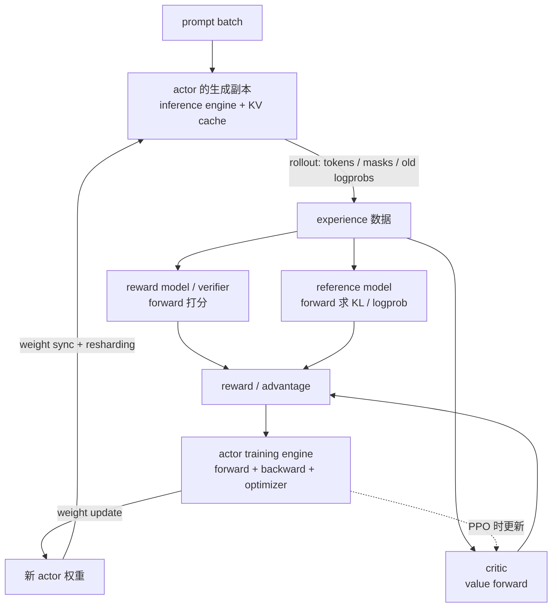
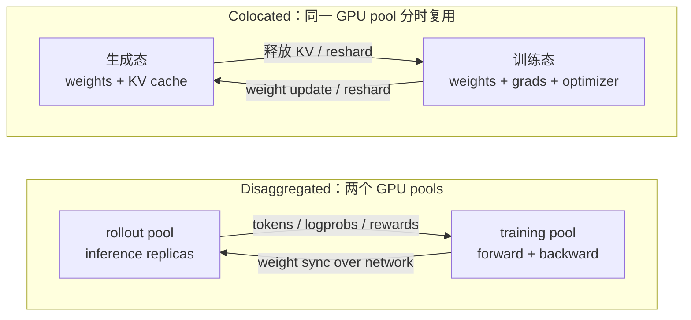

# L54 RL后训练系统：训练引擎与推理引擎被迫同居

> [!abstract] 本课速览
> 读完你将能够：
> 1. 沿一轮 PPO/GRPO 数据流说明 actor、critic、reward、reference 四个角色在哪里运行、传什么数据；
> 2. 比较 colocated 与 disaggregated 两类部署，并解释 hybrid engine 为什么不只是“把两个库粘起来”；
> 3. 从 70B BF16 权重的 140 GB 账单出发，估算 weight sync 的物理下界、坏实现上界与迭代摊销；
> 4. 用 rollout token 预算解释 generation 为何常占主导，并区分 continuous batching、partial rollout 与 async RL 各消除哪种等待；
> 5. 读懂 veRL/HybridFlow、OpenRLHF 等框架在“资源放置 × 执行时序”地图中的位置，并识别 off-policy 代价。
>
> 前置：[[L15 后训练与对齐]] · [[L47 混合并行组装]] · [[L13 自回归生成与KV缓存]] · 预计 55 分钟

## 论文里的这段话，你现在可能读不懂

> [!quote]
> “An **RLHF system** alternates an **experience phase**, where a rollout engine samples trajectories from the **actor**, with a training phase that updates the policy. A **hybrid engine** may colocate generation and training, but every **weight update** can still trigger **resharding** and **weight sync** into a differently partitioned inference engine. Disaggregating the two stages enables overlap, yet **rollout long-tail** and stale samples turn the pipeline into **off-policy async RL** unless staleness is controlled. Frameworks such as **HybridFlow** therefore use a **single controller** to orchestrate distributed model workers and data movement.”（改写自 HybridFlow 与主流开源 RL 后训练系统的典型表述）

这四句看起来像把训练、推理、网络和强化学习各抽了一把术语扔进同一段。麻烦在于：它们确实必须同时出现。SFT 主要是一个训练 workload；在线 RL 后训练却要在每次更新前先让当前模型大规模生成，再让多种模型打分，最后才进入 backward。==RLHF 不是“多加一个 loss”，而是两套最优形态不同的分布式系统反复交接状态。==

## 一、一轮 RL 到底是谁把什么交给谁

### 1. actor 有两份工作，不只是四个模型之一

[[L15 后训练与对齐]] 已讲过算法角色，本课把它们换成系统语言。一个 **RLHF system**（RLHF 系统）要把 prompt、生成结果、分数、log probability、advantage 和新权重沿正确的依赖关系搬动：

- **actor**（策略模型 / 被训练模型）有双重身份。生成时，它是带 KV cache、逐 token decode 的推理模型；更新时，它又是带 gradient、optimizer state 和 collective communication 的训练模型；
- **critic**（价值模型）用 forward 估计状态价值，并在 PPO 中参与训练；它帮助计算 advantage，不负责生成最后回答；
- **reward model**（奖励模型，RM）或 verifier 对回答给出 reward；RM 通常只做 forward，规则/环境型 verifier 甚至不一定是神经网络；
- **reference model**（参考模型）是冻结的策略锚点，用来计算 KL 约束或旧策略概率，通常只做 forward。

**rollout**（轨迹采样 / 生成轨迹）不是单指最终文本，而是从 prompt 开始、按某个策略逐 token 采样得到的完整交互记录。训练常还需要 response tokens、mask、旧策略 logprob、reward 和环境返回值。只把字符串从推理端传回训练端，再重新 tokenize，可能破坏 token-level 对齐；系统接口最好是 token-in/token-out。

从时间上看，一轮通常分成三段：

1. **generation phase**（生成阶段）由 inference engine 跑 actor，产出 rollout；
2. **experience phase**（经验构造阶段）让 reward/reference/critic 做 forward，把原始 rollout 变成可训练的 experience；很多资料也把 generation 包进更宽泛的 experience generation；
3. **training phase**（训练阶段）计算 loss、backward、梯度同步和 optimizer step，更新 actor；PPO 还会更新 critic。

GRPO 的系统减负可以一句话说清：它用同一 prompt 的组内相对 reward 估计 baseline，不需要 PPO 那个独立大 critic，于是少一份模型状态、critic forward/backward 和相应通信；但每个 prompt 要采样多条回答，省下的 critic 资源常被更多 rollout 吃回去。

> [!tip] 直觉：一个演员，两套后台
> actor 像同一位演员白天拍戏、晚上健身。拍戏需要摄影棚（KV cache、动态批处理、低精度 decode），健身需要训练房（gradient、optimizer state、all-reduce）。名字还是同一个 actor，但设备布局和随身行李完全不同；每轮换场都要搬家。

### 2. 为什么训练 workload 与推理 workload 天生不合拍

| 维度 | actor 生成态 | actor 训练态 |
|---|---|---|
| 主要工作 | autoregressive decode，逐 token forward | 大 batch forward/backward + optimizer step |
| 关键状态 | 权重、KV cache、请求队列 | 权重、activation、gradient、optimizer state |
| 常见瓶颈 | 显存带宽、KV 容量、序列长尾 | dense 计算、训练显存、梯度 collective |
| 追求的批处理 | continuous batching，随完成随补请求 | 固定 micro-batch / global batch 与同步 step |
| 合适的并行 | 较小 TP、更多 replica 往往利于吞吐 | TP/PP/DP/CP 按显存与通信组装 |
| 常见精度 | 可能采用更低精度权重或 KV | 需满足训练数值与 optimizer 语义 |

[[L47 混合并行组装]] 的训练布局若是 TP8-PP4，不能推出生成也应该 TP8-PP4。生成可能希望取消 PP、减小 TP 并增加 replicas；训练 engine 持有的又可能是 FSDP/ZeRO shards。所谓 **hybrid engine**（训练—生成混合引擎），就是让同一个 actor 能在这两种执行形态间切换，并处理显存释放/恢复、并行组切换、权重重排和状态一致性。它描述的是能力，不保证一定 colocate，也不等于两个 Python 包能依次启动就算完成。

## 二、架构两难：同一批卡轮班，还是两群卡分居

### 1. colocated：没有“另一群卡”空等，但要反复换场

**colocated architecture**（共置架构）把训练与生成映射到同一批 GPU，按阶段 time-share：生成时唤醒 inference engine，训练时释放或换出 KV cache、唤醒 training engine。更激进的共置还会让 actor/reference 或 critic/reward 共享设备。

优点是所申请的 GPU 在两个主阶段都能派上用场，较小集群也不必为每个模型单独凑一组卡。代价是两套状态争显存，阶段转换不能消失：KV cache、CUDA graph、optimizer state、模型 shards 可能需要 sleep/wake、offload 或重建。同步执行下，生成和训练也无法真正重叠。

### 2. disaggregated：可以流水，但要为速率失配买单

**disaggregated architecture**（分离架构）给 rollout/generation 和 training 分配不同 GPU pools。推理池可专门用 vLLM/SGLang 一类 serving engine，训练池继续用 FSDP/DeepSpeed/Megatron；两边可以独立选并行度、精度和扩缩容策略。

它为 generation 与 training overlap 打开了门，却没有自动提高利用率。同步 on-policy 执行时，训练池等 rollout，生成池又会在训练时等新权重；异步执行虽能让两池同时忙，若二者服务率不匹配，队列会持续积压或一端饿死。更重要的是，新 actor 权重必须跨池传输，数据已经从“同卡重排”升级为网络上的模型分发。

| 选择 | 主要收益 | 主要代价 | 更适合先考虑的情形 |
|---|---|---|---|
| colocated | 小规模也能把整批 GPU 用于各阶段；少一套常驻副本 | 显存争用、切换与 reshard；难以让生成/训练并行 | 资源紧、强调 on-policy、阶段可顺序执行 |
| disaggregated | 两阶段可独立优化、独立扩缩，支持流水/异步 | 同步时容易空转；跨池 weight sync；速率匹配更难 | 大集群、长 rollout、需要 generation/training overlap |

这不是二选一宗教。HybridFlow 的实验表明，较小资源规模可能更适合全共置，规模增大后 split/standalone placement 可能占优；真正的变量是模型大小、各阶段服务时间、显存、网络拓扑和 global batch，而不是框架名字。

## 三、weight sync：参数服务器的幽灵为什么回来了

### 1. update、sync、resharding 是三件事

**weight update**（权重更新）发生在训练 engine 内：optimizer 根据 gradient 修改 actor 参数。**weight sync**（权重同步）则把这个新版本安装到 rollout engine。若两边参数的 owner、rank 顺序、TP/PP/DP shards 或 dtype 不同，还要做 **resharding**（重新切分）：把训练布局中的 shards 聚合、转置/重排，再切成生成布局所需的 shards。

例如训练用 TP8-PP4，生成用多个 TP8 replicas。训练侧的每个 PP stage 只持一部分层，生成 replica 却要覆盖全部层；权重不能靠“每个 rank 给同号 rank 发一块”完成。控制面还要保证版本边界：rollout $k+1$ 使用的是完整的 $	heta_{k+1}$，不能一半层已更新、一半仍是 $	heta_k$。

这就是“参数服务器的幽灵回来了”：预训练里 gradient collective 让 replicas 达成同一版本；RL 后训练里又出现一个生产者（trainer）向许多消费者（rollout replicas）发布模型版本的问题。区别是现代实现会用 NCCL collective、CUDA IPC、RDMA 或分层 multicast，而不一定真的部署经典 parameter server。

### 2. 70B 权重分发：先算物理边界，再谈优化

> [!example] 算一算：140 GB 发到 128 台 rollout 机器要多久
> **模型口径：**[[03 约定与符号]] 规定 Llama-3-70B 为 $N=70\times10^9$ 参数，BF16 权重为 2 B/参数，因此
> $$
> M=70\times10^9\times2\ \mathrm{B}
> =140\times10^9\ \mathrm{B}
> =\boxed{140\ \mathrm{GB}}.
> $$
>
> **链路口径：**400 Gb/s 是每端口每方向，换成 Byte/s：
> $$
> B_{net}=\frac{400}{8}=\boxed{50\ \mathrm{GB/s}}.
> $$
>
> 所以任一接收端完整收下一份 BF16 权重的理想下界是
> $$
> T_{recv}\ge \frac{140}{50}=\boxed{2.8\ \mathrm{s}}.
> $$
>
> 若训练侧用**单个** 400G 端口向 128 个独立接收端逐个 unicast，发送总量为
> $$
> 128\times140=17{,}920\ \mathrm{GB}=17.92\ \mathrm{TB},
> $$
> $$
> T_{serial}=\frac{17{,}920}{50}=358.4\ \mathrm{s}\approx\boxed{5.97\ \mathrm{min}}.
> $$
> 这是故意选的坏上界，不是 collective broadcast 的合理实现。若从一个独立发送端出发，用整消息 store-and-forward 二叉树把数据覆盖到 128 个接收端，需要 $\lceil\log_2(128+1)\rceil=8$ 轮，粗略为 $8\times2.8=22.4$ s；充分 chunk/pipeline、路径无争用时可以继续逼近 2.8 s 的接收下界。真实时间还取决于 root 总注入带宽、交换网络 bisection bandwidth、并发 traffic、各节点是 1×400G 还是 [[03 约定与符号]] 的 8×400G striping，以及 reshard 是否能边收边装载。
>
> 为看摊销，设本轮 rollout 为 335.5 s、训练为 60 s（下一节教学题设的中档情形），则不含同步时一轮为 395.5 s：
> $$
> \rho_{sync}=\frac{T_{sync}}{395.5+T_{sync}}.
> $$
> 理想 2.8 s、整消息树 22.4 s、串行 358.4 s 分别得到
> $$
> \rho_{sync}\approx0.7\%,\quad5.4\%,\quad47.5\%.
> $$
> ==同一份 140 GB，不同分发算法会从“可摊销”变成“半轮都在发权重”。==只报 400G 链路速率，不能替代端到端 weight sync 测量。

常见优化方向由这笔账直接推出：训练与生成共享物理 GPU 时用 CUDA IPC/共享 storage 避免复制；按目标 TP/PP layout 边 all-gather 边安装；建立机内—机间分层 multicast；只传 changed tensors 或低精度副本时，同时验证算法允许的 policy mismatch；把同步与上一批数据处理重叠时，仍要记录每条 trajectory 对应的 policy version。

> [!warning] 常见误区：weight sync 就是拷一个 checkpoint 文件
> checkpoint 面向故障恢复，常含 master weights 和 optimizer moments，[[03 约定与符号]] 的口径约 14 B/参数；rollout engine 通常只需要可生成的 actor 权重。把整份训练 checkpoint 经 PFS 导出、再让 128 台机器各自读取，既多传无用状态，又把并行布局转换推给存储系统。

## 四、rollout 长尾：全员为什么被最长回答绑架

### 1. 平均 4K token 已经是一千多万 token 的一步

对 GRPO，设一个 step 有 512 个 prompts，每个 prompt 采样 8 条回答，平均每条生成 4K=4096 tokens。总生成量为：

$$
N_{out}=512\times8\times4096
=\boxed{16{,}777{,}216\ \text{tokens}}
\approx16.78\ \text{M tokens}.
$$

rollout 时间取决于 rollout fleet 的**全局 output-token 吞吐** $q_{decode}$，不是单请求 tokens/s：

$$
T_{rollout}=\frac{N_{out}}{q_{decode}}.
$$

> [!example] 算一算：为什么 rollout 常占一轮的大头
> [[03 约定与符号]] 尚未给某款模型/引擎的固定 decode 吞吐，因为它强烈依赖序列长度、TP、batch、KV cache 和软件版本。下面把 $q_{decode}$ 当作**部署后测得的输入变量**做敏感性分析，不把它冒充 GPU 规格；训练阶段暂取教学题设 $T_{train}=60$ s。
>
> | 实测全局 $q_{decode}$ | $T_{rollout}=16{,}777{,}216/q$ | rollout 时间占比 $T_r/(T_r+60)$ |
> |---:|---:|---:|
> | 35,000 tokens/s | 479.3 s ≈ 8.0 min | 88.9% |
> | 50,000 tokens/s | 335.5 s ≈ 5.6 min | 84.8% |
> | 100,000 tokens/s | 167.8 s ≈ 2.8 min | 73.7% |
>
> 所以“rollout 占 70–90%”不是一条脱离配置的常数，而是这三个敏感性设定点给出的时间预算。反过来说，即使把 60 s 的训练 kernel 全部优化掉，一轮仍至少要花 2.8–8.0 min 生成；优先优化 rollout engine、batching 和调度往往更值。公开系统也报告 generation 是主要瓶颈，但精确比例必须随模型、算法和集群重测。

平均值还会隐藏真正难点。**rollout long-tail**（rollout 长尾）指不同 trajectory 的生成或环境交互时长分布高度偏斜；**rollout straggler**（rollout 掉队样本）是同一同步边界里完成最晚、迫使其他请求或 trainer 等待的 trajectory。一个 batch 里即使多数回答在 100 tokens 结束，只要少数 reasoning trajectory 生成到 10K tokens，同步 RL 仍要等长样本满足停止条件。

```mermaid
gantt
    title 同步等待与异步重叠（时间仅作形状示意）
    dateFormat X
    axisFormat %Ss
    section 同步批次
    short rollout           :done, s1, 0, 2s
    medium rollout          :done, s2, 0, 5s
    long-tail rollout       :crit, s3, 0, 10s
    trainer 开始更新         :t1, 10, 2s
    section 异步流水
    rollout 持续生成         :active, a1, 0, 12s
    trainer 消费就绪 experience :a2, 3, 3s
    下一次 trainer update    :a3, 7, 3s
```

### 2. 三类治理手段，三种不同代价

**continuous batching**（连续批处理）让短请求结束后立刻把新请求补进 decode batch，提高 rollout GPU 的局部利用率；它能减少“短样本结束后 lane 空着”，但同步 trainer 仍可能等这一轮要求的最后几条 trajectory。机制会在 [[L57 连续批处理与调度]] 正式展开。

**partial rollout**（部分 rollout）允许系统在同步边界前暂停、截断或保存尚未完成的 trajectory，先释放已完成 experience；有的实现随后从保存的 token/KV/环境状态继续，有的算法直接训练部分轨迹。论文和框架对这个词的语义并不完全一致，阅读时必须核对三件事：中断后是否 resume、旧 token 能否跨 weight update、reward 是否只在终止状态可得。它减少等待，却可能改变 trajectory 分布或让一条样本混入多个 policy version。

**async RL**（异步 RL）把 rollout 与训练做成生产者—消费者流水：rollout workers 持续生成，trainer 从队列取够一批就更新，不要求全系统逐轮 barrier。中间的 **replay buffer**（经验回放缓冲区）保存尚未消费或允许复用的 trajectories，吸收两阶段速率波动。它像水库：能削峰填谷，却不能修复长期的生产率失配；若生成永远快于训练，buffer 只会越堆越旧。

同步 on-policy 希望 trajectory 由训练目标所对应的当前/旧策略生成。异步后，rollout 可能由 $pi_{k-d}$ 生成，而 trainer 已在更新 $pi_k$；这种“数据收集策略与当前优化策略不同”的状态称为 **off-policy**（离策略）。滞后步数 $d$、buffer age、policy KL 和 importance ratio 都应被监控。限制 queue depth、丢弃过旧样本、importance sampling/rejection correction 可以控制偏差，但都不是免费午餐。

| 手段 | 主要消除的等待 | 是否能让训练/生成重叠 | 主要算法代价 |
|---|---|---:|---|
| continuous batching | rollout engine 内的空 lane | 否 | 通常不改变策略版本，但调度影响完成顺序 |
| partial rollout | 同一轮被极长 trajectory 卡住 | 视实现而定 | 截断/恢复语义、跨版本 token、终止 reward |
| async RL + replay buffer | 阶段级 barrier 与两池交替空转 | 是 | policy staleness、off-policy 偏差、buffer 分布 |

> [!warning] 常见误区：async RL 是免费流水线
> 系统图里 generation 与 training 重叠了，不等于训练质量不变。旧策略、不同 inference/training 精度，甚至同权重下两个 backend 的数值差异，都可能让真实 rollout policy 与优化时假设的 policy 不一致。吞吐、收敛曲线、最终 reward/accuracy 和样本新鲜度必须联合报告。

## 五、框架地形图：先看架构象限，再看项目名字

截至 2026 年，框架接口变化很快，下面只记稳定的设计定位，不背某个版本的命令行参数。

**HybridFlow**（混合控制流 RLHF 框架）发表于 EuroSys 2025；其开源实现 **veRL**（Volcano Engine Reinforcement Learning for LLMs）把 RL 算法表达成多模型 dataflow。高层 **single controller**（单控制器）掌握全局依赖与资源映射，负责发起 generation、打分、更新和跨模型数据搬运；每个分布式模型内部仍由多进程/SPMD controllers 高效执行 FSDP、Megatron、vLLM 等重活。也就是说，“single”指 orchestration 的逻辑入口，不是让一个 Python 进程亲自搬完所有 tensor。

HybridFlow 的 3D-HybridEngine 让 actor 训练与生成采用不同 3D parallel layouts，并专门优化转换时的 resharding。论文还搜索 actor/critic/reward/reference 的 device placement；这比固定宣称“全共置最好”多问了一层：在给定模型大小、GPU 数和 workload 下，哪个 colocated set 才最省端到端时间？

**OpenRLHF**（开源 RLHF 框架）以 Ray 编排分布式 roles，组合 vLLM rollout 与 DeepSpeed 训练。它既能把角色分到不同 GPU pools，也提供 colocate/hybrid engine 配置；当前文档还明确区分同步、async 与 partial rollout。因此不要把“OpenRLHF=永远 disaggregated”当成永久事实，读具体论文或实验时应看实际 flags、版本和资源图。

NeMo RL 同样用 Ray worker groups/virtual clusters 组织 policy、generation 和 environment，并提供 vLLM 或 Megatron generation backend、colocated 与 non-colocated weight refit 路径。认名的目的不是选边站，而是快速找到四个问题的答案：

1. rollout 和 training 用同一批卡还是不同卡？
2. actor 两种形态是否共享一份物理权重，怎样 reshard/sync？
3. 系统是逐轮同步、有限滞后，还是 fully async？
4. 谁维护 policy version、experience queue 和跨 worker 数据引用？

可以把论文放进一个 2×2 地图：

| | 同步 / on-policy 优先 | 异步 / overlap 优先 |
|---|---|---|
| **colocated** | 同卡分时，资源紧凑；转换是主成本 | 能做局部异步，但同卡资源竞争限制真正并行 |
| **disaggregated** | 两池易在阶段间互等，weight sync 明显 | 两池同时工作；最需要 staleness/off-policy 控制 |

### Agentic RL：rollout 不再只是 LLM decode

Agentic workload 会在一条 rollout 里嵌入“LLM → tool/environment → LLM”的多轮循环。工具可能是编译器、浏览器、数据库或远端 simulator：GPU 在外部世界响应时可能空等，KV/session state 却仍占资源；轨迹长度和失败模式也比单轮回答更不可控。此时 rollout system 已从批量文本生成器变成会话与环境编排器，partial resume、session affinity、环境并发和容错都会进入主路径。[[L70 选修-多模态与新负载]] 会继续这条线。

## 六、把它变成网络与系统研究问题

RL 后训练给 MLSys × 网络提供的不是一个模糊“加速框架”题目，而是一组可以测量的接口：

- **网络机制：**140 GB 权重怎样按训练 shard → 推理 shard 做 topology-aware multicast？weight sync 与 rollout token/KV traffic 是否争同一 fabric？
- **资源调度：**在 rollout 服务率随 response length 波动时，怎样动态调整 generation/training GPU 比例，而不频繁迁移大状态？
- **尾部治理：**怎样预测 rollout long-tail、分批或抢占长轨迹，同时保留组内采样和 on-policy 语义？
- **生存性：**rollout worker、environment 或 trainer 故障后，哪些 trajectory 可重试，哪些必须因 policy version 改变而作废？
- **评估方法：**除 tokens/s，还应报告 end-to-end step time、GPU busy/idle、weight-sync bytes/time、trajectory age、policy lag、reward/收敛与故障下 goodput。

上一课 [[L53 大规模训练可靠性]] 的“故障下 goodput 不塌”在这里会多一层状态：不只恢复 actor checkpoint，还要决定 buffer 里由旧 policy 生成的 experience 是否仍可用。系统恢复得快但偷偷改变数据分布，不算完成恢复。

## 回到开头那段话

现在逐句回读：

1. “An RLHF system alternates an experience phase ... with a training phase ...”——generation/experience 让 actor 的推理副本生成 tokens/logprobs，并由 reward/reference/critic 补齐训练信号；training engine 再 forward/backward/update。actor 是两种 workload 的交界面。
2. “A hybrid engine may colocate ... but every weight update ...”——hybrid engine 管训练态与生成态转换；colocated 也可能因 TP/PP/DP layouts 不同而 reshard。若生成另存一份 actor，则每轮还要 weight sync；70B BF16 就是 140 GB 的版本发布。
3. “Disaggregating ... enables overlap, yet rollout long-tail ...”——分离两池只提供并行条件。async RL 用 overlap 消除空转，却让 buffer 中轨迹相对当前 actor 变旧，形成 off-policy；partial rollout 还可能让同一 trajectory 跨权重版本。
4. “HybridFlow therefore uses a single controller ...”——single controller 保留全局 dataflow、版本和资源视图，分布式模型内部仍用高效多进程执行；veRL 是这一设计的开源实现。

如果你现在看到一篇 RL infra 论文，能先画出“哪批卡生成、哪批卡训练、何时同步哪个版本、长轨迹由谁等待”，开头四句就已经从名词堆变成了可检查的系统设计。

## 术语卡片

| 术语 | 中文 | 一句话解释 |
|---|---|---|
| RLHF system | RLHF 系统 | 协调 rollout、打分、experience 构造与策略训练的多模型分布式系统。 |
| rollout | 轨迹采样 / 生成轨迹 | actor 对 prompt 或环境逐步采样得到的 tokens、动作、logprob 与反馈记录。 |
| generation phase | 生成阶段 | inference engine 用当前指定版本 actor 产生 rollout 的阶段。 |
| experience phase | 经验构造阶段 | 为 rollout 补齐 reward、value、reference logprob 等训练信号的阶段；有时广义包含 generation。 |
| actor | 策略模型 / 被训练模型 | 既负责 rollout 生成，又在训练阶段被 optimizer 更新的 policy。 |
| critic | 价值模型 | PPO 中估计状态价值、辅助 advantage 计算并参与训练的模型。 |
| reward model | 奖励模型 | 对 prompt/response 做 forward 并输出标量偏好分的模型。 |
| reference model | 参考模型 | 冻结策略锚点，用于 KL 约束或 reference logprob 计算。 |
| hybrid engine | 训练—生成混合引擎 | 让 actor 在训练与高效生成形态间切换，并管理显存、并行组和权重布局。 |
| colocated architecture | 共置架构 | 让训练、生成或多个 RL roles 在同一 GPU pool 上分时复用资源。 |
| disaggregated architecture | 分离架构 | 把 rollout 与 training 等 roles 放到独立 GPU pools，以便独立优化和流水重叠。 |
| weight update | 权重更新 | optimizer 在训练 engine 内根据 gradient 产生新 actor 参数版本。 |
| weight sync | 权重同步 | 把训练侧的新 actor 版本发布并安装到 rollout engine。 |
| resharding | 重新切分 | 在不同 TP/PP/DP/FSDP owners 或 layouts 之间聚合、重排并重新分发 tensor shards。 |
| rollout straggler | rollout 掉队样本 | 在同步边界内完成最晚、迫使其他请求或 trainer 等待的 trajectory。 |
| rollout long-tail | rollout 长尾 | trajectory 生成/交互时长呈高方差、少数极长样本主导尾部的现象。 |
| partial rollout | 部分 rollout | 在完整 trajectory 结束前暂停、截断、保存或消费部分状态的长尾治理机制，具体语义须看实现。 |
| async RL | 异步 RL | 让 rollout 与训练通过队列并行推进、不再逐轮全局 barrier 的执行方式。 |
| off-policy | 离策略 | 训练数据的采集策略与当前被优化策略不一致的状态。 |
| replay buffer | 经验回放缓冲区 | 保存待消费或可复用 trajectories、解耦 rollout 与 trainer 速率的数据缓冲层。 |
| single controller | 单控制器 | 从一个逻辑控制入口编排全局 RL dataflow、资源、版本与跨 worker 数据移动。 |
| veRL | Volcano Engine RL 开源框架 | HybridFlow 的开源 RL 后训练框架，集成训练与 rollout backends。 |
| HybridFlow | 混合控制流 RLHF 框架 | 以高层 single controller + 模型内 multi-controller 组织复杂 RLHF dataflow 的 EuroSys 2025 系统。 |
| OpenRLHF | 开源 RLHF 框架 | 以 Ray 编排 roles、组合 vLLM 与 DeepSpeed，并支持多种放置/时序方式的框架。 |

## 自测

1. 为什么 actor 在 RL 后训练中不是普通“训练模型”？分别列出它在生成态和训练态至少两类专属状态。
2. critic、reward model 与 reference model 都可能只做 forward；它们的输出语义各是什么？GRPO 通常省掉谁，换来了什么 rollout 压力？
3. colocated 与 disaggregated 各消除哪一种资源浪费，又各新增什么切换或通信成本？
4. **计算题：**把 70B actor 改成 INT8 rollout 副本，按 [[03 约定与符号]] 重新计算权重大小、单 400G 接收端的理想下界，以及单端口逐个发给 128 台机器的坏上界。若本轮其他阶段共 300 s，理想与坏上界的同步摊销分别是多少？
5. 为什么 512 prompts × 8 samples × 4K tokens 不能直接用“单请求 100 tokens/s”估算 rollout fleet 时间？正确的 $q_{decode}$ 口径是什么？
6. continuous batching、partial rollout、async RL 分别解决 engine 内空 lane、batch 尾部和阶段 barrier 中的哪一个？为什么后两者可能改变训练语义？
7. 一个 replay buffer 中的样本平均落后当前 actor 3 个 updates。你会记录哪些指标、采用哪些机制判断这个吞吐收益是否值得 off-policy 代价？
8. 任选 veRL/HybridFlow、OpenRLHF 或 NeMo RL 的一张架构图，用“资源放置 × 执行时序”四问法说明它落在哪个象限；若要扩展到 agentic RL，还缺哪个外部状态？

> [!note]- 参考答案
> 1. 生成态有 inference-format weights、KV cache、请求队列/CUDA graph；训练态有 activation、gradient、optimizer state 和训练 collective。actor 必须在两种布局间保持同一逻辑 policy version。
> 2. critic 输出 value，RM 输出偏好 reward，reference 输出锚点 logprob/KL 所需分布。GRPO 通常省去独立 critic 及其训练状态，但对同一 prompt 采样多条回答，rollout token、KV 和长尾压力增大。
> 3. colocated 避免为每个阶段保留一群常空闲的专用 GPU，但付出显存争用、sleep/wake 与 reshard；disaggregated 允许独立优化和 overlap，但同步时两池互等、异步时速率失配，并增加跨池 weight sync。
> 4. INT8 为 1 B/参数，大小 $70\times10^9\times1=70$ GB；400G=50 GB/s，所以接收下界 $70/50=1.4$ s。128 份串行发送为 $128\times70/50=179.2$ s。其他阶段 300 s 时，摊销分别为 $1.4/(301.4)\approx0.46\%$ 与 $179.2/(479.2)\approx37.4\%$。量化/转换本身另有成本，且需验证 rollout 与 training policy mismatch。
> 5. 单请求速率描述一条序列的 decode 速度，不能乘成多 replica、多 batch 的全局产出。公式需要 rollout fleet 在指定模型、长度分布、并行度和调度下测得的 aggregate output tokens/s。
> 6. continuous batching 补空 lane；partial rollout 不再被极长未完成轨迹绑死；async RL 重叠生成与训练。partial 可能截断或跨版本恢复，async 会用旧策略轨迹训练当前 actor，二者都需算法侧处理。
> 7. 至少记录 policy version/lag、trajectory age、buffer occupancy、rollout-vs-current KL、importance ratio、丢弃率、吞吐、训练 reward/验证准确率和收敛稳定性；可限制 queue depth/staleness、丢弃过旧样本、做 importance/rejection correction，并与同步基线对照。
> 8. 先标 rollout/training 是否同卡，再标逐轮 barrier 还是队列 overlap；继续查 weight sync 与 controller。agentic RL 还必须保存和调度 environment/tool/session state，不能只保留 tokens 与 KV。

## 延伸阅读

- [《HybridFlow: A Flexible and Efficient RLHF Framework》](https://doi.org/10.1145/3689031.3696075)（EuroSys 2025）：精读 §2–§6；先画四模型 dataflow，再看 single-/multi-controller 组合、3D-HybridEngine resharding 与 device mapping。
- [veRL 官方仓库](https://github.com/verl-project/verl)：把论文抽象对照到开源实现；重点认 controller、worker/engine、rollout backend 和 weight transfer 的边界，具体 API 以所用版本为准。
- [OpenRLHF 官方仓库](https://github.com/OpenRLHF/OpenRLHF)与[架构文档](https://openrlhf.readthedocs.io/en/latest/hybrid_engine.html)：从 Ray + vLLM + DeepSpeed 的工程视角比较 distributed、colocated hybrid engine 与 weight sync。
- [《DeepSeek-R1: Incentivizing Reasoning Capability in LLMs via Reinforcement Learning》](https://arxiv.org/abs/2501.12948)：关注 GRPO/RLVR、长 reasoning trajectory 与多阶段后训练流程；报告主要讲算法与模型行为，不要把未公开 infra 细节脑补进去。
- [NeMo RL 官方设计文档](https://docs.nvidia.com/nemo/rl/latest/design-docs/design-and-philosophy.html)：看 VirtualCluster、WorkerGroup、single-process controller 与 generation backend 如何把资源、隔离、协调、通信拆开。

---
上一课：[[L53 大规模训练可靠性]] ← · → 下一课：[[L55 推理性能模型]]
