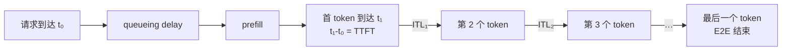
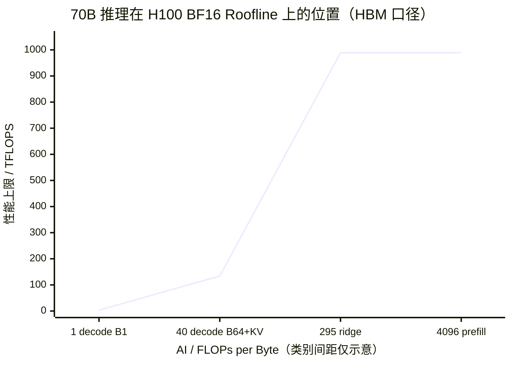
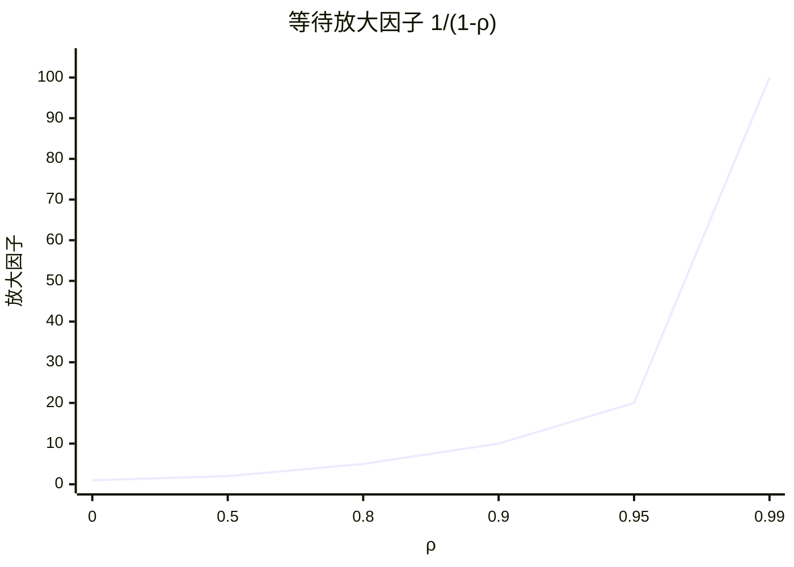

# L55 推理性能模型：从 Roofline 到 SLO

> [!abstract] 本课速览
> 读完你将能够：
> 1. 用 Roofline 定量解释 prefill 为什么典型地吃算力、decode 为什么典型地吃显存带宽；
> 2. 从一条请求时间线严格区分 TTFT、TPOT/ITL、E2E latency、tokens/s 与 RPS；
> 3. 用 SLO 与 goodput 表达“吞吐要高，但用户不能等太久”的服务目标；
> 4. 用 $\lambda$、$\mu$、$\rho$、Little's Law 和 M/M/1 直觉判断排队何时失控；
> 5. 复算 70B-BF16、TP8×H100 的权重、KV cache、prefill、并发与成本账。
>
> 前置：[[L13 自回归生成与KV缓存]] · [[L23 Roofline模型]] · 预计 55 分钟

## 论文里的这段话，你现在可能读不懂

> [!quote]
> “An LLM serving system must jointly meet a **TTFT SLO** and a **TPOT SLO**. **Compute-bound prefill** and **memory-bound decode** have different resource profiles; larger decode batches can raise **tokens/s** while worsening per-request **ITL**. Under bursty arrivals, **queueing delay** grows near saturation, so the scheduler should optimize **goodput** rather than peak throughput.”（改写自 DistServe 与推理系统论文的典型表述）

这段话真正问的是三件事：一条请求快不快，一群请求能不能持续扛住，以及“快”的门槛由谁规定。只看 GPU 上一次 forward 的时间，回答不了排队；只报最高 tokens/s，又可能把已经超时的请求也算成成绩。下面从一条请求开始，把硬件上限、排队和服务契约接成一张账。

## 一、一条请求的三只钟

### 1. TTFT、TPOT/ITL 与 E2E 各量哪一段

请求到达后不会立刻进 GPU。它先经过路由和 **queueing delay**（排队时延），再做 prefill、发出首 token，随后逐 token decode：



- **TTFT**（Time To First Token，首 token 时延）从请求到达到客户端收到首个输出 token；服务侧近似拆成“排队 + prefill + 首次返回开销”。
- **ITL**（Inter-Token Latency，token 间时延）是相邻两个流式输出 token 的时间间隔，每一步都可能不同。
- **TPOT**（Time Per Output Token，每输出 token 时间）通常指首 token 之后各 ITL 的平均值。论文常把 TPOT 与 ITL 混用；读图时要确认它报的是逐步分布、请求内平均，还是跨请求 percentile。
- **E2E latency**（端到端时延）从请求到达到最后一个输出 token 到达。若输出共有 $O$ 个 token，TTFT 已包含第一个，那么精确记账是

$$
\boxed{T_{\mathrm{E2E}}=T_{\mathrm{TTFT}}+(O-1)T_{\mathrm{TPOT}}}。
$$

当 $O$ 很大时，有些论文把它近似写成 $T_{\mathrm{TTFT}}+O\cdot T_{\mathrm{TPOT}}$；短回答里这个差一个 token 的误差不能假装不存在。若不 streaming，用户只看到 E2E；streaming 改变可感知节奏，却不会凭空减少 prefill 或 decode 工作。

### 2. tokens/s 与 RPS 不能互相替代

**tokens/s**（每秒 token 数）要注明是 input、output 还是二者之和，是单请求、单 GPU、单实例还是全局聚合。**RPS**（Requests Per Second，每秒请求数）统计完成或接纳的请求数。若平均每个请求输出 $\bar O$ 个 token，稳定区间里才有粗略关系

$$
q_{\mathrm{out}}\approx \mathrm{RPS}\times\bar O。
$$

同样是 1,000 output tokens/s，平均输出 100 token 时约为 10 RPS，平均输出 1,000 token 时只有约 1 RPS。长度分布一变，tokens/s 不变也不代表能接同样多的用户。

### 3. SLO 把用户语言翻译成系统约束

**SLO**（Service Level Objective，服务级别目标）是对指标、阈值、统计窗口和适用流量的可测目标。例如可以约定：在一个给定窗口和请求类别内，TTFT 小于 2 s，且请求级平均 TPOT 的 p99 小于 50 ms。没有窗口、percentile 和流量范围的“低时延”不是完整 SLO。

**SLA**（Service Level Agreement，服务级别协议）则是包含未达到目标时后果的用户协议；有退款、赔偿或其他明确后果，才进入 SLA 语境。大白话说：SLO 是工程团队瞄准的靶，SLA 是靶没打中要承担什么。

一般语境下，**goodput**（满足约束的有效吞吐）是不把错误或超时工作算作成绩的吞吐。DistServe 把推理 goodput 定义得更具体：给定 SLO attainment 目标 $a^\star$，寻找仍能达到该目标的最大请求到达率。设

$$
A(\lambda)=\frac{\text{同时满足 TTFT 与 TPOT SLO 的有效请求数}}
{\text{有效请求总数}},
$$

则系统级容量可写成

$$
\boxed{G_{\mathrm{req}}=\max\{\lambda:A(\lambda)\ge a^\star\}}，
\qquad
G_{\mathrm{per\ GPU}}=\frac{G_{\mathrm{req}}}{n_{\mathrm{GPU}}}。
$$

在某个固定 offered load 下，$\lambda A(\lambda)$ 可以表示实际达标请求率；但它不是 DistServe 所说的“最大可承载率”定义。这个区别能防止一个常见障眼法：把负载继续加大，raw completions 也许还涨，SLO attainment 却已经崩了。

```text
raw tokens/s
    ^                         ×
    |                    ×
    |               ●  ← SLO 内最高可用 operating point
    |          ×
    |     ×
    +---------------|--------------------> TPOT
                    SLO 上限
          左侧计入 goodput；右侧虽有吞吐，却不再合约
```

这就是 **latency-throughput tradeoff**（时延—吞吐权衡）：加 batch 常让设备吞吐上升，也让单请求等更久或每步变慢。曲线上不存在无条件“吞吐最高且时延最低”的神奇点，SLO 的作用就是规定可接受区域。

## 二、为什么 prefill 吃算力、decode 吃带宽

### 1. 同一模型，两种 Roofline 位置

[[L23 Roofline模型]] 给出的 H100 BF16 dense 屋脊点为

$$
I_{\mathrm{ridge}}=\frac{989\ \mathrm{TFLOPS}}{3.35\ \mathrm{TB/s}}
\approx295\ \mathrm{FLOPs/Byte}。
$$

对 $N$ 参数 BF16 模型，先只看参数主项：

- **compute-bound prefill**（典型计算受限的 prefill）一次并行处理 $S$ 个 prompt tokens，参数相关工作约为 $2NS$ FLOPs，权重最低读取量约 $2N$ Byte，所以理想权重 AI 约为 $S$ FLOPs/Byte。$S=4096$ 时远高于 295，大 GEMM 典型地先撞算力屋顶。
- **memory-bound decode**（典型显存带宽受限的 decode）在 batch=1 时生成一个 token 约做 $2N$ FLOPs，却仍要流式读取约 $2N$ Byte 的 BF16 权重，权重 AI 约为 1 FLOP/Byte；再加历史 KV cache 流量，AI 只会更低。



这里说的是“典型区域”，不是给阶段贴永久标签。短 prompt、小而瘦的 GEMM、低效 kernel 或物化 attention 中间矩阵，都可能让 prefill 达不到算力屋顶；大 decode batch、量化和数据复用则会把 decode 的点向右推。

### 2. batch effect 为什么对两个阶段不对称

**batch effect**（批处理效应）在 decode 上最直接：把 $B$ 个请求的当前 token 一起算，权重近似只读一次，却服务 $B$ 行输入。忽略 KV 与其他流量时，工作约为 $2NB$ FLOPs、权重约为 $2N$ Byte，因此 $I\approx B$。直到进入 compute-bound，或 KV cache 带宽与其他开销接管瓶颈，增大 batch 都可能显著提高 aggregate tokens/s。

prefill 本来就把一个请求的 $S$ 个 tokens 组成大 GEMM。它一旦 compute-bound，再加入请求主要是增加总 FLOPs，设备效率的边际收益较小，批次完成时间却会增长。于是调度器会积极凑 decode batch，却要谨慎让大 prefill 插入关键路径；这正是 [[L57 连续批处理与调度]] 的理论起点。

> [!example] 算一算 1：70B-BF16、TP8×H100 的单请求 decode 上限
> 数据全部取自 [[03 约定与符号]]：$N=70\times10^9$，BF16 为 2 B/参数；H100 HBM 带宽为 3.35 TB/s，BF16 dense 为 989 TFLOPS。假设权重和计算在 TP8 上均匀切分，8 张卡并行推进同一个 decode step，暂时忽略 KV cache、TP 通信、kernel 与调度损失。
>
> 权重总量与每卡分片为
> $$
> C_W=70\times10^9\times2=140\ \mathrm{GB},
> \qquad C_{W,\mathrm{rank}}=140/8=17.5\ \mathrm{GB}。
> $$
> 每张卡完成一次权重扫描的 HBM 下界为
> $$
> T_{\mathrm{decode},W}\ge\frac{17.5\ \mathrm{GB}}
> {3350\ \mathrm{GB/s}}
> \approx0.00522\ \mathrm{s}=5.22\ \mathrm{ms}。
> $$
> 因而单请求理想上限是
> $$
> q_{B=1}\le\frac{1}{0.00522}\approx\boxed{191\ \mathrm{tokens/s}}。
> $$
> 同一步每卡的参数相关计算只有 $2N/8=17.5$ GFLOPs，按 dense 峰值只需约 $17.7\ \mu\mathrm{s}$；它比 5.22 ms 的权重扫描小两个数量级。真实系统还要读 KV、做 collective 并承受小 kernel 效率损失，所以 191 tokens/s 是 roofline 上限，不是 benchmark 或服务承诺。

> [!example] 算一算 2：B=64、S=4K 时，KV 已经不能当零头
> Llama-3-70B 的 $L=80$、$h/h_{kv}=64/8$、$d=8192$，所以 $d_{head}=128$。取 BF16、当前缓存长度 $S=4096$。每请求 KV cache 总量为
> $$
> \begin{aligned}
> C_{\mathrm{KV,req}}
> &=2\times80\times4096\times8\times128\times2\ \mathrm{B}\\
> &=1{,}342{,}177{,}280\ \mathrm{B}
> \approx1.342\ \mathrm{GB}。
> \end{aligned}
> $$
> 64 个请求合计
> $$
> C_{\mathrm{KV,total}}=64\times1.342\approx\boxed{85.9\ \mathrm{GB}}。
> $$
> 本算例明确采用“8 个 KV heads 随 TP8 各切 1 个 head 到每卡”的口径，所以每卡约为
> $$
> C_{\mathrm{KV,rank}}=85.9/8\approx\boxed{10.7\ \mathrm{GB}}。
> $$
> 理想同步 decode 一步在每卡读取 17.5 GB 权重与约 10.7 GB 历史 KV，HBM 时间下界为
> $$
> T_{B=64}\ge\frac{17.5+10.7}{3350}\approx8.42\ \mathrm{ms}。
> $$
> 这一步同时产生 64 个 token，所以 aggregate output-token 上限为
> $$
> q_{B=64}\le\frac{64}{0.00842}\approx\boxed{7.60\times10^3\ \mathrm{tokens/s}}，
> $$
> 每个活跃请求的理想 TPOT 则约为 8.42 ms。对应每卡 AI 约为
> $$
> I\approx\frac{64\times(2N/8)}{(17.5+10.7)\times10^9}
> \approx39.7\ \mathrm{FLOPs/Byte}<295，
> $$
> 仍在 memory-bound 一侧。若忽略 KV，batch=64 的同口径上限约为 12.3K tokens/s；把 KV 加回后下降约 38%。==batch 摊薄了权重，却没有让 64 份历史 KV 互相共享。==

> [!example] 算一算 3：4K prefill 的隔离时间估算
> 参数主项工作量约为
> $$
> F_{\mathrm{prefill}}\approx2NS
> =2\times70\times10^9\times4096
> =573.44\times10^{12}\ \mathrm{FLOPs}。
> $$
> 设计场景假设 TP8 的 8 张 H100 各达到 BF16 dense 峰值的 50%，则总有效算力为
> $$
> P_{\mathrm{eff}}=8\times989\times10^{12}\times50\%
> =3.956\times10^{15}\ \mathrm{FLOPS}，
> $$
> $$
> T_{\mathrm{prefill}}\approx\frac{573.44\times10^{12}}
> {3.956\times10^{15}}
> \approx\boxed{0.145\ \mathrm{s}=145\ \mathrm{ms}}。
> $$
> 这是“参数主项 + 50% 有效算力”的教学场景，不是实测，也不是纯硬件物理下限；若直接用 100% dense 峰值，算力屋顶给出的理想下界约为 72.5 ms。attention 的 $S^2$ 项、TP 通信、kernel 效率、排队与网络返回都会继续进入真实 TTFT，因此
> $$
> T_{\mathrm{TTFT}}\approx T_{queue}+T_{prefill}+T_{overhead}。
> $$

> [!warning] 三个常见误区
> 1. **“换峰值 FLOPS 更高的卡，decode 就按比例变快。”** memory-bound decode 首先看 HBM 带宽、权重/KV 字节数与实现效率；[[03 约定与符号]] 中 H20 的算力较低、HBM 带宽却高于 H100，正说明不能只按 FLOPS 排推理卡。
> 2. **“batch 越大，吞吐和时延都会越好。”** batch 会提高权重复用，但也会增加等待、KV 流量与单步工作；SLO 外的 raw throughput 不是 goodput。
> 3. **“TTFT 就是 prefill kernel 时间。”** 负载接近饱和时，queueing delay 往往比孤立 kernel 时间更大。

## 三、排队论最小工具箱

### 1. $\lambda$、$\mu$、$\rho$：先问系统能不能稳住

把一个固定配置的 serving instance 暂时抽象成服务台：

- **arrival rate ($\lambda$)**（到达率）是单位时间进入系统的请求数；
- **service rate ($\mu$)**（服务率）是给定 workload 分布与调度策略下，服务台长期平均可完成的请求数；
- **utilization ($\rho$)**（利用率 / 负载率）在最简单单服务台模型中为 $\rho=\lambda/\mu$。它是排队负载，不等同于 profiler 里的 SM utilization 或 HBM 带宽占用；
- **stability condition ($\rho<1$)**（稳定条件）要求长期平均到达速率小于服务速率。若 $\rho\ge1$ 且队列无限，积压会无界增长；真实系统的有限队列则表现为拒绝、timeout 或 OOM；
- **saturation**（饱和）是继续增加 offered load 后，完成吞吐不再相应增长、排队与时延却快速上升的工作区间。

LLM 请求长短不一，所以 $\mu$ 不是模型和 GPU 的永恒常数。输入/输出长度分布、batch、缓存命中、量化与调度策略一变，服务时间分布和 $\mu$ 都要重测。

### 2. M/M/1 只求认路，不求把生产系统塞进去

**M/M/1**（泊松到达、指数服务时间、单服务台模型）假设到达间隔与服务时间都无记忆。它通常不符合 LLM 的长尾输出，但能给出接近饱和时的方向：

$$
W=\frac{1}{\mu-\lambda}
=\frac{1}{\mu(1-\rho)},
\qquad
W_q=\frac{\rho}{\mu(1-\rho)}。
$$

$W$ 是系统平均时延，$W_q$ 是平均排队时延。固定 $\mu$ 时，$\rho$ 从 0.5 增到 0.9，$1/(1-\rho)$ 从 2 变成 10；不是“忙了 40%”，而是等待放大到原来的 5 倍量级。该模型下系统时延的 p99 还随 $1/(\mu-\lambda)$ 放大：

$$
W_{p99}=\frac{\ln100}{\mu-\lambda}
=\frac{4.605}{\mu(1-\rho)}。
$$



这张图不是生产预测曲线；它是一个警报器：不要把系统长期顶在 100% offered-load 附近，再期待 p99 仍像空载 benchmark。

### 3. Little's Law 把并发、吞吐、时延焊在一起

**concurrency**（并发数）要说明边界：系统 concurrency 可包括排队与执行中的所有 in-flight 请求；GPU active sequences 只包括当前占用 KV cache、参与调度的请求。二者不能默认相等。

对任意稳定系统，**Little's Law**（利特尔定律）给出

$$
\boxed{L=\lambda W}，
$$

其中 $L$ 是系统内平均请求数，$\lambda$ 是长期平均完成/到达率，$W$ 是平均 E2E 时延。它不要求 M/M/1 的指数分布假设，但要求统计边界一致且系统处于稳态。

> [!example] 算一算 4：10 QPS、平均 E2E 6 s，系统里有多少请求
> $\lambda=10\ \mathrm{requests/s}$，$W=6\ \mathrm{s}$，所以
> $$
> L=\lambda W=10\times6=\boxed{60\ \mathrm{requests}}。
> $$
> 若某实例最多只允许 64 个 active sequences，这个平均值已经几乎吃光并发预算；但 Little's Law 的 60 包括按测量边界计入的排队请求，不能直接断言“GPU 上恰有 60 份 KV”。它是 sanity check：系统没有给长度长尾与突发留下多少余量，单实例大概率需要 admission control、扩容或更低 offered load。

真实流量还有 **burstiness**（突发性）：请求不是均匀滴答到达，而会在短时间成团涌入。两个 trace 的平均 $\lambda$ 相同，短时方差更大的那个仍会制造更深队列。M/M/1 只建“$\rho\to1$ 时会爆”的直觉；要预测具体 p99，应使用真实到达与长度 trace 做 trace-driven replay 或仿真。

## 四、负载决定架构，不是模型名字决定架构

一份可用的 **workload trace**（工作负载轨迹）至少应记录请求到达时间、输入长度、输出长度、请求类别/优先级、SLO，以及会影响 prefix cache 的重复前缀信息；做公开研究时还要脱敏。只给平均 prompt 长度和平均 QPS，会同时藏掉长度尾部与 burstiness。

**reasoning workload**（推理型长输出负载）常把更多 test-time compute 花在自回归生成上。不要把“reasoning”当抽象标签，直接看输出长度分布：若构造场景中输出从 $O$ 增到 $10O$，而 TTFT 与 TPOT 暂不变，则

$$
T_{\mathrm{E2E}}^{\prime}
=T_{\mathrm{TTFT}}+(10O-1)T_{\mathrm{TPOT}}，
$$

decode 项近似增至 10 倍，E2E 更容易由 decode 主导。长 prompt、短输出偏向 prefill 压力；短 prompt、长输出偏向 decode 带宽与 KV 容量；burst 高的交互流量则可能先被队列击穿。==负载画像变了，最优 batch、P/D 资源比、路由和扩缩策略都要重算。==这会在 [[L60 分布式推理与PD分离]] 里变成架构选择。

## 五、显存预算与每百万 token 成本

设每卡 HBM 容量为 $C_{\mathrm{HBM}}$，每卡权重分片为 $C_W$，每请求在该 rank 上的 KV 为 $c_{\mathrm{KV}}$，activation 与运行时预留分别为 $C_A,C_R$。最大 active batch 的乐观上限是

$$
\boxed{B_{\max}=\left\lfloor
\frac{C_{\mathrm{HBM}}-C_W-C_A-C_R}
{c_{\mathrm{KV}}}
\right\rfloor}。
$$

在前面的 TP8 头切分口径下，$c_{\mathrm{KV}}=1.342/8\approx0.168$ GB/请求。若故意令 $C_A=C_R=0$，80 GB H100 上有

$$
B_{\max,optimistic}=\left\lfloor\frac{80-17.5}{0.168}\right\rfloor
\approx\boxed{372}。
$$

这只是容量天花板：真实引擎要给 activation、CUDA graph、通信 buffer、内存池和碎片留空间，且长序列会线性增大 $c_{\mathrm{KV}}$。[[L56 KV缓存与PagedAttention]] 要解决的，正是“理论剩余容量不少，连续预留和碎片却让并发先死掉”的问题。

最后做一个成本下界。[[03 约定与符号]] 的教学租价是 H100 量级 2 美元/(GPU·h)。若 8 卡实例真的达到上面 batch=64 的理想 7.60K output tokens/s，且每个 token 所属请求都满足 SLO，则

$$
\begin{aligned}
\mathrm{Cost/M\ output\ tokens}
&=\frac{8\times\$2/\mathrm{h}}
{7.60\times10^3\ \mathrm{tokens/s}\times3600\ \mathrm{s/h}}
\times10^6\\
&\approx\boxed{\$0.58/\mathrm{M\ output\ tokens}}。
\end{aligned}
$$

因为 7.60K 是 roofline 上限，真实 GPU 成本只能高于这个数；CPU、网络、存储、PUE、空闲副本、prefill input tokens 和 SLA 冗余也尚未计入。若 SLO attainment 小于 100%，应把分母换成满足约束的有效 token rate。完整版成本模型留到 [[L61 推理服务框架与集群]]。

## 回到开头那段话

现在逐句回读：

1. “An LLM serving system must jointly meet a TTFT SLO and a TPOT SLO。”——TTFT 是排队、prefill 与首 token 返回的合计；TPOT/ITL 描述首 token 后的流式节奏。SLO 还必须写清阈值、percentile、窗口和流量范围（第一节）。
2. “Compute-bound prefill and memory-bound decode have different resource profiles。”——prefill 的理想权重 AI 约为 $S$，4K prompt 远在 H100 ridge point 右侧；batch=1 decode 的权重 AI 约为 1，再加 KV 后更吃带宽（第二节）。
3. “Larger decode batches can raise tokens/s while worsening per-request ITL。”——batch 让一份权重服务多个当前 token，但 KV 不共享；aggregate throughput 上升的同时，排队与单步工作可能让 ITL 变差，这就是 latency-throughput tradeoff（第一、二节）。
4. “Under bursty arrivals, queueing delay grows near saturation。”——$\rho=\lambda/\mu$ 接近 1 时，M/M/1 的等待按 $1/(1-\rho)$ 爆炸；真实 burstiness 与长尾输出通常只会让简单平均更不可靠（第三节）。
5. “The scheduler should optimize goodput rather than peak throughput。”——正确目标是在 TTFT/TPOT SLO attainment 约束下找最大可承载请求率，而不是把超时请求也算进 raw tokens/s（第一节）。

你现在可以把整课压成一句话：==先用 Roofline 找单步的硬件瓶颈，再用排队论把单步放回请求流，最后用 SLO 决定哪些吞吐才算数。==

## 术语卡片

| 术语 | 中文 | 一句话解释 |
|---|---|---|
| TTFT | 首 token 时延 | 从请求到达到客户端收到第一个输出 token 的时延。 |
| TPOT | 每输出 token 时间 | 首 token 之后，各 token 间隔的请求内平均。 |
| ITL | token 间时延 | 相邻流式输出 token 之间的单次时间间隔。 |
| E2E latency | 端到端时延 | 从请求到达到最后一个输出 token 到达的总时延。 |
| queueing delay | 排队时延 | 请求到达后、真正开始接受服务前的等待时间。 |
| tokens/s | 每秒 token 数 | 单位时间处理或生成的 token 数，必须注明类型与聚合边界。 |
| RPS | 每秒请求数 | 单位时间接纳或完成的请求数，必须注明统计口径。 |
| SLO | 服务级别目标 | 对服务指标、阈值、统计窗口与适用流量设定的可测目标。 |
| SLA | 服务级别协议 | 包含服务目标及未达标后果的用户协议。 |
| goodput | 有效吞吐 | 推理中指在 SLO attainment 目标下仍可承载的最大请求率。 |
| latency-throughput tradeoff | 时延—吞吐权衡 | 提高 batch/负载可能增加吞吐，也会恶化请求时延。 |
| batch effect | 批处理效应 | 多个 token 复用同一份权重读取，提高 AI 与 aggregate throughput。 |
| memory-bound decode | 显存带宽受限的 decode | 单步计算少、权重与 KV 搬运多，性能典型地先受 HBM 限制。 |
| compute-bound prefill | 计算受限的 prefill | prompt tokens 并行形成大 GEMM，性能典型地先受算术吞吐限制。 |
| concurrency | 并发数 | 同时处于指定系统边界内的 in-flight 请求数。 |
| saturation | 饱和 | 加负载不再提高完成吞吐、只继续推高排队与时延的区间。 |
| workload trace | 工作负载轨迹 | 按时间记录请求到达、长度、类别与相关服务属性的数据。 |
| reasoning workload | 推理型长输出负载 | 把较多 test-time compute 花在自回归生成、输出常更长的 workload。 |
| arrival rate (λ) | 到达率 | 单位时间进入系统的请求数。 |
| service rate (μ) | 服务率 | 固定配置与 workload 下，服务台长期平均可完成的请求数。 |
| utilization (ρ) | 利用率 / 负载率 | 简单单服务台模型中的 $\lambda/\mu$，不是 GPU SM 利用率。 |
| stability condition (ρ<1) | 稳定条件 | 长期平均到达率必须小于服务率，队列才不无界增长。 |
| Little's Law | 利特尔定律 | 稳态下平均在系统请求数等于吞吐乘平均时延：$L=\lambda W$。 |
| M/M/1 | M/M/1 排队模型 | 泊松到达、指数服务时间、一个服务台的基础排队模型。 |
| burstiness | 突发性 | 请求在短时间成团到达、瞬时负载显著偏离长期平均的性质。 |

## 自测

1. 一个请求输出 100 个 tokens，TTFT=1.2 s，平均 TPOT=40 ms。精确 E2E latency 是多少？为什么不是简单的 $1.2+100\times0.04$？
2. 70B-BF16 模型做 TP8 时，每卡权重多少 GB？只按 3.35 TB/s 权重扫描，batch=1 decode 的理想 TPOT 与 tokens/s 上限各是多少？
3. 为什么 decode 增大 batch 常显著提高 aggregate tokens/s，而 prefill 增大 batch 的效率收益通常较小？
4. 服务的 $\lambda=8$ requests/s、平均 E2E 为 4 s。用 Little's Law 估算平均系统 concurrency；这个数为何不必等于 GPU active sequences？
5. 固定 $\mu$ 时，$\rho$ 从 0.8 增至 0.9，M/M/1 的 $1/(1-\rho)$ 等待放大因子如何变化？
6. raw throughput、固定负载下的 SLO 达标请求率、DistServe 语义的 goodput 三者有什么区别？
7. 设计一个用于比较 colocated 与 P/D 分离架构的 workload trace，至少列出五个必须字段，并说明 reasoning workload 会把哪个阶段推向主导。

> [!note]- 参考答案
> 1. TTFT 已包含第一个 token，所以 $T_{E2E}=1.2+(100-1)\times0.04=\boxed{5.16\ \mathrm{s}}$。乘 100 会多算一个 TPOT。
> 2. 总权重 $70\text{B}\times2\text{ B}=140$ GB，每卡 $140/8=17.5$ GB。理想 TPOT 下界为 $17.5/3350\approx5.22$ ms，tokens/s 上限约为 $1/0.00522\approx191$；均忽略 KV、通信和软件损失。
> 3. decode batch 让同一份权重读取服务多个当前 token，权重 AI 近似随 $B$ 增长；但各请求 KV 不共享。prefill 已用 $S$ 个 prompt tokens 形成大 GEMM，进入 compute-bound 后再加 batch 主要增加 FLOPs 与完成时间，设备效率边际收益较小。
> 4. $L=\lambda W=8\times4=\boxed{32}$ 个请求。Little's Law 的系统边界可包含队列，而 GPU active sequences 只统计已经占用 KV/参与调度的请求。
> 5. 放大因子从 $1/(1-0.8)=5$ 增到 $1/(1-0.9)=10$，翻倍；这不等于生产 p99 的精确预测，只说明接近饱和的非线性风险。
> 6. raw throughput 把所有完成工作都计入；固定负载下的达标率可写成 $\lambda A(\lambda)$；DistServe goodput 是满足给定 SLO attainment 目标时可承载的最大 $\lambda$，常再除以 GPU 数报告 per-GPU goodput。
> 7. 至少包含 arrival timestamp、input length、output length、请求类别/优先级、SLO；还可含 prefix/caching key、tenant、状态码。reasoning workload 若主要拉长输出，会让 decode 时间、KV 容量与 decode 调度更容易主导。

## 延伸阅读

- [《Transformer Inference Arithmetic》](https://kipp.ly/p/transformer-inference-arithmetic)（kipply）：把权重、KV cache、batch 与 arithmetic intensity 放在同一张手算表中；重点读 memory bandwidth、batch sizes 和 capacity。
- [《DistServe: Disaggregating Prefill and Decoding for Goodput-optimized Large Language Model Serving》](https://www.usenix.org/conference/osdi24/presentation/zhong-yinmin)（OSDI 2024）：先读引言、goodput 定义与 motivation 图，观察 TTFT/TPOT SLO 怎样变成资源配比和放置目标；系统机制留到 [[L60 分布式推理与PD分离]]。
- [Google SRE《Service Level Objectives》](https://sre.google/sre-book/service-level-objectives/)：读 SLI/SLO/SLA 定义与 aggregation 小节，学会给“低时延”补齐 percentile、窗口、适用流量与违约后果。

---
上一课：[[L54 RL后训练系统]] ← · → 下一课：[[L56 KV缓存与PagedAttention]]
