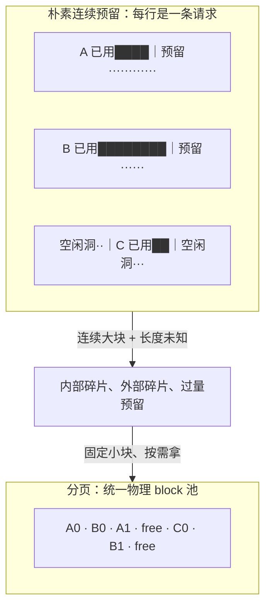
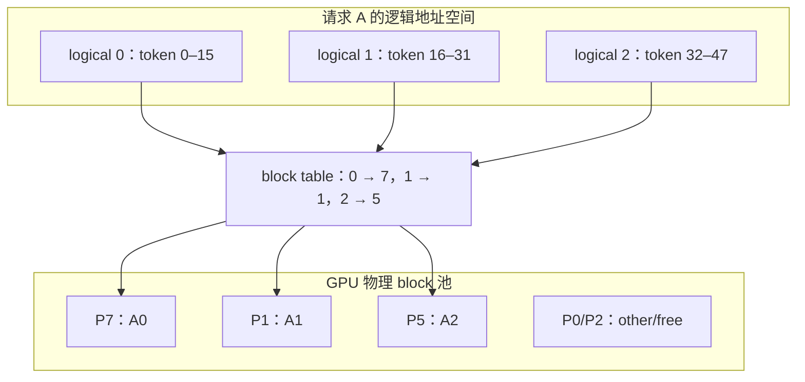
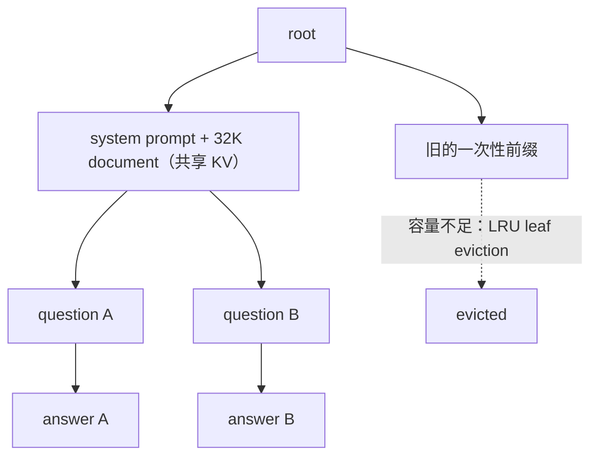

# L56 KV缓存与PagedAttention：把显存当页来管

> [!abstract] 本课速览
> 读完你将能够：
> 1. 区分 KV cache 的预留空间、内部碎片与外部碎片，并解释它们怎样卡死并发；
> 2. 把 PagedAttention 的 block、block table、logical/physical block 逐项对应到 OS 分页；
> 3. 解释 copy-on-write、swap 与 recomputation 怎样支持共享和抢占；
> 4. 用 prefix cache hit rate 估算重复长前缀带来的 TTFT、计算量与显存收益；
> 5. 说明 RadixAttention、LRU、cache-aware routing 与 KV tiering 怎样把 KV cache 推向分布式存储问题。
>
> 前置：[[L55 推理性能模型]] · [[L21 GPU内存体系]] · 预计 50 分钟

## 论文里的这段话，你现在可能读不懂

> [!quote]
> “The runtime uses **PagedAttention** to map **logical KV blocks** to non-contiguous **physical blocks** through a **block table**. Shared prefixes use **copy-on-write**, while preempted requests recover through **swap or recomputation**. **RadixAttention** retains reusable prefixes in a **radix tree** and applies **LRU eviction**; a tiered KV store may further offload cold blocks beyond GPU memory.”（改写自 vLLM、SGLang 与 KV cache 系统的典型表述）

如果只学过 Transformer，这段话像是把操作系统、缓存和存储术语硬塞进了 attention。其实主线只有一句：==KV 的数值由模型产生，但它放在哪里、能否共享、满了先赶走谁，是系统的内存管理问题。==

## 一、没有 KV cache management，并发先被“空位”吃掉

### 1. 生成长度未知，连续大块却要提前定长

[[L13 自回归生成与KV缓存]] 已经解释过：decode 若不缓存历史 K/V，每生成一个 token 都要重算整段前缀。于是 serving 引擎必须做 **KV cache management**（KV 缓存管理）：给正在增长的序列分配显存，在请求结束时回收，还要处理共享、抢占和跨层级搬运。

困难在于，输入长度在到达时可知，输出长度却只知道一个上限。早期系统为了让每个请求的 KV tensor 连续，会按 `max_len` 预留一整块。假设请求上限是 4096 token，最后只走到 350 token，那么 3746 个槽位在这个请求的一生中都被它圈住，别的请求看得见也用不了。

这里有三种容易混在一起的空间：

- 将来可能写入、但当前暂时为空的 reserved slots；请求仍在生成时，不能断言它们最终全浪费；
- **internal fragmentation**（内部碎片）：分配给某个请求的块内部，最终没有被有效 token 使用的空间；
- **external fragmentation**（外部碎片）：总空闲显存也许够，但被不同大小的已分配块切成小洞，找不到所需的连续大块。

内部碎片像是给一个人订了十人包间；外部碎片像是影院还剩十个散座，却来了一组必须连坐的十人。总空位一样，“能不能放进去”的答案完全不同。

vLLM 的 SOSP 2023 论文对当时的 Orca/FasterTransformer 风格基线做了 profiling：只有 20.4%–38.2% 的 KV cache memory 真正在保存 token states，反过来就是约 61.8%–79.6% 被预留与碎片等占去。这个“浪费 60%–80%”是特定论文、系统和 workload 下的历史测量，不是今天所有引擎的常数。[《Efficient Memory Management for Large Language Model Serving with PagedAttention》§2](https://doi.org/10.1145/3600006.3613165)

### 2. 浪费为什么直接变成吞吐损失

[[L55 推理性能模型]] 给过并发容量的乐观预算：

$$
B_{\max}=\left\lfloor
\frac{C_{\mathrm{HBM}}-C_W-C_A-C_R}{c_{\mathrm{KV}}}
\right\rfloor。
$$

朴素预留把分母从“实际已用 KV”偷换成“最大长度 KV”，外部碎片还会让分子里的可用总量无法组成连续块。并发下降后，memory-bound decode 能凑到的 batch 变小，权重读取不易摊薄，aggregate tokens/s 也跟着降。PagedAttention 的吞吐收益首先来自这里：让更多有效请求同时装进显存，而不是把同一次 attention 的 FLOPs 变少。

## 二、PagedAttention：请求看连续，显存可以散着放

### 1. block table 是那一层“翻译”

**vLLM** 是围绕高吞吐 LLM serving 构建的开源推理引擎；其 2023 年论文的核心机制 **PagedAttention** 允许一个序列的 K/V 存在不连续的显存位置。它把 KV cache 切成固定 token 数的 **block**（KV 块），例如每块 16 token；请求每增长满一块，才再取一块。

每条请求看到的是从 0 开始的逻辑块序列。**logical/physical block**（逻辑块 / 物理块）的区别是：logical block 表示“这是请求 A 的第几个 KV 块”，physical block 表示“数据实际落在全局显存池的哪一块”。**block table**（块表）保存两者映射。

对做过操作系统的读者，这几乎是“他乡遇故知”：

| OS 虚拟内存 | KV cache 管理 | 作用 |
|---|---|---|
| process | request / sequence | 各自看到连续的逻辑空间 |
| page | logical KV block | 固定粒度地编号和增长 |
| page frame | physical KV block | 真正占用 DRAM/HBM 的位置 |
| page table | block table | 把逻辑编号翻译成物理 block ID |
| demand paging | 按需分配 KV block | 不按最大生成长度一次性预留 |
| copy-on-write | 共享前缀，写时复制 | 多分支先共用，发生分叉才复制 |
| swap / page eviction | KV swap / eviction | 容量不足时把冷状态逐出快层 |

固定大小的 physical blocks 可以放进任意空闲槽，因此消除了“必须找连续大洞”造成的 external fragmentation；每条序列只可能在最后一个 block 留下未用槽位，内部浪费被限制在一个 block 内。不过，“零外部碎片”不等于整个 CUDA 进程零浪费：模型权重、workspace、allocator pool 和通信 buffer 仍有各自的容量问题。

代价也很实在：attention kernel 不能再把 K/V 当作一整段连续数组，必须按 block table 找到散落的块，并处理不同序列长度。vLLM 论文为此实现了 block write、按表读取和 block copy kernels。==PagedAttention 是用一次地址间接层换更高的全局显存利用率。==

> [!example] 算一算 1：4K 预留、平均 350 token，分页后能多放多少请求
> 采用 [[03 约定与符号]] 的 Llama-3-70B：$L=80$、$h_{kv}=8$、$d_{head}=8192/64=128$，KV 用 BF16 的 2 B。每个 token 的 KV 大小（跨完整 TP group 合计）是
> $$
> c_{\mathrm{KV/token}}
> =2\times80\times8\times128\times2
> =327{,}680\ \mathrm{B}。
> $$
> 朴素方案按 $S_{\max}=4096$ 为每请求预留：
> $$
> C_{\mathrm{naive}}=4096\times327{,}680
> =1{,}342{,}177{,}280\ \mathrm{B}
> \approx1.342\ \mathrm{GB}。
> $$
> 若实际平均只有 350 token，真正使用
> $$
> C_{\mathrm{used}}=350\times327{,}680
> =0.114688\ \mathrm{GB}，
> $$
> 所以预留槽位利用率只有
> $$
> \eta_{\mathrm{naive}}=\frac{350}{4096}
> \approx\boxed{8.54\%}。
> $$
> 现在采用 16 token/block。350 token 需要
> $$
> n_b=\left\lceil\frac{350}{16}\right\rceil=22\ \text{blocks},
> \qquad S_{\mathrm{alloc}}=22\times16=352，
> $$
> 只在末块空 2 个 token 槽，块内利用率为 $350/352\approx99.43\%$。同一个“能容纳 100 份 4K 预留”的 KV pool，在这个静态构造快照里可容纳
> $$
> \left\lfloor\frac{100\times4096}{352}\right\rfloor
> =\boxed{1163}\ \text{个平均长度请求}，
> $$
> 即约 $4096/352=\boxed{11.64\times}$ 的容量上限提升。它不是吞吐 benchmark：真实请求在持续增长，且权重、activation、运行时预留和 SLO 都没计入；它只把设计稿的“虚占显存”单独算清。

### 2. block 越小并不总越好

小 block 让最后一块浪费更少、分配更细；但 block table 更长，元数据和调度操作更多，kernel 读块也更零碎。大 block 容易形成高效的合并访存，却增加末块内部碎片，也让“恰好共享完整块”的机会变少。vLLM 论文在其 workload 中选择 16 token 作为默认值；它是工程折中，不是跨模型、跨硬件永远最优的数学常数。

## 三、共享与抢占：copy-on-write、swap 还是重算

### 1. 一份前缀，多个分支

并行采样和 beam search 常从同一个 prompt 分叉。若每条分支立刻复制整段 KV，长 prompt 会制造大量 redundant duplication。**copy-on-write**（写时复制）让多条 logical block 链先指向同一组 physical blocks，并用引用计数记录共享者数量。只读时零复制；某分支要改写最后一个共享块时，才分配新 physical block、复制那一块并更新自己的 block table。

大白话说，大家先共看一份讲义；有人要在页边写笔记时，只复印那一页，不复印整本书。prefix sharing 和 beam 分支的动态共享因此都能落在同一套 block 映射上。

### 2. 显存不够时，KV 丢了不等于请求报废

当新 token 需要 physical block、池里却没有空块时，调度器会 **preemption**（抢占）部分序列。被抢占序列有两种恢复路线，合称 **swap vs recomputation**（换出与重计算的选择）：

| 恢复方式 | 抢占时做什么 | 恢复时做什么 | 主要成本 |
|---|---|---|---|
| swap | 把 KV blocks 搬到 CPU memory | 再经 PCIe 搬回 GPU | 传输字节数、块粒度、PCIe 有效带宽 |
| recomputation | 直接丢掉 KV blocks，保留 token IDs | 把已有 tokens 当新 prompt 做一次 prefill | 模型前向 FLOPs、GPU 当前计算压力 |

这正是 [[L50 显存优化技术]] 的“算还是搬”在推理侧重演。swap 不是必然便宜：许多小 block 会变成许多小传输，吃不满 PCIe；recompute 也不是从头逐 token decode，已有 token IDs 可以并行 prefill 重建 KV。哪条路更快，要比较当前模型的 prefill 时间与 KV 往返时间，而不是凭“数据还在不在”做道德判断。具体怎样选择抢占对象和恢复时机，留给 [[L57 连续批处理与调度]]。

## 四、prefix caching：把重复 prefill 变成缓存命中

### 1. 分页解决“怎么放”，前缀缓存解决“要不要再算”

**prefix caching**（前缀缓存）保留已计算前缀的 KV；新请求若有完全相同、且计算上下文兼容的 token prefix，就直接挂到这些 physical blocks 后继续。典型重复部分包括 system prompt、few-shot examples、同一长文档，以及多轮对话历史。这样的 **prefix sharing**（前缀共享）同时省掉重复 prefill 计算和重复的前缀 KV 副本。

**cache hit rate**（缓存命中率）必须带口径：request-level hit 只问请求有没有命中过，token-level hit 则问多少前缀 tokens 的计算被跳过。一个请求只命中 16 token，和命中 32K token 都算一次 request hit，TTFT 收益却完全不同。本课后面的 $h$ 特指“重复前缀 token-work 的命中比例”。

缓存空间有限，就需要 **eviction/LRU**（淘汰 / 最近最少使用）：eviction 决定移除哪些不活跃条目；LRU 用“多久没访问”近似未来价值。LRU 简单，但 workload 若扫描大量一次性长文档，也可能把真正的热点挤走；生产系统还会考虑大小、重算代价、租户隔离和 SLO。

### 2. RadixAttention 怎样组织可复用前缀

**SGLang** 是面向高性能 LLM serving 与结构化生成的开源系统。它的 **RadixAttention** 用 **radix tree**（基数树 / 压缩前缀树）把 token sequences 作为 key、对应 KV tensors 作为 value；公共前缀只出现一次，分叉边可以一次标记一串 tokens，而不必像普通 trie 那样每 token 一个节点。请求完成后 KV 仍可留树中，容量紧张时从 LRU 叶分支递归淘汰。

RadixAttention 的“Attention”容易误导人：它不是新的注意力数学公式，而是把 prefix match、KV reuse、分页存储、LRU eviction 与调度接成运行时机制。[SGLang 的 RadixAttention 说明](https://www.lmsys.org/blog/2024-01-17-sglang/)

还有一个常见张冠李戴：RadixAttention 是 SGLang 的命名和 radix-tree 方案；截至 2026 年，vLLM 的 Automatic Prefix Caching 采用 full-block hash，把“父前缀 hash + 当前 block tokens”等组成 block key，并非维护同一棵 radix tree。二者都复用相同前缀 KV，但索引结构不同。[vLLM Automatic Prefix Caching 设计文档](https://docs.vllm.ai/en/latest/design/prefix_caching/)

### 3. 命中 32K 前缀，究竟省多少

> [!example] 算一算 2：32K 重复前缀与 70% 命中率
> 沿用 [[L55 推理性能模型]] 的教学场景：Llama-3-70B、TP8×H100，参数主项 $F_{\mathrm{prefill}}\approx2NS$，8 卡各达到 [[03 约定与符号]] 中 H100 BF16 dense 峰值 989 TFLOPS 的 50%。对 $S=32768$ 的重复 system prompt + document：
> $$
> F_{32K}=2\times70\times10^9\times32768
> =4.58752\times10^{15}\ \mathrm{FLOPs}，
> $$
> $$
> P_{\mathrm{eff}}=8\times989\times10^{12}\times50\%
> =3.956\times10^{15}\ \mathrm{FLOPS}，
> $$
> $$
> T_{32K,\mathrm{param}}
> \approx\frac{4.58752\times10^{15}}{3.956\times10^{15}}
> \approx\boxed{1.16\ \mathrm{s}}。
> $$
> 命中缓存就跳过这次重复前缀的参数主项 prefill，TTFT 约少一个 1.2 s 量级的组件。它仍不是端到端实测：长上下文 attention 的 $S^2$ 项、suffix prefill、调度、查表与返回时延要另算。
>
> 同一前缀的 BF16 KV 物理量为
> $$
> C_{\mathrm{KV},32K}
> =32768\times327{,}680
> =10.737\ \mathrm{GB}
> $$
> （跨 TP8 合计；按 8 个 KV heads 均匀切分时每 rank 约 1.342 GB）。共享已有 physical blocks，还避免为每个相同前缀再复制一份这 10.737 GB。
>
> 若 token-work 命中率 $h=70\%$，并假设瓶颈只来自这段重复前缀 prefill，则每请求平均只需计算 $(1-h)=30\%$，这部分容量的理想放大为
> $$
> A_{\mathrm{prefix}}=\frac{1}{1-h}
> =\frac{1}{0.3}
> \approx\boxed{3.33\times}。
> $$
> 这不是整集群总吞吐必然放大 3.33 倍。若重复前缀 prefill 只占原总成本比例 $f$，Amdahl 式上界应写成
> $$
> A_{\mathrm{E2E}}=\frac{1}{(1-f)+f(1-h)}。
> $$
> decode、cache miss、跨层搬运和排队越重，整体收益越小。

### 4. 一台实例命中还不够，路由要把相同前缀送到一起

如果同一前缀的下一条请求被负载均衡器送到另一台冷实例，本地 cache 再聪明也会 miss。于是 **cache-aware routing**（缓存感知路由）要在负载、SLO 与 locality 之间权衡：尽量把同前缀请求送到已有 KV 的实例，又不能把热点实例压到饱和。这个集群级问题会在 [[L61 推理服务框架与集群]] 展开。

> [!warning] prefix caching 不是无条件免费
> 1. token 不同、模型/adapter 或计算上下文不兼容，就不能把“看起来相似”当相同 KV；
> 2. 低命中或工作集大于缓存时，hash/tree 维护、内存占用和淘汰搬运可能只留下管理税；
> 3. 多租户共享还要考虑隔离与缓存侧信道，不能只追求命中率。

## 五、KV tiering：显存之外是一套存储系统

GPU HBM 最快，却最贵也最小。**KV offloading/tiering**（KV 换出 / 分层）把 KV 按热度放到 GPU memory、CPU DRAM、local SSD/NVMe 或 remote store。热 KV 留在 HBM 直接参加 attention；温 KV 放 CPU，命中时经 PCIe 取回；更冷、但重算很贵的长前缀可以落到本地盘或远端服务。

| 层级 | 容量与访问直觉 | 适合什么 KV | 新瓶颈 |
|---|---|---|---|
| GPU HBM | 最快、容量最紧 | active decode 与高频前缀 | HBM 容量、block allocator |
| CPU DRAM | 更大、需跨 PCIe | 近期可能复用的温数据 | PCIe 带宽、pinned memory |
| SSD / NVMe | 大、访问更慢 | 长文档、低频但重算贵的缓存 | I/O 粒度、prefetch、尾时延 |
| remote store | 可跨实例共享 | 跨节点复用、P/D KV 传输 | 网络带宽、路由、一致性与故障 |

**LMCache** 是需要“认名”的系统：它把 serving engine 的 KV 扩展成 GPU、CPU、local storage 与 remote backend 的多层存储，并支持跨请求、跨实例复用；Mooncake 等远端 backend 会在 [[L60 分布式推理与PD分离]] 再见。[LMCache Architecture Overview](https://docs.lmcache.ai/developer_guide/architecture.html)

offload 不是把容量问题扔给慢设备就结束。一次 miss 的关键路径是

$$
T_{\mathrm{hit,lower\ tier}}
\approx T_{lookup}+T_{transfer}+T_{install}，
$$

而重算是 $T_{recompute}$。系统要比较两者，决定 prefetch、放置、副本、eviction 和传输优先级；远端层还要处理链路拥塞、实例故障与 cache-aware routing。到了这里，KV cache 已经具备分布式存储系统的典型问题：对象命名、位置索引、分层、替换、复制、传输、隔离和可观测性。这正落在“分布式推理的网络与系统优化”主线上。

最后把 KV 优化压成三板斧：

1. **省着生成**：GQA、MLA 与 KV quantization 减少每 token 字节数，见 [[L18 注意力变体与长上下文]]、[[L58 量化推理]]；
2. **管好现有空间**：PagedAttention、block table、copy-on-write 与 prefix caching 提高显存利用率和复用率；
3. **把冷数据挪走**：CPU/SSD/remote tiering 用容量换搬运，并把 KV placement 变成网络与调度问题。

> [!warning] 三个常见误区
> 1. **“PagedAttention 加速了 attention 计算。”** 它首先优化 KV 的地址与容量管理；查 block table 还有额外 kernel 工作。端到端吞吐变好主要因为同显存能容纳更大有效 batch。
> 2. **“prefix caching 总是赚。”** 收益由 token-level hit rate、命中长度、缓存驻留和路由决定；低复用 workload 可能只付管理成本。
> 3. **“KV 被 eviction 就丢失了请求状态。”** token IDs 仍可保留，KV 可以从下层 swap-in，也可以 recompute；这是成本选择，不是生死选择。

## 回到开头那段话

现在逐句回读：

1. “The runtime uses PagedAttention to map logical KV blocks to non-contiguous physical blocks through a block table。”——请求看到按 token 顺序增长的 logical blocks；block table 把它们翻译到任意空闲 physical blocks，所以无需按 `max_len` 预留连续大块，外部碎片消失，末块内部浪费受 block size 限制（第二节）。
2. “Shared prefixes use copy-on-write, while preempted requests recover through swap or recomputation。”——多个分支先用引用计数共享物理前缀，真正写分叉时只复制末块；容量不足时，要么把 KV 搬到 CPU 后再搬回，要么保留 tokens、重新 prefill 建 KV（第三节）。
3. “RadixAttention retains reusable prefixes in a radix tree and applies LRU eviction。”——SGLang 用压缩前缀树索引 token sequence→KV 的映射，请求结束后仍保留可复用分支，空间不足时按最近使用情况从叶子淘汰（第四节）。
4. “A tiered KV store may further offload cold blocks beyond GPU memory。”——GPU 只留热 working set，冷 KV 可以下沉到 CPU、SSD 或 remote store；命中是否值得取回，要与重算成本以及网络/PCIe 时延比较（第五节）。

你现在应该能看出：==PagedAttention 不是孤立 kernel 技巧，而是一条从 GPU block allocator 出发，延伸到路由、网络和分布式缓存的数据管理主线。==

## 术语卡片

| 术语 | 中文 | 一句话解释 |
|---|---|---|
| KV cache management | KV 缓存管理 | 负责 KV 的分配、增长、共享、回收、抢占与跨层搬运。 |
| internal fragmentation | 内部碎片 | 已分配块内部最终没有承载有效 token 的空间。 |
| external fragmentation | 外部碎片 | 总空闲量够、却因空洞不连续而无法满足大块分配。 |
| PagedAttention | 分页式 attention / KV 管理机制 | 允许连续逻辑 KV blocks 存在不连续物理显存，并让 kernel 按映射读取。 |
| block | KV 块 | 容纳固定数量 token 的 K/V、作为分配和共享粒度的单元。 |
| block table | 块表 | 保存请求 logical block 到 physical block 的映射。 |
| logical/physical block | 逻辑块 / 物理块 | 前者表示请求内顺序，后者表示数据在全局 block pool 的实际位置。 |
| copy-on-write | 写时复制 | 多分支先共享物理块，某分支写入时才复制需要修改的块。 |
| swap vs recomputation | 换出与重计算 | 抢占后在“搬回旧 KV”和“用 tokens 重建 KV”之间选成本更低者。 |
| prefix caching | 前缀缓存 | 保留已算前缀 KV，让相同后续请求跳过重复 prefill。 |
| prefix sharing | 前缀共享 | 多请求或多分支共同引用一份物理前缀 KV。 |
| RadixAttention | 基数树前缀缓存机制 | SGLang 用 radix tree 自动匹配、复用和淘汰 KV 前缀的运行时方案。 |
| radix tree | 基数树 / 压缩前缀树 | 用可变长 token 串标记边、紧凑表示公共前缀的索引结构。 |
| cache hit rate | 缓存命中率 | 请求或 token-work 中从已有 KV 获得复用的比例，必须注明统计口径。 |
| eviction/LRU | 淘汰 / 最近最少使用 | 空间不足时移除缓存条目；LRU 优先移除最久未访问者。 |
| KV offloading/tiering | KV 换出 / 分层 | 按热度把 KV 放在 GPU、CPU、SSD 或远端存储。 |
| LMCache | LMCache KV 存储系统 | 为推理引擎提供多层 KV offload、复用和跨实例传输的系统。 |
| vLLM | vLLM 推理引擎 | 以 PagedAttention 与高吞吐调度著称的开源 LLM serving engine。 |
| SGLang | SGLang 推理系统 | 集成 RadixAttention、调度和结构化生成能力的开源 serving 系统。 |

## 自测

1. reserved slots、internal fragmentation 与 external fragmentation 有什么区别？为什么三者都可能压低并发？
2. 画出请求 logical blocks `[0,1,2]` 映射到 physical blocks `[7,1,5]` 的 block table，并说明 attention kernel 为什么不能再假设 KV 连续。
3. 某请求实际使用 350 token，朴素方案按 4096 token 预留。朴素槽位利用率是多少？若 block size=16，分页后的末块利用率是多少？
4. 两条并行采样序列共享长 prompt，什么时候触发 copy-on-write？为什么通常只需复制一个 block？
5. swap 与 recomputation 各自主要受什么资源限制？为什么“保留 KV”不必然比“丢掉再算”快？
6. 对 32K 重复前缀，token-work hit rate 为 70%。只看这部分 prefill 时，理想容量放大是多少？为什么不能直接说整机吞吐也放大同样倍数？
7. SGLang RadixAttention 与 vLLM Automatic Prefix Caching 的共同目标和索引结构差异是什么？
8. 设计一个跨两台 serving instances 的 KV tiering 策略：至少写出放置、路由、eviction 和故障后恢复各一个决策变量。

> [!note]- 参考答案
> 1. reserved 是尚未使用但可能供未来 token 写入的预留；内部碎片是分配块内最终未用空间；外部碎片是空闲洞不连续。它们都会让“账面空闲”不能给新请求使用，从而缩小 active batch。
> 2. 表项为 `0→7, 1→1, 2→5`。logical 顺序连续不代表 physical 地址连续，kernel 必须先查表，再从 7、1、5 号 blocks 取 K/V。
> 3. 朴素利用率 $350/4096\approx\boxed{8.54\%}$。分页需 $\lceil350/16\rceil=22$ 块，共 352 槽，利用率 $350/352\approx\boxed{99.43\%}$。
> 4. 两序列只读共同 prompt 时继续共享；某分支要写仍被多人引用的末块时触发 COW。已填满的前缀块不会改变，只有可继续写入的共享末块需要复制。
> 5. swap 主要受 KV 字节数、块粒度和 CPU–GPU 带宽限制；recompute 主要受 prefill FLOPs、GPU 算力与计算排队限制。小而碎的 PCIe 传输可能比一次并行 prefill 更慢。
> 6. $1/(1-0.7)=\boxed{3.33\times}$，但它只放大重复前缀 prefill 这一成本项；decode、miss、suffix、搬运与排队仍在，整体应用 Amdahl 式核算。
> 7. 两者都按 token-identical prefix 复用已有 KV。SGLang RadixAttention 用 radix tree 组织前缀分支；vLLM 当前 APC 用父前缀与 block tokens 等组成的 hash 索引 full blocks。
> 8. 示例：按访问频率和重算成本决定 GPU/CPU/remote 放置；路由选择已有前缀且未饱和的实例；按 LRU×对象大小×重算代价决定 eviction；实例故障后从远端副本拉取，若无副本则用 token IDs recompute。评价指标可用 TTFT p99、hit rate、网络字节数与 SLO goodput。

## 延伸阅读

- [《Efficient Memory Management for Large Language Model Serving with PagedAttention》](https://doi.org/10.1145/3600006.3613165)（SOSP 2023）：本模块必读；重点精读 §2 的浪费分类、§3 的 block table/COW/preemption 与 block-size ablation。
- [《SGLang: Efficient Execution of Structured Language Model Programs》](https://proceedings.neurips.cc/paper_files/paper/2024/file/724be4472168f31ba1c9ac630f15dec8-Paper-Conference.pdf)（NeurIPS 2024）：读 RadixAttention 的树操作、cache-aware scheduling 与 structured workload 动机。
- [vLLM Automatic Prefix Caching 设计文档](https://docs.vllm.ai/en/latest/design/prefix_caching/)：对照论文年代与当前实现，重点看 full-block hash、reference count、free queue 和 LRU eviction。
- [LMCache Architecture Overview](https://docs.lmcache.ai/developer_guide/architecture.html)：沿 GPU→CPU→local/remote backend 看 KV 怎样从 tensor 变成分层数据对象。

---
上一课：[[L55 推理性能模型]] ← · → 下一课：[[L57 连续批处理与调度]]
