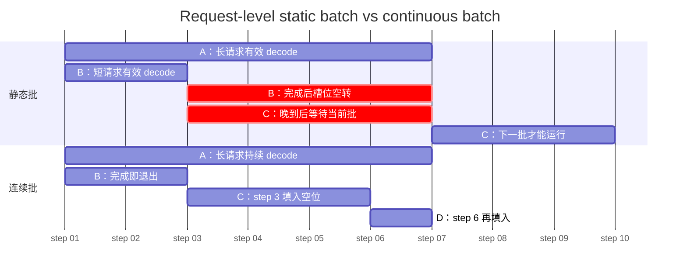
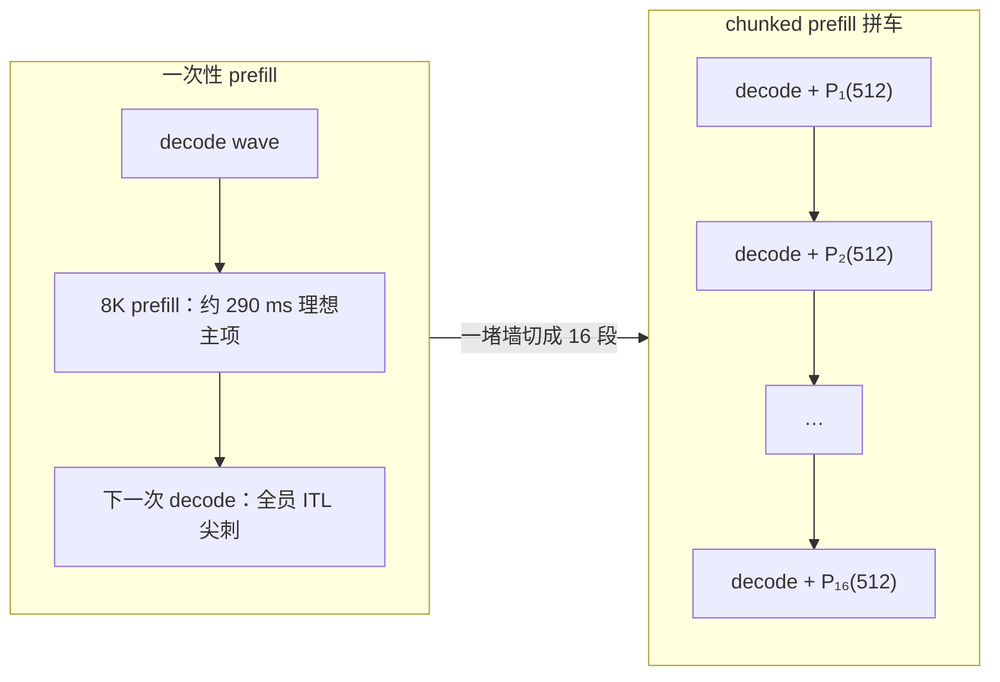
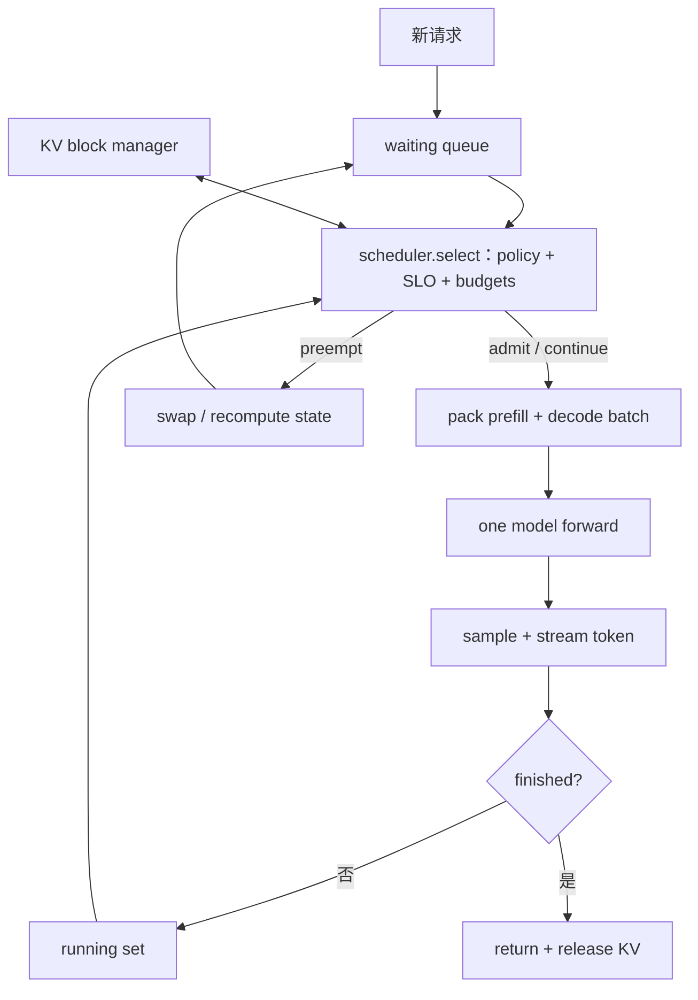

# L57 连续批处理与调度：每一步都重新组队

> [!abstract] 本课速览
> 读完你将能够：
> 1. 用甘特图和槽时模型解释静态批为什么同时浪费 GPU、拖慢短请求；
> 2. 解释 continuous batching 怎样在每个 iteration 让完成者退出、等待者加入；
> 3. 定量分析长 prefill 插入 decode 时的 generation stall，以及 chunked prefill 的粒度权衡；
> 4. 比较 FCFS、SJF、优先级、公平、准入和抢占策略，并把目标写成 SLO 约束下的 goodput；
> 5. 沿 waiting/running 队列读懂推理引擎主循环的源码地图。
>
> 前置：[[L55 推理性能模型]] · [[L56 KV缓存与PagedAttention]] · 预计 55 分钟

## 论文里的这段话，你现在可能读不懂

> [!quote]
> “A **request-level batch** holds its membership until the longest sequence finishes. **Orca** replaces it with **iteration-level scheduling**, also known as **continuous** or **in-flight batching**, so completed requests leave and waiting requests join between decoding iterations. Yet co-locating a long prefill with active decodes can cause a **generation stall**; **chunked prefill**, **admission control**, and **preemption** must trade TTFT, TPOT, **fairness**, and goodput across **SLO tiers**.”（改写自 Orca、Sarathi-Serve 与现代推理引擎的典型表述）

这段话其实在问一个很朴素的问题：GPU 上座位有限，谁现在上车、谁中途下车、谁先等一会儿？麻烦在于每位乘客的 prompt 和输出长度不同，还分别盯着 TTFT 与 TPOT 两只钟。调度器不是外围胶水，而是把模型、显存和 SLO 接起来的推理引擎心脏。

## 一、静态批的两宗罪：迟到者等，早退者空转

### 1. batch 一旦发车，成员就不再改变

**request-level/static batching**（请求级 / 静态批处理）先从队列凑出一组请求，再让执行引擎把这一整组跑到全部完成。这里的“静态”指批成员在整段生成期间不变，不是说请求长度必须相同。

它有两宗罪：

1. **等齐才开车**：系统常等到凑够目标 batch size 或 batching timeout 才发车；已经到达的请求先付等待成本。发车后再到的新请求，即使 GPU 刚空出一个逻辑槽，也要等当前整批结束。
2. **短请求陪跑**：同批请求输出长度不同。短请求已经遇到 EOS，批的 tensor 形状和执行生命周期却仍由最长请求决定；它的槽位可能继续做无效工作，结果也可能迟到整批结束才返回。

下面把“一天”当一个 decode iteration，只看调度槽位，不代表真实墙钟日历：



静态批把“一个 GPU forward 能并行处理多条序列”误当成“这些序列必须生死与共”。训练 batch 通常一次 forward/backward 就结束，长度还能 padding；自回归生成却有几十到几千个 iterations，成员寿命差异会在每一步重复放大。

### 2. 两种“浪费倍数”不能混成一个数字

> [!example] 算一算 1：64 条指数长度请求，静态槽位只用上约 21%
> 这是设计稿指定的教学模型，不是生产 trace：batch size $B=64$；输出长度 $X_i$ 独立服从指数分布，均值 $mathbb{E}[X_i]=350$ token；先完成者的槽位一直占到最长者结束。
>
> 对独立同分布指数变量，最大值期望为
> $$
> \mathbb{E}[X_{\max}]
> =350H_{64},
> \qquad
> H_{64}=\sum_{k=1}^{64}\frac{1}{k}
> \approx4.7439。
> $$
> 所以
> $$
> \mathbb{E}[X_{\max}]
> \approx350\times4.7439
> \approx\boxed{1660\ \text{tokens}}。
> $$
> 一批的期望有效槽时是 $64\times350$ token-slots；若 64 个槽都占到最长请求结束，期望占用槽时是 $64\times1660$ token-slots。按“期望有效工作 / 期望占用槽时”的口径，
> $$
> \eta_{\mathrm{static}}
> =\frac{64\times350}{64\times1660}
> =\frac{1}{H_{64}}
> \approx\boxed{21.1\%}。
> $$
> 反过来说，系统每完成 1 份有效 token-slot，约占住 $H_{64}\approx\boxed{4.74}$ 份槽时。这里算的是“长度不齐导致的执行槽空转”。
>
> 另一个常见的 $11.7\times$ 来自不同假设：若 KV 按 `max_len=4096` 为每条请求固定预留，而平均实际长度仍为 350，则
> $$
> \eta_{\mathrm{reserve}}=\frac{350}{4096}
> \approx\boxed{8.54\%},
> \qquad
> \frac{4096}{350}\approx\boxed{11.70\times}。
> $$
> 这是 KV 容量的预留倍率，已由 [[L56 KV缓存与PagedAttention]] 的分页管理治理；它不等于上面的执行槽空转倍率。一个系统可以同时受两者影响，但不能把两个倍数直接相乘就声称是端到端加速比。

真实论文里的倍数还取决于 baseline。vLLM 的 SOSP 2023 论文报告，在其模型与 workload 上、相同时延水平下，相对 FasterTransformer 和 Orca 等基线提高约 $2$–$4\times$ serving throughput；Orca 的 OSDI 2022 实验则在 GPT-3 175B 的一个对比点上，相对 FasterTransformer 报告 $36.9\times$ throughput。后者比较的是旧式 request-level baseline 与一整套 Orca 设计，不是“continuous batching 永远快 36.9 倍”。[vLLM 论文](https://doi.org/10.1145/3600006.3613165) · [Orca 论文与实验口径](https://www.usenix.org/conference/osdi22/presentation/yu)

> [!warning] 倍数先问 baseline
> 教学模型的 $4.74\times$ 是槽时占用倍率，$11.70\times$ 是固定 KV 预留倍率，论文的 $2$–$4\times$ 或 $36.9\times$ 是特定端到端比较。它们的分子、分母和约束不同；只抄一个“×”号，几乎必然读错论文。

## 二、Continuous batching：每个 iteration 都重新组队

### 1. Orca 把调度边界从“整条请求”切到“一步生成”

**Orca** 是 OSDI 2022 的分布式 Transformer serving 系统。它系统化提出 **iteration-level scheduling**（迭代级调度）：调度器每次只让执行引擎跑一个 model iteration，返回后检查谁完成，再为下一步重新选 batch。后来更常见的名字是 **continuous batching**（连续批处理）：完成者随时退出，waiting queue 中的新请求在下一次调度点填入。

“continuous”并不是 GPU 在一个 kernel 运行到一半时硬塞新 tensor；batch 仍以一次 forward 为边界离散更新。大白话说，不是行驶中的车开门，而是每到一站就重新点名。于是：

- 短请求生成 EOS 后立即释放执行槽与 KV blocks，并可马上向客户端结束响应；
- 新请求最多等到可用的下一个 iteration 调度点，而不是等最长请求的整段 generation；
- 每条请求可处于不同序列长度，运行时负责打包 token、position 与 KV 映射。

NVIDIA TensorRT-LLM 把同一机制称为 **in-flight batching**（在途批处理），并明确说明它也叫 continuous batching 或 iteration-level batching。[TensorRT-LLM IFB 文档](https://nvidia.github.io/TensorRT-LLM/features/paged-attention-ifb-scheduler.html) vLLM、SGLang 与 TensorRT-LLM 都采用了这类细粒度重组；这就是“范式”的含义：接口从“给我一批、整批跑完”变成“给我一步、运行时维护每条请求的状态”。

### 2. Continuous 不等于免费

每步重组带来 CPU scheduling、元数据打包、KV block 分配和变长 kernel 的管理成本；batch composition 频繁变化还会影响 CUDA Graph 复用。它之所以仍值得，是因为自回归请求有大量调度点，而释放空槽与权重摊薄的收益通常更大。

更关键的是，continuous batching 只回答“何时可以换人”，还没有回答“下一步该选谁”。当 waiting queue 里既有长 prompt 的 prefill，又有已在流式输出的 decode，矛盾马上出现。

## 三、Prefill-decode interference：新客上车，老客卡顿

### 1. 一个长 prefill 能让整批 decode 的 TPOT 出尖刺

[[L55 推理性能模型]] 已给出资源画像：prefill 典型地 compute-bound，一次处理很多 prompt tokens；decode 典型地 memory-bound，每条请求每步只推进一个 token。二者放在同一引擎上竞争计算时间，就形成 **prefill-decode interference**（prefill–decode 干扰）。

若调度器把一个长 prompt 一次性插入正在运行的 decode wave，这个 iteration 会突然很长。所有活跃 decode 请求都要等它结束才拿到下一个 token，于是某次 ITL/TPOT 出现尖刺；Sarathi-Serve 把这种现象称为 **generation stall**（生成停顿）。

两个极端策略都不完美：

| 策略 | 先照顾谁 | 得到什么 | 牺牲什么 |
|---|---|---|---|
| prefill 优先 | waiting 中的新请求 | TTFT 较低，队列更快清空 | 活跃 decode 的 TPOT 出尖刺 |
| decode 优先 | 已在 streaming 的请求 | TPOT 更平稳 | 长 prompt 可能迟迟不能 prefill，TTFT 上升甚至 starvation |

因此“prefill 优先天经地义”是错的。interactive chat 的用户不仅盯首 token，也会察觉文字流突然停顿；反过来，永远 decode 优先又可能让新会话看不到首字。

### 2. Sarathi 用 chunked prefill 把一堵墙切成减速带

**Sarathi** / **Sarathi-Serve** 是 OSDI 2024 的 LLM serving 系统。它用 **chunked prefill**（分块预填充）把长 prompt 切成若干 token chunks，不在一个 iteration 吞完整个 prompt，而是把一块 prefill tokens 与一批 decode tokens 拼成 hybrid batch。decode 的 memory-bound slack 可以吸收一部分 prefill 计算，长停顿被摊到多个更短的步骤。[Sarathi-Serve 论文页面](https://www.usenix.org/conference/osdi24/presentation/agrawal)



> [!example] 算一算 2：8K prefill 的 290 ms 尖刺怎样摊成 16 个 18 ms
> 沿用 [[L55 推理性能模型]] 的教学口径：Llama-3-70B，TP8×H100；[[03 约定与符号]] 给出 H100 BF16 dense 峰值约 989 TFLOPS；假设每卡有效算力为峰值的 50%。于是 8 卡有效算力为
> $$
> P_{\mathrm{eff}}
> =8\times989\times10^{12}\times50\%
> =3.956\times10^{15}\ \mathrm{FLOPS}。
> $$
> 参数主项采用 $F_{\mathrm{prefill}}\approx2NS$。对 $N=70\times10^9$、$S=8192$：
> $$
> F_{8K}=2\times70\times10^9\times8192
> =1.14688\times10^{15}\ \mathrm{FLOPs}，
> $$
> $$
> T_{8K,\mathrm{param}}
> =\frac{1.14688\times10^{15}}
> {3.956\times10^{15}}
> \approx\boxed{0.290\ \mathrm{s}}。
> $$
> 若执行顺序使 active decodes 必须等这次 monolithic prefill，它会给某个 inter-token gap 加上约 290 ms 量级的参数主项。
>
> 改成 512-token chunks，需要 $8192/512=16$ 个调度步。每块的理想参数主项为
> $$
> T_{512,\mathrm{param}}
> =\frac{2\times70\times10^9\times512}
> {3.956\times10^{15}}
> \approx\boxed{18.1\ \mathrm{ms}}。
> $$
> 16 块总参数主项仍约 $16\times18.1\approx290$ ms；chunking 没有消灭 FLOPs，而是把一次大尖刺摊成多次小扰动。代价是该请求要跨更多 scheduling rounds，TTFT 可能略增。
>
> 这不是 kernel 实测：忽略了长上下文 attention 的 $S^2$ 项、TP 通信、decode 本身、打包与排队；小 chunk 的 GEMM 效率也可能低于假设的 50%，所以真实单步附加时延常高于 18.1 ms。这个算例只隔离“参数主项怎样被切片”。

chunk size 是旋钮，不是常数：块大，GEMM 更饱满、rounds 更少、该 prefill 的 TTFT 更好，但 decode 尖刺更高；块小，TPOT 更平滑，却增加调度与 kernel 开销，还可能降低矩阵计算效率。当前 vLLM 也会在 token budget 内把 prefill 切块并优先安排 decodes；具体默认和配置会随版本变化，读源码时以官方 scheduler 文档为准。[vLLM scheduler 配置](https://docs.vllm.ai/en/latest/api/vllm/config/scheduler/)

chunked prefill 是共置引擎里的干扰治理，不是物理隔离。若要让 P、D 使用不同 GPU 池、独立 batching 与扩缩，并为此搬运 KV cache，就进入 [[L60 分布式推理与PD分离]]。

## 四、Scheduling policy：优化谁的时延，谁就可能等更久

### 1. 从 FCFS 到 SJF、公平与抢占

**scheduling policy**（调度策略）定义 waiting/running 中谁在下一步得到 token budget、sequence slot 和 KV blocks。它不是一个“最优算法”列表，而是一组目标之间的取舍：

| policy | 直觉 | 优点 | 风险 / 研究问题 |
|---|---|---|---|
| **FCFS**（First-Come, First-Served，先来先服务） | 按到达顺序 | 简单、可解释，等待顺序直观 | 队头长 prefill 可形成 HoL blocking |
| **SJF**（Shortest Job First，短作业优先）类 | 先做预计最短 / 剩余最少的请求 | 降低平均完成时延，短请求更快 | 输出长度未知；预测误差与长请求 starvation |
| priority | 先服务高等级请求 | 保护 interactive、付费或紧急 tier | 低等级可能饿死，需要 aging / 配额 |
| fair sharing | 按租户权重切 token/GPU 时间 | 限制 noisy neighbor，提供隔离 | “公平”按请求数、tokens、GPU 时间还是成本计？ |
| deadline / SLO-aware | 优先处理快违约且尚可挽救的请求 | 直接面向 goodput | 需要代价预测，错误抢救可能拖累全局 |

**queue head-of-line blocking**（队头阻塞，HoL blocking）指队头请求暂时放不进资源预算，却挡住后面本可运行的请求。比如 FCFS 队头是 128K prompt，当前只剩少量 KV blocks；若实现遇到它就停止扫描，后面的短 prompt 即使能放下也一起等。允许 bypass 能减轻 HoL，却会破坏严格 FCFS，并可能让长请求持续被插队。

SJF 在推理里尤其难：输入长度到达时已知，输出长度只有 `max_tokens` 上限，真实 EOS 在未来。研究可以用 prompt、模型、任务类别或早期生成特征预测输出长度 / remaining work，但必须报告预测错误、额外开销与 starvation，而不能假设 oracle。

**fairness**（公平性）也必须带分母。按请求数一人一票会偏爱长输出租户；按 generated tokens 计费又可能忽略长 prefill；按 GPU time 更接近资源，却难在异构 batch 中精确归因。生产调度通常结合 weighted fair share、priority、quota 与 aging，而不是只靠一个排序键。

### 2. Admission control：拒绝一部分，可能救回大多数

**admission control**（准入控制）在请求进入 running set 或实例前判断：当前 KV 容量、token budget 和未来 SLO 余量是否允许接纳它。过载时可立即拒绝、让上游重试、送往其他副本，或留在有界队列；区别在于失败语义和客户端代价。

为什么不“先都收下再说”？[[L55 推理性能模型]] 已给出排队直觉：固定服务率时，$
ho\to1$，等待按 $1/(1-\rho)$ 放大。过度接纳还会让 KV pool 反复触发 **preemption**（抢占）：在推理语境中，它是暂停一个正在生成的请求、收回其 KV / 执行资源，稍后通过 swap 或 recomputation 恢复；不是简单取消请求，也不能收回已经 stream 给用户的 tokens。恢复成本见 [[L56 KV缓存与PagedAttention]]。

于是调度目标可写成：

$$
\max_{\pi}\ \operatorname{Goodput}(\pi)
\quad\text{s.t.}\quad
\Pr\!\left[
T_{\mathrm{TTFT},i}\le\tau^{\mathrm{TTFT}}_{k(i)}
\land
T_{\mathrm{TPOT},i}\le\tau^{\mathrm{TPOT}}_{k(i)}
\right]\ge a_{k(i)}^{\star},
$$

并同时满足 KV / token budget、各租户 fair share 与允许拒绝率等约束。$pi$ 是调度策略，$k(i)$ 是请求的 SLO tier，$a_k^\star$ 是该 tier 的目标达标比例。==maximize goodput s.t. SLO== 比 maximize raw tokens/s 更诚实：把所有请求塞到超时，GPU 很忙，服务却已经失败。

也要防“拒绝所有请求，达标率 100%”的作弊。评测必须同时报告 offered load、admitted/ rejected rate、SLO attainment 和 goodput；若准入是研究变量，就给拒绝率上限或把未接纳请求计入失败。

## 五、引擎主循环：waiting、running 与每步状态机

下面 10 行不是某个版本 vLLM 的原样源码，而是一张稳定的源码地图：

```python
waiting, running = Queue(), set()
while True:
    waiting.extend(receive_requests())
    plan = scheduler.select(waiting, running, kv_budget, token_budget)
    preempt(plan.victims); move(plan.admit, waiting, running)
    batch = pack(plan.prefills, plan.decodes)
    logits, kv_updates = model_forward(batch)
    tokens = sample(logits); publish(tokens)
    finished = check_finished(running, tokens)
    release_kv(finished); running -= finished
```

每轮至少做六件事：接收新请求；决定谁进、谁留、谁被抢占；分配 / 回收 KV；把不同阶段 token 打包成 batch；执行一次 forward 和 sampling；检查 EOS、长度上限、abort 或 error。现代引擎会把 CPU scheduling 与 GPU execution 重叠，数据结构也远比伪代码复杂，但读源码时先找这几个责任边界，不容易迷路。



这里还藏着一个容易忽略的控制环：scheduler 的选择改变本步执行时间，本步执行时间又改变下一轮 waiting 深度、SLO slack 和请求年龄。调度不是离线排序，而是带状态反馈的在线决策。

## 六、Burst、p99 与 SLO tier：平均负载相同，服务体验可以完全不同

### 1. p99 要拆来源，不要只盯 kernel

**burstiness** 会在短时间把很多请求推入 waiting queue；均值 QPS 没变，瞬时 $
ho$ 却越过 1。TTFT 与一次 ITL 可以分别拆成：

$$
T_{\mathrm{TTFT}}
=T_{\mathrm{route}}+T_{\mathrm{queue}}+T_{\mathrm{prefill}}+T_{\mathrm{return}}，
$$

$$
T_{\mathrm{ITL},j}
=T_{\mathrm{wait\ for\ step},j}+T_{\mathrm{forward},j}
+T_{\mathrm{sample},j}+T_{\mathrm{stream},j}。
$$

接近饱和时，TTFT p99 常先被 queueing delay 支配；混跑长 prefill 时，TPOT p99 又会出现 generation stalls。注意，端到端 p99 不能机械地等于各组件 p99 之和，因为它们未必在同一条请求上同时取到尾部。正确做法是保留 request ID 和 step timeline，先定位尾请求，再看它当时在等什么。

**The Tail at Scale** 是必须认名的经典工作：大规模在线系统中，少数慢组件和排队会决定整体尾时延；到 [[L65 推理服务生存性]] 会再从副本、故障和降级角度精读。[Google Research 页面](https://research.google/pubs/the-tail-at-scale/)

### 2. Interactive 与 offline 可以错峰互补

**SLO tier**（SLO 分级）把请求按服务目标分层，而不是拿一套阈值硬套全部流量：

| tier | 用户真正关心什么 | 常见调度倾向 | 适合怎样利用资源 |
|---|---|---|---|
| interactive | TTFT、TPOT p99 与流式稳定 | decode priority、较小 prefill chunks、保留 headroom、及时 admission control | 预留容量承接 burst |
| batch / offline | 截止时间、总完成时间、tokens/s 与成本 | 更大 batch、可等待、可抢占、允许低优先级 | 填补 interactive 波谷 |

**offline/batch inference**（离线 / 批量推理）指已有数据集上的非交互生成，例如批量打标、embedding、合成数据或评测。它不是“不需要调度”，而是目标从逐请求交互时延转向 deadline、throughput 和 cost。低优先级 offline work 可以在 interactive 低谷填满 GPU；高峰到来时被限速或抢占，从而同时提高资源利用率与前台 SLO goodput。跨实例路由、自动扩缩和多租户隔离将在 [[L61 推理服务框架与集群]] 接着展开。

> [!warning] 三个常见误区
> 1. **“batch 越大越好。”** batch 能摊薄权重读取，但更大的单步工作和排队会先击穿 TPOT/TTFT SLO；SLO 外的 throughput 不是 goodput。
> 2. **“continuous batching 是 vLLM 发明的。”** Orca 在 2022 年系统化提出 iteration-level scheduling；vLLM 把它与分页 KV 管理结合并广泛工程化。
> 3. **“prefill 优先一定更合理。”** 它保护新请求 TTFT，却可能制造所有 active decodes 的 generation stall；选择取决于 tier、负载和目标。

## 回到开头那段话

现在逐句回读：

1. “A request-level batch holds its membership until the longest sequence finishes。”——静态批一旦发车不换成员，晚到请求要等下一批，早完成请求的槽位却被最长输出拖住；指数长度教学模型里，64 个槽的平均有效利用率只有约 21.1%（第一节）。
2. “Orca replaces it with iteration-level scheduling, also known as continuous or in-flight batching, so completed requests leave and waiting requests join between decoding iterations。”——Orca 把 scheduler–engine 接口缩到一次 model iteration；每步结束都可释放已完成请求并从 waiting 补位。continuous 与 TensorRT-LLM 所称 in-flight batching 描述的是同一类细粒度重组（第二节）。
3. “Yet co-locating a long prefill with active decodes can cause a generation stall。”——compute-bound 长 prefill 与 memory-bound decode 共用 GPU 时，一次 8K prefill 的教学参数主项约 290 ms，可能把所有 active requests 的某次 ITL 一起拉长（第三节）。
4. “Chunked prefill, admission control, and preemption must trade TTFT, TPOT, fairness, and goodput across SLO tiers。”——chunking 用更多 rounds 和可能略高 TTFT 换较小 TPOT 尖刺；admission control 防止排队与 KV 抖动失控；preemption 用 swap/recompute 成本换资源；policy 还要避免租户饥饿，并让 interactive 与 offline 请求按各自 SLO 共享容量（第四、六节）。

你现在应该能看出：==continuous batching 不是“开一个开关让 batch 动起来”，而是把每次 token generation 都变成一次资源分配决策。==

## 术语卡片

| 术语 | 中文 | 一句话解释 |
|---|---|---|
| request-level/static batching | 请求级 / 静态批处理 | 批成员在整条生成请求完成前固定不变的 batching 方式。 |
| continuous batching | 连续批处理 | 在相邻 model iterations 之间移除完成请求并补入等待请求。 |
| iteration-level scheduling | 迭代级调度 | 以一次模型迭代而非整条请求为 scheduler–engine 的调度粒度。 |
| in-flight batching | 在途批处理 | TensorRT-LLM 等系统对 continuous / iteration-level batching 的称呼。 |
| Orca | Orca 推理系统 | 在 OSDI 2022 系统化提出 iteration-level scheduling 与 selective batching 的 serving 系统。 |
| generation stall | 生成停顿 | 长 prefill 等工作让一批 active decodes 的下一个 token 集体延迟。 |
| chunked prefill | 分块预填充 | 把长 prompt 的 prefill 分成多个 chunks，与 decode 分步混合调度。 |
| Sarathi | Sarathi-Serve 推理系统 | 以 chunked-prefills 和 stall-free scheduling 治理吞吐–时延权衡的系统。 |
| prefill-decode interference | prefill–decode 干扰 | 两阶段共用执行资源时，对彼此 TTFT、TPOT 或吞吐造成的影响。 |
| scheduling policy | 调度策略 | 决定 waiting/running 请求下一步获得哪些执行与 KV 资源的规则。 |
| FCFS/SJF | 先来先服务 / 短作业优先 | 前者按到达顺序，后者优先预计短或剩余工作少的请求。 |
| admission control | 准入控制 | 在过载前决定请求是否进入实例、排队、转发或被拒绝。 |
| preemption | 抢占 | 暂停 active request 并收回资源，之后以 swap 或 recomputation 恢复。 |
| fairness | 公平性 | 控制不同请求或租户长期获得资源份额与等待机会的性质。 |
| queue head-of-line blocking | 队头阻塞 | 队头请求不能推进时，挡住后面本可被服务的请求。 |
| SLO tier | SLO 分级 | 按 interactive、batch 等类别为请求设置不同服务目标与优先级。 |
| offline/batch inference | 离线 / 批量推理 | 面向已有数据集、主要优化 deadline、吞吐和成本的非交互推理。 |

## 自测

1. request-level/static batching 的“两宗罪”分别是什么？为什么 training batch 没有同样严重的 early-finished 问题？
2. $B=64$、输出长度独立同指数分布且均值 350 token，$H_{64}=4.7439$。最长输出的期望、槽位利用率和占用倍率各是多少？
3. continuous batching 为什么不是“在 GPU kernel 运行中途塞进新请求”？它真正改变了哪个接口边界？
4. 70B、TP8×H100、50% 有效 BF16 dense 算力下，8K prefill 参数主项约多久？切成 512-token chunks 后每块约多久、共几块？
5. prefill priority 与 decode priority 分别保护哪个 SLO？chunk size 过大或过小各有什么代价？
6. 比较 FCFS、SJF 与 fair sharing：它们分别容易造成 HoL、预测错误和什么“分母选择”问题？
7. 推理 preemption 与集群里直接杀掉低优先级作业有什么不同？为什么 recomputation 后仍能继续同一请求？
8. 为 interactive chat 与 offline synthetic-data 两个 tier 设计一套策略：至少写出 admission、priority、chunk、preemption 与四项评测指标。

> [!note]- 参考答案
> 1. 等齐 / 等当前批结束使迟到请求付排队成本；短请求完成后仍被最长请求占住执行槽或结果返回。训练通常在一个 step 内让整个 batch 共同完成 forward/backward，并用已知 shape/padding 组织，不需要逐 token 维持数百次可变寿命的生成循环。
> 2. $mathbb{E}[X_{\max}]=350\times4.7439\approx\boxed{1660}$ token；利用率 $350/1660=1/4.7439\approx\boxed{21.1\%}$；每份有效 token-slot 约占住 $oxed{4.74}$ 份槽时。它不是 `max_len=4096` 时 $4096/350\approx11.70\times$ 的 KV 预留倍率。
> 3. batch 仍在一次 forward 的离散边界上组装，正在执行的 kernel 不能改输入。改变的是 scheduler–engine 接口：从“整条请求 / 整批完成一次返回”变成“每个 model iteration 返回一次并重选成员”。
> 4. $P_{eff}=8\times989\times10^{12}\times0.5=3.956\times10^{15}$ FLOPS；$T_{8K}=2\times70\times10^9\times8192/P_{eff}\approx\boxed{290\ \mathrm{ms}}$。512-token chunk 约 $oxed{18.1\ \mathrm{ms}}$，共有 $oxed{16}$ 块；实际还受 attention、通信与小 GEMM 效率影响。
> 5. prefill priority 保护新请求 TTFT，却可能伤 active decodes 的 TPOT；decode priority 相反，并可能让 prefill starvation。块太大使 generation stall 更高；块太小增加 rounds、调度 / kernel 开销并降低 GEMM 效率。
> 6. FCFS 遇到放不下的长队头会挡住短请求；SJF 依赖未知输出长度预测，误判并可能饿死长请求；fair sharing 必须选清按请求数、tokens、GPU time 还是成本作为份额分母。
> 7. 推理抢占通常保留 request identity、token history 与 sampling state，只暂时回收执行槽 / KV；KV 可 swap 回来，或用已生成 token IDs 重新 prefill 重建，因此无需把已输出内容撤回、也不必从新请求开始。
> 8. 示例：interactive 高优先级、保留 capacity headroom、使用较小 prefill chunks；offline 只在低谷准入、可限速和抢占。过载时先路由或拒绝新增 offline，再限制 interactive admission。至少报告 interactive TTFT p99、TPOT p99、分 tier goodput、offline deadline completion rate；还应补充 reject rate、公平份额与 preemption/recompute 开销。

## 延伸阅读

- [《Orca: A Distributed Serving System for Transformer-Based Generative Models》](https://www.usenix.org/conference/osdi22/presentation/yu)（OSDI 2022）：精读 §3–§4 的 early-finished / late-joining、iteration-level scheduling、selective batching 与调度算法。
- [《Taming Throughput-Latency Tradeoff in LLM Inference with Sarathi-Serve》](https://www.usenix.org/conference/osdi24/presentation/agrawal)（OSDI 2024）：重点看 generation stall、chunked-prefills、stall-free batching 与 chunk size 的实验权衡。
- [vLLM SchedulerConfig 官方文档](https://docs.vllm.ai/en/latest/api/vllm/config/scheduler/)：把 token budget、partial prefill、KV admission headroom 等配置映射回本课主循环；具体行为以所用版本源码为准。
- [TensorRT-LLM：Paged Attention, IFB, and Request Scheduling](https://nvidia.github.io/TensorRT-LLM/features/paged-attention-ifb-scheduler.html)：核对 in-flight / continuous / iteration-level batching 的同义关系和 context-generation 混批约束。
- [《The Tail at Scale》](https://research.google/pubs/the-tail-at-scale/)（Communications of the ACM 2013）：先认清尾时延为什么会被少数慢请求与排队支配，L65 再连接副本与故障治理。

---
上一课：[[L56 KV缓存与PagedAttention]] ← · → 下一课：[[L58 量化推理]]
