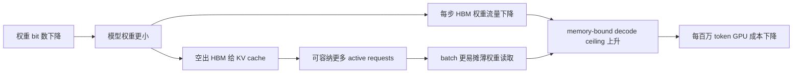
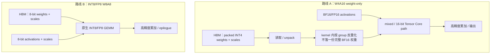
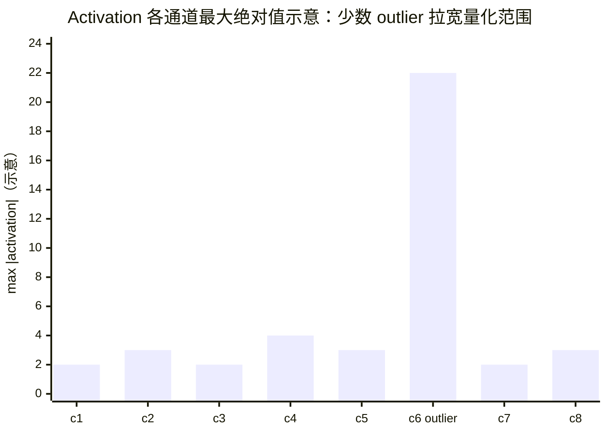
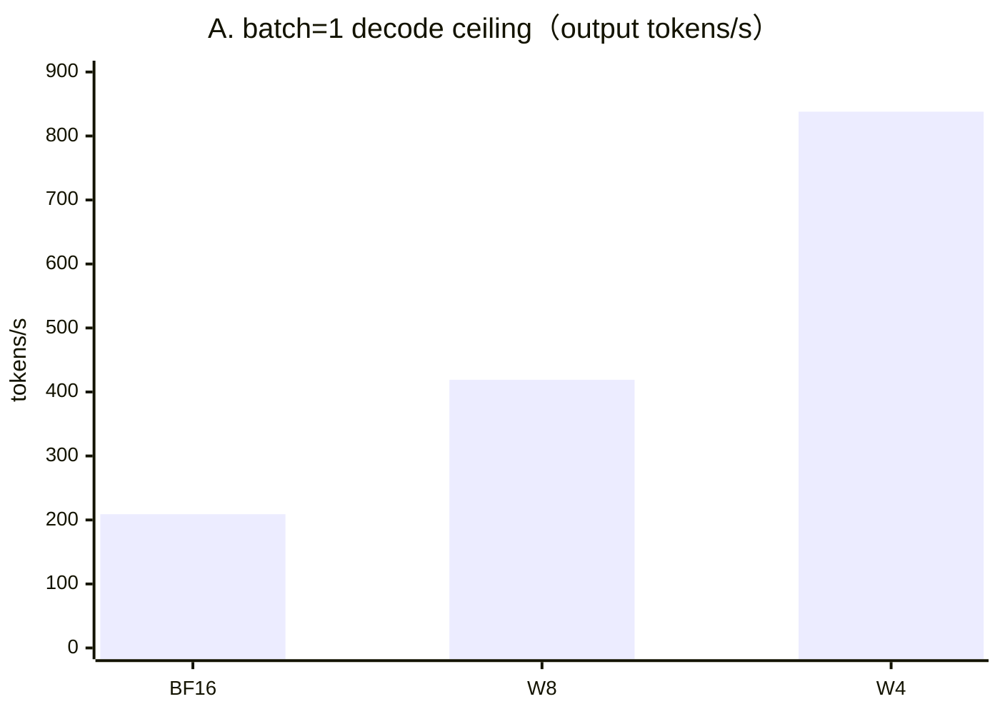
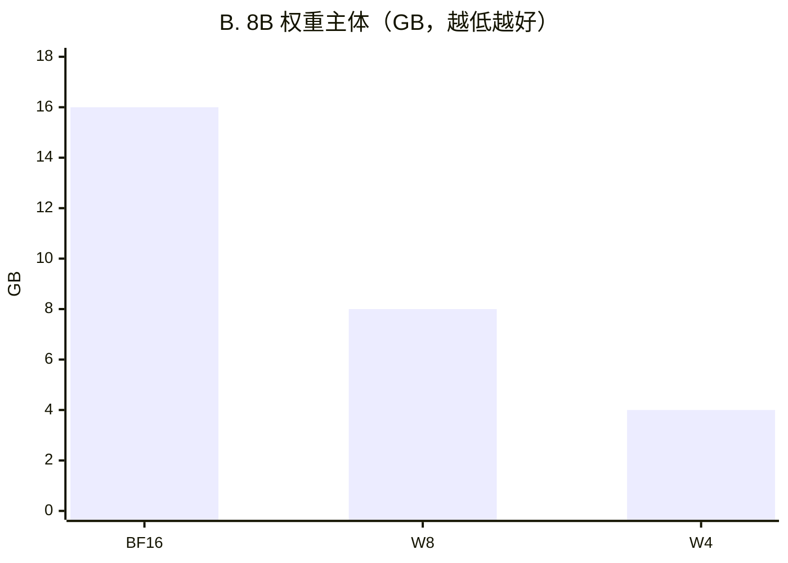
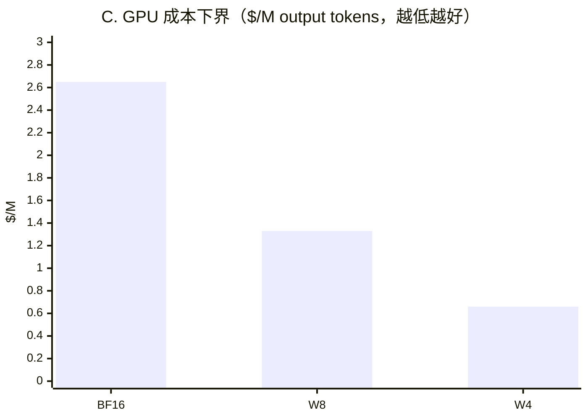

# L58 量化推理：少搬字节，也少花钱

> [!abstract] 本课速览
> 读完你将能够：
> 1. 读懂 W4A16、W8A8 与 FP8 serving，区分 weight-only 和 weight+activation 两条数据通路；
> 2. 用 outlier channel 解释 SmoothQuant、GPTQ 与 AWQ 分别在修什么问题；
> 3. 复算 8B 模型在单张 H100 上从 BF16 到 W8/W4 的权重、decode ceiling、KV 并发与每百万 token 成本；
> 4. 把 dequantization、scale、kernel、校准分布和质量退化都计入 quantization tax；
> 5. 用一套评估清单审查论文或模型卡里的 “lossless” 宣称。
>
> 前置：[[L24 数值格式]] · [[L55 推理性能模型]] · 预计 55 分钟

## 论文里的这段话，你现在可能读不懂

> [!quote]
> “A **post-training W4A16** model keeps activations in BF16 and performs grouped weight **dequantization** inside a mixed-precision kernel; **GPTQ** minimizes layer reconstruction error, whereas **AWQ** uses **calibration** activations to protect salient weights. **W8A8 SmoothQuant** migrates the difficulty of activation **outlier channels** into weights, while Hopper **FP8 serving** can use native low-precision GEMM. Any **lossless** claim must account for the calibration distribution and the full **quantization tax**, not perplexity alone.”（改写自 GPTQ、AWQ、SmoothQuant 与量化 serving 的典型表述）

这段话把位数、算法、kernel 和评测揉成了一团。最容易犯的错是看到 “4-bit” 就直接写下“显存省四倍、吞吐快四倍、质量不变”。本课要拆开四本账：==存了多少、搬了多少、怎样计算、掉了多少质量==。只有四本都对，量化才真正省钱。

## 一、为什么量化在 decode 阶段有“复利”

### 1. 少一半权重字节，不只省一半显存

[[L55 推理性能模型]] 已经说明：小 batch decode 典型地是 **memory-bound decode**，每一步只推进少量 token，却要流式读取一遍权重。[[L23 Roofline模型]] 的带宽侧上限为

$$
P_{\mathrm{bandwidth}}=BW\times I。
$$

若只把 BF16 权重从 2 B/参数压到 INT8 的 1 B/参数，而每 token 的 FLOPs 近似不变，那么权重流量减半、arithmetic intensity 近似翻倍，理想 decode tokens/s 也近似翻倍。显存同时空出一半权重空间，可装更大的模型或更多请求的 KV cache；更多并发又能通过 batch effect 摊薄同一份权重读取。于是收益链条是：

这就是量化的“复利”。但它带着条件：瓶颈要真在被压缩的数据流上，kernel 要能高效读取 packed weights，并且 KV、通信或调度不能先接管瓶颈。compute-bound 的大 batch prefill 已经碰到算力屋顶时，W4A16 只减权重流量、没有提高 Tensor Core 的 BF16 峰值，端到端加速可能很小。

### 2. PTQ 与 QAT：是在毕业后压缩，还是训练时适应

**quantization**（量化）的基本映射已在 [[L24 数值格式]] 给出。部署侧还要区分两条获得低精度 checkpoint 的路线：

- **PTQ/QAT** 中的 **PTQ**（Post-Training Quantization，训练后量化）从已训练好的高精度 checkpoint 出发，用少量 **calibration**（校准）样本观察 tensor 分布、选择 scale 或优化量化权重，通常不再做完整训练；它便宜、转换快，是大模型部署的常见起点。
- **QAT**（Quantization-Aware Training，量化感知训练）在训练或微调时模拟 rounding、clipping 等量化效应，让参数主动适应低精度格子；它可能在更低 bit 下保住质量，却要重新付数据、显存、训练时间和配方调试成本。

大白话说，PTQ 像毕业后把行李压进小箱子，QAT 像从训练期就练习只带一个小箱子生活。8B、70B 乃至更大模型重训太贵，所以本课主线是 PTQ；但“无需完整训练”不等于“无需数据”，GPTQ、AWQ、SmoothQuant 仍会从 calibration set 取得统计信息。

## 二、代号解码器：W4A16 与 W8A8 不是同一条路

### 1. W{x}A{y} 只说位数，还没说格式和粒度

**W{x}A{y} (W4A16/W8A8)** 是“权重 x bit、activation y bit”的速记：W4A16 表示 4-bit 权重配 16-bit activation，W8A8 表示两者都是 8 bit。它没有自动说明 8 bit 是 INT8 还是 FP8，也没说明 scale 是 per-tensor、per-channel、per-token 还是 per-group；读论文时必须继续看 recipe。

| 路线 | 常见代号 | HBM 中的权重 | activation | GEMM 主路径 | 主要收益 | 主要难点 |
|---|---|---|---|---|---|---|
| **weight-only quantization**（仅权重量化） | W8A16、W4A16 | INT8/INT4 packed | FP16/BF16 | kernel 内按组 **dequantization**（反量化），再走混合/16-bit 计算路径 | 权重容量与流量下降，改造面较小 | unpack/dequant 开销、scale 元数据、kernel shape |
| weight+activation | INT8 W8A8 | INT8 | INT8 | 真正 INT8 GEMM，通常高精度累加 | 权重与 activation 都省流量，可用 INT8 算力 | activation 动态分布与 outlier 难量化 |
| weight+activation | FP8 W8A8 | FP8 | FP8 | 原生 FP8 GEMM，通常高精度累加 | 低流量 + 原生低精度算力 | 硬件代际、scale recipe、敏感层回退 |

**dequantization** 并不一定先生成一份完整 BF16 权重再写回 HBM；高性能 kernel 会在 tile 进入寄存器或片上存储时融合 unpack、乘 scale 和矩阵乘。若实现真的先展开整份权重，省下的 HBM 流量很容易又被写回/重读吃掉。相反，W8A8 要把 activation 也压低，所以比 weight-only 更可能使用更高的原生低精度算力，却也更怕运行时输入分布变化。

### 2. group size：尺子越多越贴身，元数据也越多

**group size (g128)**（量化分组大小）表示一组连续权重共享一套 scale（以及可能的 zero point）；`g128` 就是每 128 个权重共用一把尺。group 越小，各组范围越接近，量化误差通常越容易控制；但 scale/zero-point 元数据占比、索引和 kernel 处理复杂度都会增加。

这也解释了为什么“4 bit 权重”文件通常略大于严格的 $0.5\ \mathrm{B/参数}$：还要保存 scales、zero points、未量化的敏感层与格式元数据。本课定量环节按 [[03 约定与符号]] 的理想权重主体记账，真实 checkpoint 要另测文件和驻留显存。

## 三、Outlier 为什么难，以及几个方法各在做什么

### 1. 一条极端通道能拉坏整把尺

**outlier channel**（离群通道）是某些 activation 通道的幅值长期明显高于多数通道。若整个 tensor 共用一把尺，scale 为了罩住极端值会变大，普通值便挤在少数整数格里；若缩小 scale，极端值又会 clipping。

这不是某个模型的实测直方图，而是分布形状示意。关键是：同样 8 bit，量化误差由数据分布和 scale 粒度共同决定，不能只数码格。

### 2. SmoothQuant、GPTQ、AWQ：三种不同的修法

- **SmoothQuant**（平滑量化）面向 W8A8。它利用线性层的等价变换，把 activation channel 的量化难度离线迁移到相对容易量化的权重：
  $$
  XW=(X\operatorname{diag}(s)^{-1})(\operatorname{diag}(s)W)。
  $$
  activation outlier 被 $s$ 压平，权重对应通道被放大，函数在高精度下等价，再分别量化两边。它是 ICML 2023 的 PTQ 方法，目标是让所有矩阵乘可走 INT8 W8A8。[SmoothQuant 正式论文](https://proceedings.mlr.press/v202/xiao23c.html)
- **GPTQ** 是 weight-only PTQ：逐层观察 calibration 输入，用近似二阶信息依次量化权重，并补偿已经量化列造成的重构误差。心智模型是“不是逐个就近取整，而是尽量让这一层的 $XW$ 与 $X\hat W$ 接近”。[GPTQ 论文](https://arxiv.org/abs/2210.17323)
- **AWQ**（Activation-aware Weight Quantization，激活感知权重量化）同样走低 bit weight-only，但用 activation 统计识别重要权重，并搜索 per-channel scaling 来保护它们；它不靠反向传播或逐层重构训练。AWQ 的重点不是“activation 也量化”，而是“activation 告诉我哪些 weights 不能粗暴处理”。[AWQ MLSys 2024 正式论文](https://proceedings.mlsys.org/paper_files/paper/2024/hash/42a452cbafa9dd64e9ba4aa95cc1ef21-Abstract-Conference.html)

三者都不是一种文件后缀：算法负责决定“怎样压”，checkpoint format 负责“怎样存”，kernel 负责“怎样快”。同一个 GPTQ/AWQ checkpoint 换了不合适的 kernel，可能只省显存而不加速。

### 3. FP8、KV cache 与更低位：压缩对象继续扩张

**FP8 serving**（FP8 推理服务）通常让主要线性层的 weight 与 activation 都走 FP8，并为敏感层、高精度累加和 scale 管理保留更高精度。[[03 约定与符号]] 中 H100 的 FP8 dense 峰值约 1979 TFLOPS，接近 BF16 dense 约 989 TFLOPS 的两倍；这让 Hopper 上的 FP8 成为容量、带宽和原生算力较均衡的路线。这里的“接近无损”仍是经验结果，不是格式保证，必须按第四节评测。

**KV cache quantization**（KV 缓存量化）压的不是静态权重，而是每个请求随 $S$ 增长的 K/V。它能继续提高 [[L56 KV缓存与PagedAttention]] 的 active concurrency、降低 KV 读取流量，却要在每个 decode step 量化新 K/V、反量化或用量化 attention kernel 消费历史 K/V；长上下文检索和 attention score 对误差也可能更敏感。vLLM 已提供 FP8 KV cache 路线，但 scale 粒度与 attention backend 条件要按当期文档核对。[vLLM Quantized KV Cache](https://docs.vllm.ai/en/latest/features/quantization/quantized_kvcache/)

再往下是 INT4、NVFP4 等极低位格式。[[L24 数值格式]] 已区分 MXFP4 与 NVFP4；后者依赖细粒度 block scale 与匹配的 Blackwell 软件/硬件路径。对较早 GPU，关键往往不是“有没有 4-bit 文件”，而是有没有能把 packed weight、scale、异步搬运与 Tensor Core 喂饱的 kernel。**Marlin** 是应认识的 FP16×INT4 mixed-precision kernel：它把量化格式真正落实成面向 autoregressive serving 的数据布局、流水与调度，而不是把“4 bit”当作自动加速开关。[Marlin 官方仓库](https://github.com/IST-DASLab/marlin)

## 四、算一算：8B 模型的显存、并发、吞吐与钱账

### 1. 三档权重与 batch=1 decode ceiling

> [!example] 算一算 1：BF16 → W8 → W4
> 数据全部来自 [[03 约定与符号]]：Llama-3-8B 取 $N=8.0\times10^9$；BF16/INT8/INT4 主体分别为 2/1/0.5 B/参数；单张 H100 SXM HBM 带宽取 $BW=3.35\times10^{12}$ B/s。沿用 [[L24 数值格式]] 的理想化 batch=1 weight-streaming 模型：每生成一个 token，权重主体恰好读一遍；忽略 KV、scale、dequantization、未量化层、kernel 与调度开销。
>
> $$
> C_W=N b_W,
> \qquad q_{\max}=\frac{BW}{C_W}。
> $$
>
> | 权重档位 | 权重主体 | 理想 output tokens/s ceiling | 相对 BF16 |
> |---|---:|---:|---:|
> | BF16 | $8\times10^9\times2=16$ GB | $3.35\times10^{12}/(16\times10^9)\approx\boxed{209}$ | $1\times$ |
> | W8 | $8\times10^9\times1=8$ GB | $3.35\times10^{12}/(8\times10^9)\approx\boxed{419}$ | $2\times$ |
> | W4 | $8\times10^9\times0.5=4$ GB | $3.35\times10^{12}/(4\times10^9)\approx\boxed{838}$ | $4\times$ |
>
> W4A16 并没有把 BF16 Tensor Core 峰值变成四倍；这里的 $4\times$ 只来自“权重流量是唯一瓶颈 + kernel 完美消费压缩权重”的 roofline 上限。真实值只能通过目标 GPU、目标 batch、目标模型和目标引擎实测。

### 2. 省下 12 GB，能多放多少条 4K KV

> [!example] 算一算 2：把 BF16→W4 省下的显存全给 KV
> BF16 权重 16 GB，W4 主体 4 GB，理想差额为 $\Delta C=12$ GB。按 [[03 约定与符号]] 的 Llama-3-8B：$L=32$、$h_{kv}=8$、$d_{head}=d/h=4096/32=128$；每请求缓存 $S=4096$ token，KV 仍用 BF16 的 2 B：
>
> $$
> \begin{aligned}
> C_{\mathrm{KV,req}}
> &=2\times L\times S\times h_{kv}\times d_{head}\times2\ \mathrm{B}\\
> &=2\times32\times4096\times8\times128\times2\\
> &=536{,}870{,}912\ \mathrm{B}\approx0.537\ \mathrm{GB}。
> \end{aligned}
> $$
>
> 因而纯容量上可增加
> $$
> \Delta B
> =\left\lfloor\frac{12\times10^9}{536{,}870{,}912}\right\rfloor
> =\boxed{22\ \text{个 4K 请求}}。
> $$
>
> 这 22 个是“把全部差额只给 KV”的乐观增量：没有给 activation、CUDA Graph、workspace、allocator、scale 和碎片留空间，也不保证 22 个请求同时推进时仍满足 TPOT SLO。若 KV 本身再量化，分母还能下降，但要新增 KV quantization tax。

### 3. 每百万 output tokens 的 GPU 成本下界

> [!example] 算一算 3：量化的钱账
> [[03 约定与符号]] 的教学租价为 H100 量级 $2/(\mathrm{GPU\cdot h})$。若单卡持续达到上面的理想 output-token rate，且生成结果全部满足质量与 SLO，则
> $$
> \mathrm{Cost/M\ output\ tokens}
> =\frac{\$2/\mathrm{h}}
> {q\ \mathrm{tokens/s}\times3600\ \mathrm{s/h}}
> \times10^6。
> $$
>
> 所以 BF16、W8、W4 分别约为
> $$
> \boxed{\$2.65},\qquad
> \boxed{\$1.33},\qquad
> \boxed{\$0.66}
> \quad/\mathrm{M\ output\ tokens}。
> $$
>
> 这仍是 GPU-only roofline 下界，不含 prefill、KV 流量、空闲副本、CPU/网络/存储、PUE 和 SLO 失败 token。若量化让某类任务质量不达标，那些便宜生成的 token 不能算 goodput。

三笔账放在一起看，量化的理想收益方向很清楚：

## 五、Quantization tax：不要让 “lossless” 只赢一道题

### 1. 量化税不只是 accuracy drop

**quantization tax**（量化税）是为了使用低精度而新增或暴露的全部代价，至少有四类：

| 税目 | 具体从哪里来 | 应报告什么 |
|---|---|---|
| 模型质量 | rounding/clipping、outlier、校准分布不匹配、敏感层误差累积 | perplexity、任务分数、长文本与人评，含 BF16 对照 |
| 存储与流量 | scales、zero points、padding、未量化层、格式转换 | 实际 checkpoint/HBM 占用与 HBM bytes，而非只报 bit 数 |
| 执行 | unpack、dequant、activation quantization、fallback ops、差 kernel/shape | prefill/decode 分开测，扫 batch/序列长度，报 TTFT/TPOT/tokens/s |
| 工程 | calibration、转换时间、格式兼容、硬件绑定、并行切分 | 转换资源、失败回退、引擎/版本/GPU 与部署限制 |

**lossless claim**（“无损”宣称）通常只能理解为“在指定评测与容差内没有测出显著退化”，不能理解成低 bit checkpoint 与 BF16 在数学上逐元素相同。perplexity 是 next-token 概率的平均指标；两个模型 perplexity 很接近，仍可能在代码边界条件、数学推理、少数语言、指令遵循、长上下文检索或开放式生成风格上分叉。

### 2. 审查 “lossless” 的三连问

1. **对谁无损？** 基线是否为同一 checkpoint、同一 tokenizer、同一 decoding 参数？比较的是平均 perplexity、多少个 downstream tasks，还是用户真正关心的 pass rate / 人评？是否报告方差、置信区间或容差？
2. **在哪个分布无损？** calibration set 来自什么语言、领域、长度和 prompt 格式？测试是否覆盖 calibration 外的代码、数学、多语言、长上下文与多轮对话？有没有把测试集泄漏进 scale 选择？
3. **花什么代价才无损？** 是否把敏感层留在 BF16、使用很小 group、牺牲 kernel 支持或增加 latency？同样的 GPU、batch、SLO 下，实际 HBM、TTFT、TPOT、goodput 和 $/M tokens 是否真的更好？

一套最低评估矩阵应同时包含：语言模型 perplexity；多任务 benchmark（知识、推理、代码、指令）；长文本检索与生成；抽样人评或成对偏好；以及相同 serving 条件下的容量、吞吐、p50/p99 时延和 SLO goodput。==质量评测决定 token 是否“有效”，系统评测决定有效 token 是否真的更便宜。==

> [!warning] 三个常见误区
> 1. **“量化必掉点。”** W8/FP8 在合适 recipe 和覆盖充分的评测里可能测不出有意义差异；但这必须由任务矩阵证明。W4 的误差预算更紧，更应警惕模型、层和 workload 差异。
> 2. **“权重小四倍，所有场景就快四倍。”** 只有 weight-streaming memory-bound 路径接近这个上限；compute-bound prefill、KV-heavy decode 或低效 kernel 都会打折。
> 3. **“calibration 随便抽点文本即可。”** scale 与重要性统计是从样本分布学来的。分布、长度和 prompt 模板错配会把风险留到线上才暴露。

## 六、部署现实：算法、格式、kernel、引擎必须四方对齐

截至 2026-08-05，下面只作能力认名，不作永久兼容承诺；同一引擎还会受模型架构、GPU generation、checkpoint schema 与具体 kernel 限制：

| 引擎 | 官方文档可见的量化家族 | 使用时先核对 |
|---|---|---|
| vLLM | AWQ、GPTQ/Marlin、INT4 W4A16、INT8/FP8 W8A8、quantized KV cache 等 | hardware compatibility table、模型层支持、attention/MoE backend；[官方量化矩阵](https://docs.vllm.ai/en/stable/features/quantization/)明确标注其会持续变化 |
| TensorRT-LLM | INT8 SmoothQuant W8A8、W8A16/W4A16、AWQ/GPTQ、FP8、NVFP4 | GPU compute capability、逐模型 support matrix、build recipe；见[官方 Numerical Precision](https://nvidia.github.io/TensorRT-LLM/1.0.0/reference/precision.html) |
| Hugging Face TGI | GPTQ、AWQ、Marlin、FP8，以及其他加载时/预量化路线 | 哪些需预量化 checkpoint、是否 tensor parallel、实际 backend；见[TGI 量化文档](https://huggingface.co/docs/text-generation-inference/en/conceptual/quantization) |

量化还会与并行布局相互咬合。TP 做 column-parallel 时，per-channel scales 应随对应输出 channels 一起切分；per-group 权重若在离线 checkpoint 中跨越 shard 边界，就需要对齐 group 或在转换时重打包。更普遍地说，==先量化再切分与先切分再校准未必等价==，因为 observer 看到的范围、group boundary 与 kernel layout 可能不同。论文若只给单卡质量和吞吐，不能自动推出多卡 TP 部署同样成立。

最后把量化放回模型压缩家族：**pruning**（剪枝）删除或置零不重要的权重、通道、层或结构；若没有匹配的结构化稀疏硬件/kernel，参数为零也不等于墙钟更快。**distillation**（蒸馏）让较小 student 学 teacher 的输出分布或行为，机制见 [[L15 后训练与对齐]]；它能真正减少参数与 FLOPs，却要重新训练并接受 student 容量变化。量化主要改变数值表示，剪枝改变连接，蒸馏改变模型；三者可以组合，但质量税和系统税必须重新测，不能把各自的理想倍数相乘。

## 回到开头那段话

现在逐句回读：

1. “A post-training W4A16 model keeps activations in BF16 and performs grouped weight dequantization inside a mixed-precision kernel; GPTQ minimizes layer reconstruction error, whereas AWQ uses calibration activations to protect salient weights。”——W4A16 是 weight-only 路线；g128 等 group 共享 scale，kernel 在片上融合反量化。GPTQ 用近似二阶信息控制逐层输出重构误差，AWQ 则用 activation 识别并缩放保护重要 weights（第二、三节）。
2. “W8A8 SmoothQuant migrates the difficulty of activation outlier channels into weights, while Hopper FP8 serving can use native low-precision GEMM。”——SmoothQuant 通过数学等价的 channel scaling 压平 activation outlier，让 weight 与 activation 都能走 INT8；FP8 serving 同样是 weight+activation 路线，并可利用 H100 原生 FP8 dense 算力（第二、三节）。
3. “Any lossless claim must account for the calibration distribution and the full quantization tax, not perplexity alone。”——“无损”只是限定评测范围内的经验结论；必须补问 calibration 的分布外风险、多任务/长文本/人评，以及 scale、dequant、kernel、SLO 和成本是否仍然划算（第五、六节）。

你现在应该能把一句 “4-bit quantized model is lossless and 4× faster” 拆成可验证的问题：==哪部分 4 bit、什么算法与 group、在哪个 kernel 上、对什么 workload 快、用哪些任务证明无损、最终每个达标 token 省了多少钱？==

## 术语卡片

| 术语 | 中文 | 一句话解释 |
|---|---|---|
| quantization | 量化 | 把高精度值映射到有限低精度码，以容量、带宽或算力收益换可控误差。 |
| PTQ/QAT | 训练后量化 / 量化感知训练 | PTQ 在高精度训练后校准压缩；QAT 在训练中模拟量化效应让参数适应。 |
| W{x}A{y} (W4A16/W8A8) | 权重/激活位宽记法 | W4A16 表示 4-bit 权重、16-bit activation；W8A8 表示两者均 8 bit。 |
| weight-only quantization | 仅权重量化 | 只压低权重存储位宽，activation 保持 FP16/BF16。 |
| dequantization | 反量化 | 用 scale/zero point 把低精度码恢复成近似高精度值或计算所需表示。 |
| SmoothQuant | 平滑量化 | 用等价 channel scaling 把 activation outlier 的量化难度迁移到 weights，以支持 W8A8。 |
| GPTQ | GPTQ 训练后权重量化 | 用 calibration 输入和近似二阶信息逐层控制量化后的重构误差。 |
| AWQ | 激活感知权重量化 | 用 activation 统计识别、缩放保护重要 weights 的低 bit weight-only PTQ。 |
| group size (g128) | 量化分组大小 | g128 表示每 128 个权重共享一套 scale/zero point。 |
| calibration | 校准 | 用代表性样本估计范围、scale、重要性或重构目标的 PTQ 阶段。 |
| outlier channel | 离群通道 | 幅值显著高于多数通道、容易拉宽共享量化范围的 activation channel。 |
| KV cache quantization | KV 缓存量化 | 降低 K/V 存储位宽以节省每请求容量和 attention 读取流量。 |
| FP8 serving | FP8 推理服务 | 让主要 serving GEMM 用 FP8 weight/activation，并保留必要高精度路径。 |
| Marlin | Marlin 混合精度 kernel | 面向 autoregressive inference 的 FP16×INT4 数据布局与矩阵乘 kernel。 |
| quantization tax | 量化税 | 量化引入的质量、元数据、反量化、kernel 限制和工程转换等全部代价。 |
| lossless claim | “无损”宣称 | 在指定数据、指标和容差内未测出退化的经验性说法，不是数学等价。 |
| pruning | 剪枝 | 删除或置零不重要连接/结构的压缩方法，是否加速取决于硬件与 kernel。 |
| distillation | 蒸馏 | 用 teacher 的分布或行为训练更小 student 的模型压缩方法。 |

## 自测

1. W4A16 与 W8A8 分别表示什么？为什么只看这串代号还不能判断 checkpoint format 与 kernel？
2. weight-only quantization 为什么能提高 memory-bound decode ceiling，却不保证 compute-bound prefill 同比例加速？
3. 用一句话分别说明 SmoothQuant、GPTQ 与 AWQ 在保护什么、优化什么。
4. g128 改成更小 group 时，质量与系统开销通常分别向什么方向变化？
5. 8B 模型从 BF16 改成 W4，按 3.35 TB/s 的理想 weight-streaming 口径，权重主体、batch=1 decode ceiling 和 2 美元/(GPU·h) 下每百万 output tokens 成本各是多少？
6. 按 Llama-3-8B、BF16 KV、$S=4096$，12 GB 可多容纳多少个完整请求的 KV？写出公式。
7. 为什么 perplexity 几乎不变仍不足以支持 “lossless” 宣称？请给出至少四类补充评测。
8. 你要把一个 AWQ g128 checkpoint 部署到 TP4 serving 集群。上线前应核对哪些 format、scale、shard、kernel、质量与 SLO 条件？

> [!note]- 参考答案
> 1. W4A16 是 4-bit weights + 16-bit activations，W8A8 是两者均 8 bit；代号不说明 INT/FP 格式、scale/zero point、粒度、packing、敏感层回退与实际执行 kernel。
> 2. 小 batch decode 每步反复扫描权重，权重字节下降直接抬高带宽侧 roofline；大 prefill 典型地已受计算峰值限制，而 W4A16 反量化后仍主要使用 16-bit/mixed 计算路径，算力屋顶没有按权重 bit 数提高。
> 3. SmoothQuant 用等价缩放把 activation outlier 难度迁到 weights；GPTQ 用近似二阶信息逐层减小 $XW-X\hat W$ 重构误差；AWQ 用 activation 找出并缩放保护重要 weights。
> 4. group 更小通常让 scale 更贴合局部分布、量化误差下降；代价是 scales/zero points 元数据更多、packing/索引更复杂，并可能失去最快 kernel 的支持。
> 5. W4 主体为 $8\times10^9\times0.5=\boxed{4\ \mathrm{GB}}$；ceiling 为 $3.35\times10^{12}/(4\times10^9)\approx\boxed{838\ \mathrm{tokens/s}}$；成本下界为 $2\times10^6/(837.5\times3600)\approx\boxed{\$0.66/\mathrm{M\ output\ tokens}}$。
> 6. 每请求 $C_{KV}=2\times32\times4096\times8\times128\times2=536{,}870{,}912$ B；$\lfloor12\times10^9/C_{KV}\rfloor=\boxed{22}$。这是不给其他运行时占用留空间的容量上限。
> 7. perplexity 是平均 next-token 指标，可能掩盖局部能力与开放生成差异。至少补：多任务 benchmark、数学/代码/多语言、长上下文、生成质量人评；系统侧还应在相同配置下报显存、TTFT/TPOT、goodput 与成本。
> 8. 核对 checkpoint schema 与 g128 packing；per-channel/per-group scales 是否随 TP shards 对齐；目标 GPU 是否有 AWQ/Marlin 等匹配 kernel；未支持层如何回退；calibration 与线上分布是否匹配；同一 decoding 配置下的任务/长文本质量；目标负载下的 HBM、TTFT、TPOT、goodput 和 $/M tokens。

## 延伸阅读

- [《AWQ: Activation-aware Weight Quantization for On-Device LLM Compression and Acceleration》](https://proceedings.mlsys.org/paper_files/paper/2024/hash/42a452cbafa9dd64e9ba4aa95cc1ef21-Abstract-Conference.html)（MLSys 2024 Best Paper）：读 motivation、salient weights 与 activation-aware scaling，再看它如何把算法接到真实部署。
- [《SmoothQuant: Accurate and Efficient Post-Training Quantization for Large Language Models》](https://proceedings.mlr.press/v202/xiao23c.html)（ICML 2023）：重点看 outlier migration 的核心图和 W8A8 评测口径。
- [《GPTQ: Accurate Post-Training Quantization for Generative Pre-trained Transformers》](https://arxiv.org/abs/2210.17323)：只需先读问题定义与逐层重构目标，建立“量化不只是 rounding”的认识。
- [《MARLIN: Mixed-Precision Auto-Regressive Parallel Inference on Large Language Models》](https://arxiv.org/abs/2408.11743)：从系统角度看 4-bit speedup 怎样依赖数据布局、流水和 batch regime。
- [vLLM Quantization 官方文档](https://docs.vllm.ai/en/stable/features/quantization/)：部署前查支持格式与 hardware matrix；这是快速演化区，以实际版本为准。

---
上一课：[[L57 连续批处理与调度]] ← · → 下一课：[[L59 投机解码]]
