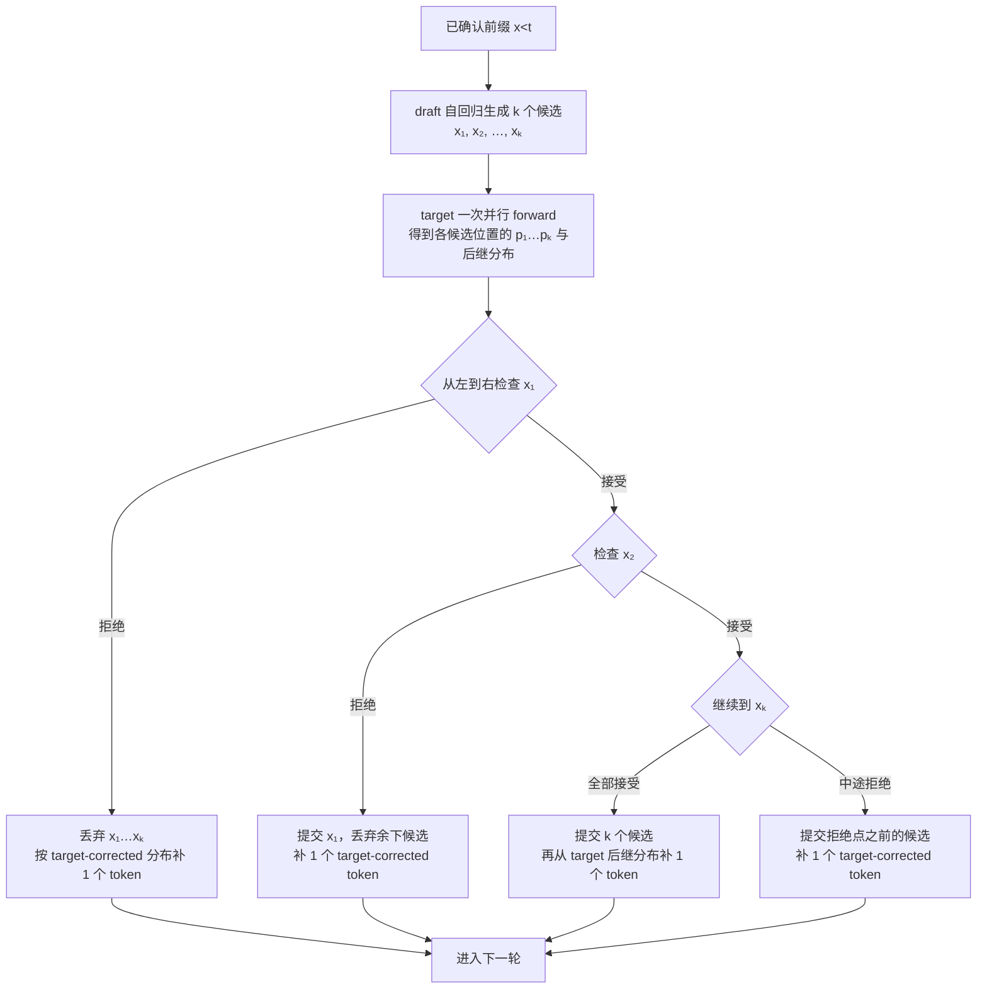
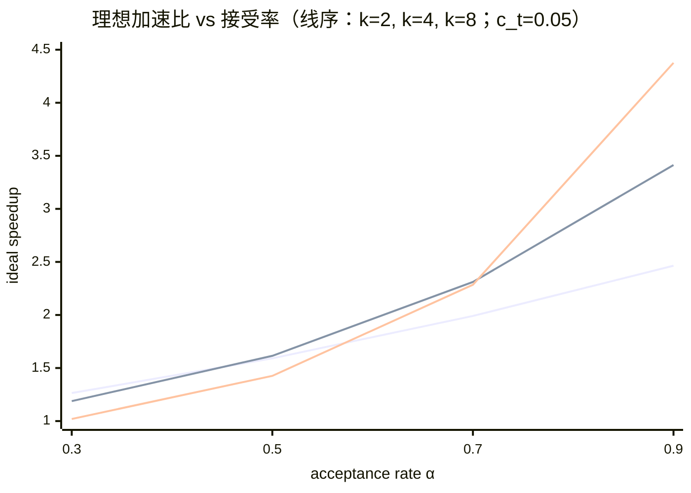
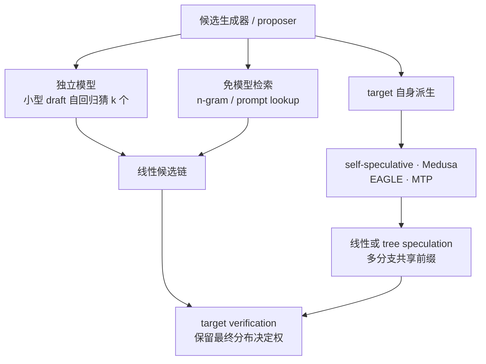

# L59 投机解码：让小模型打草稿，大模型批改

> [!abstract] 本课速览
> 读完你将能够：
> 1. 从 memory-bound decode 的 Roofline 解释：为什么一次 target forward 可以验证多个候选 token；
> 2. 画出 draft → verify → accept/reject 的完整数据流，并说清“无损”保持的究竟是什么；
> 3. 用 speculation length $k$、acceptance rate $\alpha$ 和 draft 成本复算理想加速比；
> 4. 区分独立 draft、prompt lookup、self-speculative、Medusa、EAGLE、MTP 与 tree verification；
> 5. 用算力余量判断投机解码何时降低时延、何时反而压坏吞吐与 SLO。
>
> 前置：[[L55 推理性能模型]] · [[L13 自回归生成与KV缓存]] · 预计 50 分钟

## 论文里的这段话，你现在可能读不懂

> [!quote]
> “**Speculative decoding** lets a **draft model** propose $k$ tokens and asks the **target model** to **verify** them in one parallel forward pass. With **rejection sampling**, the accepted prefix plus a target-corrected token preserves the target distribution; the speedup is governed by the **acceptance rate**, speculation length, and drafting cost. **Medusa**, **EAGLE**, and **MTP** change where draft candidates come from, but at high batch sizes verification may become compute-bound and hurt throughput.”（改写自 speculative decoding、Medusa、EAGLE 与 MTP 的典型表述）

这三句话把算法保证和系统条件压在了一起。最容易犯的错有两个：一是把“草稿”理解成质量打折，二是只数一轮能吐几个 token，却不数 draft 与验证多做了多少运算。本课要把它拆成两本账：==概率账决定输出对不对，资源账决定加速赚不赚==。

## 一、机会从哪里来：一次搬权重，多批几份作业

### 1. 自回归的串行税

[[L13 自回归生成与KV缓存]] 已经说明，自回归生成第 $t+1$ 个 token 依赖第 $t$ 个 token，所以普通 decode 每一步只能为每个请求确认一个新 token。问题不只在“串行”两个字，还在每一步做的工作很不对称：

- 权重必须从 HBM 进入计算单元；
- 小 batch 下矩阵很“瘦”，每次只服务少量 token；
- 同一份权重做完很少的 FLOPs 就被下一层替换，Tensor Core 没被喂饱。

以 [[03 约定与符号]] 的 Llama-3-70B 为例，BF16 权重主体为

$$
C_W=70\times10^9\times2\ \mathrm{B}=140\ \mathrm{GB}。
$$

这就是“decode 一步要读约 140 GB 权重”的==全模型聚合口径==，不是说 140 GB 能塞进一张 80 GB H100。若理想地用 TP8 切分，忽略不均匀切层、通信、KV 与其他运行时开销，每卡权重约为 $17.5$ GB。按 H100 每卡 $3.35$ TB/s HBM 带宽，一次流式读取的带宽下界为

$$
T_{\mathrm{HBM}}\ge
\frac{17.5\times10^9}{3.35\times10^{12}}
\approx5.22\ \mathrm{ms}。
$$

而每个 token 的参数主项约为 $2N$ FLOPs；TP8 平均到每卡为 $17.5$ GFLOPs。按 H100 BF16 dense 峰值约 $989$ TFLOPS，纯算力屋顶下界只有

$$
T_{\mathrm{compute}}\ge
\frac{17.5\times10^9}{989\times10^{12}}
\approx0.0177\ \mathrm{ms}。
$$

两个下界相差约 $295$ 倍。真实 decode 还有 attention、collective、kernel 与调度，不能用这两个数预测 TPOT；它们只说明一个方向：在小 batch、weight-streaming 场景里，等待权重的时间远大于参数主项的纯计算时间，这正是 [[L55 推理性能模型]] 所说的 memory-bound decode。

### 2. 把“空着的乘法器”换成少几轮串行调用

如果已经把这一层的权重搬进来了，让同一层同时处理连续 $k$ 个候选位置，会增加 activation 与算术工作，却不必为每个位置各自重新搬一遍完整权重。只要新增计算仍落在 Roofline 的带宽侧，一次 target forward 处理多个位置的墙钟时间可以接近处理一个位置，而不是严格乘 $k$。

这就是 **speculative decoding**（投机解码）的系统直觉：先用便宜方法猜出未来，再把这些位置当成一个小 prefill 交给大模型并行检查。它不是减少数学工作量，而是用 decode 阶段的闲置算力换更少的串行 target calls。

> [!tip] 直觉：审稿，不是代写
> target model 仍拥有最终决定权。draft model 像先写四行答案的助教，大模型一次批改四行；前两行对、第三行错，就只提交前两行，并由大模型改正第三行。省的是“大模型逐行起笔”的往返，不是把最终判题权交给助教。

这里的“近似免费”有边界：batch 增大后，普通 decode 已经能把权重读取摊给许多请求，arithmetic intensity 上升；再塞 $k$ 个候选位置可能撞上算力屋顶。于是投机解码首先是 latency 技术，是否提高 aggregate throughput 要重新算，第五节会专门处理。

## 二、Draft–verify：一轮到底发生什么

### 1. 三个角色与一个旋钮

- **draft model**（草稿模型）是便宜的候选生成器，可以是独立小模型，也可以不是神经网络；
- **target model**（目标模型）是部署时真正想采样的模型，其条件分布记为 $p$；
- **verify / verification**（验证）是 target 对候选位置并行计算 logits，并按目标采样语义决定接受或纠正；
- **speculation length $k$**（投机长度）是一轮最多先猜多少个 token。

独立 draft 的线性流程如下。设当前已确认前缀为 $x_{<t}$，draft 的条件分布为 $q$：

两个细节很重要。第一，接受必须从左到右；一旦第 $i$ 个候选被拒绝，后面的候选都建立在错误前缀上，不能继续提交。第二，一轮总能由 target 再贡献一个 token：中途拒绝时它是纠正 token，全部接受时它是 bonus token。所以若接受了 $A\in[0,k]$ 个 draft token，一轮提交 $A+1$ 个 token。

贪心解码最容易理解：候选 token 等于 target 的 argmax 就接受，否则提交 target 的 argmax。这样输出序列与 target 单独做 greedy decoding 相同。随机采样时不能只比较 argmax，还需要下面的概率修正。

### 2. 为什么随机采样也能保持目标分布

**rejection sampling**（拒绝采样）在这里的核心规则是：draft 先采样 $x\sim q$，再以

$$
a(x)=\min\left(1,\frac{p(x)}{q(x)}\right)
$$

的概率接受它。若拒绝，不是简单地从原始 $p$ 重采，而是从残差分布

$$
p'(x)=\operatorname{norm}\!\left(\max(0,p(x)-q(x))\right)
$$

采样纠正 token。《[Fast Inference from Transformers via Speculative Decoding](https://proceedings.mlr.press/v202/leviathan23a.html)》（ICML 2023）给出了这个算法与证明。对任意 token $x$，接受分支给它的概率质量是 $\min(p(x),q(x))$，拒绝后的残差分支补上 $p(x)-\min(p(x),q(x))$，两者相加正好是

$$
\min(p(x),q(x))+
\left[p(x)-\min(p(x),q(x))\right]
=p(x)。
$$

逐位置重复这个论证，就得到 **lossless (distribution preservation)**（无损 / 分布保持）：最终 token 序列服从 target model 单独运行时的同一分布。这里的“无损”有三层限定：

1. 保持的是==经过相同 temperature、top-$p$、top-$k$ 等变换后的 target 分布==；实现必须对 $p$、$q$ 与残差修正保持一致语义；
2. 随机采样保证的是分布相同，不保证换一种执行路径后每次都得到 bitwise 相同的样本；greedy 的确定性路径才可直接比较逐 token 序列；
3. “target”若本身是量化后的模型，无损是相对这个已部署 target，而不是自动恢复 BF16 原模型的分布。

temperature、任务域、prompt 风格与 tokenizer 都会改变 $p$ 和 $q$ 的接近程度，从而改变接受率。它们不破坏正确实现的分布保证，却会改变性能。这也是为什么一对 draft/target 在代码补全上很好用，换到多语言对话上未必仍然快。

> [!warning] “拒绝采样”不是“猜错就重跑 target”
> target 已经在验证 pass 里算出了所需 logits。正确算法在首个拒绝点使用残差分布补 token，并丢弃该点之后的草稿；若无条件从原始 $p$ 再采一次，概率质量会被重复计算，分布不再自动等于 target。

## 三、接受率经济学：草稿像不像，草稿贵不贵

### 1. 一轮平均能前进多少 token

**acceptance rate**（接受率）记为 $\alpha$，表示一个 draft token 在 speculative sampling 下被接受的平均概率。为得到可手算模型，先作“各位置独立、接受概率都等于 $\alpha$”的近似；真实相邻位置相关，下面是性能估算式而非正确性证明。

一轮至少产出 target-corrected 的 1 个 token。第 1 个 draft 被提交的概率为 $\alpha$，第 2 个要求前两个都接受，概率为 $\alpha^2$，以此类推。因此

$$
\begin{aligned}
E[Y]
&=1+\alpha+\alpha^2+\cdots+\alpha^k\\
&=1+\frac{\alpha(1-\alpha^k)}{1-\alpha}\\
&=\frac{1-\alpha^{k+1}}{1-\alpha}。
\end{aligned}
$$

设普通 target decode 一步墙钟时间为 $T$，一次 draft step 为 $c_tT$。若处于 memory-bound 区间，target 并行验证 $k$ 个候选的时间仍近似为 $T$，则一轮成本约为

$$
T_{\mathrm{round}}\approx(1+kc_t)T，
$$

理想时延加速比为

$$
S_{\mathrm{ideal}}
\approx\frac{E[Y]}{1+kc_t}
=\frac{1-\alpha^{k+1}}
{(1-\alpha)(1+kc_t)}。
$$

这与 ICML 2023 原论文的简化 walltime 模型一致。==分子是少做了多少轮 target 串行调用，分母是写草稿付了多少时间。==

> [!example] 算一算 1：$k=4$、接受率 70%，为什么约为 $2.3\times$
> 题设来自设计稿：$k=4$，$\alpha=0.70$；每个 draft step 的墙钟成本为一个 target decode step 的 $c_t=0.05$。先算一轮期望产出：
>
> $$
> \begin{aligned}
> E[Y]
> &=1+0.7+0.7^2+0.7^3+0.7^4\\
> &=1+0.7+0.49+0.343+0.2401\\
> &=\boxed{2.7731\ \text{tokens/round}}。
> \end{aligned}
> $$
>
> 四次 draft 的总时间为 $4\times0.05T=0.2T$；若一次并行验证仍约为 $T$：
>
> $$
> T_{\mathrm{round}}\approx1.2T，\qquad
> S_{\mathrm{ideal}}=\frac{2.7731}{1.2}
> \approx\boxed{2.31\times}。
> $$
>
> 基线要用约 $2.7731T$ 才平均生成同样多 token，投机路径用约 $1.2T$。但 $2.31\times$ 依赖“验证 $k$ 个位置仍只花约 $T$”；一旦 target verification 变成 compute-bound，这个分母就必须增大。

上面的式子也解释了“draft 越大越好”为何不成立。更强的 draft 往往让 $\alpha$ 上升，却也让 $c_t$、显存占用与 KV 管理成本上升；$k$ 加长能在高 $\alpha$ 时收更多利息，在低 $\alpha$ 时则常常只是多写几行最终被撕掉的草稿。

### 2. 不同 $k$ 的曲线：高接受率才值得下长注

下面固定每个 draft step 的 $c_t=0.05$，使用同一理想 walltime 模型。三条线依次为 $k=2,4,8$；数据点是可复算的教学计算，不是某个引擎 benchmark。

| $\alpha$ | $k=2$ | $k=4$ | $k=8$ |
|---:|---:|---:|---:|
| 0.3 | 1.264× | 1.188× | 1.020× |
| 0.5 | 1.591× | 1.615× | 1.426× |
| 0.7 | 1.991× | 2.311× | 2.285× |
| 0.9 | 2.464× | 3.413× | 4.376× |

$\alpha=0.3$ 时，$k=8$ 几乎把收益全交回 draft 成本；$\alpha=0.9$ 时，长 speculation 才明显占优。生产系统因此不该只配置一个永久的 $k$，而应至少按模型对、workload 与负载做离线扫参，在线再根据接受率和 GPU 余量调整。

## 四、草稿从哪里来：一张谱系图

投机解码的共同部分是“候选 + target verification”，差别主要在候选从哪里来、是线性一条还是树形多条：

### 1. 独立小模型与免模型检索

最经典的路线就是较小的独立 draft model。它的优点是概念简单、可以专门蒸馏到 target；缺点是多一份权重与 KV cache，还要求 tokenizer、模型家族和输出分布足够匹配。一个更大的 draft 可能提高 $\alpha$，却也会提高 $c_t$，所以真正要优化的是 $S_{\mathrm{ideal}}$，不是单独最大化接受率。

**n-gram / prompt lookup**（n-gram / 提示查找）不运行额外神经网络。它在 prompt 或已经生成的上下文里查找最近 token 片段的历史出现位置，把其后续 token 当候选。代码补全、文档改写、摘要等重复度高的 workload 可能有很长匹配；开放式聊天找不到重复片段时便退化为低命中率。它几乎不付 draft model 的 FLOPs 和显存，却把“模型相似度问题”换成了“上下文可复用性问题”。

### 2. Self-speculative、Medusa、EAGLE 与 MTP

**self-speculative decoding**（自投机解码）让 target 的廉价子路径自己写草稿。《[Draft & Verify: Lossless Large Language Model Acceleration via Self-Speculative Decoding](https://aclanthology.org/2024.acl-long.607/)》（ACL 2024）的一种实现是在 draft 阶段跳过选定中间层，verify 时再用完整模型。好处是不需维护另一个模型与 tokenizer；难点是层跳过策略会同时决定 draft 速度和接受率。

**Medusa** 给 target 增加多个 decoding heads，让不同 head 并行预测更远的 future tokens；多个 top candidates 可以组成树，再用 tree attention 合并共享前缀并行验证。《[Medusa: Simple LLM Inference Acceleration Framework with Multiple Decoding Heads](https://proceedings.mlr.press/v235/cai24b.html)》（ICML 2024）是这条路线的代表。它避免完整独立 draft，却需要训练额外 heads；是否严格保持 target 分布仍取决于最终使用的 acceptance scheme，不能由“叫 Medusa”三个字自动推出。

**EAGLE** 不直接只在 token logits 上猜，而是在 target 倒数第二层的 feature 空间做轻量自回归，并把错开一步的 token 序列作为条件，缓解“同一 feature 可能对应不确定 token”的问题。《[EAGLE: Speculative Sampling Requires Rethinking Feature Uncertainty](https://proceedings.mlr.press/v235/li24bt.html)》（ICML 2024）给出了这套 feature-level proposer。大白话说，Medusa 多开几个“答案头”，EAGLE 则先预测更接近 target 内部思路的 feature，再还原候选 token。

**multi-token prediction (MTP)**（多 token 预测）把能力提前放进训练：除 next-token 目标外，再让额外模块预测后续 token。它首先是训练目标，也可以成为推理时的 proposer。`DeepSeek-V3 Technical Report` 明确说明其 MTP 目标可用于 speculative decoding；这是典型的 training–serving co-design：为了推理少走几轮串行路径，训练时就准备未来 token 的草稿能力。[DeepSeek-V3 技术报告](https://arxiv.org/abs/2412.19437)

**tree speculation / verification**（树形投机 / 验证）不是另一种模型，而是候选拓扑：每个未来位置不只押一个 token，而是保留多个分支。若正确续写落在树内，可能比单链更容易延伸；但分支越多，target 要验证的节点、tree attention mask、临时 KV 与调度复杂度也越大。树不是免费提高接受率，而是用更多并行算力买“至少有一条路猜中”的概率。

截至 2026-08，vLLM 官方文档已经把 draft model、EAGLE、MTP、n-gram 与 dynamic speculation 等列为不同 proposer/控制路线；具体模型、采样与并行兼容性仍是快速演化区，部署时应查目标版本并实测。[vLLM Speculative Decoding 文档](https://docs.vllm.ai/en/stable/features/spec_decode/)

## 五、什么时候会负优化：时延收益不是吞吐免费券

### 1. “一轮只花一个 $T$”为什么会失效

低负载时，verification 把 $k+1$ 个 target 条件位置并行放进一次执行，墙钟可能仍接近一个 target step；但算术操作并没有凭空消失。ICML 2023 原论文把 target 的并发条件位置计为 $k+1$，并用 $\hat c$ 表示每个 draft token 相对 target token 的算术操作量。于是每生成一个有效 token 的算术需求相对基线约为

$$
R_{\mathrm{ops}}
=\frac{(k+1)+k\hat c}{E[Y]}
=\frac{(1-\alpha)\left(k+1+k\hat c\right)}
{1-\alpha^{k+1}}。
$$

$R_{\mathrm{ops}}>1$ 不等于低负载下必然更慢：正是那些原先闲置的算力在消化额外 operations。但若普通 decode 已接近 compute roof，再增加算术需求就只能拉长 verification 或挤压别的请求。

> [!example] 算一算 2：batch=64、算力屋顶已用 60% 时会怎样
> 设计稿给定普通 decode 在 batch=64 时已达到匹配口径 compute roof 的 60%。继续沿用 $k=4$、$\alpha=0.7$，并作一个明确的教学假设：draft 每 token 的算术量也为 target 的 $\hat c=0.05$。上一题已有 $E[Y]=2.7731$，所以
>
> $$
> R_{\mathrm{ops}}
> =\frac{(4+1)+4\times0.05}{2.7731}
> =\frac{5.2}{2.7731}
> \approx\boxed{1.875}。
> $$
>
> 若要维持与基线相同的 output-token 吞吐，所需算力利用率将变成
>
> $$
> U'\approx0.60\times1.875
> =\boxed{1.125=112.5\%}。
> $$
>
> 112.5% 超过物理屋顶，说明“并行验证约等于一个 $T$”在此负载下不可能继续成立。系统只能让 verification 变长、降低 admitted throughput，或让队列增长；最终 p99 TPOT 与 SLO goodput 可能比关闭投机更差。这里的 60%、$\hat c=0.05$ 是题设，不是跨模型 benchmark；真实阈值还取决于实现是否复用已有 logits、实际验证节点数、attention/KV 开销与 kernel 效率。

这个算例给出很实用的区分：

- **低 QPS / 小 batch / latency-sensitive**：target memory-bound，投机常能用闲置算力降低单请求 TPOT；
- **高 QPS / 大 continuous batch / throughput-sensitive**：[[L57 连续批处理与调度]] 已经用跨请求 batching 吃掉同一份算力余量，投机又做 request 内并行，两者会争夺 Tensor Core；
- **低接受率或昂贵 draft**：即使 target 仍 memory-bound，草稿成本和浪费的验证分支也可能让 $S<1$。

### 2. 动态开关看哪些信号

工程上不应把 speculative decoding 当永久布尔常量。一个最小控制器可以观测：

| 观测量 | 说明 | 可能动作 |
|---|---|---|
| acceptance rate 的滑动平均 | 当前 prompt/domain 下 proposer 是否像 target | 低于阈值时缩短 $k$ 或关闭 |
| draft time / verify time | 分母里 $kc_t$ 与 target 验证是否膨胀 | draft 变贵时换轻量 proposer；verify 变贵时缩短 $k$ |
| active batch、QPS、GPU compute utilization | 是否还有“闲置算力” | 高负载切回普通 continuous batching |
| TTFT、TPOT、p99 与 SLO goodput | 优化是否真的服务于业务目标 | 只保留能改善目标 SLO 的配置 |

截至 2026-08，vLLM 文档已经列出 dynamic speculative decoding，并把典型收益场景限定在中低 QPS、memory-bound workload；这说明“按负载切换”已不是只存在于公式里的想法。但控制策略、兼容矩阵与最佳阈值随引擎快速变化，课程只保留方法论，不把某个版本的默认值写成定律。

> [!warning] 三个常见误区
> 1. **“投机就是有损近似。”** 正确的 rejection sampling 保持 target 分布；有损的是某些为了更高接受率而放宽验证的变体，不能混为一谈。
> 2. **“接受率越高，所以 draft 越大越好。”** 应最大化的是 $E[Y]/(1+kc_t)$ 和 SLO goodput；更大 draft 同时抬高时延、显存与算术成本。
> 3. **“batch=1 快两倍，线上吞吐也会快两倍。”** batch=1 恰好最容易有闲置算力；高并发时 request 内投机与 request 间 batching 会争同一屋顶，必须扫 load curve。

## 六、把它装进完整 serving 系统

投机解码改变的是“每次 target call 推进多少 token”，与其他技术大多能组合；但“正交”不等于“零交互”。

| 组合 | 为什么原则上兼容 | 真正要核对的交互 |
|---|---|---|
| spec-dec × [[L58 量化推理|量化]] | 量化减少 weight bytes，投机减少串行 target calls | 量化 draft/target 会改变 $q/p$ 与 $\alpha$；验证 kernel 能否高效处理多候选；无损只相对量化后的 target 分布 |
| spec-dec × [[L60 分布式推理与PD分离|PD 分离]] | draft 与 verify 主要服务 decode，可放在 D 路径 | draft 放哪块 GPU、是否远端、token/feature 传输、D pool 负载与 KV ownership 都会影响 $c_t$ |
| spec-dec × [[L56 KV缓存与PagedAttention|prefix cache]] | prefix cache 复用已确认前缀，spec-dec 加速后续 decode | target 与 draft 各自要有一致前缀状态；拒绝后只能提交已接受路径的 KV，树分支需及时回收 |
| spec-dec × continuous batching | 前者做单请求内并行，后者做请求间并行 | 两者共同扩大有效 batch；调度器要在 acceptance、batch expansion、显存与 compute roof 间选点 |

对网络与系统研究，真正有意思的地方恰好在表格右列：draft 是和 target 共卡、独占一张便宜卡、放 CPU，还是放远端服务？远端 draft 能并行工作，却新增网络时延与故障面；共卡没有网络往返，却会与 target 抢 HBM、KV 容量和算力。优化变量因此不只剩一个 $k$，还包括 proposer placement、请求路由、batch 组织、动态开关与降级策略；目标也应从单请求平均 TPOT 扩展到 p99、goodput、GPU-hour/token 与故障下可用性。这正是 MLSys × 网络视角会继续追问的问题。

## 回到开头那段话

现在逐句回读：

1. “Speculative decoding lets a draft model propose $k$ tokens and asks the target model to verify them in one parallel forward pass。”——draft 自回归写长度最多为 $k$ 的候选链；target 把连续位置当成一个小 prefill 并行算 logits，从左到右接受到首个拒绝点（第一、二节）。
2. “With rejection sampling, the accepted prefix plus a target-corrected token preserves the target distribution; the speedup is governed by the acceptance rate, speculation length, and drafting cost。”——接受概率 $\min(1,p/q)$ 与残差分布 $\operatorname{norm}([p-q]_+)$ 让每个位置最终仍服从 $p$；一轮平均产出 $(1-\alpha^{k+1})/(1-\alpha)$，还要除以 $1+kc_t$ 才是理想加速，而不是只看接受数（第二、三节）。
3. “Medusa, EAGLE, and MTP change where draft candidates come from, but at high batch sizes verification may become compute-bound and hurt throughput。”——Medusa 用多 heads、EAGLE 预测 feature、MTP 在训练时准备未来 token 模块；它们仍要 target 验证。batch=64 的题设下，额外算术需求把 60% 屋顶推到 112.5%，说明 latency optimization 可能成为 throughput regression（第四、五节）。

你现在应该能把一句 “turn on speculative decoding for a free $2\times$ speedup” 拆成一组可验证的问题：==谁写草稿、$k$ 多长、$\alpha$ 多高、draft 多贵、验证是否仍 memory-bound、保持的是哪个 target 分布、在目标 QPS 下 p99 与 goodput 是否真的更好？==

## 术语卡片

| 术语 | 中文 | 一句话解释 |
|---|---|---|
| speculative decoding | 投机解码 | 用廉价 proposer 先猜多个 token，再由 target 并行验证，以额外并发计算换更少串行 target calls。 |
| draft model | 草稿模型 | 低成本生成候选 token 的模型或 proposer，不拥有最终输出决定权。 |
| target model | 目标模型 | 定义最终期望输出分布、负责验证与纠正候选的模型。 |
| verify / verification | 验证 | target 对候选位置并行算 logits，并从左到右接受或在首个分歧处纠正。 |
| acceptance rate | 接受率 | draft token 通过 target 验证的平均概率，常记为 $\alpha$。 |
| rejection sampling | 拒绝采样 | 以 $\min(1,p/q)$ 接受候选，并在拒绝时从 $[p-q]_+$ 残差分布补样本。 |
| lossless (distribution preservation) | 无损 / 分布保持 | 正确采样语义下最终序列分布与 target 单独运行相同，不等于随机样本逐 bit 相同。 |
| n-gram / prompt lookup | n-gram / 提示查找 | 从 prompt 或已见上下文的重复片段检索后续 token 作为免模型草稿。 |
| self-speculative decoding | 自投机解码 | 用 target 自身的浅层、跳层或其他廉价子路径生成候选，再由完整 target 验证。 |
| Medusa | Medusa 多头投机 | 给模型增加多个 future-token heads，常结合候选树与 tree attention 并行验证。 |
| EAGLE | EAGLE 特征级投机 | 在 target 的高层 feature 空间自回归预测候选，再交给 target 保持分布地验证。 |
| multi-token prediction (MTP) | 多 token 预测 | 训练时加入预测多个未来 token 的目标或模块，推理时可作为 proposer。 |
| tree speculation / verification | 树形投机 / 验证 | 并行保留多条共享前缀的候选分支，再用 target 一次验证多个树节点。 |
| speculation length $k$ | 投机长度 | 每轮预先生成的最大 draft token 数，是接受收益与 draft/verification 成本的核心旋钮。 |

## 自测

1. 为什么 speculative decoding 更适合小 batch 的 memory-bound decode，而不是已经 compute-bound 的大 batch？
2. 一轮长度 $k=4$ 的线性投机中，若第 3 个候选被拒绝，哪些 token 可以提交，后两个候选如何处理？
3. 随机采样时，为什么“候选错了就直接从原始 target 分布重采”不能自动保证分布不变？正确残差分布是什么？
4. 在独立同分布近似下，推导 $E[Y]=(1-\alpha^{k+1})/(1-\alpha)$。
5. 若 $k=4$、$\alpha=0.7$、每个 draft step 的墙钟成本 $c_t=0.05$，一轮平均产出、轮次成本与理想加速比各是多少？
6. 沿用上题并取 $\hat c=0.05$，若基线已使用 compute roof 的 60%，为什么相同 output throughput 不可维持？
7. 用一句话分别区分 prompt lookup、self-speculative、Medusa、EAGLE 与 MTP 的候选来源。
8. 你在一个同时使用 INT4 target、prefix cache、continuous batching 的服务里开启 EAGLE。上线前至少要测哪些 acceptance、时延、吞吐、显存与正确性指标？

> [!note]- 参考答案
> 1. 小 batch decode 每步反复搬权重但只做少量计算，验证多个候选可复用一次权重读取并使用闲置算力；大 batch 已用跨请求 batching 提高 arithmetic intensity，新增候选更容易撞 compute roof，使 verification 增时并压低吞吐。
> 2. 提交前两个已接受 draft token，再按 target-corrected 分布提交第 3 个位置的纠正 token；原第 3、4 个 draft 候选均丢弃，因为它们依赖已经被拒绝的前缀。然后从纠正后的前缀开始下一轮。
> 3. 接受分支已经给部分 token 分配了 $\min(p,q)$ 概率质量；若拒绝后又从完整 $p$ 采样，会重复计入这部分。正确残差为 $p'(x)=\operatorname{norm}(\max(0,p(x)-q(x)))$。
> 4. 一轮总有 1 个 target-corrected/bonus token；第 $i$ 个 draft 被提交要求前 $i$ 个都接受，概率为 $\alpha^i$。故 $E[Y]=1+\sum_{i=1}^{k}\alpha^i=(1-\alpha^{k+1})/(1-\alpha)$。
> 5. $E[Y]=1+0.7+0.49+0.343+0.2401=\boxed{2.7731}$；$T_{round}\approx(1+4\times0.05)T=\boxed{1.2T}$；$S\approx2.7731/1.2=\boxed{2.31\times}$。
> 6. 每有效 token 的算术需求为 $R_{ops}=(5+4\times0.05)/2.7731\approx1.875$；维持原 output throughput 需要 $0.60\times1.875=1.125$，即 112.5% 的屋顶，物理上不可能。系统必须延长验证、减少负载或关闭/缩短投机。
> 7. prompt lookup 从已有 token 片段检索；self-speculative 用 target 自身廉价子路径；Medusa 用多个 future-token heads；EAGLE 自回归预测高层 feature；MTP 在训练时加入多未来 token 预测模块，推理时复用为 proposer。
> 8. 至少测：分 workload/采样参数的 token acceptance 与 accepted length；draft/verify 分段时间、TTFT、p50/p99 TPOT；从低到高 QPS 的 raw throughput 与 SLO goodput；target/draft/KV/候选树的实际 HBM；INT4 target 作为参照时的分布保持或 greedy 序列一致性；prefix hit/miss、拒绝回滚与 continuous batch 扩张下是否有 KV 泄漏或调度回退；并报告 GPU、引擎版本、$k$ 和 kernel。

## 延伸阅读

- [《Fast Inference from Transformers via Speculative Decoding》](https://proceedings.mlr.press/v202/leviathan23a.html)（ICML 2023）：精读 §2–§3，重点复现接受/残差公式、期望 token 数与 walltime/operations 两套成本模型。
- [《EAGLE: Speculative Sampling Requires Rethinking Feature Uncertainty》](https://proceedings.mlr.press/v235/li24bt.html)（ICML 2024）：看 feature-level autoregression 与 shifted token 怎样解决 feature uncertainty；先抓机制，不背单点 speedup。
- [《Medusa: Simple LLM Inference Acceleration Framework with Multiple Decoding Heads》](https://proceedings.mlr.press/v235/cai24b.html)（ICML 2024）：看 multiple heads、candidate tree 与 tree attention 如何组装，再区分不同 acceptance scheme。
- [《Draft & Verify: Lossless Large Language Model Acceleration via Self-Speculative Decoding》](https://aclanthology.org/2024.acl-long.607/)（ACL 2024）：看跳过中间层如何把同一个模型变成 draft 与 target，以及层选择如何影响速度—接受率权衡。
- [《DeepSeek-V3 Technical Report》](https://arxiv.org/abs/2412.19437)：读 MTP 小节，理解 multi-token objective 如何同时服务训练表征与推理 proposer。
- [vLLM Speculative Decoding 官方文档](https://docs.vllm.ai/en/stable/features/spec_decode/)：部署时核对当期 proposer、动态控制、lossless 语义与功能兼容性；这是快速演化区，以实际版本为准。

---
上一课：[[L58 量化推理]] ← · → 下一课：[[L60 分布式推理与PD分离]]
