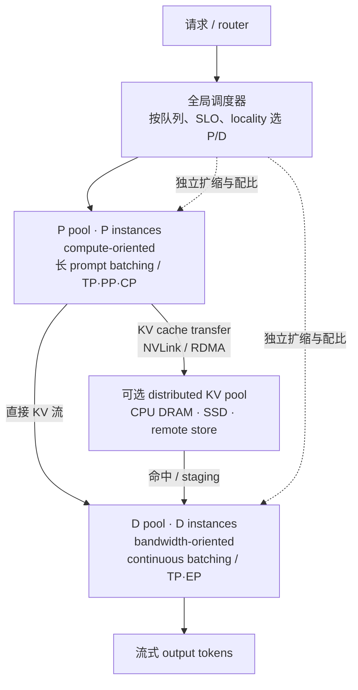
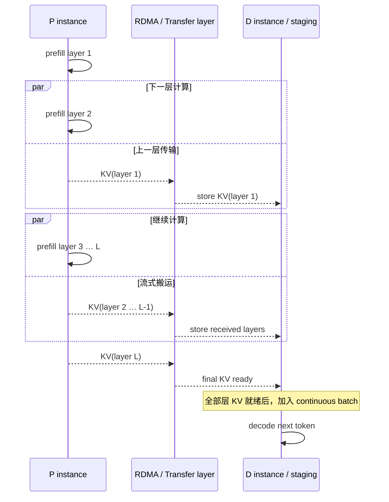
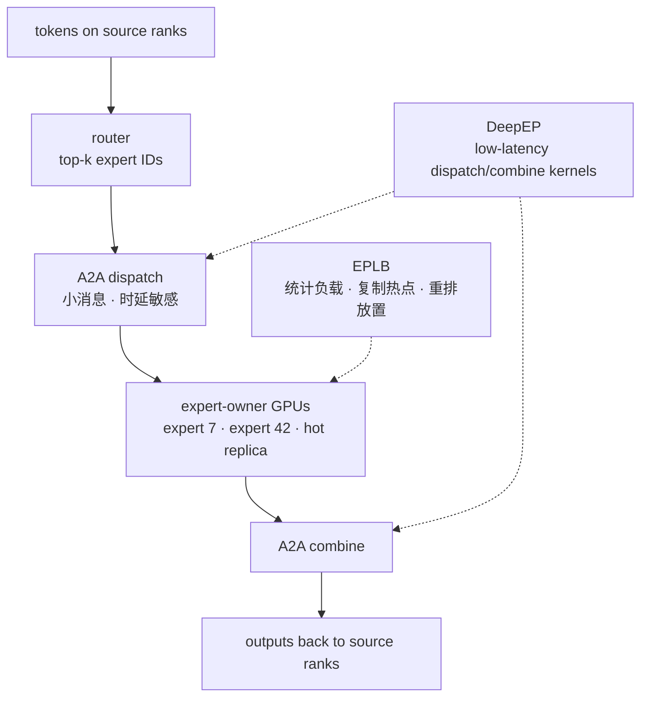
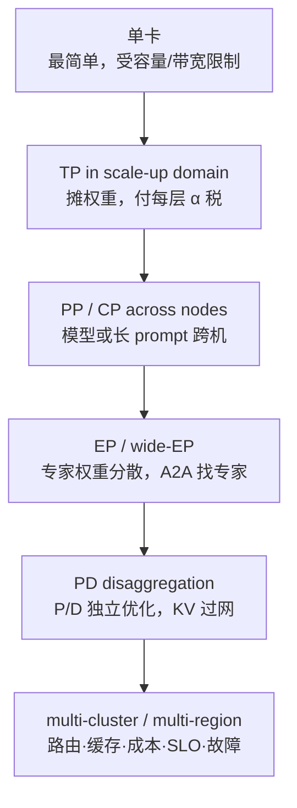

# L60 分布式推理与PD分离：把计算、缓存与网络拆开调度

> [!abstract] 本课速览
> 读完你将能够：
> 1. 根据模型容量、collective 消息大小和 SLO，判断推理侧何时使用 TP、PP、CP 或 EP；
> 2. 画出 P 池、D 池与 KV 流，解释 PD 分离消除了什么干扰、又新增了什么网络成本；
> 3. 复算 70B、4K prompt 在 TP8→TP8 场景中的 1.342 GB KV 与 3.36–26.84 ms 线速传输账；
> 4. 区分 DistServe 的 goodput 优化与 Mooncake 的 KVCache-centric 架构；
> 5. 用 DeepSeek-V3 的 EP32/EP320 部署理解 wide-EP 为什么同时是显存、批处理、通信与负载均衡问题。
>
> 前置：[[L55 推理性能模型]] · [[L47 混合并行组装]] · [[L56 KV缓存与PagedAttention]] · [[L46 专家并行与MoE训练]] · 预计 55 分钟

## 论文里的这段话，你现在可能读不懂

> [!quote]
> “A goodput-optimized serving system may use **prefill-decode disaggregation** so that each **P/D instance** chooses its own parallelism and resource allocation. The resulting **KV cache transfer** must be hidden with **layer-wise streaming** and topology-aware placement. For MoE models, **wide-EP** trades replicated weight traffic for latency-sensitive all-to-all, making **EPLB** and low-latency communication kernels part of the serving critical path.”（改写自 DistServe、Mooncake 与 DeepSeek-V3 的典型表述）

这三句其实在说三次“拆开”：模型太大，先把计算拆到多卡；prefill 与 decode 互相干扰，再把阶段拆到两类实例；MoE 权重太大，再把专家拆到更多 GPU。每拆一次，都少了一种本地瓶颈，也多了一条通信路径。==分布式推理不是“训练并行去掉 backward”，而是在 SLO 下重新决定计算、状态与流量放在哪里。==

## 一、推理并行：训练的积木，时延的新账

**inference parallelism**（推理并行）仍会用到 [[L47 混合并行组装]] 的 TP、PP、CP、EP，但优化目标已经从训练 step time/MFU 换成 TTFT、TPOT、goodput 与每请求成本。训练通常有较大的 $bS$，collective 容易进入带宽区；decode 的一次迭代却可能只有每请求一个 token，小消息固定开销会突然站到台前。

### 1. TP：能装下只是门槛，小消息时延才是地板

**TP for inference**（推理张量并行）把每层矩阵与权重切到多个 ranks，主要解决两件事：模型或 KV 在单卡装不下；单卡 decode 扫权重太慢，需要多卡 HBM 并行供数。代价是每层都要同步 partial results。

decode 时，一次 row-parallel 输出 collective 的逻辑 tensor 常只有 $b\times d$ 个元素。拿 [[03 约定与符号]] 的 Llama-3-70B、batch 1、BF16 举例：

$$
n=b\times d\times2\ \mathrm{B}
=1\times8192\times2
=16{,}384\ \mathrm{B}\approx16.4\ \mathrm{kB}。
$$

即便用 400 Gb/s = 50 GB/s 的线速做一个过分乐观的序列化下界，也只有

$$
T_{\beta}=\frac{16{,}384}{50\times10^9}
\approx0.33\ \mu\mathrm{s}，
$$

远小于 [[03 约定与符号]] 给出的 collective 固定开销约 $10\ \mu\mathrm{s}$ 量级。于是这里是 **latency-bound communication**（时延受限通信）：$T\approx\alpha+n\beta$ 中的 $\alpha$ 主导，真实 all-reduce 还要经过多步算法与软件路径。80 层反复付这笔“小额手续费”，TPOT 会很敏感。这也是 TP group 优先留在高速 scale-up/NVLink 域、并尽量减少同步次数的原因；不是因为跨机带宽为零，而是因为 decode 的消息太小，根本来不及摊薄固定时延。

> [!tip] 训练 TP 像搬家，推理 TP 像跑腿
> 搬家时卡车容量最重要；每层只送一个小包时，打电话、等电梯、签收的固定时间反而最贵。相同的 collective，在训练和 decode 中可能落在完全不同的 $\alpha/\beta$ 区间。

### 2. PP：少做层内同步，用流水换单请求路径

**PP for inference**（推理流水线并行）把连续 layers 分给不同 stages，只在 stage 边界发送 activation。相比 TP 每层 collective，PP 更容易跨节点，因为跨机通信次数少；代价是单请求必须依次穿过全部 stages，空流水线时 TTFT/TPOT 都会增加。

推理没有 backward，也不需要像训练那样等一次同步 iteration 的 forward/backward flush。continuous batching 可以不断把不同请求或 token iterations 灌进 stages，稳态吞吐下的 bubble 因而比训练更容易填。但这不是“无气泡”：低 QPS、长度差异、stage 不均衡和 SLO 优先级仍会让某些 stage 饿着。大白话说，PP 适合“模型要跨机、车流又足够连续”的场景；追求单请求极低时延时要谨慎。

CP 只补一块特殊拼图：超长 prompt 的 prefill 可用 [[L45 序列与上下文并行]] 的 **context parallelism** 切序列/attention 工作；它服务的是长上下文 TTFT，不是普通 decode 每步的默认方案。

| 方案 | 推理侧主要收益 | 关键通信 | 最容易踩的坑 |
|---|---|---|---|
| TP | 摊权重与单步计算、压 TPOT、过容量门槛 | 每层 collective | 小消息 $\alpha$ 税；TP 跨慢域 |
| PP | 模型跨节点；以请求流填 pipeline | stage 间 activation | 低负载 bubble；单请求穿越时延 |
| CP | 并行处理超长 prefill | KV/sequence blocks 交换 | 普通短 prompt 收不回通信成本 |
| EP | 分摊 MoE experts 的权重与带宽 | dispatch/combine all-to-all | token 小消息、热点专家与尾时延 |

## 二、PD 分离：把两种机器活拆成两条生产线

[[L55 推理性能模型]] 已经给出资源画像：prefill 用一个长 prompt 做大矩阵，典型地更吃计算；decode 每步只前进一个 token，典型地更吃 HBM 带宽。[[L57 连续批处理与调度]] 的 chunked prefill 能把长 prefill 切小、降低 generation stall，却仍让两种工作争同一 GPU、同一 batch 和同一调度时钟。

**prefill-decode disaggregation**（prefill–decode 分离，PD 分离）把它们放进两类独立资源池；两类执行角色统称 **P/D instance**（P/D 实例）。P instance 处理 prompt、产出首 token 与 prompt KV，D instance 接手这份 KV，继续 autoregressive decode。

分开之后，各阶段可以选择不同 parallelism、batch policy 和副本数。P 池可以为长 prompt 配较强计算与 CP/PP；D 池可以把更多请求凑成 continuous batch，专注 TPOT。**heterogeneous deployment**（异构部署）更进一步：按 [[03 约定与符号]] 的统一规格，H800 的 BF16 dense 约 989 TFLOPS、HBM 约 3.35 TB/s，H20 的 BF16 dense 约 148 TFLOPS、HBM 约 4.0 TB/s；前者的算力/带宽比更像 prefill，后者的规格形状更贴近 memory-bound decode。这里只是在做资源画像匹配，不是在宣称某型号必然更便宜；模型容量、互联、软件支持和供给都要另算。

### 1. P/D 配比不是 1:1 常数

**prefill/decode instance ratio**（prefill/decode 实例配比）应由负载与 SLO 算，而不是照抄一张架构图。设单个 P instance 和 D instance 在目标 SLO 下的可承载率分别为 $\mu_P$、$\mu_D$，到达率为 $\lambda$，最小副本数至少满足

$$
n_P\mu_P\ge\lambda，\qquad
n_D\mu_D\ge\lambda，
$$

因此连续近似下

$$
\frac{n_P}{n_D}\approx\frac{\mu_D}{\mu_P}。
$$

prompt 变长会压低 $\mu_P$，输出变长则增加 D 池 residency、压低 $\mu_D$；SLO 收紧、硬件改变、prefix hit rate 变化，也都会改配比。Mooncake 论文在它的一个 16-node synthetic workload 与特定 TTFT/TBT 阈值下观察到约 1:1 最佳，只能说明“该实验的两池负载在此处平衡”，不能升级成通用定律。

### 2. DistServe：把 goodput 变成放置优化目标

**DistServe** 是 OSDI 2024 的 PD 分离系统。它给定模型、workload、TTFT/TPOT 约束和 SLO attainment 目标，联合选择：P/D 各自的 parallelism、实例数量，以及物理 placement；目标是最大化 per-GPU goodput。网络较慢或节点亲和性强时，它还要让对应 layer/stage 的 P/D segments 靠近，避免 KV 在慢路径上绕行。

论文在其模型、应用与 SLO 组合中报告：相对当时基线，最多承载 $7.4\times$ 请求，或在相近服务能力下满足 $12.6\times$ 更严格的 SLO，并让超过 90% 的请求满足时延约束。这是论文评估范围内的量级，不是“打开 PD 开关就有 $7.4\times$”。真正值得学的是问题形式：==以满足 TTFT 与 TPOT 的最大到达率为目标，同时搜索并行、配比与放置。==[《DistServe: Disaggregating Prefill and Decoding for Goodput-optimized Large Language Model Serving》](https://www.usenix.org/conference/osdi24/presentation/zhong-yinmin)（OSDI 2024）

## 三、KV 传输：PD 分离新增的网络税

P 做完 prompt 后，D 不能只拿 token IDs：若没有 KV，D 就得重新 prefill。于是 **KV cache transfer**（KV 缓存传输）成为 PD 分离的交接单。域内可走 NVLink；跨节点通常依赖 RDMA/GPU-direct 路径；CXL 等内存互联可能为未来的共享/分层内存提供新位置，但不能在缺少具体平台时把它当成现成的“远程 HBM”。

### 1. 算一算：70B、4K prompt 到底要搬多少

> [!example] 算一算 1：TP8 P instance → TP8 D instance 的 KV 账
> 全部模型与硬件口径取自 [[03 约定与符号]]。Llama-3-70B 有 $L=80$、$d=8192$、$h/h_{kv}=64/8$，所以 $d_{head}=8192/64=128$；KV 用 BF16，即 2 B。$S=4096$ 时，跨完整 TP group 的 KV 总量为
>
> $$
> \begin{aligned}
> C_{\mathrm{KV}}
> &=2\times L\times S\times h_{kv}\times d_{head}\times2\ \mathrm{B}\\
> &=2\times80\times4096\times8\times128\times2\\
> &=1{,}342{,}177{,}280\ \mathrm{B}
> \approx\boxed{1.342\ \mathrm{GB}}。
> \end{aligned}
> $$
>
> 拓扑口径按设计稿写死：P 与 D 都是 TP8，8 个 KV heads 均匀切到 8 ranks，每卡各接一张 400G NIC。每个 shard 为
>
> $$
> C_{\mathrm{shard}}=\frac{1.342}{8}
> \approx0.1678\ \mathrm{GB}。
> $$
>
> [[03 约定与符号]] 规定 400 Gb/s = 50 GB/s（每方向）。若 8 个 shards 真能各走本卡 NIC、路径互不争用并同时跑满线速，payload-only 并行下界为
>
> $$
> T_{8\ \mathrm{links}}
> \ge\frac{0.1678\ \mathrm{GB}}{50\ \mathrm{GB/s}}
> \approx\boxed{3.36\ \mathrm{ms}}。
> $$
>
> 若放置或实现迫使 1.342 GB 全部串过单条 400G 链路，则该单链路的 payload-only 下界为
>
> $$
> T_{1\ \mathrm{link}}
> \ge\frac{1.342\ \mathrm{GB}}{50\ \mathrm{GB/s}}
> \approx\boxed{26.84\ \mathrm{ms}}。
> $$
>
> 同口径的 prefill 参数主项取 [[L55 推理性能模型]] 的 50% dense 峰值教学场景：
>
> $$
> F_{\mathrm{prefill}}\approx2NS
> =2\times70\times10^9\times4096
> =5.7344\times10^{14}\ \mathrm{FLOPs}，
> $$
>
> $$
> P_{\mathrm{eff}}
> =8\times989\times10^{12}\times50\%
> =3.956\times10^{15}\ \mathrm{FLOPS}，
> $$
>
> $$
> T_{\mathrm{prefill,param}}
> \approx\frac{5.7344\times10^{14}}
> {3.956\times10^{15}}
> \approx\boxed{145\ \mathrm{ms}}。
> $$
>
> 所以 26.84 ms 约为这段 145 ms 教学窗口的 18.5%，3.36 ms 约为 2.3%；有机会用流水覆盖。注意：两个网络数都是忽略协议、拓扑争用、注册、排队和尾时延的==线速下界==，26.84 ms 不是实际传输时间的“上界”。真实系统可能落在 3.36 ms 之上，也完全可能超过 26.84 ms；这正是 NIC 亲和性、路由、多 rail、拥塞控制与 placement 要解决的问题。

这个算式还是 GQA 模型的账。MHA 的 $h_{kv}$ 更大，KV 传输会线性变重；MLA 或 KV 量化则会改变 bytes/token。网络研究者第一步不是背 1.3 GB，而是把模型结构重新代回公式。

### 2. Layer-wise streaming：隐藏搬运，不是提前偷跑 decode

**layer-wise streaming**（逐层流式传输）让 P 算完某层 prompt KV 后立即异步发送，不等 80 层全部完成才开网。这样 layer 1 的传输可与 P 的 layer 2 计算重叠，D 侧也可同步接收和 staging。

这里必须卡住一个常见误读：标准 decoder 的下一 token 要依次经过所有 layers，所以 Mooncake 论文描述的是“逐层传输与 incremental prefill 重叠”，并在全部 KV 到达 D 侧 CPU memory 后进入 decode batch；不是 layer 1 到了就能让完整 token 提前生成。流水隐藏的是交接等待，D 侧可以预注册、接收、排布或向 GPU staging，但模型依赖没有消失。[Mooncake FAST 2025 论文 §3.1](https://www.usenix.org/system/files/fast25-qin.pdf)

### 3. 两个传输库要认名，但别把职责混在一起

- **NIXL**（NVIDIA Inference Xfer Library）为推理框架提供点到点数据搬运抽象，把 CPU/GPU memory 与 file/block/object storage 接到可插拔 backends；运行时负责 memory registration、metadata exchange、backend 选择和异步 transfer request。它不是 scheduler，也不替系统决定哪条请求去哪个 D instance。[NIXL 官方仓库](https://github.com/ai-dynamo/nixl)
- **Transfer Engine**（Mooncake 传输引擎）是 Mooncake 的高性能数据传输层，统一处理 DRAM/VRAM/NVMe 等位置与 TCP、RDMA、NVLink 等 transport，强调多 NIC 聚合、拓扑感知选路和临时故障换路；其上还有管理可复用 KV 的 Mooncake Store。Transfer Engine 解决“怎么搬”，Store/Conductor 还要解决“对象在哪、该不该复用、P/D 选谁”。[Mooncake 官方仓库](https://github.com/kvcache-ai/Mooncake)

## 四、两个案例：同样分离，优化中心不同

### 1. DistServe 以 phase capacity 为中心

DistServe 把 P 与 D 当成两种服务台：分别 profile/simulate，在 TTFT/TPOT SLO 下搜索各自的 parallelism 与 capacity，再决定副本数和 placement。它最适合用来学习“怎么把 [[L55 推理性能模型]] 的 goodput 变成优化目标”。

### 2. Mooncake 以 KV 为中心

**Mooncake** 是 Moonshot AI 的 Kimi serving 平台；FAST 2025 正式版题名是《Mooncake: Trading More Storage for Less Computation — A KVCache-centric Architecture for Serving LLM Chatbot》，并获该届 Best Paper。它不仅把 P/D 分池，还利用 GPU VRAM、CPU DRAM、SSD 与 NIC 构成分布式 KV cache，围绕复用、迁移、热点复制、淘汰和 SLO 调度请求。[USENIX FAST 2025 页面](https://www.usenix.org/conference/fast25/presentation/qin)

**KVCache-centric**（以 KV 缓存为中心）不是“系统里有个 KV cache”这么弱的说法，而是：请求先去哪里、是否值得远端取回、P/D 如何配对、热点要不要复制，都围绕 KV 的位置与重算成本决策。论文在其 real traces 与实验设置中报告，相对基线的 effective request capacity 提升 59%–498%；这些数字同时包含 global cache、调度、PD 与传输工程的组合效果，不能单独归因给 PD 分离。

| 观察角度 | DistServe | Mooncake |
|---|---|---|
| 核心对象 | P/D phase capacity 与 placement | 全局 KV cache 的位置、复用与迁移 |
| 主要目标 | 最大化满足双阶段 SLO 的 per-GPU goodput | 在 TTFT/TBT SLO 下提高有效容量并减少重算 |
| 网络进入模型的方式 | P/D placement 与 KV path 约束 | Transfer Engine + distributed KV pool + cache-aware scheduling |
| 最值得模仿的研究方法 | workload→模拟/搜索→配比和并行计划 | compute-vs-transfer 判据→缓存层级→全局调度 |

## 五、MoE 推理与wide-EP：省计算，不等于省权重

[[L17 MoE混合专家]] 的剪刀差在推理时更尖锐：DeepSeek-V3 每 token 激活约 37B 参数，但整个 671B 模型的专家权重仍必须在服务集群的某处在线。若每张 GPU 复制全部 experts，显存放不下；若把 experts 切得很宽，token 就必须过网找专家。

**wide-EP / large-scale EP**（宽专家并行 / 大规模专家并行）把大量 experts 分散到数十乃至数百 GPU。router 给每个 token 选 expert owners，第一次 all-to-all dispatch 把 hidden state 送过去，专家本地计算，第二次 all-to-all combine 把结果送回来源。

**EPLB**（Expert Parallelism Load Balancer，专家并行负载均衡器）依据线上 token→expert 统计复制热门 experts、生成更均衡的 placement，避免某个 GPU 因热点专家成为 straggler。**DeepEP** 是 DeepSeek 开源的 EP 通信库，提供面向 MoE dispatch/combine 的高吞吐与低时延 all-to-all kernels；其官方资料明确区分了适合 prefill/training 的高吞吐路径与适合 decode 小 batch 的低时延路径。[DeepEP 官方仓库](https://github.com/deepseek-ai/DeepEP) · [EPLB 官方仓库](https://github.com/deepseek-ai/EPLB)

### 1. 算一算：EP64 把多少权重摊到每卡

> [!example] 算一算 2：把显存账换成 A2A 时延账
> 用 [[03 约定与符号]] 的 DeepSeek-V3：总参数 671B、每 token 激活约 37B。先做一个故意简化的“把全部模型参数均匀摊到 EP64”直觉账：
>
> $$
> N_{\mathrm{rank}}=\frac{671\ \mathrm{B}}{64}
> \approx10.484\ \mathrm{B\ parameters}。
> $$
>
> 若按 BF16 存放：
>
> $$
> C_{\mathrm{BF16}}=10.484\times2
> \approx\boxed{20.97\ \mathrm{GB/rank}}；
> $$
>
> 若按 FP8/8-bit 存放：
>
> $$
> C_{\mathrm{FP8}}=10.484\times1
> \approx\boxed{10.48\ \mathrm{GB/rank}}。
> $$
>
> DeepSeek 官方只发布 FP8 权重，采用 $128\times128$ block scaling；因此 10.48 GB 对应公开权重的主体字节口径，但每个 block 还带 FP32 scale 元数据，不能把“1 B/参数”当完整文件/显存精确值。[DeepSeek-V3 权重说明](https://github.com/deepseek-ai/DeepSeek-V3/blob/main/README_WEIGHTS.md)
>
> 这说明 EP 可以把“671B 必须在线”的容量和每卡权重读取压力摊开。但它不是 DeepSeek 实际 per-rank 显存复刻：真实 EP 主要切 expert weights，attention、dense layers、shared expert、TP/DP 副本、量化 scale、冗余 experts 与运行时 buffers 都要另算。教学式只负责说明方向：==少读本卡权重，换成每层 dispatch/combine 两段 A2A 的固定时延与拥塞账。==

DeepSeek-V3 技术报告给了一个极好的 P/D 异构 EP 样本：prefill 的最小单元是 32 GPUs，attention 用 TP4×DP8，MoE 用 EP32；decode 的最小单元是 320 GPUs，attention 用 TP4×DP80，MoE 用 EP320，每 GPU 只放一个 expert，另有 64 GPUs 承担 redundant/shared experts。报告还说 decode 每 expert 的 batch 通常不超过 256 tokens，瓶颈偏 memory access，因此使用 direct IB point-to-point 与低时延路径。[《DeepSeek-V3 Technical Report》§3.4](https://arxiv.org/abs/2412.19437)

这也解释了规模经济：流量越大，越容易让每个 expert 收到足够多 token、摊薄权重读取，并让大 EP group 有事可做。但“把全国流量都汇到一个集群”不是免费结论；更大的 group 同时扩大 A2A 范围、故障域、排队与跨地域 RTT。真正的研究问题是：多少流量该集中以填满 experts，多少该留在近端以保护 SLO？这会自然接到 [[L61 推理服务框架与集群]] 的路由，以及 [[L63 跨域与跨集群训练]]、[[L64 边缘与端云协同]] 的多集群/多地域权衡。

> [!warning] 三个常见误区
> 1. **“PD 分离总是更好。”** 短 prompt、低负载时，复制两份模型、维持两个最小资源池和搬 KV 可能比干扰本身更贵；必须扫 load curve 与长度分布。
> 2. **“推理 TP 就是训练 TP 去掉 backward。”** decode 的 $b\times d$ 小消息常让 $\alpha$ 主导，优化重点会从大带宽转向少同步、低时延和 scale-up locality。
> 3. **“MoE 激活 37B，所以只需保存 37B 权重。”** 37B 是每 token 的计算路径；为了让任意 token 能选任意专家，671B 的全体权重仍要在 serving group 某处在线，除非接受换入或远端读取的额外时延。

## 六、从单卡到多地域：一张收口地图

这条路径不是要求每个系统把所有技术全开，而是一组逐步出现的门槛：单卡装不下才切模型；跨卡以后先保护 latency-sensitive collectives；两阶段干扰值得治理时才分 P/D；MoE 专家足够多、流量足够大时才拉宽 EP；单集群装不下业务或需要容灾时，才继续把路由与状态推向多集群。每一步的判据都可归结为三本账：==计算/显存账、通信/状态账、SLO goodput 账。==

## 回到开头那段话

现在逐句回读：

1. “A goodput-optimized serving system may use prefill-decode disaggregation so that each P/D instance chooses its own parallelism and resource allocation。”——P 池处理 compute-oriented prefill，D 池处理 bandwidth-oriented decode；两者分别选择 TP/PP/CP/EP、batch 和副本数，DistServe 再以双阶段 SLO 下的 per-GPU goodput 搜索配比与 placement（第二、四节）。
2. “The resulting KV cache transfer must be hidden with layer-wise streaming and topology-aware placement。”——4K Llama-3-70B 的 BF16 KV 跨 TP8 合计约 1.342 GB；8×400G 理想并行线速下界约 3.36 ms，单 400G 链路约 26.84 ms。逐层发送可与后续 prefill 重叠，但要等全部层 KV 就绪后才能做完整 decode；NIC 亲和、路径争用和 RDMA 工程决定真实落点（第三节）。
3. “For MoE models, wide-EP trades replicated weight traffic for latency-sensitive all-to-all, making EPLB and low-latency communication kernels part of the serving critical path。”——EP 把 experts 分到更多 GPUs，token 每层经历 dispatch/combine；EPLB 复制热点并平衡 placement，DeepEP 提供低时延 A2A。DeepSeek-V3 的 prefill EP32、decode EP320 表明 P/D 可以采用完全不同的 EP 度（第五节）。

你现在应该能把一句“我们采用 PD disaggregation + wide-EP”翻译成一组可复算的问题：==P/D 各有多少实例、用什么卡和并行度、KV 每请求多少字节、走几条什么路径、哪些传输能与计算重叠、每 expert 有多少 token、A2A 的 $\alpha$ 税多大，以及最终提高的是 raw throughput 还是 SLO goodput？==

## 术语卡片

| 术语 | 中文 | 一句话解释 |
|---|---|---|
| inference parallelism | 推理并行 | 为容量、TTFT、TPOT、吞吐与成本组合 TP/PP/CP/EP 的部署方法。 |
| latency-bound communication | 时延受限通信 | 消息很小时 $\alpha$ 固定开销主导、增加带宽也难显著缩短的通信区间。 |
| TP for inference | 推理张量并行 | 跨 ranks 切分层内权重与计算，以摊容量/带宽，代价是频繁小 collective。 |
| PP for inference | 推理流水线并行 | 把连续 layers 放到不同 stages，以较少跨 stage activation 传输让模型跨机。 |
| prefill-decode disaggregation | prefill–decode 分离 / PD 分离 | 把两个阶段部署到独立 GPU pools，并通过 KV 交接请求状态。 |
| P/D instance | P/D 实例 | 分别只执行 prefill 或 decode 的 serving engine 实例。 |
| KV cache transfer | KV 缓存传输 | 把 P 产生或缓存池保存的 K/V 状态搬到 D，使其无需重新 prefill。 |
| layer-wise streaming | 逐层流式传输 | 某层 KV 产出后立即异步发送，以和后续层 prefill 重叠。 |
| NIXL | NVIDIA 推理传输库 | 抽象异构 memory/storage 与可插拔 transport 的点到点推理数据搬运库。 |
| Transfer Engine | Mooncake 传输引擎 | 支持多介质、多协议、多 NIC 与拓扑感知路径的统一数据传输层。 |
| DistServe | DistServe 分离式 serving 系统 | 联合搜索 P/D parallelism、实例数和 placement 以最大化 per-GPU goodput。 |
| Mooncake | Mooncake serving 平台 | 以分布式 KV cache 为中心组织 P/D、存储、传输与调度的工业系统。 |
| KVCache-centric | 以 KV 缓存为中心 | 让请求放置、复用、迁移、淘汰与调度围绕 KV 位置和重算成本决策。 |
| wide-EP / large-scale EP | 宽 / 大规模专家并行 | 把 experts 分到数十至数百 GPUs，以 A2A 换每卡更少权重与更大聚合 batch。 |
| EPLB | 专家并行负载均衡器 | 按线上负载复制热点 experts、重新生成平衡 placement。 |
| DeepEP | DeepSeek EP 通信库 | 为 MoE dispatch/combine 提供高吞吐与低时延 all-to-all kernels。 |
| prefill/decode instance ratio | prefill/decode 实例配比 | P 与 D 实例数之比，由阶段容量、长度分布、硬件和 SLO 共同决定。 |
| heterogeneous deployment | 异构部署 | 给 P/D 选择算力/带宽形状不同的硬件与独立配置。 |

## 自测

1. 为什么同一个 TP all-reduce 在训练中可能 bandwidth-bound，在 batch-1 decode 中却 latency-bound？
2. PP for inference 为什么比训练 PP 更容易填 bubble？它为何仍可能伤害低 QPS 下的单请求时延？
3. 按本课口径复算 Llama-3-70B、4K、BF16 KV 的总量、TP8 每 shard 大小，以及 8×400G 理想并行传输下界。
4. 为什么 26.84 ms 不能叫 KV 传输的实际“上界”？列出至少三个让真实时间变大的因素。
5. 某 workload 在目标 SLO 下，单 P instance 可承载 4 RPS，单 D instance 可承载 10 RPS；到达率为 37 RPS。至少要多少 P/D instances，离散配比是多少？
6. DistServe 与 Mooncake 都做 PD 分离，但各自把什么对象放在优化中心？
7. 为什么 DeepSeek-V3 的“每 token 激活 37B”不能推出 serving group 只保存 37B 权重？wide-EP 又把什么新瓶颈带进来？

> [!note]- 参考答案
> 1. 训练的 $bS$ 大，payload 能摊薄固定开销，$n\beta$ 更可能主导；batch-1 decode 的逻辑 activation 可能只有十几 kB，每层重复 collective，$\alpha$ 与软件/算法步数主导。
> 2. 推理无 backward 和同步 flush，continuous batching 可持续灌入不同请求；但低 QPS 时没有足够并发填 stages，单请求仍须串行穿过全部 stages，并支付 stage 边界通信。
> 3. $2\times80\times4096\times8\times128\times2=1.342$ GB；每 shard $1.342/8=0.1678$ GB；400 Gb/s = 50 GB/s，因此 $0.1678/50=0.00336$ s，即约 3.36 ms。
> 4. 26.84 ms 只是单 400G 链路搬 payload 的线速下界。协议与 memory registration、NIC/PCIe/GPU 路径、交换机排队/拥塞、多租户争用、分片不均、传输启动与尾部同步都会让真实时间更长。
> 5. $n_P=\lceil37/4\rceil=10$，$n_D=\lceil37/10\rceil=4$，离散配比 $10:4=2.5:1$。连续近似 $\mu_D/\mu_P=10/4=2.5$，本题恰好一致。
> 6. DistServe 以 P/D phase capacity、parallelism、实例数与 placement 下的 per-GPU goodput 为中心；Mooncake 以全局 KV cache 的位置、复用、迁移和 SLO 调度为中心。
> 7. 37B 是单 token 被路由后参与计算的参数，不代表未被选中的 experts 可以从服务中消失；任意未来 token 仍可能选它们。wide-EP 分摊 expert 权重与 HBM 读取，却引入每层 dispatch/combine A2A、小消息 $\alpha$ 税、热点 expert 和更大故障域。

## 延伸阅读

- [《DistServe: Disaggregating Prefill and Decoding for Goodput-optimized Large Language Model Serving》](https://www.usenix.org/conference/osdi24/presentation/zhong-yinmin)（OSDI 2024）：精读 §2–4；重点复现“workload + SLO → P/D parallelism、配比与 placement”的优化链。
- [《Mooncake: Trading More Storage for Less Computation — A KVCache-centric Architecture for Serving LLM Chatbot》](https://www.usenix.org/conference/fast25/presentation/qin)（FAST 2025，Best Paper）：精读架构图、layer-wise transfer、global cache scheduler 与 transfer evaluation，分清论文各收益来自哪个组件。
- [《DeepSeek-V3 Technical Report》§3.4](https://arxiv.org/abs/2412.19437)：逐句核对 prefill EP32、decode EP320、redundant experts 与两阶段不同通信路径。
- [DeepEP / EPLB 官方开源仓库](https://github.com/deepseek-ai/open-infra-index)：从 inference engine open-source week 的索引进入两个项目，重点看 high-throughput 与 low-latency 路径为何分开。
- [NIXL 官方文档](https://github.com/ai-dynamo/nixl/blob/main/docs/nixl.md)：认清 memory registration、metadata exchange、backend 与 asynchronous transfer handle 的边界；不要把传输库误当全局 scheduler。

---
上一课：[[L59 投机解码]] ← · → 下一课：[[L61 推理服务框架与集群]]
