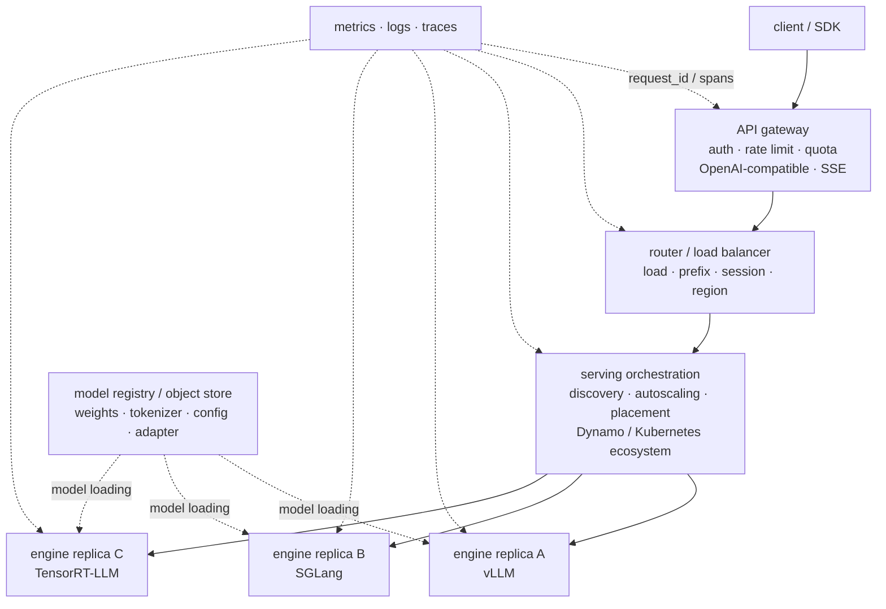
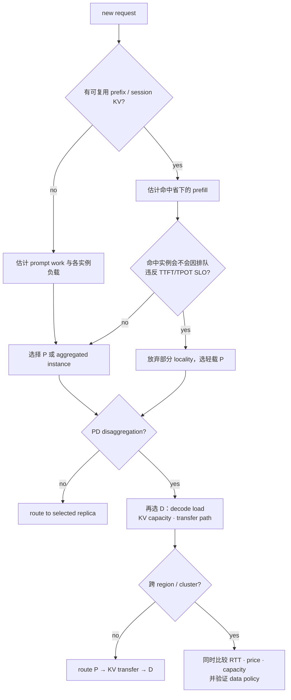
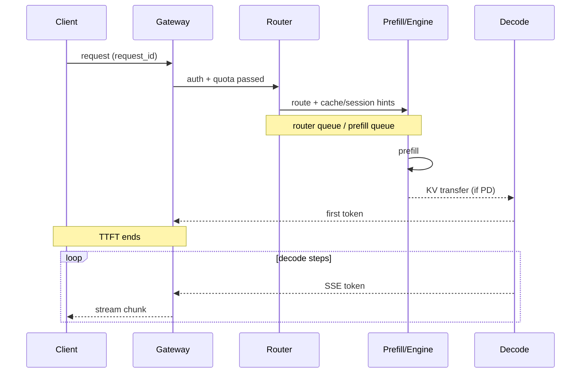
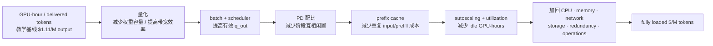

# L61 推理服务框架与集群：从单实例到在线平台

> [!abstract] 本课速览
> 读完你将能够：
> 1. 画出从 API gateway、router 到推理引擎与模型仓库的 serving 全栈，并说清每层的职责边界；
> 2. 根据负载、前缀、会话、PD 拓扑和地域信号选择路由策略，而不把负载均衡简化成轮询；
> 3. 解释 autoscaling 为什么受 cold start 约束，并复算 70B-FP8 的权重加载下界；
> 4. 区分多模型、多租户与 multi-LoRA serving，理解 S-LoRA 解决的批处理和内存问题；
> 5. 用每请求 trace 拆解 SLO，用统一模板复算 70B 服务的 $/M output tokens。
>
> 前置：[[L57 连续批处理与调度]] · [[L60 分布式推理与PD分离]] · [[L35 GPU集群调度]] · 预计 55 分钟

## 论文里的这段话，你现在可能读不懂

> [!quote]
> “A production **serving stack** places an **OpenAI-compatible API gateway** and a **cache-aware router** in front of heterogeneous engine replicas. **Autoscaling** must account for **cold start**, while **multi-LoRA serving** and **structured decoding** turn model identity and decoding constraints into scheduling inputs. End-to-end **observability** therefore requires **per-request tracing**, and capacity plans should be evaluated in **$/M tokens** rather than peak tokens/s alone.”（改写自典型生产 serving 文档与系统论文表述）

三句话从入口一路压到钱账：第一句在问“请求经过哪些层”；第二句在问“平台如何应对负载和请求异质性”；第三句在问“怎么证明既守住 SLO，又没有把成本藏起来”。如果只会运行一条 `vllm serve` 命令，这段话里每个加粗词都像额外的运维负担；读完本课，你会发现它们其实是同一个闭环的不同位置。

## 一、为什么“起个 vLLM”还不是生产平台

没有平台层时，单实例首先会遇到四个朴素问题：谁来鉴权和限流？多个 replicas 该选谁？流量涨了谁来补实例？某个请求慢了，究竟慢在排队、prefill、KV 传输还是 decode？推理引擎只负责最后一段高性能执行，无法替整条在线链路回答这些问题。

**serving stack**（推理服务栈）就是从外部 API 到 GPU 执行、再到模型与运行数据的分层集合。下面这张图是本课主图；请求走实线，控制和观测走虚线。

### 1. API 层：把“模型调用”变成可治理的服务

**API gateway**（API 网关）是客户端看到的边界。它终止 TLS、校验身份与配额、执行 rate limit、统一错误码，并给请求分配可贯穿全链路的 `request_id`。**OpenAI-compatible API**（OpenAI 兼容 API）表示端点路径和主要请求/响应 schema 与常用 OpenAI API 约定兼容，例如 `/v1/chat/completions`；它方便现有 SDK 换 `base_url` 接入，但==兼容不等于所有参数、错误语义和边界行为都完全相同==。vLLM 官方文档就逐项列出了已支持的接口与参数差异。[vLLM OpenAI-Compatible Server](https://docs.vllm.ai/en/latest/serving/openai_compatible_server/)

生成几十到几千个 token 时，等完整回答再返回会让用户空看白屏。**SSE / streaming**（Server-Sent Events / 流式返回）让服务器在同一 HTTP 响应上按事件持续推送增量 token。它改善“看见首 token”的体验，却也把客户端断连、反压、取消传播和连接数变成平台问题；GPU 已经生成但客户端不再消费的 token，照样会烧成本。

### 2. router 与引擎：选服务台，和在服务台内排队，是两件事

**router**（服务路由器）从多个健康实例或资源池中选择下一跳；**load balancing**（推理服务负载均衡）是让请求工作量分布合理、避免单个实例排队爆炸的过程。它们工作在实例之外。[[L57 连续批处理与调度]] 里的 scheduler 则在一个 engine replica 内决定哪些 waiting/running 请求进入下一轮 batch。不要把两者混成一个“调度器”。

叶子执行层常见三个名字：vLLM 以 PagedAttention、continuous batching 和易用的兼容 API 见长；SGLang 把 RadixAttention、结构化生成、调度和 Model Gateway 组合在一套 serving 生态里；**TensorRT-LLM** 是 NVIDIA 面向 NVIDIA GPU 的 LLM inference library/runtime，强调图与 kernel 优化、量化和多 GPU 执行。它们都能当 engine backend，但支持矩阵、默认行为和最佳硬件路径会随版本变化，选型必须以当期文档和同 workload benchmark 为准。

**Dynamo** 是 NVIDIA 的分布式推理编排框架，不是第四种模型本体。它把 frontend、router、worker discovery、KV-aware routing、PD 分离和多种 backend（包括 vLLM、SGLang、TensorRT-LLM）接在一起。官方路由文档明确同时考虑 KV overlap 与 active load：缓存命中很好但队列已经堆满的 worker，不应无条件获胜。[NVIDIA Dynamo Routing Concepts](https://docs.nvidia.com/dynamo/latest/components/router/routing-concepts)

### 3. 模型仓库：权重不是 `docker image` 里的一件小附件

模型仓库或对象存储保存 weights、tokenizer、配置、量化 scale 和 adapters；控制面维护版本、权限与副本位置。**model loading**（模型加载）是把这些工件读入 host/GPU memory，完成必要转换并使实例 ready 的过程。[[L34 存储与数据供给]] 已经讲过数据通路：几十到上百 GB 权重若由大量 replicas 同时拉取，会把扩容动作变成一次 storage/network burst。

> [!tip] 一条边界判断
> engine 解决“这张卡下一步算谁”；router 解决“这个请求去哪个实例”；orchestrator 解决“应该有多少实例、放在哪里”；API gateway 解决“谁能以什么规则调用”。生产事故往往就藏在边界之间。

## 二、路由的信号学：这不是普通 Web 负载均衡

无状态 Web 服务常能把两个请求视作同样大小；LLM 请求却可能有 20-token prompt，也可能有 100K-token prompt，输出长度还未知。更关键的是，KV cache 让实例带上了“这个请求过去来过哪里”的状态。于是轮询只能当 baseline，不能当终点。

### 1. 从轮询到 cache-aware

- round-robin 不看工作量，按顺序分发，简单且适合作为对照组；
- least-loaded 看 active request count 或 queue depth，比轮询多了一点实时信息，但“2 个 100K prompt”和“2 个短问答”不能算同样负载；
- **cache-aware routing**（缓存感知路由）估计各实例已有的 prefix/KV overlap，把请求优先送去能复用更多前缀的地方，同时用排队或 active load 防止热点。

[[L56 KV缓存与PagedAttention]] 的命中经济学在这里变成集群决策：若多个请求共享 32K-token system prompt，把它们随机摊开会在每个实例重做 prefill；把相同前缀聚到同一实例，能用一次计算换多次命中。但亲和性过强又会制造热点，所以实际目标不是“命中率最大”，而是“缓存收益减去排队代价后最小”。SGLang Model Gateway 当前文档也把 `cache_aware` 定义为 cache locality 与 load balancing 的组合策略，而不是只看哈希。[SGLang Model Gateway](https://docs.sglang.io/docs/advanced_features/sgl_model_gateway)

### 2. 会话亲和不等于永不搬家

**session affinity**（会话亲和）让同一多轮会话尽量回到保存其 KV/history 的实例。**sticky routing**（粘性路由）是实现这种亲和的一类机制，例如对 `session_id` 做 consistent hash，或由 router 记录绑定关系。两者不应被理解成“永久钉死”：实例故障、过载、扩缩容和 KV 淘汰都会让绑定失效，平台必须允许重算、迁移或降级。

会话亲和还带来多租户安全问题。只按“文本前缀相同”复用缓存不够，cache key 还必须包含模型版本、adapter、tokenizer、租户/权限域以及影响 logits 的 decoding 配置；否则高命中率可能换来跨租户数据泄漏或错误复用。

### 3. PD 分离把一次路由变成耦合的两次选择

在 [[L60 分布式推理与PD分离]] 中，请求先去 P instance 生成 prompt KV，再由 D instance 继续生成。平台不再只选一个 worker：P 侧要看 prefix overlap、prefill queue 与算力；D 侧要看 decode batch、KV capacity 和 TPOT 余量；P/D 配对还决定 KV transfer 的路径。

### 4. 多地域：时延、成本、容量组成三角

多地域路由多了一层物理约束：近端 region RTT 低但可能排队或单价高，远端容量空闲却要付 WAN RTT、带宽和会话状态迁移税。还要先满足数据驻留、模型可用性和故障域等硬约束。WAN 的带宽/RTT 物理账会在 [[L63 跨域与跨集群训练]] 集中建立；推理决策继续接到 [[L64 边缘与端云协同]] 的时延/卸载问题，以及 [[L65 推理服务生存性]] 的 failover 与 capacity headroom。

可以把 router 的选择抽象为一个在线优化问题。对可行实例集合 $mathcal{F}$，选择

$$
i^*=\arg\min_{i\in\mathcal{F}}
\left(
w_q\hat T_{queue,i}
+w_p(1-H_i)\hat T_{prefill}
+w_x\hat T_{\text{KV transfer},i}
+w_d\hat T_{decode,i}
+w_c\hat C_i
\right),
$$

同时约束预测 TTFT/TPOT 不超过对应 SLO。$H_i$ 是 prefix/KV 命中比例，$hat C_i$ 是该请求的边际成本。难点不在写出 `argmin`，而在在线估计：输出长度未知、队列不断变化、cache events 有延迟、跨地域 RTT 会抖。这正是“路由 = 研究富矿”的原因。

> [!warning] “cache-aware”不是“cache-only”
> 只追命中会把共同 system prompt 的全部流量砸向一个 worker；只追最短队列又会丢掉昂贵前缀。真正的策略必须同时核算 locality、load、SLO 与迁移代价。

## 三、autoscaling：GPU 能加，ready capacity 不能瞬移

**autoscaling**（自动扩缩）按负载增加或减少 ready replicas。最容易想到的信号是 QPS，但同样 10 QPS 可以是一批短问答，也可以是一批长上下文 reasoning 请求。更可靠的信号组合包括：queueing delay/queue depth、in-flight tokens、预测 prefill/decode work、KV/HBM 水位、SLO violation trend，以及平台实测的 per-replica goodput。

扩容控制通常还需要 cooldown/hysteresis，避免观测窗口稍有波动就反复开关实例；可预测的昼夜潮汐则适合 predictive scaling，在流量到达前先加载。缩容也不是直接杀进程：先停止接新请求、排空或迁移 in-flight sessions，再释放实例。

### 1. cold start 的四段税

**cold start**（冷启动）是从“需要一个 replica”到“replica 能稳定接流量”的等待。它至少包含：拉取容器与依赖 → 下载/读取 weights → 格式转换、kernel/graph 编译 → warmup 与健康检查。权重加载只是其中一段，所以 storage payload 的线速时间只能是下界。

> [!example] 算一算 1：70B-FP8 扩容为什么不是瞬时的
> 采用 [[03 约定与符号]] 的 Llama-3-70B 与 dtype 口径：FP8/8-bit 为 $1\ \mathrm{B/parameter}$，BF16 为 $2\ \mathrm{B/parameter}$。因此权重主体为
>
> $$
> W_{FP8}=70\times10^9\times1\ \mathrm{B}=70\ \mathrm{GB}，
> $$
>
> $$
> W_{BF16}=70\times10^9\times2\ \mathrm{B}=140\ \mathrm{GB}。
> $$
>
> 设计稿给一个显式教学场景：对象存储到实例的有效吞吐约 $B_{store}=10\ \mathrm{GB/s}$。若仓库直接保存可加载的 FP8 权重，纯 payload 下界为
>
> $$
> T_{load,FP8}\ge\frac{70\ \mathrm{GB}}{10\ \mathrm{GB/s}}
> =\boxed{7\ \mathrm{s}}。
> $$
>
> 若仓库存 BF16、加载后再转 FP8，仅传输下界已变成
>
> $$
> T_{load,BF16}\ge\frac{140\ \mathrm{GB}}{10\ \mathrm{GB/s}}
> =\boxed{14\ \mathrm{s}}，
> $$
>
> 之后还要加转换、编译、显存分配、warmup 与 readiness check。这里的 $10\ \mathrm{GB/s}$ 是“约量级”的题设，不是对象存储的通用规格；并发 replicas 共享后端或网络时，每实例有效带宽还会下降。结论不是“冷启动等于 7 秒”，而是==连最乐观的 payload 都有秒级下界，完整 ready time 只会更长==。

### 2. keep-warm 与 serverless 的同一笔账

**keep-warm**（保温实例）是提前保留已加载、已预热的空闲 capacity，用 GPU-hour 换掉 cold start。按 [[03 约定与符号]] 的 H100 教学租价 $2/\text{GPU·h}$，一个 TP8 replica 即使完全空闲也要

$$
C_{warm}=8\times\$2/\mathrm{h}=\$16/\mathrm{h}
=\$384/\mathrm{day}。
$$

因此 keep-warm 数量应该由突发概率、启动时间和 SLO 违约代价共同决定。**serverless inference** 试图让用户按调用付费、让平台 scale-to-zero 或共享暖池；但物理上的权重没有消失，只是冷启动与空闲容量由平台在更大租户池里摊销。[[L66 弹性算力与资源效率]] 会继续讨论这种弹性与利用率的交换。

## 四、多模型、多租户与 multi-LoRA

### 1. 多模型首先是容量与热度管理

若每个业务都复制一份完整 70B base，模型仓库、host memory、GPU HBM 和冷启动带宽都会迅速膨胀。平台会把模型按热度分层：hot model 保持 ready replicas；warm model 让 weights 留在 host/local SSD、需要时较快拉起；cold model 只在远端仓库保留。router 先做 model selection，再在该模型的 worker pool 内做 load/cache-aware selection。

**multi-tenancy**（多租户）则表示多个用户、团队或业务共享同一平台甚至同一 engine。共享能提高利用率，也引入 noisy neighbor：一个租户的长 prompt、超长输出或高优先级请求可能污染另一个租户的 p99。治理手段包括 quota、admission control、per-tenant queue、priority/fair sharing、显存/KV 配额与 cache namespace 隔离。[[L57 连续批处理与调度]] 的 interactive/batch SLO tier 在集群层可以错峰互补：interactive 请求保留低时延 capacity，offline batch 吃剩余吞吐，但不能反过来阻塞 interactive。

### 2. multi-LoRA：共享 base，不等于 adapter 免费

**multi-LoRA serving**（多 LoRA 推理服务）让很多请求共享一份 frozen base model，每个请求再选择自己的小型 LoRA adapter。它比“每个 adapter 合并出一份完整 checkpoint”节省大量权重复制，也能把不同 adapter 的请求放进同一个 base-model batch。[[L15 后训练与对齐]] 已给出 LoRA 的低秩旁路；到了 serving，难点变成 adapter 放置、换入、不同 rank 的混合 batch 和租户隔离。

**S-LoRA** 是这条线的代表系统。《S-LoRA: Serving Thousands of Concurrent LoRA Adapters》（MLSys 2024）把 adapters 放在 host memory、按需取到 GPU，用 Unified Paging 共同管理动态 adapter weights 与 KV tensors，并用 heterogeneous batching kernels 处理同批不同 adapters/ranks；它还设计了多 GPU tensor parallel 路径。重点不是记住论文报告的某个倍数，而是看见一个模式：==base 权重共享后，adapter memory、I/O 和 batch heterogeneity 会成为新的系统瓶颈。==[MLSys 2024 正式论文](https://proceedings.mlsys.org/paper_files/paper/2024/file/906419cd502575b617cc489a1a696a67-Paper-Conference.pdf)

| 场景 | 共享什么 | 新增状态 | 主要平台问题 |
|---|---|---|---|
| 多模型 | 仓库、控制面、部分基础设施 | 每个模型独立 weights/KV | 热度分层、放置、冷启动 |
| 多租户 | worker pool / engine / cache capacity | quota、priority、tenant namespace | 隔离、公平、noisy neighbor |
| multi-LoRA | 同一 base weights | adapter weights + adapter identity | adapter paging、混合 batch、隔离 |

## 五、结构化输出和 function calling 改变了 workload

**guided / structured decoding**（引导式 / 结构化解码）按 JSON Schema、正则或 grammar 限制每一步允许生成的 token 集合，再对合法 token 采样。它让“请输出 JSON”从软提示变成解码约束，提高下游可解析性；代价是维护 grammar state、构造 token mask，并让不同请求携带不同约束。实现若在 CPU 侧推进状态机，还可能把 CPU–GPU 同步和 tokenizer 处理放进每个 decode step 的关键路径。

function calling/tool calling 则让一次用户请求变成：模型生成 tool call → 外部工具运行 → 结果追加进上下文 → 再次调用模型。第一段生成可能在产出工具参数后提前结束，但整个用户任务没有结束；会话在工具执行期间暂时空闲，随后带着更长 prefix 回来。这强化了 session affinity 和 prefix cache 的价值，也让请求到达从独立 Poisson 式直觉变成相关的多轮 burst。[[L70 选修-多模态与新负载]] 会把 agentic workload 的 KV 生命周期完整展开。

## 六、先能观测，再谈 SLO 与成本

### 1. per-request tracing：不要只盯 GPU utilization

**observability**（可观测性）是从 metrics、logs 和 traces 推断系统内部状态的能力。集群平均 GPU utilization 很高，既可能是有效 decode，也可能是长 prefill 干扰、无效重试或已经断连的请求。只看一个平均数无法定位 SLO。

**per-request tracing**（逐请求追踪）用同一个 trace/request ID 串起 gateway、router、queue、prefill、KV transfer、decode 和 egress spans。至少应记录：模型/版本/adapter、输入输出 token 数、route target、cache hit tokens、各段队列时间、TTFT、TPOT/ITL、finish reason、取消/错误状态和资源池。这样 p99 TTFT 上升时，才能判断是 router 送歪了、P pool 排队、cold replica 未 ready，还是存储/网络加载拖住扩容。

### 2. $/M tokens：把 M8 的技术放回同一张账

**$/M tokens**（每百万 token 成本）把固定时间内的基础设施成本除以实际交付 token。输入和输出必须分开，因为 input/prefill 与 output/decode 的资源画像、缓存收益和定价都不同。对某一稳定 workload window，先写通用式：

$$
C_{in}=\frac{C_{in\text{-}pool}/\mathrm{h}}{q_{in}\times3600}
\times10^6，\qquad
C_{out}=\frac{C_{out\text{-}pool}/\mathrm{h}}{q_{out}\times3600}
\times10^6。
$$

$q_{in}$、$q_{out}$ 应取成功交付且口径明确的 aggregate tokens/s，并注明是否只统计满足 SLO 的流量；不能拿实验中的峰值 tokens/s 直接代替全天平均。PD 分离时可分别使用 P/D pool 的卡时成本；aggregated engine 则要按 phase profile 分摊，或只报告 blended cost，不能把同一份 GPU-hour 在 input/output 两边各算一次后再相加。完整 TCO 还要加 CPU、内存、存储、网络、控制面、运维与冗余，本课先用 GPU-hour 隔离最主要的一项。

> [!example] 算一算 2：70B-FP8、TP8 的 output token 成本
> 采用 [[03 约定与符号]] 的 H100 教学租价 $\$2/\text{GPU·h}$。本算例按设计稿的简化口径，把整个实例的 GPU-hour 都归到 output 侧，不再另加同一实例的 input 成本。一个 TP8 实例的 GPU 成本为
>
> $$
> C_{instance}=8\times\$2/\mathrm{h}=\$16/\mathrm{h}。
> $$
>
> 设计稿给定这个 workload 下的 aggregate 有效输出吞吐为 $q_{out}\approx4000\ \text{tokens/s/instance}$。一小时交付
>
> $$
> N_{out}=4000\times3600=14.4\times10^6\ \text{tokens}。
> $$
>
> 所以只计 GPU-hour 的输出成本是
>
> $$
> C_{out}=\frac{\$16}{14.4\times10^6}\times10^6
> =\boxed{\$1.11/\text{M output tokens}}。
> $$
>
> 这里的 4000 tokens/s 是明确 workload 下的题设，不是 70B-FP8 的通用硬件规格。若实际只达到一半有效吞吐，成本立即翻倍到约 $\$2.22/\text{M}$；若同卡价下吞吐提高 25%，则降为 $\$1.11/1.25\approx\$0.89/\text{M}$。这就是“利用率/吞吐杠杆可能大于卡价差”的定量含义。

截至 2026-08-05，Groq 官方模型页列出的 Llama 3.3 70B output price 为 $0.79/M tokens。[Groq 官方模型与价格页](https://console.groq.com/docs/model/llama-3.3-70b-versatile) 它甚至低于上面的 H100 教学成本，但不能据此宣布谁“亏钱”或“毛利更高”：Groq 使用不同硬件和数值路径，平台利用率、缓存、承诺合同、非 GPU 成本、SLO 与计费 token 口径也不同。这个对照真正要训练的是研究习惯：==公开 API 标价是市场价格，不是某个 H100 配置的成本测量。==

这张“成本瀑布”不是说每个箭头必然省钱。量化可能交量化税，过大 batch 会违反 TPOT，PD 会增加 KV 网络，cache-aware 会制造热点，缩容过猛会触发 cold start。正确做法是对同一 workload trace 同时报告 SLO attainment/goodput 与成本，逐项做 ablation。M8 从 [[L55 推理性能模型]] 到本课的所有技术，到这里终于落到同一把尺上。

> [!warning] 三个常见误区
> 1. **“serving 就是起个 vLLM。”** 那只完成 engine leaf；入口治理、集群路由、扩缩、版本、隔离、观测和故障仍然空着。
> 2. **“负载均衡就是 round-robin。”** KV 与 session 让实例变成有状态服务台，请求长度又高度异质，轮询只能是 baseline。
> 3. **“卡价就是 token 成本。”** token 成本还被有效吞吐、利用率、缓存命中、SLO 失败、冗余和非 GPU 资源共同缩放。

## 七、与研究的连接：router 是网络、系统与 SLO 的交叉点

本课最贴近“分布式推理的网络与系统优化”的地方，不是背框架名单，而是把每个 routing decision 看成状态放置问题：KV 在哪里，计算容量在哪里，请求离哪个 region 最近，迁移要走哪条链路，哪个租户的 SLO 最紧。可直接形成四类研究问题：

1. **缓存与负载联合路由**：如何在 cache hit、queueing delay 和 hot-spot risk 之间在线权衡；cache events 不完整或延迟时如何保持鲁棒；
2. **PD/多地域协同**：如何联合选择 P、D、KV placement 与传输路径，而不是让两级 router 各自贪心；
3. **SLO-aware autoscaling**：如何从 workload trace 预测 token work，而不是只预测 QPS；cold start 与 keep-warm 的最优容量是多少；
4. **多租户成本与隔离**：如何在 interactive/batch、不同 adapter 和不同租户之间分配 GPU/HBM/network bandwidth，同时报告 fairness、SLO violation 与 $/M tokens。

故障检测、failover、重试风暴和降级服务没有在本课展开，它们不是平台的边角料，而是 [[L65 推理服务生存性]] 的整节主线。下一课 [[L62 实践-跑起来一个推理服务]] 会先把单实例服务跑起来，亲手量 TTFT/TPOT；带着本课分层图，你会清楚实验覆盖了哪一层、还没有覆盖哪一层。

## 回到开头那段话

> “A production **serving stack** places an **OpenAI-compatible API gateway** and a **cache-aware router** in front of heterogeneous engine replicas.”

现在可以逐项翻译：生产平台的入口先用兼容 API、鉴权、限流和 SSE 统一客户端语义；router 再同时看 cache locality 与 active load，从 vLLM/SGLang/TensorRT-LLM 等异构 replicas 中选下一跳。它说的是平台层，不是 engine 内的 continuous batching。

> “**Autoscaling** must account for **cold start**, while **multi-LoRA serving** and **structured decoding** turn model identity and decoding constraints into scheduling inputs.”

扩容命令发出后，70B 权重仅 payload 就有秒级加载下界，编译和 warmup 还在后面，所以要预测扩容或保留 keep-warm。multi-LoRA 让 adapter identity/placement 进入 batch 与路由；structured decoding 让 grammar state 和合法 token mask 进入每步执行。请求不再只有“prompt 和 max_tokens”两个维度。

> “End-to-end **observability** therefore requires **per-request tracing**, and capacity plans should be evaluated in **$/M tokens** rather than peak tokens/s alone.”

最后一句是在规定验收方法：每请求 trace 把 gateway、queue、prefill、KV transfer、decode 串起来，才能定位 SLO；$/M tokens 把卡时成本除以真实交付吞吐，才能揭穿“峰值很高、全天很贵”。至此，开场三句已经能逐句落到架构、机制和算式上。

## 术语卡片

| 术语 | 中文 | 一句话解释 |
|---|---|---|
| serving stack | 推理服务栈 | 从 API 入口、路由、编排、引擎到模型与观测的分层系统。 |
| API gateway | API 网关 | 负责协议入口、鉴权、限流、配额、错误与 request ID 的服务边界。 |
| OpenAI-compatible API | OpenAI 兼容 API | 兼容常用 OpenAI 端点与主要 schema 的接口；不保证全部行为相同。 |
| SSE / streaming | SSE / 流式返回 | 在同一响应上持续推送增量生成结果。 |
| router | 服务路由器 | 在健康模型池、实例或地域之间为请求选择下一跳。 |
| load balancing | 推理服务负载均衡 | 依据工作量和状态分配请求，避免单实例过载并保护 SLO。 |
| cache-aware routing | 缓存感知路由 | 联合 KV/prefix overlap 与 active load 选择实例。 |
| session affinity | 会话亲和 | 让同一多轮会话尽量回到已有其状态的实例。 |
| sticky routing | 粘性路由 | 用映射或 hash 实现会话/用户到实例的稳定绑定。 |
| autoscaling | 自动扩缩 | 随负载和 SLO 信号调整 ready replica 数量。 |
| cold start | 冷启动 | 新实例从不存在/未加载到 ready 的完整等待。 |
| model loading | 模型加载 | 将权重和相关工件读入运行时并完成可执行准备。 |
| keep-warm | 保温实例 | 保留已加载的空闲 capacity，以 GPU-hour 换低启动时延。 |
| multi-tenancy | 多租户 | 多个用户或业务共享平台资源，同时需要隔离与公平。 |
| multi-LoRA serving | 多 LoRA 推理服务 | 共享 base 权重、按请求选择和批处理不同 adapters。 |
| S-LoRA | S-LoRA 系统 | 用 Unified Paging、heterogeneous batching 与 TP 扩展多 adapter serving。 |
| guided / structured decoding | 引导式 / 结构化解码 | 用 JSON schema、grammar 等约束每步合法 token。 |
| observability | 可观测性 | 通过 metrics、logs、traces 推断系统内部状态。 |
| per-request tracing | 逐请求追踪 | 用统一 ID 串起一个请求经过的全部阶段与时延。 |
| $/M tokens | 每百万 token 成本 | 基础设施成本除以实际交付的百万 token 数。 |
| TensorRT-LLM | TensorRT-LLM | NVIDIA 面向 NVIDIA GPU 的 LLM inference library/runtime。 |
| Dynamo | Dynamo | NVIDIA 连接 frontend、router、workers、KV 与多 backend 的分布式推理框架。 |

## 自测

1. 为什么 `vllm serve` 已经提供 HTTP API，却仍不能等同于完整 production serving stack？
2. cache-aware routing 与 session affinity 各利用什么状态？为什么都不能无条件压过负载信号？
3. 在 PD 分离架构里，router 为什么要做两级选择？列出 P、D 各至少两个信号。
4. 70B-FP8 权重主体为 70 GB。若实例可获得的加载带宽约为 5 GB/s，纯 payload 下界是多少？为什么不能把这个答案当 cold start？
5. TP8 H100 实例按 $2/GPU·h 计费，aggregate 有效输出吞吐为 3000 tokens/s。只计 GPU-hour 时，输出成本约为多少 $/M tokens？
6. multi-LoRA serving 相比“每个 adapter 合并一份完整模型”共享了什么，又引入了哪些新瓶颈？
7. 设计一个多地域 cache-aware router 的最小 trace schema：至少列出六个你会记录的字段，并说明如何用它定位 p99 TTFT 上升。

> [!note]- 参考答案
> 1. 单实例 HTTP server 主要覆盖 API 解析和 engine 执行；完整平台还要负责认证/配额、跨实例路由、service discovery、autoscaling、模型版本与加载、多租户隔离、全链路观测和故障处理。
> 2. cache-aware routing 看 prefix/KV overlap，session affinity 看会话到已有状态位置的关联。命中实例可能已经排队或故障，过强亲和还会制造热点，所以二者都必须与 active load、SLO 和健康状态联合判断。
> 3. P 侧可看 prefix hit、prefill queue、prompt work/算力余量；D 侧可看 active decode tokens、KV/HBM capacity、TPOT 余量。两者之间还要计 KV transfer 路径和成本。
> 4. $70\ \mathrm{GB}/(5\ \mathrm{GB/s})=14\ \mathrm{s}$。这只是权重 payload 的理想下界，未含镜像、转换/编译、显存分配、warmup、健康检查和竞争带宽。
> 5. 实例卡时成本 $=8\times\$2=\$16/\mathrm{h}$；一小时输出 $3000\times3600=10.8$ M tokens；故 $C=16/10.8\approx\boxed{\$1.48/\text{M output tokens}}$。
> 6. 它共享 base weights 与 base-model batch，避免每 adapter 复制完整模型；新瓶颈是 adapter placement/paging、host→GPU I/O、混合 rank/adapter batching kernels、cache key 与租户隔离。
> 7. 可记录 `request_id`、region、model/version/adapter、input/output tokens、cache-hit tokens、route target、gateway/router/prefill/decode queue spans、KV transfer bytes/time、TTFT/TPOT、finish/error。先比较 p99 请求各 span：router queue 涨说明入口/路由容量问题，prefill queue 涨说明 P pool 不足，load/warmup span 涨说明扩容冷启动，KV transfer 涨说明 placement/network 问题。

## 延伸阅读

- [vLLM OpenAI-Compatible Server](https://docs.vllm.ai/en/latest/serving/openai_compatible_server/)：核对“compatible”具体支持哪些端点和参数；读到能解释兼容边界即可。
- [SGLang Model Gateway](https://docs.sglang.io/docs/advanced_features/sgl_model_gateway)：沿 architecture、load balancing policies、PD mode 与 observability 四节对照本课分层图。
- [NVIDIA Dynamo Routing Concepts](https://docs.nvidia.com/dynamo/latest/components/router/routing-concepts)：重点看 KV overlap、active load 和 worker selection 如何进入同一个 cost model。
- [《S-LoRA: Serving Thousands of Concurrent LoRA Adapters》](https://proceedings.mlsys.org/paper_files/paper/2024/file/906419cd502575b617cc489a1a696a67-Paper-Conference.pdf)（MLSys 2024）：精读 Unified Paging 与 Heterogeneous Batching，理解 adapter serving 为何不是简单换权重。
- [Groq 官方模型与价格页](https://console.groq.com/docs/model/llama-3.3-70b-versatile)：只用于观察 2026-08-05 的公开 per-token 标价；不要把它当 H100 成本或论文性能基线。

---
上一课：[[L60 分布式推理与PD分离]] ← · → 下一课：[[L62 实践-跑起来一个推理服务]]
