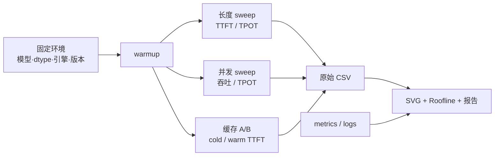

# L62 实践：跑起来一个推理服务，从 TTFT 到 Roofline 的测量闭环

> [!abstract] 本课速览
> 做完本课，你将能够：
> 1. 在单卡 GPU、Apple Silicon 或纯 CPU 上启动一个 OpenAI-compatible 推理服务；
> 2. 从 streaming 响应中正确测量 TTFT、TPOT、端到端时延和 aggregate output throughput；
> 3. 扫 prompt 长度与并发数，画出 prefill、decode 和 batch effect 的三张核心图；
> 4. 用开/关 prefix caching 的受控实验测出缓存命中收益；
> 5. 用统一的 H100/Llama-3-8B 口径计算 decode Roofline，并把实测吞吐换成可解释的“屋顶达成率”；
> 6. 读懂 KV cache usage、running/waiting requests 与 preemption counter，交付一份可复核的部署性能报告。
>
> 前置：[[L55 推理性能模型]] · [[L56 KV缓存与PagedAttention]] · [[L57 连续批处理与调度]] · 预计 90–150 分钟

## 本次实践你要亲眼看到什么

1. 在本课选择的中短 context 区间，**TTFT**（首 token 时延）通常随 prompt tokens 显著上升；近似线性是一个待验证的局部现象，不是对任意长序列的定律。
2. 单请求 **TPOT**（每输出 token 时间）对 prompt/context 长度的斜率通常小得多，但不会严格水平：每个 decode step 仍要读取越来越长的 KV cache。
3. **throughput**（吞吐）会随 **concurrency**（并发数）上升，因为权重读取被 batch 摊薄；过了拐点后，TPOT、排队与 KV 压力开始快速变坏。
4. 相同长前缀第二次出现时，**prefix caching**（前缀缓存）能跳过一部分 prefill，让 TTFT 明显下降；它不会直接加速后续 decode。
5. 单请求 decode 的 Roofline 上限远低于 dense compute roof。实测达不到上限的差距，要能拆成 KV 读取、kernel/调度、前端与测量口径，而不是一句“GPU 没跑满”。

前几课的图都是别人画好的。这次你要从客户端时钟、服务端 metrics 和硬件规格出发，亲手画出属于自己机器的图。最后交付物不是“我成功问了模型一句话”，而是目录 `results/`、三张核心 SVG、缓存对照、Roofline 算式与一页结论。



## 〇、环境准备：三档机器，同一份实验契约

### 0.1 先选档，不要先改指标

| 档位 | 最低环境 | 推荐引擎与模型 | 必做范围 | 不能冒充的结果 |
|---|---|---|---|---|
| A：主路径 | Linux + 单张 NVIDIA GPU，显存能容纳 3–8B 模型 | vLLM 0.18.1 + Llama-3-8B BF16 | 任务 A–D 全部；挑战题可选 | 这是单实例结果，不代表集群 goodput |
| B：Mac | Apple Silicon，建议 16 GB 以上统一内存 | llama.cpp + Gemma-3-4B Q4_K_M | A/B；C 用 `--cache-prompt` 与 `--parallel` 等价替代；D 读 `timings`/metrics | 4-bit GGUF 不能和 BF16 H100 的绝对数值横比 |
| C：CPU | x86/Arm CPU，建议 8 GB 内存 | llama.cpp + Gemma-3-1B Q4_K_M | 只要求 A/B，长度和并发缩小 | 只验证测法与趋势，不声称复现 GPU batching 上限 |

llama.cpp 官方 server 同时支持 CPU/GPU、OpenAI-compatible endpoint、parallel decoding、continuous batching、prompt caching 和 metrics；`-hf` 可直接按 Hugging Face repo 与量化名下载 GGUF。[llama.cpp HTTP server 文档](https://github.com/ggml-org/llama.cpp/blob/master/tools/server/README.md) 本课选择的 1B/4B GGUF 仓库与 Q4_K_M 文件也可直接核验：[Gemma-3-1B GGUF](https://huggingface.co/ggml-org/gemma-3-1b-it-GGUF)、[Gemma-3-4B GGUF](https://huggingface.co/ggml-org/gemma-3-4b-it-GGUF)。

三档都必须遵守同一份**实验契约**：

- 每轮记录 OS、CPU/GPU、内存/显存、模型、dtype/quant、引擎版本、启动命令与日期；
- 比较两组数据时，除被研究变量外，模型、prompt 生成器、输出上限、采样参数和 warmup 次数保持一致；
- 每个点至少重复 3 次，报告 raw rows 和 p50；若研究 SLO，再增加样本并报告 p99；
- 客户端与 server 尽量同机。若跨机，TTFT 会包含网络 RTT，报告里必须注明；
- 不把“目标词数”当 token 数。脚本会调用 server 的 `/tokenize`，CSV 中的 `prompt_tokens` 才是横轴；
- 不混用不同模型或量化后的绝对时延，只比较各自机器内的趋势和无量纲达成率。

### 0.2 两个完整脚本：先离线自检

本课代码只依赖 Python 3.10+ 标准库。[[L62_bench.py]] 负责 streaming 计时、token 计数、并发发压和 CSV；[[L62_plot.py]] 直接生成 SVG，不需要 NumPy、pandas 或 matplotlib。

```bash
python3 "M8 推理系统/实践代码/L62_bench.py" self-test
python3 "M8 推理系统/实践代码/L62_plot.py" --self-test
```

预期输出：

```text
[PASS] SSE parsing, /tokenize counting, TTFT and TPOT formulas
[PASS] CSV aggregation and four SVG outputs
```

这两个 PASS 只验证客户端测量逻辑，不代表本机模型服务性能。脚本的 TTFT 从“发请求前”计到第一个非空 SSE 文本片段；输出 token 数优先采用 stream `usage`，没有该字段时再让 server tokenizer 对拼接文本做 retokenization，CSV 的 `token_count_source` 会保留口径。少数 tokenizer 的 decode→encode 不能严格 round-trip，此时输出 token 数可能与 engine raw token count 略有差异，应使用官方 benchmark/trace 交叉核对。TPOT 使用 [[L55 推理性能模型]] 的精确口径：

$$
TPOT=\frac{T_{E2E}-TTFT}{O-1},\qquad O>1.
$$

`group_decode_tps` 则把一组并发请求首 token 之后的输出 token 除以共同 decode 时间窗。它比全程 output throughput 更接近 decode 速度，但这个时间窗仍可能混入其他请求的 prefill；真实 phase time 以引擎 trace/metrics 为准。

### 0.3 A 档：安装并启动 vLLM

本课将 GPU 主路径固定在 **vLLM 0.18.1**，避免“latest”使 CLI 在复现实验时漂移；官方推荐在新环境中用 `uv` 选择匹配 CUDA driver 的 PyTorch backend。[vLLM 0.18.1 GPU 安装说明](https://docs.vllm.ai/en/v0.18.1/getting_started/installation/gpu/) 若你的硬件/driver 不能使用该 wheel，应先按当期官方安装矩阵换兼容版本，并把版本变化写进报告，而不是强行覆盖已有 PyTorch。

```bash
uv venv --python 3.12 --seed .venv-l62
source .venv-l62/bin/activate
uv pip install "vllm==0.18.1" --torch-backend=auto

vllm --version
nvidia-smi --query-gpu=name,memory.total,driver_version --format=csv
```

Llama-3-8B 官方权重需要先在 Hugging Face 接受许可并配置 `HF_TOKEN`。服务启动后把模型对外别名固定为 `l62-model`：

```bash
export HF_TOKEN="<你的 Hugging Face token>"

vllm serve meta-llama/Meta-Llama-3-8B-Instruct \
  --served-model-name l62-model \
  --dtype bfloat16 \
  --max-model-len 8192 \
  --max-num-seqs 16 \
  --enable-prefix-caching \
  --host 127.0.0.1 --port 8000 \
  2>&1 | tee l62-vllm.log
```

另开终端做 smoke test：

```bash
source .venv-l62/bin/activate
mkdir -p results

python3 "M8 推理系统/实践代码/L62_bench.py" smoke \
  --base-url http://127.0.0.1:8000 --model l62-model \
  --output-tokens 16 --ignore-eos \
  --label a-vllm --out results/a-smoke.csv
```

看到 `completed=1 failed=0` 才进入正式实验。若 OOM，先换 3–4B 的公开模型并记录其 `config.json`，不要沿用后面 8B Roofline 数字；本课禁止“模型换小了，理论参数仍写 8B”。

### 0.4 B/C 档：安装并启动 llama.cpp

llama.cpp 更新频繁，本课不伪造一个跨平台通用 build number。报告必须保存 `llama-server --version`；下列参数按 2026-08-05 的官方 server 文档核实。macOS 可用 Homebrew，其他平台可从官方 release 下载或源码构建。

```bash
brew install llama.cpp
llama-server --version
```

B 档 Apple Silicon：

```bash
llama-server \
  -hf ggml-org/gemma-3-4b-it-GGUF:Q4_K_M \
  --alias l62-model --ctx-size 8192 --parallel 4 \
  --cache-prompt --metrics \
  --host 127.0.0.1 --port 8000 \
  2>&1 | tee l62-llama-mac.log
```

C 档纯 CPU：

```bash
llama-server \
  -hf ggml-org/gemma-3-1b-it-GGUF:Q4_K_M \
  --alias l62-model --ctx-size 4096 --parallel 2 \
  --n-gpu-layers 0 --cache-prompt --metrics \
  --host 127.0.0.1 --port 8000 \
  2>&1 | tee l62-llama-cpu.log
```

两档都使用与 A 档相同的 smoke 命令。B/C 的 `--parallel N` 是 server slots 数；逻辑 batch/ubatch 还受 `--batch-size`、`--ubatch-size` 约束，不应把 `N` 直接写成“每个 decode iteration 的实际 batch”。

> [!warning] 先固定版本，再谈性能
> vLLM/llama.cpp 的 kernel、scheduler 默认值和 CLI 会演化。报告不写版本，别人即使有同一张卡也无法解释差异。可复现不是“命令今天能跑”，而是“未来知道当时跑了什么”。

## 一、逐步任务

### 任务 A：把 TTFT、TPOT 与吞吐真正量出来

#### A.1 prompt 长度 sweep

A/B 档运行：

```bash
python3 "M8 推理系统/实践代码/L62_bench.py" length \
  --base-url http://127.0.0.1:8000 --model l62-model \
  --lengths 128,512,1024,2048 --output-tokens 64 \
  --repeats 5 --warmup 1 --ignore-eos \
  --label length-main --out results/length.csv
```

C 档把范围缩为 `--lengths 64,128,256,512 --output-tokens 32 --repeats 3`。脚本中的 `lengths` 是目标词数；每次请求的实际 `prompt_tokens` 由当前模型 tokenizer 记录，所以最终图不会把英文词数伪装成 token 数。

预期看到：TTFT 曲线斜率明显，TPOT 曲线平缓。不要反过来为了“符合理论”删除弯曲点。prefill 含线性投影/MLP 与 attention；当 $S$ 很长、kernel 或内存状态改变时，TTFT 完全可能表现出非线性。这里要验证的是“在你选定区间内是否近似线性”，而不是证明一个无条件定律。

#### A.2 并发 sweep

```bash
python3 "M8 推理系统/实践代码/L62_bench.py" concurrency \
  --base-url http://127.0.0.1:8000 --model l62-model \
  --concurrency 1,2,4,8,16 --prompt-words 512 \
  --output-tokens 128 --repeats 3 --warmup 1 --ignore-eos \
  --label max-seqs-16 --out results/concurrency-mns16.csv
```

脚本把唯一 marker 放在 prompt 最前面，避免并发 sweep 意外从 prefix cache 获利。核心输出有两个：

- `group_output_tps`：一组请求的全部输出 token ÷ 从最早发起到最晚结束的 makespan，包含 prefill 与排队；
- `group_decode_tps`：首个请求产生首 token 后的剩余输出 token ÷ 共同 decode 时间窗，更适合和 decode Roofline 做保守对照。

随着 concurrency 从 1 增大，aggregate decode throughput 应先近似上升；这是 [[L55 推理性能模型]] 的 batch effect：同一次权重读取服务更多当前 token。继续增大后，scheduler 已经塞满、KV 占用升高，TPOT/排队会恶化，吞吐最终饱和。==“并发数 16”是 offered load，不保证每一步实际 batch 恰好为 16。==

#### A.3 生成三张核心图

```bash
python3 "M8 推理系统/实践代码/L62_plot.py" \
  results/length.csv results/concurrency-mns16.csv \
  --out-dir results/figures
```

得到：

1. `L62_prompt_length_TTFT.svg`：prompt tokens → mean TTFT；
2. `L62_prompt_length_TPOT.svg`：prompt tokens → mean TPOT；
3. `L62_concurrency_tradeoff.svg`：上半是 aggregate decode tok/s，下半是 TPOT。

不要只截 console 的均值。CSV 保留每请求 raw rows，后续可重算 p50/p99、识别冷启动点和失败请求。vLLM 官方 `vllm bench serve` 同样报告 TTFT、TPOT、ITL、E2E 与 percentiles，可作为本课脚本的交叉检查，而不是混入同一张图后假装测法完全一致。[vLLM benchmark CLI](https://docs.vllm.ai/en/stable/benchmarking/cli/)

### 任务 B：对照 Roofline，算“屋顶达成率”

先把测量对象说严谨。对 batch $b$、平均 context $S$ 的 dense decoder，忽略额外 workspace，给每个输出 token 分摊的权重与 KV 读取代理量：

$$
M_{token}(b,S)\approx\frac{Nw}{b}
+2LSh_{kv}d_{head}w_{kv}.
$$

其中 $w$ 是权重 bytes/参数，$w_{kv}$ 是 KV dtype bytes。于是带宽与算力两个屋顶为

$$
q_{BW}(b,S)=\frac{B_{HBM}}{M_{token}(b,S)},
$$

$$
q_F=\frac{F_{dense}}{2N},
$$

$$
q_{roof}(b,S)=\min(q_{BW},q_F).
$$

> [!example] 算一算：H100 + Llama-3-8B BF16，单请求 2K context
> 全部口径取自 [[03 约定与符号]]：$N=8.0\times10^9$，$L=32$，$h_{kv}=8$，$d_{head}=4096/32=128$；BF16 权重与 KV 都取 2 B；H100 HBM 带宽 $B_{HBM}=3.35\times10^{12}$ B/s，BF16 dense 峰值 $F_{dense}=989\times10^{12}$ FLOPS。令 $b=1,S=2048$。
>
> 权重读取代理量：
>
> $$
> W=Nw=8.0\times10^9\times2=16.0\times10^9\ \mathrm{B}=16.0\ \mathrm{GB}.
> $$
>
> 每个 decode token 的 KV 读取代理量：
>
> $$
> M_{KV}=2\times32\times2048\times8\times128\times2
> =268{,}435{,}456\ \mathrm{B}\approx0.268\ \mathrm{GB}.
> $$
>
> 因而
>
> $$
> q_{BW}\approx\frac{3.35\times10^{12}}
> {16.0\times10^9+0.268\times10^9}
> \approx\boxed{205.9\ \text{output tok/s}}.
> $$
>
> 而算力屋顶为
>
> $$
> q_F=\frac{989\times10^{12}}{2\times8.0\times10^9}
> \approx\boxed{61{,}813\ \text{output tok/s}}.
> $$
>
> 两者相差约 300 倍，单请求 decode 明显落在 bandwidth roof。若本机 `concurrency=1` 的 `request_decode_tps` 实测为题设值 120 tok/s，则
>
> $$
> \eta_{roof}=\frac{120}{205.9}\approx\boxed{58.3\%}.
> $$
>
> 120 tok/s 是演示如何代入的显式题设，不是本课伪造的 H100 benchmark；你的报告必须换成自己的 CSV 数值。

当 $b=16,S=2048$ 时，仅按这个代理式，权重分摊从 16 GB 降到 1 GB，$q_{BW}$ 上升到约 2641 tok/s；这解释了吞吐为什么会随 batch 快涨。但动态 scheduler 的实际 $b$、KV dtype、prefix 命中、kernel 融合和每层访问都可能变化，所以这仍是 upper bound，不是性能承诺。

> [!warning] “达成率”不等于真实 HBM utilization
> $q_{meas}/q_{roof}$ 是基于“权重 + KV 必须流过 HBM”的等效达成率。它没有读取硬件 performance counters，也没有精确统计 cache hit、重读、临时 tensor 和 kernel 访存；因此不能在报告里改名成“HBM 利用率 58.3%”。要声称真实带宽利用率，必须用 Nsight Systems/Compute、厂商 profiler 或引擎 trace 采集实际 bytes/s。

B/C 档仍可填写 Roofline 一栏，但只能使用本机已核实的模型参数、GGUF 实际大小和内存带宽；不知道就保留参数式，不要把 H100 3.35 TB/s 或 Llama-3-8B 的 $N$ 贴到 Mac/CPU 结果上。

### 任务 C：亲手拨动 prefix cache 与并发上限

#### C.1 vLLM prefix caching 开/关

vLLM 的 Automatic Prefix Caching 复用相同前缀的完整 KV blocks，让后续请求跳过共享部分 prefill；官方文档同时强调它只省 prefill，不直接减少新 token 的 decode 时间。[vLLM Automatic Prefix Caching](https://docs.vllm.ai/en/stable/features/automatic_prefix_caching/)

先按 0.3 的命令以 `--enable-prefix-caching` 启动，运行：

```bash
python3 "M8 推理系统/实践代码/L62_bench.py" prefix \
  --base-url http://127.0.0.1:8000 --model l62-model \
  --prefix-words 2048 --prefix-id l62-fixed \
  --output-tokens 32 --repeats 5 --warmup 1 --ignore-eos \
  --label cache-on --out results/prefix-on.csv
```

停止 server，把唯一变量改为 `--no-enable-prefix-caching`，重新启动后运行同一命令，只改输出与 label：

```bash
python3 "M8 推理系统/实践代码/L62_bench.py" prefix \
  --base-url http://127.0.0.1:8000 --model l62-model \
  --prefix-words 2048 --prefix-id l62-fixed \
  --output-tokens 32 --repeats 5 --warmup 1 --ignore-eos \
  --label cache-off --out results/prefix-off.csv
```

`run_id=0` 是冷的长历史，后续请求保留相同 history、只改变最后一轮 user turn。比较时先看 cache-on 内部 cold→warm 的下降，再看 cache-on warm 与 cache-off 对照。若没有下降，依次检查：共享 token 前缀是否足够长、是否重启后串错文件、缓存是否被容量压力淘汰、队列噪声是否盖过 prefill 收益。vLLM 以完整 block 为缓存粒度，不完整尾块不能命中。[vLLM prefix caching 设计](https://docs.vllm.ai/en/stable/design/prefix_caching/)

B/C 档把 server 分别以 `--cache-prompt --parallel 1` 与 `--no-cache-prompt --parallel 1` 重启，复用上面两条客户端命令。固定单 slot 是为了让 llama.cpp 的前一请求 KV 更稳定地落在同一 slot；正式并发服务的 slot 选择会让命中更复杂。

#### C.2 `max_num_seqs` / slots sweep

vLLM 的 `--max-num-seqs` 限制单个 iteration 能处理的最大 sequences，不是总 QPS，也不是保证 batch 一定填满。[vLLM 0.18.1 serve 参数](https://docs.vllm.ai/en/v0.18.1/cli/serve/) 依次用 `--max-num-seqs 1`、`4`、`16` 重启 server，每次都运行任务 A.2，并把 label/output 分别改为 `max-seqs-1/4/16`。最后合并画图：

```bash
python3 "M8 推理系统/实践代码/L62_plot.py" \
  results/concurrency-mns1.csv \
  results/concurrency-mns4.csv \
  results/concurrency-mns16.csv \
  --out-dir results/max-seqs-figures
```

预期不是“越大越好”，而是一条 throughput–TPOT trade-off：小上限保护单请求时延，却浪费权重摊薄机会；大上限提高 aggregate throughput，也可能让每请求 TPOT、KV 水位与等待上升。B 档用 llama.cpp 的 `--parallel 1/2/4` 做等价的服务 slots sweep，但要在报告中写清它与 vLLM `max_num_seqs` 不是同一内部变量。

### 任务 D（A 档限定）：把日志/metrics 翻译成人话

vLLM 的 `/metrics` 比版本相关的 console 文案更稳定。压测时另开终端观察：

```bash
while true; do
  date '+%H:%M:%S'
  curl -s http://127.0.0.1:8000/metrics | \
    grep -E '^vllm:(kv_cache_usage_perc|num_requests_running|num_requests_waiting|num_preemptions|prefix_cache_hits|prefix_cache_queries)'
  sleep 1
done
```

按 `Ctrl-C` 停止。字段对应关系：

| metric | 类型 | 你该怎么读 | 对应前课 |
|---|---|---|---|
| `vllm:kv_cache_usage_perc` | Gauge | 当前 KV block pool 使用比例，`1` 才是 100%；高水位不等于已经 OOM | [[L56 KV缓存与PagedAttention]] |
| `vllm:num_requests_running` | Gauge | 正在 model execution batches 中的请求数，不是累计完成数 | [[L57 连续批处理与调度]] |
| `vllm:num_requests_waiting` | Gauge | 等待 scheduler 的请求；持续非零表示 offered load 超过当前服务能力或受约束阻塞 | [[L57 连续批处理与调度]] |
| `vllm:num_preemptions` | Counter | 从进程启动起累计的 preemption 次数；看压测前后差值，不能把某时刻读数当“当前正在抢占” | [[L57 连续批处理与调度]] |
| `vllm:prefix_cache_hits/queries` | Counter | 以 cached/queried tokens 计的累计命中与查询；差分后再算当前实验命中率 | [[L56 KV缓存与PagedAttention]] |

这些 metric 的类型和语义可在固定版本的官方 production metrics 表逐项核对。[vLLM 0.18.1 Production Metrics](https://docs.vllm.ai/en/v0.18.1/usage/metrics/)

最有价值的观察不是截图一个峰值，而是保存三个时间点：空闲、吞吐接近拐点、出现 waiting/preemption。把 metrics 与同一时刻 CSV 的 TPOT 放在一起，你才能说“性能拐点伴随 KV 水位和等待上升”，而不是把相关性编成因果。

B/C 档可在一次非 streaming 请求中读取 llama.cpp 返回的 `timings`：`cache_n` 是复用的 prompt tokens，`prompt_n/prompt_ms` 是实际处理的 prompt 部分，`predicted_n/predicted_ms` 是生成段；官方 server 文档给出了字段样例与定义。[llama.cpp timings](https://github.com/ggml-org/llama.cpp/blob/master/tools/server/README.md#timings-and-context-usage) 这条路径不要求任务 D，但能帮助解释 Mac/CPU 的缓存差值。

## 二、观察与解释：五个现象怎样接回理论

### 2.1 TTFT 的“近似线性”只属于一个区间

prompt 变长时，prefill 要处理更多 tokens，TTFT 上升是第一层结论。若 128→2048 token 的点近似成直线，可报告该区间的经验斜率；若长端开始上弯，可能是 attention 项、kernel shape、chunked prefill、cache/显存压力或排队改变。不要把客户端四个点拟合成“一切 prefill 都是 $O(S)$”。

建议报告：`p50 TTFT / 1000 prompt tokens`，并附原始散点。这个斜率是当前 model × engine × hardware × load 的经验值，不是模型常数。

### 2.2 TPOT 平缓，不代表 KV cache 免费

decode 每一步只新增一个 query token，但要访问历史 K/V；所以 TPOT 随 $S$ 的斜率通常小于 TTFT，却可能缓慢上升。Llama-3-8B 的教学算例在 $S=2048$ 时，每输出 token 的 KV 读取代理量已约 0.268 GB；batch 变大后，权重被摊薄，KV 项相对更显眼。

若 TPOT 曲线完全平，可能只是权重读取仍压倒 KV；若上升很陡，先排除 context 让 KV 水位逼近容量、server 同时排队、或不同长度点没有隔离其他流量。

### 2.3 batch 拐点是容量规划的核心，不是排行榜彩蛋

concurrency 增大时，aggregate throughput 先上升、TPOT 后恶化。真正可部署的点不是最大 tok/s，而是在 TTFT/TPOT SLO 内的最大 offered load，即 [[L55 推理性能模型]] 的 goodput 视角。单纯把 concurrency 拉到 128 并得到一个巨大 tok/s，若 p99 TTFT 已不可接受，对交互服务没有意义。

### 2.4 prefix cache 省的是重复 prefill

cache-on 的 warm TTFT 应比 cold/cache-off 低；TPOT 通常变化小。命中没收益不一定是实现坏了：如果输出很长，decode 已占大头；如果共享前缀不足一个或几个完整 blocks，能跳过的 prefill 本来就少；如果等待主导 TTFT，计算节省会被队列掩盖。

### 2.5 Roofline 差距是一份排查清单

屋顶达成率低时，按顺序问：

1. 口径对吗——模型参数量、weight/KV dtype、实际 context 和 batch 是否写对？
2. 比的是 decode 吗——有没有把 prefill、排队、HTTP 和 tokenizer 时间算进 numerator？
3. 读了哪些 bytes——KV、临时 tensor、量化 scale、MoE 路由或通信是否漏账？
4. kernel/shape 是否高效——小 batch、launch、同步和不规则访问会让有效带宽下降；
5. 是否发生 waiting/preemption——scheduler 与容量压力会把纯硬件屋顶之外的损失叠上来。

这份清单比“vLLM 比理论慢 40%”有用，因为它能导向下一次可证伪的实验。

## 三、挑战题：投机解码会不会负优化

vLLM 当前用 `--speculative-config` JSON 配置 speculative decoding；官方说明它更适合中低 QPS、memory-bound 场景，配置 schema 可核验 `method` 与 `num_speculative_tokens`。[vLLM Speculative Decoding](https://docs.vllm.ai/en/latest/features/speculative_decoding/)

不额外下载 draft model 的最小挑战是 n-gram speculation：

```bash
vllm serve meta-llama/Meta-Llama-3-8B-Instruct \
  --served-model-name l62-model --dtype bfloat16 \
  --max-model-len 8192 --max-num-seqs 16 \
  --speculative-config '{"method":"ngram","num_speculative_tokens":4,"prompt_lookup_min":2,"prompt_lookup_max":5}' \
  --host 127.0.0.1 --port 8000
```

分别在 baseline 与 speculation 下运行 `--concurrency 1,16`，其他参数完全相同。报告四格：低负载 TPOT、低负载 throughput、高负载 TPOT、高负载 throughput。重复/代码类 prompt 可能有较高 n-gram 接受率；自然文本接受率低时，proposal/verify 开销可能抵消收益。高负载 target 已靠 batch 接近屋顶时，投机验证还会增加计算压力，这正是 [[L59 投机解码]] 的“负优化预言”。

## 回到本次实践

现在逐条回看开场目标：第一、长度图把“TTFT 随 prompt 增长”从口号变成了你机器上的局部斜率，曲线若弯也必须如实保留；第二、TPOT 图验证 decode 不是与 context 无关，只是其斜率通常比 TTFT 小；第三、并发图同时给出 aggregate decode throughput 与 TPOT，让 batch 收益和时延代价出现在一张图里；第四、cache-on/off 加 cold/warm 两层对照，把 prefix reuse 与普通 warmup、排队噪声分开；第五、Roofline 把实测 tok/s 除以同口径屋顶，并明确这个达成率不是 profiler 的 HBM counter。

最后，`running/waiting`、KV 水位和 preemption 差分把三张客户端图接回 server 内部状态。做到这里，你交付的已经不是“一个能回答问题的进程”，而是一份别人知道怎样复跑、也知道哪些结论不能外推的 serving 性能报告。

## 术语卡片：实测报告模板

L62 是复习实践课，没有新增必收术语；本表把 frontmatter 中的既有术语改造成可提交的测量卡。复制一份填入自己的数值，空白不允许用网上 benchmark 代填。

| 指标 / 机制 | 定义 | 本课测法 | 本机数值 | 理论 / 对照 |
|---|---|---|---|---|
| TTFT | 请求发出到首个非空输出 token | client `perf_counter` + SSE | p50：__ ms；p99：__ ms | prompt slope：__ ms/1K tok |
| TPOT | 首 token 后平均每输出 token 时间 | $(T_{E2E}-TTFT)/(O-1)$ | p50：__ ms；p99：__ ms | 随 context 斜率：__ |
| ITL | 相邻输出 token 的单次间隔 | 本脚本未逐 token 输出汇总；用官方 bench 交叉测 | p50/p99：__ / __ ms | 与 TPOT 差异：__ |
| aggregate throughput | 一组请求输出 token / wall time | `group_output_tps` | 峰值：__ tok/s @ C=__ | 饱和点：__ |
| decode throughput | 首 token 后共同窗口内的输出 token 速率 | `group_decode_tps` | __ tok/s @ C=__ | $q_{roof}$：__ tok/s；达成率：__% |
| prefix caching | 复用相同前缀 KV blocks，跳过重复 prefill | cache-on/off + cold/warm | warm TTFT 降低 __% | hit/query delta：__ / __ |
| KV cache | 历史 K/V 的服务期状态 | `kv_cache_usage_perc` | 拐点水位：__% | 理论 KV bytes/token：__ |
| preemption | scheduler 暂停并恢复请求 | `num_preemptions` 前后差分 | Δ=__ | 同期 waiting/TPOT：__ |
| 环境 | 复现边界 | 版本与完整启动命令 | GPU/CPU：__；model：__；engine：__ | A/B/C 档：__ |

报告最后只写三条结论，每条必须带证据：

1. “我观察到什么”（图/CSV/metric）；
2. “最可能的机制解释是什么”（连回 L55–L57）；
3. “下一次怎样证伪这个解释”（改一个变量的实验）。

## 自测

1. 为什么 TTFT 必须等第一个“非空文本” SSE event，而不是 HTTP headers 到达？
2. 一次请求 TTFT=200 ms、E2E=1.2 s、输出 65 tokens，TPOT 是多少？为什么分母不是 65？
3. 按本课 H100/Llama-3-8B BF16、$S=2048,b=1$ 的口径，权重与 KV 代理量分别是多少，bandwidth roof 约多少 tok/s？
4. 为什么 concurrency sweep 要把唯一 marker 放在 prompt 最前面？
5. cache-on 的第二次 TTFT 没下降，至少列出三个可能原因。
6. `num_requests_waiting=8` 与 `num_preemptions=8` 的“8”语义有什么不同？
7. 为什么 speculative decoding 在低负载可能降低 TPOT，在高负载却可能负优化？设计一个最小 A/B 对照。

> [!note]- 参考答案
> 1. headers 只说明 server 接受并开始返回 streaming 响应，可能还没有生成 token；角色元数据或空 delta 也不是用户看见的首 token。首个非空文本才对应 TTFT 的用户可见边界。
> 2. 首 token 已包含在 TTFT，余下 64 个 token 花 $1.2-0.2=1.0$ s，所以 $TPOT=1.0/64=0.015625$ s，即 **15.625 ms/token**。
> 3. 权重 $8\times10^9\times2=16.0$ GB；KV $2\times32\times2048\times8\times128\times2\approx0.268$ GB/token；$3.35\ \mathrm{TB/s}/(16.0+0.268)\ \mathrm{GB}\approx205.9$ tok/s。compute roof 约 61,813 tok/s，因此取 bandwidth roof。
> 4. prefix cache 只能从序列开头连续命中。开头 marker 不同会让后面的重复 filler 无法形成共享 prefix，从而隔离 batch effect；若 marker 放在末尾，长 filler 会被缓存，吞吐提升混入缓存收益。
> 5. 共享 token 前缀太短/未满 block；缓存启动参数没生效或连错 server；KV blocks 被容量压力淘汰；不同 tokenizer/template 使表面相同文本的 token prefix 不同；排队/噪声盖过了 prefill 节省。
> 6. waiting 是当前时刻的 Gauge，8 表示正在等待的请求数；preemptions 是进程启动以来的累计 Counter，8 表示历史共发生 8 次。前者看当前水位，后者看实验前后差分。
> 7. 低负载 memory-bound 时，少量 verify 可一次接受多个 draft tokens，减少 target decode steps；高负载 target 已通过 batch 充分利用计算，额外 proposal/verify 会争用算力。固定模型、prompt、输出、采样和 server 配置，只切换 speculative config，在 concurrency=1 与高并发各重复测 TPOT/throughput，即可验证正负翻转。

## 延伸阅读

- [vLLM Benchmark CLI](https://docs.vllm.ai/en/stable/benchmarking/cli/)：用官方工具交叉核对 TTFT/TPOT/ITL 与 percentiles；先读输出口径，再扩大 workload。
- [vLLM Production Metrics](https://docs.vllm.ai/en/latest/usage/metrics/)：把本课六个 metrics 扩展成 Prometheus/Grafana 观测面，重点分清 Gauge、Counter、Histogram。
- [vLLM Automatic Prefix Caching](https://docs.vllm.ai/en/stable/features/automatic_prefix_caching/)：理解适用 workload 与“只省 prefill”的边界；实现细节再读 design 页面。
- [llama.cpp HTTP Server](https://github.com/ggml-org/llama.cpp/blob/master/tools/server/README.md)：B/C 档的参数与 `timings` 字段一手来源；遇到 CLI 变化先查当前 `--help`。
- [SGLang Bench Serving Guide](https://docs.sglang.ai/developer_guide/bench_serving)：对照另一套跨 backend 工具怎样定义 TTFT、TPOT、ITL、request rate 与 max concurrency。

---
上一课：[[L61 推理服务框架与集群]] ← · → 下一课：[[L63 跨域与跨集群训练]]
