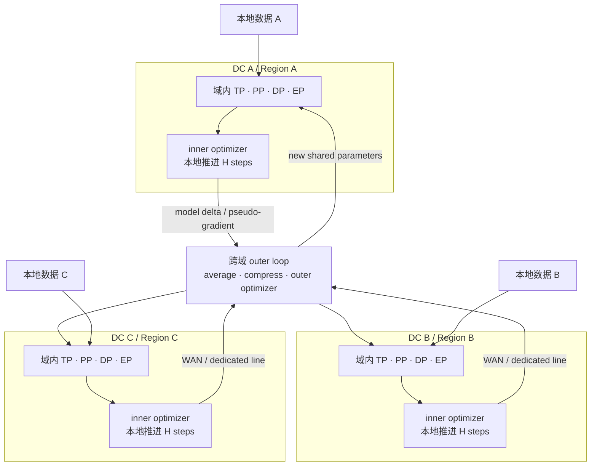
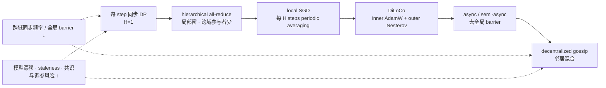

# L63 跨域与跨集群训练：把通信频率降下来

> [!abstract] 本课速览
> 读完你将能够：
> 1. 从电力、GPU 供给与数据主权解释为什么训练会跨 cluster、region 和 cloud；
> 2. 用带宽、RTT 和 $\alpha$-$\beta$ 模型判断 TP、EP、DP、PP 哪些维度能跨 WAN；
> 3. 沿 hierarchical all-reduce → local SGD → DiLoCo → async/gossip 的谱系，写出每步等效跨域通信量；
> 4. 复算 70B BF16 梯度在 10 Gb/s 专线上的 112 s 同步账，并量化 $H$ 与压缩率的作用；
> 5. 区分跨 DC 训练与 federated learning，提出可由网络测量、调度或仿真验证的研究问题。
>
> 前置：[[L47 混合并行组装]] · [[L44 流水线并行]] · [[L41 数据并行与DDP]] · [[L30 无损网络与拥塞控制]] · 预计 55 分钟

## 论文里的这段话，你现在可能读不懂

> [!quote]
> “**Multi-datacenter training** replaces one tightly coupled accelerator island with several clusters connected through a **cross-region WAN dedicated line**. **Hierarchical all-reduce** still pays an inter-site synchronization, whereas **local SGD** uses **periodic averaging** and **DiLoCo** lets an **inner optimizer** run for $H$ steps before an **outer optimizer** consumes a pseudo-gradient. **Asynchronous training** or decentralized **gossip** removes the global barrier but introduces **staleness** and consensus risk; **gradient compression** reduces bytes at a possible convergence cost. The loop resembles **federated learning** and **FedAvg**, especially with **non-IID** data, but the trust model and systems bottleneck are different.”（改写自典型 geo-distributed training 与 federated optimization 表述）

这四句把设施、网络、优化器和联邦学习揉在了一起。先抓住一条主线：==跨域训练不是给原有 collective 换一根更长的网线，而是把“多久必须达成一次全局一致”变成算法参数==。

## 一、为什么一个大集群还不够

### 1.1 电力墙：GPU 能买到，供电与并网不能瞬移

**power wall**（电力墙）不是一个全行业统一的瓦数上限，而是某个园区在供电、变电、并网、冷却和建设周期上的综合容量边界。[[L27 走进AI数据中心]] 已经看到：rack 里还有 U，不代表还能供电和散热。

用 [[03 约定与符号]] 的教学口径感受线性增长。若一台 8×H100 节点约 10 kW，PUE 取 1.2：

- 100,000 张 GPU 是 $100{,}000/8=12{,}500$ 台节点，IT 功率约 $125$ MW，设施输入约 $125\times1.2=150$ MW；
- 1,000,000 张 GPU 则把同一估算推到约 $1.5$ GW。

这不是某个真实项目的电表读数，而是统一节点口径下的容量量级。结论也不是“十万卡一定跨域”，而是：规模每扩大十倍，电力、冷却和故障爆炸半径也近似扩大十倍；当单址扩建跟不上时，多址成为现实选项。

### 1.2 供给与主权：有卡的地方，不一定是数据能去的地方

第二个动机是 GPU 供给和地缘约束。组织可能从多个 cloud、availability zone 或自建站点拼资源；这些资源不会自动落在同一个低时延 fabric 里。第三个动机是数据驻留、隐私或合规：某地的数据可能只能在本地处理，能跨边界的是模型更新，而不是原始样本。

于是出现 **multi-datacenter training**（多数据中心训练）：一个训练任务跨越多个物理数据中心或独立 cluster；若边界跨越云厂商定义的 region，则属于 **cross-region**（跨地域）训练。连接这些站点的是 **WAN**（Wide Area Network，广域网）；工程上常采购有带宽与服务保障的 **dedicated line**（专线），但“专用”不等于零抖动、零故障或免费。

可以把它看成“scale-out 的再 scale-out”：每个 DC 内仍运行 [[L47 混合并行组装]] 的 TP/PP/DP/EP，DC 之间再套一个低频外环。

图中的 outer loop 是逻辑角色，不一定是一台中心 server：它可以由 coordinator 实现，也可以由跨域 all-reduce 或 peer-to-peer mixing 完成。真正的问题是它发送什么、多久发送一次、谁必须等谁。

> [!tip] 直觉：三个厨房，一本总菜谱
> 每个 DC 像一间设备齐全的厨房，域内可以高速协作。跨域若每切一片菜都打视频确认，RTT 会把工作拖死；更合理的办法是各厨房先按共同菜谱做一批，再交换修改意见并更新总菜谱。

## 二、WAN 的物理账：为什么朴素同步先被判死刑

### 2.1 比较前先对齐端点和时延口径

下表只使用 [[03 约定与符号]] 的统一量级。DC 内“一张 400G 端口”和“一台 8×400G 节点的汇聚能力”不是同一个分母；RDMA 单向时延和 WAN RTT 也不是同一个指标，所以不能只说“差很多”而不写口径。

| 维度 | 集群内 scale-out 教学口径 | 跨地域专线教学口径 | 读法 |
|---|---:|---:|---|
| 单端口带宽 | 400 Gb/s = 50 GB/s，每方向 | 10–100 Gb/s = 1.25–12.5 GB/s，常为站点共享 | 单端口比约 4–40× |
| 8-GPU 节点汇聚能力 | 8×400G = 3.2 Tb/s，每方向 | 10–100 Gb/s 站点链路 | 端点汇聚比约 32–320× |
| 固定时延参考 | DC 内 collective $\alpha\sim10\ \mu\text{s}$ | RTT 10–100 ms | 用于代价模型时约差 $10^3$–$10^4$× |
| 共享与费用 | 后端网仍可能拥塞 | 带宽常跨任务共享、可能按流量或容量计费 | 平均带宽不能替代 p99/jitter |
| 故障边界 | link、switch、rack、pod | carrier、region、海缆/长途路径等更大故障域 | 重试不一定能绕开相关故障 |

带宽差并非固定“2–3 个量级”：节点汇聚能力对 10 Gb/s 是 $320\times$，对 100 Gb/s 是 $32\times$。固定时延则可用 $\alpha\sim10\ \mu\text{s}$ 对 WAN RTT 10–100 ms，得到明确的 $10^3$–$10^4$ 倍量级。更麻烦的是 jitter：同步训练的 step time 由最慢域决定，偶发慢包会被全局 barrier 放大。

### 2.2 出域体检：先问“传什么、传多频繁、谁等谁”

| 并行维度 | 跨域主要消息 | 频率与依赖 | 体检结论 |
|---|---|---|---|
| TP | activation 规模 collective | 每层多次，紧邻下一算子 | **基本不可行**：高频、强同步、对 RTT 极敏感 |
| EP | token dispatch/combine all-to-all | 每个 MoE 层，消息不均且时延敏感 | **基本不可行**：WAN 同时放大 all-to-all 与负载不均 |
| DP | 参数梯度或参数分片 | 通常每 optimizer step | **垂危**：70B 级更新本身就是百 GB 量级 |
| PP | stage 边界 activation/gradient P2P | 每 micro-batch、相邻 stages；可形成计算窗口 | **有条件能活**：消息远小于全模型更新，但怕 bubble、jitter 与 stage 失衡 |

为什么 PP 是意外的幸存者？[[L44 流水线并行]] 已推导边界消息 $n_{act}=b_{micro}Sd\times2$ B。沿用那里的 70B 教学例：$b_{micro}=1,S=8192,d=8192$，一次 BF16 activation 是 134.2 MB。在 10 Gb/s 专线上，忽略协议和拥塞的单向 payload 下界是

$$
T_{PP,wire}=\frac{134.2\ \text{MB}}{1.25\ \text{GB/s}}\approx0.107\ \text{s}.
$$

这仍然很慢，却比后面 140 GB 的梯度同步小约三个量级，还可让其他 micro-batches 的 stage 计算尝试覆盖它。近年的 [SWARM Parallelism](https://proceedings.mlr.press/v202/ryabinin23a.html) 就把临时随机流水线用于低带宽、异构和不可靠节点。这里的“能活”只表示值得设计：长序列会放大 activation，多条边界和 backward 还会重复传输，WAN jitter 也会把气泡沿流水线级联。

> [!example] 算一算：70B 梯度每 step 跨域同步要多久
> 题设全部来自设计稿与 [[03 约定与符号]]：两个 DC，$p=2$；10 Gb/s 专线按 SI 换成
>
> $$
> B_{WAN}=10/8=1.25\ \text{GB/s}.
> $$
>
> 70B 参数的 BF16 梯度消息为
>
> $$
> n=70\times10^9\times2\ \text{B}=140\ \text{GB}.
> $$
>
> ring all-reduce 每个 rank 发送 $2n(p-1)/p$，并接收同样字节。$p=2$ 时，每端发送量与接收量各为
>
> $$
> V_{round}=\frac{2n(p-1)}p
> =\frac{2\times140\times(2-1)}2
> =140\ \text{GB}.
> $$
>
> 假设专线全双工、两个方向可同时跑满，完成时间由任一方向的 140 GB 决定；忽略协议、RTT、抖动和拥塞的 payload 下界为
>
> $$
> T_{sync}\ge\frac{140\ \text{GB}}{1.25\ \text{GB/s}}=112\ \text{s}\approx1.87\ \text{min}.
> $$
>
> 这还只是一次 step 的通信下界。把 NCCL 的同步 DP 原样搬上 WAN，计算再快也要等接近两分钟，方案已经失去训练吞吐意义。

### 2.3 hierarchical all-reduce 先救拓扑，但还没救频率

**hierarchical all-reduce**（分层 all-reduce）先在 DC 内 reduce/reduce-scatter，再让少量 leaders 或 lanes 跨域规约，最后在域内 broadcast/all-gather。它让高频局部流量留在快网，也减少跨域参与者与连接数。

但别误读成“有 8 张卡，跨域向量就自动缩成 $1/8$”。如果两个 DC 最终都要得到完整的全局平均梯度，跨域语义 payload 仍是一个完整 $n$；hierarchy 首先优化路径和并发形状。若它每 step 都做一次跨域同步，112 s 的带宽主项仍在。要继续活下去，必须降低 **communication frequency**（通信频率）。

## 三、通信稀释谱系：同步少一点，优化风险多一点

令 $p_D$ 是 DC 数，$H$ 是两次跨域同步之间的本地 optimizer steps。一次完整更新的每端发送量为

$$
V_{round}=\frac{2n(p_D-1)}{p_D},
$$

接收量相同；以本地 step 为分母的摊销发送量则是

$$
\bar V_{step}=\frac{V_{round}}{H}.
$$

这就是本课最重要的杠杆：把 $H$ 从 1 提到 500，跨域频率从“每 step 一次”降为“每 500 steps 一次”。代价是各域模型在同步前会走向不同位置。

这条轴不是“越往右越先进”。每档是在通信、等待、收敛和故障恢复之间换税种。

### 3.1 local SGD：各跑 $H$ 步，再周期平均

**local SGD**（本地 SGD）让各 worker/domain 从同一参数出发，在本地数据上独立更新 $H$ 步，再平均模型或等价更新；这个同步动作叫 **periodic averaging**（周期平均）。[《Local SGD Converges Fast and Communicates Little》](https://openreview.net/forum?id=S1g2JnRcFX)给出了经典理论分析，但论文的凸优化结论不能直接当作任意 LLM、任意 $H$ 的质量保证。

local SGD 把跨域摊销量降到 $V_{round}/H$，却引入 worker drift：$H$ 越大，各域看到的样本越不同，参数轨迹越可能分叉。评估时不能只报“通信少了多少”，还要比较达到同一 validation loss 所需的 tokens、steps 和 wall-clock；若多跑了很多 token 才追平，省下的 WAN 可能被计算税吃回去。

### 3.2 DiLoCo：把周期平均升级成双优化器

**DiLoCo**（Distributed Low-Communication）保留“本地多步、低频跨域”的骨架，但明确分成两层优化：

1. 每个域用 **inner optimizer**（内层优化器）AdamW，从共享参数 $\theta_t$ 出发训练 $H$ 步，得到 $\theta^{(i)}_{t,H}$；
2. 用起点与终点差构造该域的 pseudo-gradient，例如 $\Delta_i=\theta_t-\theta^{(i)}_{t,H}$；
3. 聚合 $\bar\Delta$ 后，由 **outer optimizer**（外层优化器）Nesterov momentum 更新下一轮共享参数。

[《DiLoCo: Distributed Low-Communication Training of Language Models》](https://arxiv.org/abs/2311.08105)在其 C4 实验中使用较大的 inner-step 数，并报告 8 workers 下相较全同步优化通信少 500×而效果相当。这个结果证明机制有潜力，不是“任何模型都可把 $H$ 设为 500”的定律；outer learning rate、momentum、数据划分、warmup 和参与域数都要重新验证。

**OpenDiLoCo** 是 DiLoCo 的开源复现与分布式框架；其报告包含跨两洲、三个国家的训练实验，并研究了 worker 数与低精度通信。[OpenDiLoCo 论文](https://arxiv.org/abs/2407.07852)进一步把原论文算法变成可检查的系统实现。**INTELLECT** 是 Prime Intellect 的全球协同训练项目；[《INTELLECT-1 Technical Report》](https://arxiv.org/abs/2412.01152)记录了 10B 模型跨三洲、动态节点参与的训练，并组合 DiLoCo、FSDP2 与压缩通信。认这两个名字，是为了知道“洲际训练”已有公开系统证据；它们的环境与结果不能直接外推到任意专线和模型。

### 3.3 async：不等最慢者，但旧更新会回来

**asynchronous training**（异步训练）取消逐轮全局 barrier：worker 读一个参数版本，计算完就提交更新；coordinator 不必等所有人。[[L41 数据并行与DDP]] 中 parameter server 的“幽灵”因此回归，伴随的核心量是 **staleness**（陈旧度）——某更新所基于的参数版本落后于当前全局版本多少。

半异步方案可以设置时间窗、最少参与数或最大 staleness，拒绝太旧的 update。它主要减少 straggler 等待，==不会自动减少字节==；若每个 worker 仍以原频率上传完整梯度，WAN 账仍然难看。异步还改变了更新顺序和有效权重，故障恢复时必须决定迟到更新是丢弃、降权还是重算。

### 3.4 decentralized/gossip：没有中心，不代表没有共识成本

**decentralized training**（去中心化训练）不依赖单个 parameter server；各域在通信图上与邻居交换并混合模型。**gossip**（流言式传播）让局部信息像“你告诉两个朋友、朋友再告诉别人”一样扩散，最终趋向共识。[异步去中心化 SGD 的代表工作](https://proceedings.mlr.press/v80/lian18a.html)展示了它在异构环境中的系统潜力。

gossip 能绕开中心瓶颈，并允许拓扑跟随真实 WAN 连接；但每轮只看邻居，信息需要多轮才能传遍全图。稀疏图减少单轮 fan-out，却可能降低 mixing speed；站点掉线还会改变图连通性。研究时要同时报告 per-link bytes、全网总 bytes、达到共识/目标 loss 的轮数和故障下连通性，不能只说“没有 all-reduce 所以通信更少”。

> [!example] 算一算：$H$ 与 4× 压缩怎样把 112 s 摊薄
> 沿用上一节的两个 DC、10 Gb/s、$n=140$ GB，先忽略重叠与额外元数据。
>
> | 方案 | 跨域周期 | 每次每端发送 payload | 单次线速下界 | 摊到每个本地 step |
> |---|---:|---:|---:|---:|
> | 同步 DP | $H=1$ | 140 GB | 112 s | 112 s/step |
> | local SGD | $H=500$ | 140 GB | 112 s | $112/500=0.224$ s/step |
> | DiLoCo + 题设 4× 压缩 | $H=500$ | $140/4=35$ GB | $35/1.25=28$ s | $28/500=0.056$ s/step |
>
> 所以设计稿中的约 0.22 s 与约 0.06 s 都能独立复算。这里的“摊销”是 network-time equivalent：阻塞式 periodic averaging 仍会每 500 步出现一次 112 s 或 28 s 的停顿；只有实现允许 outer communication 与本地计算并发、且不会造成错误参数版本时，部分时间才可被隐藏。真实链路还要加协议效率、RTT、抖动、共享拥塞、压缩/解压和失败重传，因此表中都是乐观下界。

## 四、通信压缩：与降频正交的第二根杠杆

**gradient compression**（梯度压缩）减少一次同步携带的字节；local SGD/DiLoCo 减少同步次数。两者正交，所以理想的等效摊销量可以写成

$$
\bar V_{step}=\frac{V_{round}}{Hq},
$$

其中 $q$ 是端到端有效压缩倍数。注意是“有效”：索引、scale、padding、collective 类型变化和压缩 kernel 都要算进去。

| 工具 | 机制 | 省下什么 | 主要收敛/系统税 |
|---|---|---|---|
| **Top-K sparsification** | 每轮只发送绝对值最大的 $K$ 个 gradient 坐标 | 大量近零元素不上传 | 还要传 indices；各 rank 的 Top-K 不同，聚合未必能走高效 all-reduce |
| **error feedback** | 保存“原更新 − 已发送更新”的 residual，下轮加回再压缩 | 不直接省字节，而是偿还有偏压缩丢掉的信息 | 多一份 residual 状态；只能缓解误差，不能免做收敛验证 |
| 量化通信 | 把 BF16/FP32 update 映射到更少 bit，并附 scale | 降低每个元素位数 | scale、outlier、reduce 精度与量化 kernel 成本；见 [[L49 混合精度与FP8训练]] |
| **PowerSGD** | 对矩阵梯度做低秩近似 $G\approx PQ^T$ | 从 $mn$ 个元素降到约 $r(m+n)$ 个元素 | 低秩计算与 residual 占资源；小矩阵或高 rank 时收益变差 |

Top-K 是 **Top-K sparsification**（Top-K 稀疏化）的典型做法；它很直观，却不能把“保留 1% 坐标”直接写成 100× 加速，因为 value 之外还有 index，且 all-gather 可能替代更可扩展的 all-reduce。**error feedback**（误差反馈）会把本轮未发送的 residual 累到下轮；[ICML 2019 的分析](https://proceedings.mlr.press/v97/karimireddy19a.html)说明它为何能修复一类有偏压缩器，但工程上仍需检查额外显存与 kernel。

**PowerSGD** 是基于 power iteration 的低秩 gradient compressor。[NeurIPS 2019 论文](https://proceedings.neurips.cc/paper/2019/hash/d9fbed9da256e344c1fa46bb46c34c5f-Abstract.html)的关键系统点不只在“低秩”，还在压缩表示可用 all-reduce 聚合。对一个 $m\times n$ 矩阵，用 rank $r$ 的两个因子传约 $r(m+n)$ 个元素；当 $r(m+n)\ll mn$ 才真正划算。

评价“压缩率 vs 收敛税”至少同时看六项：wire bytes、collective 完成时间、暴露在关键路径上的通信、压缩/解压计算、达到同一 loss 的 tokens/wall-clock、最终质量。只报 tensor 从 BF16 变 INT8，等于只看账单上的单价，不看数量与附加费。

## 五、与联邦学习同宗，但不是同一个问题

**federated learning**（联邦学习）让多个数据持有方在不汇集原始数据的情况下协同训练共享模型。经典 **FedAvg**（Federated Averaging，联邦平均）让选中的 clients 做若干本地 SGD steps，再按本地样本量加权平均模型更新。[原始 FedAvg 论文](https://proceedings.mlr.press/v54/mcmahan17a.html)把通信、设备参与和去中心化数据放在同一问题里。

它和 local SGD 有共同计算骨架：本地多步 → 周期平均。区别在于联邦场景天然面对 **non-IID**（非独立同分布）数据——不同 client 的样本分布、数量和标签比例可能明显不同；跨 DC 预训练则常有机会主动打散全局语料，但数据主权也可能让地域数据变成 non-IID。

| 维度 | 跨 DC / 跨集群训练 | 经典 federated learning |
|---|---|---|
| 参与者 | 少量、强算力、专业运维的 cluster/domain | 大量可能离线、算力与网络异构的 clients 或机构 |
| 信任模型 | 常属同一组织或合同信任域，仍要隔离故障与凭据 | 原始数据不出端，常需 secure aggregation、隐私与抗恶意机制 |
| 数据分布 | 可主动做近 IID sharding，也可能受驻留规则约束 | non-IID、unbalanced 往往是问题定义的一部分 |
| 主要瓶颈 | WAN 带宽/RTT/jitter、流量费用、跨域 barrier | client uplink、在线率、电量、隐私、抽样与 straggler |
| 参与方式 | 域较稳定，但 region/专线会故障 | partial participation 常态，clients 动态加入离开 |
| 系统目标 | 训练吞吐、time-to-loss、成本与故障生存性 | 在数据不汇集约束下取得效用、公平性、隐私与通信效率 |

所以“跨 DC 训练 ≈ 数据中心版联邦”是有用类比，不是等号。对本课程的 MLSys × 网络方向，FL 文献中的 local update、partial participation、压缩、异步、secure aggregation 和 client selection 都是机制弹药；若工作只改 FedAvg 的收敛定理或模型精度、没有落到真实分布式基础设施，就不自动成为我们的主线。

## 六、与研究的连接：把 WAN 变成优化变量

### 6.1 拓扑与带宽感知的任务切分

现实不是“所有 DC 各放一份同构 replica”。域 A 可能卡多但 WAN 窄，域 B 卡少但靠近数据，域 C 只能在特定时段参加。系统要联合决定：每域内部的 TP/PP/DP/EP，跨域是 PP 边界还是 outer replica，$H$、压缩率 $q$、同步时刻与路由走哪条专线。

可以把目标写成：在达到同一 target loss 和数据策略约束下，最小化

$$
T_{train}+\lambda C_{WAN}+\mu P_{failure},
$$

其中 $C_{WAN}$ 是跨域容量/流量成本，$P_{failure}$ 代表故障导致的额外训练损失或 SLO 风险。真正困难的是 $H$ 与 $q$ 会反过来改变收敛速度，不能把它们只当网络旋钮。

### 6.2 跨域故障隔离与重新加入

若一个 DC 掉线，系统有三种基本选择：全局暂停等恢复；以更少 domains 继续，并调整 outer update 权重；从 checkpoint 在替代站点恢复。继续训练时还要回答：失联域回来后拿哪个参数版本？旧 pseudo-gradient 是否丢弃？数据是否因地域退出而改变分布？这把 [[L53 大规模训练可靠性]] 的 checkpoint、blast radius 和 recovery 问题推进到 region 级。

### 6.3 流量工程与计费优化

outer synchronization 会让多个站点同时发送大流，容易形成周期性 burst。网络侧可以研究：按实时可用带宽调整 $H$，把 outer updates 分块/错峰，做多路径 traffic engineering，在训练进度和 WAN 费用之间调度。专线“有 100G”不代表训练独占 100G；测量平均吞吐、p99 RTT、jitter、loss/retransmission 和共享流量，才有论文所需的证据链。

### 6.4 没有三洲 GPU，也能评估

[[L67 测量仿真与评测]] 会系统讲评估方法。L63 的可行路径已经很清楚：

1. 用小规模 testbed/prototype 测 inner compute、压缩 kernel、outer sync payload 与恢复逻辑；
2. 用 bandwidth/RTT/jitter/failure traces 驱动多域仿真，比较同步、local SGD、DiLoCo 与 async/gossip；
3. 用公开训练 loss 曲线或缩小模型做算法校准，避免仿真只算网络、不检查收敛；
4. 做敏感性分析：DC 数、$H$、$q$、数据 heterogeneity、link failure 和计费函数逐项变化。

这是很典型的系统研究闭环：小实验校准机制，仿真扩规模，算法指标与网络指标一起报告。

> [!warning] 四个常见误区
> 1. **“跨域训练就是把 NCCL 跑在 WAN 上。”** 朴素 70B 同步的 payload 下界已是 112 s/step；必须改变同步频率、payload 或并行映射。
> 2. **“local SGD 掉点，所以没用。”** 收敛差异要换算成 time-to-target 与总成本；问题是优化税率，不是只看相同步数的单点 loss。
> 3. **“压缩 4× 就加速 4×。”** 只有网络带宽主导且压缩 kernel、元数据、collective 变化与收敛税可忽略时才接近线性。
> 4. **“联邦学习与数据中心训练无关。”** 问题边界不同，但 local update、partial participation、压缩和异步机制可以直接借鉴。

## 回到开头那段话

第一句说的是设施与网络边界：multi-datacenter training 把一个紧耦合 GPU island 拆成多个 cluster；cross-region WAN/dedicated line 提供连接，却只有 10–100 Gb/s、10–100 ms RTT 的教学量级，不能当作域内 fabric。

第二句讲同步频率：hierarchical all-reduce 能让域内通信保持稠密、减少跨域参与者，但完整全局更新的语义 payload 还在；local SGD 用 periodic averaging 把频率降为每 $H$ steps 一次，DiLoCo 再用 inner AdamW 生成 pseudo-gradient，由 outer Nesterov 处理域间更新。

第三句讲另一种换法：asynchronous training 和 decentralized gossip 减少全局 barrier，却带来 staleness、mixing 与故障重入问题；gradient compression 则减少每次 bytes，但要支付压缩 kernel、元数据和可能的 convergence tax。

第四句把血缘理清：FedAvg 与 local SGD 都是“本地多步再平均”，non-IID 数据会加剧 drift；但 federated learning 更强调数据不汇集、动态 clients 和隐私信任模型，跨 DC 训练则更强调 WAN、训练吞吐、费用与 region 级生存性。现在你应该能把开场整段压成一个研究问题：==在给定 WAN 和故障条件下，用同步频率、更新表示与任务映射，换取可接受的 time-to-loss。==

## 术语卡片

| 术语 | 中文 | 一句话解释 |
|---|---|---|
| multi-datacenter training | 多数据中心训练 | 一个训练任务跨越多个物理数据中心或独立 cluster 共同推进。 |
| cross-region | 跨地域 | 通信或计算跨越云/基础设施定义的 region 边界。 |
| WAN | 广域网 | 连接远距离站点、带宽和时延显著不同于域内 fabric 的网络。 |
| dedicated line | 专线 | 为站点间提供约定容量和服务保障的 WAN 连接，但仍可能共享、抖动或故障。 |
| power wall | 电力墙 | 园区在供电、并网、冷却和建设周期上的综合容量边界。 |
| hierarchical all-reduce | 分层 all-reduce | 先域内聚合、再跨域规约、最后域内分发的层次化 collective。 |
| local SGD | 本地 SGD | 各 worker 独立更新多步后才平均参数或更新，以计算换通信轮次。 |
| periodic averaging | 周期平均 | 每隔 $H$ 个本地 steps 对各 worker 的参数或更新做一次平均。 |
| communication frequency | 通信频率 | 训练推进过程中执行跨 worker/domain 同步的频度，local SGD 中约为每 $H$ steps 一次。 |
| DiLoCo | 分布式低通信训练 | 用多步 inner optimization 与低频 outer optimization 训练弱互联模型副本的方法。 |
| inner optimizer | 内层优化器 | 在单个 domain 内连续执行 $H$ 步本地训练的优化器，DiLoCo 中为 AdamW。 |
| outer optimizer | 外层优化器 | 聚合各域 pseudo-gradient 后更新共享参数的优化器，DiLoCo 中使用 Nesterov momentum。 |
| OpenDiLoCo | OpenDiLoCo | DiLoCo 的开源复现与全球分布式训练框架。 |
| INTELLECT | INTELLECT 全球协同训练项目 | Prime Intellect 公开的全球动态节点训练项目与技术报告谱系。 |
| asynchronous training | 异步训练 | worker 不经逐轮全局 barrier 即读取参数并提交更新的训练方式。 |
| staleness | 陈旧度 | 更新所基于的参数版本相对当前全局版本落后的程度。 |
| decentralized training | 去中心化训练 | 不依赖单个中心 server、由 peers 在通信图上协同优化的训练方式。 |
| gossip | 流言式传播 | 节点只与邻居交换并混合状态，让信息经过多轮扩散到全图。 |
| gradient compression | 梯度压缩 | 用稀疏化、量化或低秩表示减少训练更新的通信字节。 |
| Top-K sparsification | Top-K 稀疏化 | 只发送绝对值最大的 $K$ 个更新坐标及其索引。 |
| error feedback | 误差反馈 | 保存压缩残差并在后续更新中加回，以补偿有偏压缩的信息损失。 |
| PowerSGD | PowerSGD 低秩压缩 | 用 power iteration 得到低秩 gradient 因子，并以 all-reduce 友好的形式聚合。 |
| federated learning | 联邦学习 | 原始数据不汇集时，由多个 clients/机构协同训练共享模型的范式。 |
| FedAvg | 联邦平均 | clients 本地更新多步后按本地样本量加权平均模型更新的经典联邦算法。 |
| non-IID | 非独立同分布 | 不同参与方的数据分布、数量或标签比例存在系统性差异。 |

## 自测

1. power wall 为什么不是一个固定的“多少 MW”阈值？按统一口径，100,000 张 H100 的设施功率量级是多少？
2. 为什么“集群内与 WAN 带宽差 2–3 个量级”必须注明比较的是单端口还是节点汇聚？
3. 分别用消息大小、频率和依赖说明 TP、EP、DP 为什么难以出域，PP 为什么只是“有条件能活”。
4. 两个 DC、70B BF16 更新、10 Gb/s 专线时，若希望压缩后的摊销网络时间不超过 0.1 s/step，压缩率 $q=4$，至少要取多大的 $H$？
5. local SGD 与 DiLoCo 都降低 communication frequency；两者在 optimizer 结构上有什么差别？
6. asynchronous training、decentralized gossip 和 gradient compression 分别主要减少 barrier、中心依赖还是 payload？它们会自动减少总字节吗？
7. FedAvg 与 local SGD 的共同骨架是什么？为什么 non-IID、信任模型和参与方式让两者不能直接画等号？

> [!note]- 参考答案
> 1. power wall 取决于站点的供电、变电、并网、冷却和建设条件，不是模型常数。100,000/8=12,500 台节点；IT 功率约 $12{,}500\times10\ \text{kW}=125$ MW；PUE=1.2 时设施功率约 150 MW。
> 2. 一张 400G 端口对 10–100G WAN 是 4–40×；8×400G 节点汇聚对同一 WAN 是 32–320×。分母不同，量级结论也不同。
> 3. TP 每层多次 activation collective、EP 每 MoE 层做不均匀 all-to-all，都紧贴算子且怕 RTT；DP 每 step 交换模型规模更新，字节巨大；PP 只做相邻 stage 的 activation/gradient P2P，消息更小且有流水窗口，但仍受长序列、micro-batch 数、jitter、bubble 和 stage imbalance 限制。
> 4. 未压缩同步下界是 112 s，压缩后摊销为 $112/(Hq)$。要求 $112/(4H)\le0.1$，所以 $H\ge280$。
> 5. local SGD 通常直接对 $H$ 步后的模型/更新做 periodic averaging；DiLoCo 用 inner AdamW 产生 pseudo-gradient，再由 outer Nesterov momentum 更新共享参数，是显式双优化器。
> 6. async 主要去全局 barrier，gossip 去中心并改成邻居 mixing，compression 减少单次 payload。前两者若仍频繁传完整更新，不保证总字节下降；gossip 还可能因多轮 mixing 增加全网总量。
> 7. 共同骨架是“本地多步 → 周期聚合”。经典 FL 常面对 non-IID/unbalanced data、partial participation、弱设备和更强隐私/信任约束；跨 DC 参与者更少更强，主要矛盾常是 WAN、训练吞吐、费用和 region 故障。

## 延伸阅读

- [《DiLoCo: Distributed Low-Communication Training of Language Models》](https://arxiv.org/abs/2311.08105)（DeepMind，2023）：主读算法节，画出 inner/outer optimizer 与 pseudo-gradient 的数据流；实验数字只在其设定内解读。
- [《OpenDiLoCo: An Open-Source Framework for Globally Distributed Low-Communication Training》](https://arxiv.org/abs/2407.07852)（2024）：重点读开源实现、跨洲部署和 worker-scaling ablation，理解算法怎样变成系统。
- [《INTELLECT-1 Technical Report》](https://arxiv.org/abs/2412.01152)（Prime Intellect，2024）：选读 system architecture、elastic participation 与 communication 部分，把全球训练的失败路径列出来。
- [《SWARM Parallelism: Training Large Models Can Be Surprisingly Communication-Efficient》](https://proceedings.mlr.press/v202/ryabinin23a.html)（ICML 2023）：看低带宽、异构和可抢占节点上的随机 pipeline，补足“PP 为什么可能跨慢网”。
- [《Gaia: Geo-Distributed Machine Learning Approaching LAN Speeds》](https://www.usenix.org/conference/nsdi17/technical-sessions/presentation/hsieh)（NSDI 2017）：回看较早的 geo-distributed ML 如何用 approximate synchronization 抑制 WAN 流量；重点借机制，不把旧 workload 直接等同于 LLM 预训练。

---
上一课：[[L62 实践-跑起来一个推理服务]] ← · → 下一课：[[L64 边缘与端云协同]]
