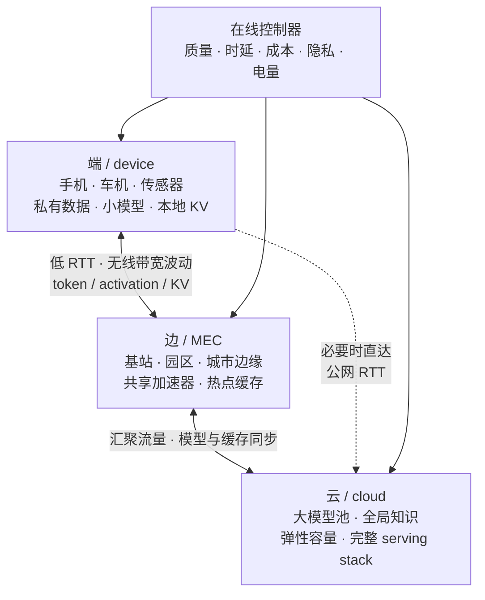
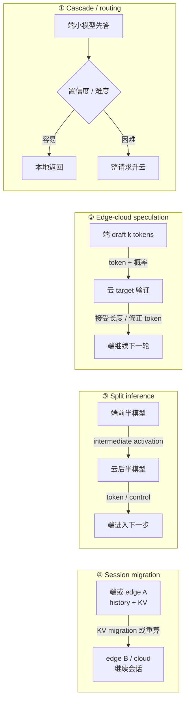
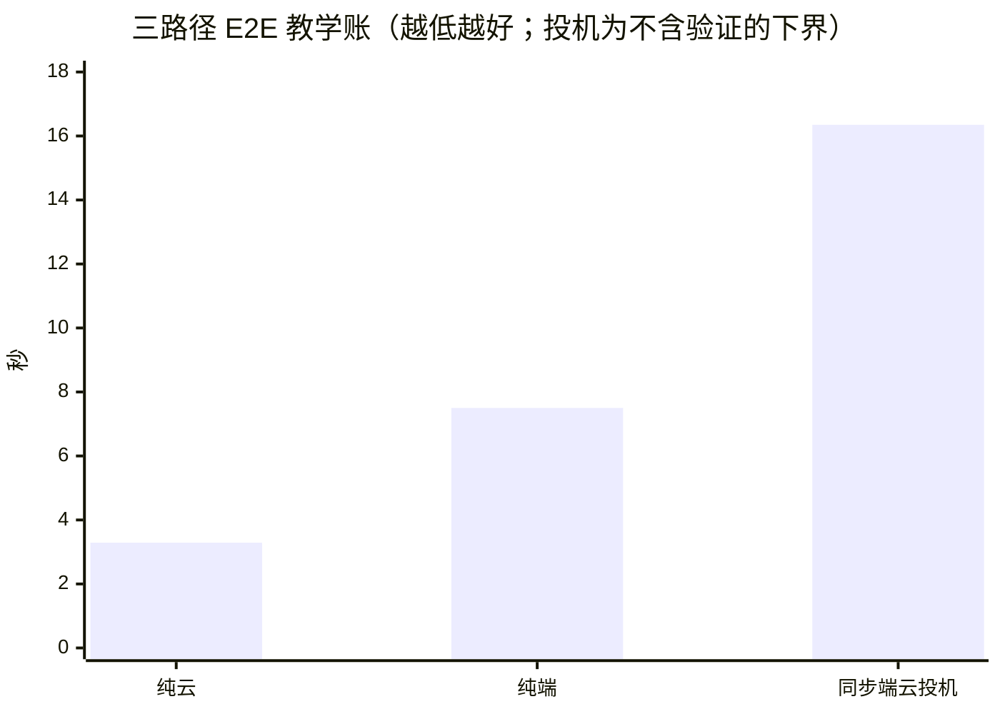

# L64 边缘与端云协同：把推理搬到用户旁边

> [!abstract] 本课速览
> 读完你将能够：
> 1. 用内存容量与带宽账判断手机能否装下、能以什么量级速度运行量化 LLM；
> 2. 区分 cascade、端云投机、split inference 与 KV migration，并为每种机制写出通信关键路径；
> 3. 复算 1K 输入、300 token 输出、50 ms RTT 场景下纯云、纯端与端云投机的时延和流量；
> 4. 把每请求 routing 与离线模型放置写成带质量、隐私和资源约束的优化问题；
> 5. 从弱网、移动性、多用户边缘资源和 SLO 评测中提出可验证的研究问题。
>
> 前置：[[L55 推理性能模型]] · [[L58 量化推理]] · [[L59 投机解码]] · [[L60 分布式推理与PD分离]] · 预计 50 分钟

## 论文里的这段话，你现在可能读不懂

> [!quote]
> “An **edge-cloud collaboration** system may use **routing** and a **model cascade** to keep easy requests on an **on-device LLM**, while offloading hard requests to the cloud. **Speculative edge-cloud inference** exchanges draft tokens instead of KV state, whereas **split inference** performs **intermediate activation transfer** across a model partition. Under mobility, **KV migration** can preserve **session continuity**, but the optimal policy still depends on a **quality-latency-cost tradeoff** under privacy and device-resource constraints.”（改写自典型 edge–cloud LLM inference 表述）

这四句列的不是四个同义词，而是四种完全不同的“端和云怎么分工”。本课始终用三个问题拆它们：==谁算、传什么、关键路径要过几次网==。不先回答这三个问题，“边云协同”就只是架构图上的一条箭头。

## 一、为什么不把所有请求都扔给云

### 1.1 四个收益，对着五个约束

**edge inference**（边缘推理）是在靠近数据产生者的位置运行模型；位置可以是手机、车机、摄像头，也可以是接入网或园区里的边缘服务器。若完整 LLM 直接驻留并运行在终端设备上，就是 **on-device LLM**（端侧大语言模型）。它吸引人的原因有四个：

| 动机 | 没有端侧能力会怎样 | 端侧带来的机会 |
|---|---|---|
| 时延 | 每次交互至少承受接入网和 WAN 的 RTT，弱网还会抖动、丢包 | 本地路径不受公网 RTT 下限约束 |
| 隐私 | prompt、照片、语音或业务上下文要离开设备 | 原始数据可以不出端，只输出必要结果 |
| 成本 | 每个 token 都消耗云侧算力，账单随请求量增长（见 [[L61 推理服务框架与集群]]） | 已购买的端侧算力可承担一部分工作 |
| 离线可用 | 断网时功能直接消失 | 飞行、隧道、灾害或园区断网时仍可服务 |

反方向也有五堵墙：算力、内存容量、内存带宽、电池功耗和持续散热。手机短时跑得快，不代表十分钟后不因温度降频；“装得下权重”也不代表还给 KV cache、runtime 和操作系统留下了空间。

端侧常用 **NPU**（Neural Processing Unit，神经网络处理单元）加速低精度张量算子。[[03 约定与符号]] 给旗舰手机的教学口径是 12–16 GB **unified memory**（统一内存）、LPDDR 约 50–100 GB/s、NPU 数十 TOPS（INT8）。unified memory 表示 CPU、GPU/NPU 等可在统一体系中共享内存资源与地址空间，==不表示 16 GB 全归模型，也不表示跨处理器访问没有同步和带宽代价==。NPU 的 TOPS 还必须与 dtype、算子覆盖和编译后端一起看；memory-bound decode 不能只按 TOPS 排名。

### 1.2 端、边、云不是三台大小不同的服务器

**edge-cloud collaboration**（端云协同）让终端、近端 edge 和远端 cloud 按请求或执行阶段分工。电信与接入网语境里的 **MEC**（Multi-access Edge Computing，多接入边缘计算）特指把云计算能力和 IT 服务环境部署到网络边缘；它比手机资源强、比远端云离用户近，但容量更小、用户移动会改变接入位置。

把任务移到别处执行叫 **computation offloading**（计算卸载）。经典 offloading 常把任务抽象成一次性的“输入上传 → 远端计算 → 结果下载”；LLM 多了自回归循环、KV 状态和流式输出，决策会反过来影响后续数百个 token，所以不能只套一次上传的旧公式。

## 二、端侧资源现实：小模型与低比特不是审美，是物理账

先取一个 3B 参数的 W4 模型。按 [[03 约定与符号]] 的 INT4 口径，权重部分约为

$$
W=3\times10^9\ \text{param}\times0.5\ \text{B/param}
=1.5\ \text{GB}。
$$

它能放进 12–16 GB unified memory，但 1.5 GB 只算权重：长上下文 KV、临时 activation、量化 scale、runtime 和其他应用仍要占容量。若单请求 decode 每步近似顺序扫一遍权重，沿用 [[L55 推理性能模型]] 的 weight-streaming 上限：

$$
q_{decode}\lesssim\frac{B_{mem}}{W}
=\frac{50\text{--}100\ \text{GB/s}}{1.5\ \text{GB}}
\approx33\text{--}67\ \text{tokens/s}。
$$

取整后就是设计稿的约 30–60 tokens/s 量级。这是忽略 KV 读取、kernel 效率、带宽争用和降频的乐观屋顶，不是某款手机的 benchmark。反过来看，若保持 3B 却用 BF16，权重会增到 6 GB，单是扫权重就把理论速度降到原来的约四分之一；于是“端侧 = 较小模型 + 极致量化”首先是容量与带宽的共同结果。

端侧软件栈先认三个名字：**llama.cpp** 是面向本地 LLM 推理的 C/C++ 工程与工具链；**MLC LLM** 用机器学习编译把模型部署到 Metal、Vulkan、WebGPU、iOS 和 Android 等平台；ExecuTorch 是 PyTorch 的 edge runtime，可经不同 backend 接入 CPU、GPU 或 NPU。生态碎片化的难点正在这里：同一个模型要面对不同算子覆盖、量化格式、内存布局、编译器和 thermal policy，桌面 GPU 上能跑的 graph 不会自动在每款 NPU 上高效运行。

> [!tip] 直觉：端侧像随身背包
> 1.5 GB 权重只是塞进去的一本书；KV、工作区和系统进程也是行李。背包标称 16 GB，不等于你能把 16 GB 全塞给这本书，更不等于跑起来不会发热。

## 三、协同模式谱系：谁算、传什么、过几次网

### 3.1 Model cascade：先让便宜模型答，困难请求再升云

**model cascade**（模型级联）先调用较小、较便宜的模型，再把不确定或高难请求交给更强模型。这里的 **routing (model selection)**（路由，模型选择语义）不是选哪台同构实例，而是选哪个模型、在哪个位置执行。router 可看任务类型、置信度、历史错误、网络状态、电量和隐私标签。

若本地模型处理时间为 $T_s$，难题比例为 $p$，升云附加时间为 $T_c$，则最简单的期望时延是 $T_s+pT_c$。$p$ 小时可省大量云调用；若置信度未校准，错误请求不会升云，账面时延很好、质量却先坏掉。router 本身因此就是可训练、可校准、也必须做安全评测的研究对象。

### 3.2 端云投机：传 token 很省，但每轮 RTT 可能很贵

**speculative edge-cloud inference**（端云投机推理）把 [[L59 投机解码]] 的 draft 放在端侧、target verifier 放在云侧。端通常传候选 token 和必要的 draft probability，云返回接受长度与修正 token；它不搬完整模型，也不搬层级 activation 或 KV，所以 payload 可做到很小。

但 token 小只消掉了带宽项，没有消掉 RTT。同步协议每轮都要“端写草稿 → 上云 → target 验证 → 回端”，$N_r$ 轮就会支付约 $N_r$ 次 RTT。流水化可以让下一轮 drafting 与上一轮验证重叠，却仍受较慢分支约束；开放云 API 若没有 verifier-only 接口，也不能把普通 completion API 当成逐轮验证器。

### 3.3 Split inference：切模型，交换的却不是模型

**split inference / model partitioning**（切分推理 / 模型切分）把连续层或模块分放在端和云。端执行前半段后做 **intermediate activation transfer**（中间激活传输），云从切点继续算。CNN 的某些中间层可能形成压缩 bottleneck；decoder-only LLM 的 hidden state 通常并不小，而且每个新 token 都会再次跨切点。

用 [[03 约定与符号]] 的 Llama-3-8B 教学宽度 $d=4096$，1K token 的 BF16 切点 activation 为

$$
V_{act}=S\times d\times2\ \text{B}
=1000\times4096\times2
=8.192\ \text{MB}。
$$

若网络只有 20 Mb/s = 2.5 MB/s，单次上传的 payload 下界已经是

$$
T_{act,up}\ge\frac{8.192}{2.5}\approx3.28\ \text{s}。
$$

而把 1K 个 token ID 按本课 4 B/token 的教学协议代理量上传，只需 4 KB，payload 时间约 1.6 ms；前者字节约是后者的 2,048 倍。之后每个 decode token 还会产生 $d\times2=8.192$ KB activation，并可能支付一次交互 RTT。除非切点有强压缩、链路很近、执行能批量化或隐私收益足够大，LLM split 往往不如 CNN 时代直观。

### 3.4 KV migration：让会话跟着用户走

**KV migration**（KV 迁移）把已有 KV cache 从端、边缘节点或云实例搬到新执行位置；目标是保持 **session continuity**（会话连续性），即用户切网、移动或故障切换后不用丢掉多轮上下文。选择不只在“迁或不迁”之间：还可传原始 token/history 在目标处重做 prefill，或把冷热 KV 分层搬运。[[L60 分布式推理与PD分离]] 已经给出 KV 传输与重算的判据，端云场景还要把公网 RTT、隐私和移动停留时间加入判断。

RAG 也可以按同一张表拆：私有文档在端侧检索、只把选中片段交给云生成；或云维护大索引，端只做 query rewrite 与最终过滤。不要问“RAG 在端还是云”，要问 embedding、index、retrieval、rerank、generation 各自放哪里、跨边界传什么；新负载细节留到 [[L70 选修-多模态与新负载]]。

## 四、算一算：同一请求，三条路径谁赢

> [!example] 算一算：1K 输入、300 输出、50 ms RTT
> 设计稿给定：输入 $S=1000$ tokens、输出 $O=300$ tokens、RTT = 50 ms、上行 20 Mb/s、端侧 3B-W4 生成 40 tokens/s。为闭合算式，再加入四个==教学场景输入==，不把它们当成硬件 benchmark：下行也取 20 Mb/s；协议 payload 用 4 B/token ID 代理；云侧首 token 计算为 0.25 s、之后输出 100 tokens/s；端云投机沿用 [[L59 投机解码]] 的 $k=4,\alpha=0.7$。忽略 JSON/TLS/header、排队、丢包和重传。
>
> **纯云。** 输入上传为 $1000\times4=4$ KB，输出为 $300\times4=1.2$ KB；20 Mb/s = 2.5 MB/s，因此上下行 serialization 分别约 1.6 ms 和 0.48 ms。按 TTFT 已含第一个 token 的口径：
>
> $$
> T_{cloud}\approx0.0016+0.050+0.250+\frac{299}{100}+0.00048
> \approx\boxed{3.29\ \text{s}}。
> $$
>
> 逻辑 token payload 合计 5.2 KB。真实文本、tokenizer 和协议编码会改变字节数；这里的价值是说明小文本请求通常先怕 RTT、排队和生成，而不是 20 Mb/s 的 payload serialization。
>
> **纯端。** 只算 300 个输出 token 的 decode：
>
> $$
> T_{device}\ge\frac{300}{40}=\boxed{7.5\ \text{s}}。
> $$
>
> 它没有网络流量，但 7.5 s 还没加本地 prompt prefill，所以是 decode-only 下界；同时它输出的是 3B 模型质量，不能与云 target 的质量画等号。
>
> **同步端云投机。** 一轮期望产出沿用 L59：
>
> $$
> E[Y]=1+\alpha+\alpha^2+\alpha^3+\alpha^4
> =1+0.7+0.49+0.343+0.2401=2.7731。
> $$
>
> 完成 300 tokens 约需 $N_r=\lceil300/2.7731\rceil=109$ 轮。端每轮写 4 个 draft，要 $4/40=0.1$ s；即使把云验证和 transmission 都当成 0，同步关键路径仍有
>
> $$
> T_{spec,sync}>109\times(0.1+0.05)=\boxed{16.35\ \text{s}}。
> $$
>
> 若每个候选用 4 B token ID + 4 B probability，云回 4 B accepted length + 4 B corrected token，则紧凑协议代理量为 $109\times[4\times(4+4)+8]=4.36$ KB。==它的流量比纯云代理量还小，时延却更差：输在 109 次 RTT，不是输在 bytes。==理想流水化把 draft 与网络分支重叠，也仍有约 $109\times\max(0.1,0.05)=10.9$ s 的下界，且没算 verification、启停和错误草稿浪费。

这不是“端云投机没用”的结论，而是一张相图的一个点。谁赢由下列边界移动：

| 条件 | 更可能占优的路径 | 原因 |
|---|---|---|
| 强隐私、离线、3B 质量够用 | 纯端或端侧 cascade | 不出网，云成本为零 |
| 云 target 快、RTT 可接受、质量要求高 | 纯云 | 少量文本只付一次请求往返 |
| easy request 比例高 | cascade | 大部分请求不升云，少数难题保质量 |
| verifier API 可用、RTT 低、云侧 AR 慢或 server draft 已成瓶颈 | 端云投机 | 端 draft 换 target calls 或云容量 |
| 近端链路快、切点强压缩、隐私要求不传原文 | split | activation 账和多轮 RTT 才可能收回 |
| 用户移动、目标节点已有模型且重算慢 | KV migration | 搬状态换掉重复 prefill |

> [!warning] 三个常见误区
> 1. **“端侧模型没用。”** 它可直接回答、做 cascade router、draft、隐私过滤或离线 fallback；价值不只由单模型榜单决定。
> 2. **“Split inference 一定更隐私、更省流量。”** activation 可能被反演，也可能远大于 token；先写 threat model，再算切点字节与往返次数。
> 3. **“边缘就是小一号的云。”** edge 的接入位置、无线波动、容量、移动性、故障域和多租户到达过程都不同，不能照搬云内调度器的假设。

## 五、把“走端还是走云”写成优化问题

令每个请求可选动作 $x\in\{\text{device},\text{edge},\text{cloud},\text{cascade},\text{speculative},\text{split},\text{migrate}\}$。一个最小骨架是

$$
\min_x\ \mathbb E[T(x)]+\lambda C_{cloud}(x)+\mu E_{device}(x)
$$

subject to

$$
Q(x)\ge Q_{min},\quad
P_{privacy}(x)\le P_{max},\quad
M_{device}(x)\le M_{free},\quad
\Pr[T(x)\le T_{SLO}]\ge\eta。
$$

这就是 **quality-latency-cost tradeoff**（质量—时延—成本权衡）：不能只把平均时延最小化，而要说明质量如何量、云价怎么算、端侧能耗与温度是否进目标、隐私是硬约束还是罚项。

问题天然分两层：

- **在线决策**：每请求 routing、是否升云、speculation length $k$、在哪个 edge 接入、迁 KV 还是重算；输入包含任务特征、置信度、RTT、带宽、队列、cache hit、剩余电量和温度。
- **离线决策**：模型版本/量化档放在哪些设备与边缘站点，模型在哪里更新，哪些 KV 或 RAG index 预置，容量和隐私域怎样规划。

传统 MEC offloading 的队列、无线信道、能耗和 mobility 模型仍然有用；新的部分是 LLM 的请求成本随输入/输出长度变化，自回归状态让本轮 placement 绑定后续决策，质量还会随模型选择、量化和 cascade 阈值变化。旧知识没有过时，只是状态空间变大了。

## 六、现实系统与研究入口

### 6.1 Apple Intelligence：双层不是一句“敏感任务本地跑”

Apple 2024 年公开的架构是很清楚的现实样本：约 3B 参数的 on-device model 处理适合本地执行的任务，更复杂的请求可交给较大的 server model；**Private Cloud Compute**（私有云计算，PCC）用专门的硬件、软件、attestation 与透明机制约束云端对用户数据的处理。它证明“端侧 + 私有云”能成为产品架构，也提醒我们：隐私不是“用了 edge”三个字自动获得的，而要落到请求最小化、信任边界、保留策略和可验证机制。

这是快速演化区。截至 2026 年，端侧模型、量化格式、NPU backend 和厂商端云边界仍在更新；研究写作应给材料加日期，不把一家厂商的一代设计当作行业定律。

### 6.2 四个可做成系统论文的问题

1. **弱网与移动性下的 session continuity**：预测用户停留时间和 handoff，联合决定 KV 预迁移、history 重算或会话降级；指标同时看 p99 恢复时延、迁移字节、无效预迁移和隐私暴露面。
2. **自适应端云投机**：根据 acceptance rate、RTT、端侧温度和云队列在线调 $k$，并与纯云 AR、云内 co-located speculation 比较，而不只比一个弱基线。
3. **多用户 MEC 资源分配**：联合分配 NPU/GPU time、内存、无线带宽和模型副本；目标从 raw tokens/s 改成分 SLO tier 的 goodput、公平性与能耗。
4. **评测基准缺失**：构造可复现的 prompt/output length、移动轨迹、RTT/bandwidth trace、电量/thermal trace 和隐私等级，覆盖 cascade、split、speculative 与 migration；小规模实机校准后再用 trace-driven 仿真扩展。

这四类问题都落在本课程的 MLSys × 网络边界内：优化的是请求在端、边、云基础设施上的运行，而不是单独追求模型精度。

## 回到开头那段话

第一句现在可以直译：edge-cloud collaboration 先用 routing 做模型选择，model cascade 让 easy requests 留在 on-device LLM，hard requests 才做 computation offloading；省云钱的前提是 router 的质量判断可信。

第二句在比较通信对象：speculative edge-cloud inference 主要传 draft token 与概率，payload 小却可能重复支付 RTT；split inference/model partitioning 传 intermediate activation，1K×4096 的 BF16 切点已有 8.192 MB，不能只因“不传原文”就说轻量。

第三句说的是有状态移动：KV migration 用搬状态换掉目标节点的重复 prefill，session continuity 是否值得维持取决于 KV 大小、链路、用户停留时间和重算成本。

第四句把系统问题收口：最优策略不是永远走端或永远走云，而是在质量、时延、成本、隐私、内存、电量和 SLO 约束下做在线与离线联合决策。现在再读开场，你应该能在每个名词后补上它的 payload、RTT 次数与适用域。

## 术语卡片

| 术语 | 中文 | 一句话解释 |
|---|---|---|
| edge inference | 边缘推理 | 在靠近数据产生者的终端、接入边缘或园区节点执行模型推理。 |
| on-device LLM | 端侧大语言模型 | 权重和执行主要驻留在用户终端、无需依赖远端云即可生成的 LLM。 |
| NPU | 神经网络处理单元 | 面向低精度张量算子加速的专用处理器，实际收益受算子、dtype 与 backend 支持限制。 |
| unified memory | 统一内存 | 多类处理器在统一体系中共享的内存资源与地址空间，不等于全部容量可被模型独占。 |
| edge-cloud collaboration | 端云协同 | 让 device、edge 与 cloud 按请求或执行阶段共同完成推理。 |
| computation offloading | 计算卸载 | 把原本在本地执行的计算连同必要输入迁到远端执行并取回结果。 |
| model cascade | 模型级联 | 先用便宜模型处理，再把不确定或困难请求升级给更强模型。 |
| routing (model selection) | 路由（模型选择语义） | 依据请求、质量和系统状态选择模型与执行位置，而非只选同构实例。 |
| speculative edge-cloud inference | 端云投机推理 | 端侧小模型生成 draft，云侧 target 跨网验证，以 token payload 换取更少 target 串行调用或更多云容量。 |
| split inference / model partitioning | 切分推理 / 模型切分 | 把同一模型的不同层或模块放在端与云，并在切点交换中间结果。 |
| intermediate activation transfer | 中间激活传输 | 把模型切点处的 hidden states 从一侧发送到另一侧继续计算。 |
| KV migration | KV 迁移 | 把已生成的 KV cache 搬到新执行位置，以避免从 token history 重做 prefill。 |
| session continuity | 会话连续性 | 用户移动、切网或实例切换后仍保留上下文与交互状态的能力。 |
| MEC | 多接入边缘计算 | 在网络边缘向应用提供云计算能力和 IT 服务环境的 ETSI 体系。 |
| Private Cloud Compute | 私有云计算 | Apple 为复杂 Apple Intelligence 请求设计、强调可验证隐私与安全约束的云侧计算架构。 |
| llama.cpp | llama.cpp 本地推理项目 | 面向多平台本地 LLM 推理的 C/C++ 工程与工具链。 |
| MLC LLM | MLC LLM 部署引擎 | 用机器学习编译把 LLM 优化并部署到多类 GPU、浏览器和移动平台的工程。 |
| quality-latency-cost tradeoff | 质量—时延—成本权衡 | 联合比较模型质量、用户时延、云成本与端侧资源的多目标取舍。 |

## 自测

1. 端侧推理的四个主要动机是什么？为什么 unified memory 容量不能直接等同于可放权重容量？
2. 用 50–100 GB/s LPDDR 与 1.5 GB W4 权重复算 3B 模型的 weight-streaming decode 上限；为什么真实速度通常更低？
3. model cascade 与 speculative edge-cloud inference 都使用小模型，它们的输出语义和通信轮次有什么根本差别？
4. $S=1000,d=4096$ 的 BF16 intermediate activation 有多大？在 20 Mb/s 上只算 payload 要传多久？
5. $k=4,\alpha=0.7,O=300$ 时，端云投机约需多少轮验证？为什么 4.36 KB payload 仍可能比 5.2 KB 的纯云路径慢？
6. 写出端云 routing 优化至少应有的两个目标项和三个约束；哪一项最难用单一标量描述？
7. 研究弱网下的 KV migration 时，除平均时延外至少应报告哪些网络、SLO 与错误决策指标？

> [!note]- 参考答案
> 1. 时延、隐私、云成本与离线可用。unified memory 还要服务 OS、应用、KV、activation、runtime 和工作区，且不同处理器共享不代表访问无开销。
> 2. $50/1.5\approx33$、$100/1.5\approx67$ tokens/s，故约 30–60 tokens/s。KV 读取、量化元数据、kernel 效率、带宽争用、功耗和降频都会把真实速度压低。
> 3. cascade 让小模型的答案直接成为 easy request 的最终答案，难题才整请求升云；端云投机只让小模型提候选，target 保留最终分布决定权，并可能每轮跨网验证。
> 4. $1000\times4096\times2=8.192$ MB；20 Mb/s = 2.5 MB/s，所以 payload 下界为 $8.192/2.5\approx3.28$ s。
> 5. $E[Y]=2.7731$，$\lceil300/2.7731\rceil=109$ 轮。小 payload 消除了带宽项，却没有消除 109 次 RTT；50 ms RTT 单独就累积到 5.45 s，端侧每轮 drafting 还要时间。
> 6. 目标可含期望时延、云成本、端侧能耗；约束可含最低质量、最大隐私风险、可用内存、thermal limit 与 SLO attainment。质量通常最难统一标量化，因为它随任务、模型和用户容忍度变化。
> 7. 至少报告 p50/p99 handoff 恢复时延、迁移字节与有效带宽、会话 SLO 违约率、重算量、无效预迁移比例、目标 edge 缓存占用，以及误迁/漏迁对质量和隐私的影响。

## 延伸阅读

- [Apple《Private Cloud Compute Security Guide》](https://security.apple.com/documentation/private-cloud-compute/)：读 core requirements、request processing 与 transparency，观察“端云隐私”怎样落实成可检查的系统机制。
- [Apple《Introducing Apple’s On-Device and Server Foundation Models》](https://machinelearning.apple.com/research/introducing-apple-foundation-models)（2024）：看约 3B 端侧模型与 server model 如何组成产品级双层架构；性能数字只在其设备与模型版本内理解。
- [《Collaborative Inference and Learning between Edge SLMs and Cloud LLMs: A Survey of Algorithms, Execution, and Open Challenges》](https://arxiv.org/abs/2507.16731)（2025，arXiv 版本）：用其 task assignment、task division 与 mixture taxonomy 对照本课 cascade、split 和 speculative 谱系。
- [《Speculation at a Distance: Where Edge-Cloud Speculative Decoding Actually Pays Off》](https://arxiv.org/abs/2606.25091)（2026，arXiv 版本）：重点读 RTT break-even、流水化边界与 multi-tenant capacity，检查“流量小就更快”的反例。
- [MLC LLM 官方文档](https://llm.mlc.ai/docs/)与 [ExecuTorch LLM 部署文档](https://docs.pytorch.org/executorch/stable/llm/getting-started.html)：选一个移动平台走完 export、量化、编译和 runtime 路径，建立端侧工程感。
- [llama.cpp 官方仓库](https://github.com/ggml-org/llama.cpp)：从 supported backends、quantization 与 example CLI 入手，认清“本地可运行”和“目标设备高效运行”之间还隔着哪些层。

---
上一课：[[L63 跨域与跨集群训练]] ← · → 下一课：[[L65 推理服务生存性]]
