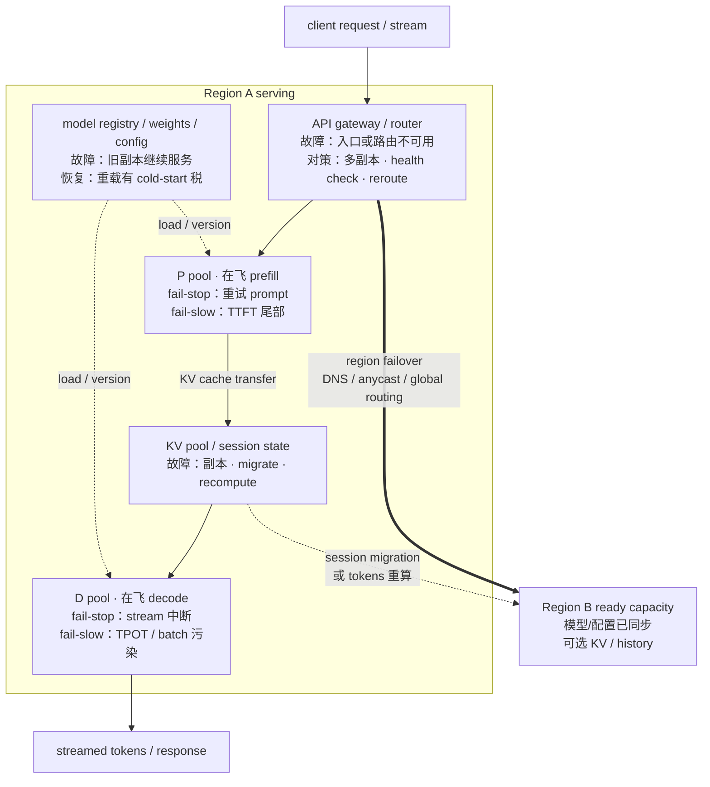
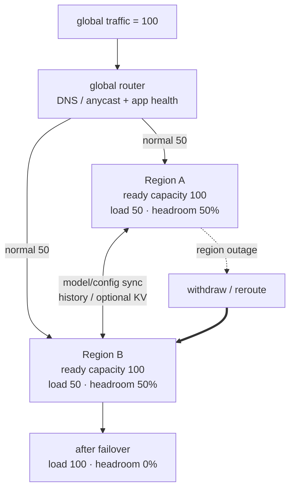

# L65 推理服务生存性：故障发生时仍把服务交付出去

> [!abstract] 本课速览
> 读完你将能够：
> 1. 对照训练与 serving 的故障单位、状态和时间预算，解释为什么分钟级恢复在两者中含义完全不同；
> 2. 沿 API/router、在飞请求、KV、P/D 实例、权重和 region 画出故障面，并为每层选择重试、迁移、重算或 failover；
> 3. 区分 retry、hedging、active-active/active-standby 与 graceful degradation，识别幂等性和 retry storm 风险；
> 4. 独立复算 availability、多地域组合、KV 迁移—重算翻转点和过载降级三笔账；
> 5. 用 SLO violation rate、error budget、RTO/RPO 与故障注入设计一份可验证的推理生存性实验。
>
> 前置：[[L55 推理性能模型]] · [[L57 连续批处理与调度]] · [[L60 分布式推理与PD分离]] · [[L61 推理服务框架与集群]] · 推荐先读 [[L53 大规模训练可靠性]] · 预计 60 分钟

## 论文里的这段话，你现在可能读不懂

> [!quote]
> “An **active-active multi-region deployment** may improve **availability**, but only when each region keeps enough **capacity headroom** and the failover path does not share a hidden **blast radius**. A **health check** can remove a failed replica, while an indiscriminate **request retry** may trigger a **retry storm**; a delayed **hedged request** instead trades duplicate work for lower tail latency. For a stateful LLM session, **KV cache fault tolerance** must choose between **session migration** and recomputation under an **RTO/RPO** target. When full service cannot be sustained, **graceful degradation** and **load shedding** spend the **error budget** deliberately rather than letting every request violate its SLO.”（改写自典型在线服务可靠性与 LLM serving 表述）

这段话把“多放几个副本”拆成了四笔必须分别算的账：副本是否在同一故障域、切换后有没有容量、会话状态能不能接上，以及守不住完整功能时怎样有序退让。==生存性不是保证永不出故障，而是故障发生后仍能交付多少服务、以什么代价交付、多久恢复。==

## 一、训练容错不能原样搬来：job 变成 request/session

[[L53 大规模训练可靠性]] 的主角是一个同步 job：任一关键 rank 停住，整个 worker group 可能不再产生有效 step；恢复慢一些，损失主要表现为 Runtime Goodput。推理 serving 的主角却是持续到来的请求。一个实例挂掉通常只伤到落在它上面的流量，但用户的 TTFT/TPOT SLO 从故障那一刻仍在计时。

| 观察维度 | 分布式训练 | 在线推理 serving |
|---|---|---|
| 工作单位 | 长时间运行的 job / step | request、stream、session |
| 状态核心 | 参数、optimizer、checkpoint、全局 step | 在飞请求、已输出 token、KV cache、会话绑定 |
| 故障影响 | 同步成员故障可能停整个 job | 常是局部请求失败或尾时延污染，也可能因共享依赖扩散 |
| 恢复动作 | 定位、换节点、加载 checkpoint、重算 steps | 摘除、重路由、retry/hedge、迁移或重算 KV、补容量 |
| 典型时间预算 | 分钟级恢复可能已经很好 | interactive 请求常只有毫秒到秒级余量 |
| 主要指标 | failure-free MFU、Runtime Goodput、完成时间 | availability、SLO violation rate、恢复时间、完成率 |

**availability**（可用性）描述服务在定义窗口内“可用”的比例。单地域小服务常按时间算 uptime；全球服务经常按合格请求中成功请求的比例算，因为同一时刻可能只坏了部分地域或部分用户。高可用百分比常用 **nines**（“几个 9”）简称，例如 99.9% 是 three nines。对应的 **downtime**（不可用时间）是窗口内允许服务不可用的累计时间；它只在采用 time-based availability 时才可直接换算。

**SLO violation rate**（SLO 违约率）则更细：

$$
r_{vio}=\frac{N_{\text{超过 TTFT/TPOT 阈值、错误或按口径拒绝}}}
{N_{\text{适用的合格请求}}}。
$$

分母必须写清 window、region、model、SLO tier，以及被 admission control 拒绝的请求算失败还是单列。否则把故障流量从统计里删掉，就能凭空“提高”可用性。

训练课已经解释过 **fail-stop**（明确停止）和 **fail-slow**（仍响应但显著变慢）。在 serving 中，fail-stop 容易被连接错误或心跳缺失发现；fail-slow 会持续接收流量，把慢请求混入 batch、占住 KV 和连接，最终污染 p99。Google 的《The Tail at Scale》强调的正是这种规模效应：局部、短暂的高时延在大型交互服务中会主导整体尾部。[Google Research 页面](https://research.google/pubs/the-tail-at-scale/)

一次故障波及的流量、实例、故障域或地域范围叫 **blast radius**（故障爆炸半径）。训练里一张卡可让一个 gang job 全停；serving 里一个 D instance 也许只伤几十条 session，而共享 router、模型配置或身份控制面出错却可能把多个 region 一起带走。生存性设计的第一步因此不是“加副本”，而是先问副本是否真的跨过了共同故障域。

> [!tip] 直觉：训练像长途货运，serving 像急诊分诊
> 货车坏了，半小时换车可能仍按天交货；急诊窗口停半小时，即使后来恢复，已经等待的病人也不会自动变成“没受影响”。同一个恢复时间，必须放回工作单位和 SLO 才有意义。

## 二、状态分层：到底丢了什么，决定怎样恢复

推理服务不是简单的“有状态”或“无状态”。把状态拆层后，恢复路径才清楚。

### 2.1 API/router：最容易重建，不等于不会成为单点

API gateway 和 router 通常不保存大模型状态，可以用多副本和外部配置快速重建。但请求配额、租户权限、rate limit counter、路由表与服务发现可能在共享控制面里；这些依赖若跨 region 共用，同样会扩大 blast radius。入口恢复了也不代表后端 capacity 已经 ready。

### 2.2 在飞请求：已经 stream 出去的 token 收不回来

P 实例在首 token 前失败，通常可以把 prompt 重新送到另一个 P，代价主要是重复 prefill 和 TTFT。D 实例失败更麻烦：用户可能已收到半句话，服务端也已为后续 token 累积 KV。此时“从头再试”会产生重复输出；“从最后一个已确认 token 续接”又要求服务端知道客户端确认边界，并能恢复兼容的 sampler、模型版本与 KV 状态。

因此在飞请求至少要记录 `request_id`、model/version、sampling parameters、已确认输出位置、目标实例和状态版本。exactly-once streaming 通常比“HTTP 请求返回成功一次”难得多；协议应明确客户端断连、服务端超时和重复请求的语义。

### 2.3 KV cache/session：搬字节，还是重做计算

**KV cache fault tolerance**（KV 缓存容错）是让 KV 所在实例、内存或网络路径故障后，会话仍能恢复到规定状态的机制集合。常见选择有：同步/异步 KV 副本、分布式 KV pool、从其他层级取回、传 token history 在目标处重算，以及直接终止低优先级 session。

**session migration**（会话迁移）把会话路由绑定和必要状态移到新执行位置。它不必永远搬完整 KV：短上下文可只传 token history 重算，长上下文且域内网络快时直接搬 KV 可能更快。[[L60 分布式推理与PD分离]] 已经给出 4K Llama-3-70B 的 1.342 GB KV 与 145 ms prefill 教学账，本课稍后把它放进故障切换。

Mooncake 的 Transfer Engine 就展示了局部 KV 通路容错：检测到 RDMA 连接或资源异常后，临时避开故障资源，尝试其他可达 NIC/path 并重新提交传输；它解决的是“还有替代路径时怎样继续搬”，不等于整个 session 已经跨 region 容灾。[Mooncake FAST 2025 论文 §3.2.3](https://www.usenix.org/system/files/fast25-qin.pdf)

### 2.4 模型权重：通常不会逻辑丢失，但会冷启动

权重和配置应在模型仓库中耐久保存，实例故障不会让模型本身消失；问题是新实例要 model loading、编译和 warmup。[[L61 推理服务框架与集群]] 的 70B-FP8 教学账仅 70 GB payload 在 10 GB/s 下就有 7 s 下界，还没算其余启动阶段。对 interactive failover，临时再启动副本往往来不及，ready headroom 才是真正能接流量的容量。

## 三、Failover 谱系：发现、摘除、转移，每一步都可能反噬

**failover**（故障转移）是检测主服务路径不可用或不满足健康条件后，把流量与必要状态切到备用路径的完整过程。它不是 router 改一次地址，而是一条链：

$$
T_{recover}=T_{detect}+T_{isolate}+T_{reroute}+T_{state}+T_{capacity}。
$$

状态已经有副本时 $T_{state}$ 可很小；备用实例尚未 ready 时，$T_{capacity}$ 可能被冷启动主导。

### 3.1 Health check 与 probe：探得快，也可能误杀

**health check**（健康检查）依据心跳、错误率、队列、TTFT/TPOT、GPU/NIC telemetry 或主动测试判断实例能否继续接流量。一次具体的主动探测叫 **probe**（探针 / 探测请求）：它可以只测端口，也可以跑一个短 prompt 检查从 API 到 token 的端到端路径。

探测间隔短、超时阈值紧，能减小 $T_{detect}$，却会在网络抖动或 GC/长 kernel 时误判健康实例并引发路由震荡；阈值太松又会让 fail-slow 长时间污染尾部。实践中要有连续失败门槛、hysteresis、不同层级 probe，并让被摘除实例先停止接新流量，再排空或恢复在飞 session。

### 3.2 Retry：必须先回答“重复做一次安全吗”

**request retry**（请求重试）是在超时或明确错误后，重新发送同一逻辑操作。某操作重复执行仍得到等价可接受结果的性质叫 **idempotency**（幂等性）。只读查询较容易做到；扣费、写外部系统、调用工具或发送消息不是天然幂等，应使用 idempotency key、去重日志或事务边界。

LLM completion 本身还可能因随机采样得到不同文本，所以“相同 prompt 可重算”不等于“业务操作可以重复提交”。重试必须吃同一条端到端 deadline，并设置次数上限、指数 backoff 和 jitter；否则下游容量刚下降，上游各层同时重试，新增流量进一步压垮剩余实例，形成 **retry storm**（重试风暴）。AWS 对 2021 年 12 月 7 日 US-EAST-1 事件的官方复盘就记录了：内部网络拥塞提高时延和错误后，更多连接尝试与重试又加剧了持续拥塞。[AWS 事件总结](https://aws.amazon.com/message/12721/)

### 3.3 Hedged request：复制工作，买尾时延保险

**hedged request**（对冲请求）不是等第一次明确失败才 retry，而是在原请求超过某个延迟阈值后，把同一逻辑请求再发给另一个副本，谁先成功就用谁，并取消或丢弃较慢副本。它是《The Tail at Scale》代表性的 tail-tolerance 思想：用少量冗余工作剪掉少数极慢样本。

LLM 里 hedge 比小型 RPC 贵得多。复制一个长 prompt 会重复 prefill，复制 decode 会重复生成；若两个副本都已开始 streaming，还要处理输出一致性和取消传播。因此更合理的触发点可能是 TTFT 阶段、只对高价值 interactive tier 启用，并把 hedge rate、wasted tokens 和尾时延收益一起报告。阈值过早会把 1 倍故障变成接近 2 倍负载，再次诱发过载。

### 3.4 Active-active 与 active-standby

- **active-active**（双活 / 多活）让多个副本或地域平时都接流量；切换快、容量不闲置，但状态同步、版本一致和相关故障隔离更难。
- **active-standby**（主备）让主路径服务、备用路径保持某种 ready 状态；语义更清晰，但 standby 越“冷”切换越慢，越“热”成本越接近 active-active。

副本选择不是二选一。API/router 可多活，模型权重可多地热备，KV 只做异步副本，低价值 session 允许重算；不同状态层可以有不同策略。

> [!warning] 三个常见误区
> 1. **“重试总是安全。”** 非幂等副作用可能执行两次；即使业务幂等，retry storm 也会放大负载。
> 2. **“Hedge 等于免费降 p99。”** 它消耗第二份 prefill/decode、KV 和带宽；必须限制触发比例并快速取消 loser。
> 3. **“有副本就会自动接管。”** 没有健康探测、路由、状态语义和 ready capacity，副本只是另一份静态资源。

## 四、降级服务：设计一张“有序退让”菜单

当故障后只剩 70% capacity，继续假装一切正常通常会让队列发散，最后所有请求一起超时。**graceful degradation**（优雅降级）是按预设优先级减少功能、质量或流量，使核心服务继续满足降级后的目标；实际交付出的有限能力叫 **degraded service**（降级服务）。

**brownout**（棕色降级）借用电网降压而非全停电的比喻：过载时关闭可选组件，让 essential path 留在预算内。**load shedding**（负载丢弃）则主动拒绝、延后或转移一部分 offered load，以保护已接纳请求；[[L57 连续批处理与调度]] 的 admission control 是实现它的入口机制之一。

| 降级手段 | 质量 / 功能代价 | 时延影响 | 资源 / 成本影响 | 适合保护什么 |
|---|---|---|---|---|
| model cascade 切到小模型 | 复杂任务质量可能下降 | 通常更短 | 单请求 FLOPs、权重/KV 压力下降 | 保住大部分交互请求可回答 |
| 缩短 context、关闭 RAG/tool/高成本功能 | 可能丢历史或外部能力 | prefill 与外部调用变短 | 计算、网络与状态量下降 | 核心问答路径 |
| 关闭 speculation | exact verification 下质量可不变 | 可能变慢；draft 成为瓶颈时也可能变稳 | 释放 draft capacity，减少重复工作 | target 主路径与总容量 |
| 切换更低 bit serving profile | 质量可能小幅下降，需单独验收 | 常有机会降低时延 | 权重/KV 内存与带宽压力下降 | 高峰期 ready capacity |
| load shedding / admission control | 被拒请求无结果 | 已接纳请求排队显著改善 | 防止系统做注定超时的工作 | 高优先级 goodput |
| 暂停或抢占 batch/offline tier | batch 完成时间变长 | interactive 尾时延改善 | 把共享资源让给前台 | 分级 SLO |

这里没有“最优顺序”的通用答案。interactive 与 batch 应拥有不同 **SLO tier** 语义：故障时可先停低优先级离线请求，保留 interactive 的 TTFT/TPOT；但也要给 batch deadline、最大暂停时长和恢复顺序。降级策略必须在故障前实现、压测并写入 runbook，==降级是设计出来的能力，不是系统塌下来之后给事故换一个好听名字。==

## 五、多地域生存性：第二个 region 不是第二份保险单

**region outage**（地域级中断）是一个 region 的服务路径或关键依赖大范围不可用。它未必意味着所有机器同时断电：共享网络、DNS、身份、监控或 control plane 故障，也可能让现有实例“还在跑”，却无法扩容、注册、观测或对外服务。AWS 的上述事件中，运行中的部分资源继续工作，但 EC2/ELB/Route 53 等控制面能力、监控和多个上层服务受到不同程度影响；连服务健康面板切到 standby region 的路径也被同源网络拥塞妨碍。这正说明“备用地域”必须连控制与观测依赖一起审计。

**multi-region deployment**（多地域部署）把服务能力分布到多个 region。要让它真的生存，至少要同时解决四件事：

1. **流量切换**：DNS 可把域名解析改向健康 region，但受 TTL 与客户端缓存影响；**anycast**（任播）让多个站点宣告同一 IP 前缀，由网络路由把流量送到可达/较近入口，但仍需要应用健康信号触发撤路或流量工程。两者都不能替应用层状态和容量兜底。
2. **模型与配置同步**：目标 region 必须已有兼容的 weights、tokenizer、adapter、权限与 sampling 配置；故障中临时复制百 GB 权重通常来不及。灰度发布还要避免两个 region 版本语义不一致。
3. **会话连续性**：可同步 token history、复制/迁移 KV，或接受重新 prefill。跨地域专线按 [[03 约定与符号]] 统一看作 10–100 Gb/s、RTT 10–100 ms；状态越大，越不能把 WAN 当成“远一点的 NVLink”。
4. **可接管容量**：健康地域有地址却没 GPU headroom，切过去只会把局部故障变成全局排队。

**capacity headroom**（容量余量）可写成

$$
h=\frac{C-L}{C}，
$$

其中 $C$ 是 ready capacity，$L$ 是当前负载。两个等容量 region 平时各承接总流量的一半，相当于各自 $h=50\%$；任一 region 故障，另一个才有机会独立承担全部正常流量。注意这是假设请求 mix、模型副本、KV 容量和网络入口都匹配，不能只按 GPU 张数相加。

**N+1 redundancy**（N+1 冗余）表示正常服务需要 $N$ 个同类容量/故障单元，再额外准备 1 个；N+2 则能在模型覆盖的条件下再多承受一个单元故障或维护事件。多出来的容量会降低正常利用率，下一课 [[L66 弹性算力与资源效率]] 将从反方向追问：怎样让这份保险在健康期不完全闲置。

图里故障后虽然刚好装下 100 流量，却没有余量吸收 burst、重试或长请求 mix。工程上还要在故障模式下执行 load shedding 或准备更高 headroom；N+1 只是起点，不是稳态承诺。

## 六、算一算：可用性、状态迁移与降级三连算

### 6.1 99.9% 到底允许坏多久；双活怎样组合

> [!example] 算一算 1：几个 9 与两个 region
> 一年按 $365\times24=8760$ h 记。time-based availability 为 $A$ 时，允许 downtime 为
>
> $$
> T_{down}=(1-A)\times8760\ \mathrm{h}。
> $$
>
> | availability | 常见叫法 | 年 downtime |
> |---:|---|---:|
> | 99% | two nines | 87.6 h |
> | 99.9% | three nines | $0.001\times8760=\boxed{8.76\ \mathrm{h}}$ |
> | 99.99% | four nines | 0.876 h = 52.56 min |
> | 99.999% | five nines | 0.0876 h = 5.256 min |
>
> 现在设 Region A/B 各自 availability 都为 99.5%，不可用概率 $q=0.5\%=0.005$。两地 active-active，平时各负担 50% 总流量且各有 50% capacity headroom，所以单地故障后另一地在容量上能接住全部流量。若再作一个很强的假设：==两地故障相互独立，且 global routing、模型、配置和身份等依赖不会共同失败==，则全站同时不可用概率为
>
> $$
> q_{both}=q_Aq_B=0.005^2=0.000025
> =\boxed{0.0025\%}，
> $$
>
> 组合 availability 为 $99.9975\%$，年 downtime 约为
>
> $$
> 0.000025\times8760\ \mathrm{h}
> =0.219\ \mathrm{h}\approx\boxed{13.1\ \mathrm{min}}。
> $$
>
> 这不是多地域 SLA 的保证。共享软件发布、DNS/IAM/control plane、同一上游网络和容量不足都会制造相关故障，使 $P(A\cap B)$ 远大于 $P(A)P(B)$。50% headroom 只消除了一个容量前提，并没有证明独立性。

### 6.2 1.342 GB KV：域内搬，跨域重算

> [!example] 算一算 2：迁移—重算的翻转点
> 沿用 [[L60 分布式推理与PD分离]] 的同一对象：Llama-3-70B、4K prompt、BF16 KV，总量 $C_{KV}=1.342$ GB；单条 400 Gb/s 网卡每方向为 50 GB/s；4K prefill 参数主项教学时间 $T_{recompute}=145$ ms。
>
> 域内若完整 KV 串过单条 400G 链路，payload-only 下界为
>
> $$
> T_{mig,DC}\ge\frac{1.342\ \mathrm{GB}}{50\ \mathrm{GB/s}}
> =\boxed{26.84\ \mathrm{ms}}<145\ \mathrm{ms}。
> $$
>
> 在忽略排队、注册、协议和争用的理想账里，域内迁移胜过重算。若 8 个 TP shards 可各走独立 400G path，L60 的理想并行下界还是 3.36 ms；这里故意采用更保守的单链路拓扑。
>
> 跨地域取 RTT = 100 ms，另设==故障/拥塞后的构造性有效吞吐约 1 Gb/s==，即 0.125 GB/s。这个 1 Gb/s 不是 [[03 约定与符号]] 的正常专线规格；统一口径中的跨地域专线是 10–100 Gb/s。若控制握手约付一次 RTT，payload 再发送，则
>
> $$
> T_{mig,WAN}\gtrsim0.100+
> \frac{1.342}{0.125}
> =\boxed{10.836\ \mathrm{s}}>0.145\ \mathrm{s}。
> $$
>
> 跨域时重算明显更快。一般地，若控制代价近似 $T_{ctrl}$，迁移胜出的条件是
>
> $$
> T_{ctrl}+\frac{C_{KV}}{B}<T_{recompute}，
> \qquad
> B>B^*=\frac{C_{KV}}{T_{recompute}-T_{ctrl}}。
> $$
>
> 当 $T_{ctrl}\approx0$，$B^*=1.342/0.145\approx9.26$ GB/s $\approx\boxed{74.0\ \mathrm{Gb/s}}$；当 $T_{ctrl}=100$ ms，
>
> $$
> B^*=\frac{1.342}{0.145-0.100}
> \approx29.82\ \mathrm{GB/s}
> \approx\boxed{238.6\ \mathrm{Gb/s}}。
> $$
>
> 若控制/RTT 已达到 145 ms，分母不再为正，再大的带宽也无法在这条串行关键路径上赢过 145 ms 重算。真实决策还应加入目标 P 队列、prefix hit、KV 压缩、多 rail、会话剩余长度与隐私；这个翻转点只比较“已知状态的传输”与“同 prompt 的隔离重算”。

### 6.3 超容量 20%：牺牲 30% 的模型档位，救回稳定性

> [!example] 算一算 3：降级不是认输，是把损失集中到可控处
> 把大模型单请求工作量归一化为 1，把服务池 capacity 归一化为 $\mu$。故障后 offered workload 比 capacity 高 20%，所以
>
> $$
> \rho_0=\frac{\lambda_{work}}{\mu}=1.2>1。
> $$
>
> 不降级时不满足 [[L55 推理性能模型]] 的稳定条件；无限队列会无界增长，有限队列则逐渐表现为 timeout、reject 或 OOM，因而不存在可用的稳态 p99/violation 分布。
>
> 现在把 30% 请求路由到工作量仅为大模型 $1/5$ 的小模型，剩余 70% 仍走大模型。保持同一归一化资源口径，平均工作因子变为
>
> $$
> f=0.7\times1+0.3\times\frac15=0.76，
> $$
>
> $$
> \rho_1=1.2\times0.76=\boxed{0.912}\approx0.91<1。
> $$
>
> 设计稿所说“回到约 0.9”是这个结果的取整。把这份混合 workload 再压成一个等效 M/M/1，只做教学直觉，系统平均时延与 p99 为
>
> $$
> W=\frac{1}{\mu(1-0.912)}
> \approx\frac{11.36}{\mu}，
> $$
>
> $$
> W_{p99}=\frac{\ln100}{\mu(1-0.912)}
> \approx\boxed{\frac{52.3}{\mu}}。
> $$
>
> 对任意 SLO 时延阈值 $\tau$，该模型给出
>
> $$
> P(W>\tau)=e^{-\mu(1-\rho_1)\tau}
> =e^{-0.088\mu\tau}。
> $$
>
> 因而若把 $\tau$ 设为上述 $52.3/\mu$，教学模型的 violation rate 为 1%；不降级的 $\rho_0>1$ 则没有对应稳态结果。真实 LLM 服务时间并非指数分布，小模型也可能有独立 pool，所以实验必须用 workload trace 重放。这里真正的结论是：==30% 请求承受可标记、可评估的质量降级，换来其余系统重新稳定；不要让 100% 请求一起进入不可控时延降级。==

## 七、度量与演练：把“能活下来”变成可证伪结论

**error budget**（错误预算）把 SLO 允许的失败量写成预算。time-based 99.9% availability 在一年窗口内允许 8.76 h downtime；request-based 99.9% success SLO 在 1,000,000 个合格请求中允许 1,000 个失败。Google SRE 的定义就是“1 减 availability target”，并强调按用户能感知的 SLI 和明确窗口计算。[Google SRE Book：Service Level Objectives](https://sre.google/sre-book/service-level-objectives/)；[Embracing Risk](https://sre.google/sre-book/embracing-risk/)

error budget 不是“随便坏的额度”，而是决策接口：预算充足时可以灰度新版本；预算烧得过快时冻结高风险变更、扩大 headroom、启用降级或修复根因。对 LLM serving，至少同时报告：

| 指标 | 它捕捉什么 | 它漏掉什么 |
|---|---|---|
| availability / request success | 服务是否返回合格结果 | 成功但非常慢的请求 |
| SLO violation rate | 错误、拒绝和超时是否越过门槛 | 违约严重程度与受影响用户差异 |
| detection / failover / full-recovery time | 恢复链各段瓶颈 | 恢复期间交付了多少降级服务 |
| request/session completion rate | 工作是否最终完成 | 质量、时延与重复计算成本 |
| degraded-mode quality 与流量占比 | 有序退让损失集中在哪里 | 正常模式成本 |
| wasted tokens / duplicate work | retry/hedge/重算付了多少资源 | 用户层面的可接受性 |

**RTO**（Recovery Time Objective，恢复时间目标）规定故障后多快恢复到目标服务级别；它是目标，不是实测恢复时间。**RPO**（Recovery Point Objective，恢复点目标）规定最多能丢多旧的状态。对 session，RPO=0 可理解为不允许丢失已确认进度，通常需要更同步的状态复制；若允许从最近若干 token/history 重算，RPO 可以放松以节省网络。还应分别写“恢复到 degraded service 的 RTO”和“恢复到 full service 的 RTO”。

最后用 **fault injection**（故障注入）主动制造实例退出、NIC drop、网络限速、KV 节点不可达、region route withdraw 或配置错误；**chaos engineering**（混沌工程）则把这类实验放进受控、持续、可回滚的生产假设验证流程。先定义 steady state 与 abort condition，再注入，不要把“随机杀进程”当完整方法。

一份最小实验矩阵应包含：

- 故障：P fail-stop、D fail-slow、KV path loss、router error、region outage；
- 负载：interactive/batch 比例、arrival burst、输入/输出长度、session age；
- 机制：retry backoff、hedge threshold、KV replica count、headroom、degradation policy；
- 指标：分 tier TTFT/TPOT p99、violation/reject rate、RTO/RPO 达标、completion、wasted tokens、成本；
- 对照：无机制、单机制和组合机制，并扫故障相关性而非只测独立故障。

这条评估路径会接到 [[L67 测量仿真与评测]]：小规模 testbed 做故障注入与 timing 校准，再用 trace-driven simulation 扫更大 region、负载和故障空间。

## 八、与研究的连接：五个还没有标准答案的问题

1. **故障感知 routing 与 scheduling**：把健康置信度、queue、KV locality、网络路径和 SLO slack 放进同一个在线决策；避免 fail-slow 节点被 cache-aware router 反复选中。
2. **KV 容灾放置**：联合决定哪些 session 做几份 KV replica、放在哪个故障域、何时只保 token history；目标是最小化恢复时延、网络字节与 HBM/DRAM 成本。
3. **在线降级决策**：根据 arrival burst、模型质量需求与 error budget 动态选择小模型、上下文长度、feature set 和 load shedding 比例，而不是固定阈值一刀切。
4. **多地域容量规划**：联合优化 active-active 流量比例、N+1/N+2、ready headroom、模型覆盖和故障相关性；这与 [[L66 弹性算力与资源效率]] 的利用率目标天然冲突。
5. **生存性 benchmark 缺失**：公开 trace 很少同时给 request/session 状态、故障、网络与恢复动作；需要定义可复现的 fail-stop/fail-slow、KV loss、region outage 和 degraded-quality 指标。

这些问题都落在“AI workload 在真实分布式基础设施上如何维持性能、服务质量与生存性”的交叉地带。研究贡献不应只说“故障后恢复更快”，而要把故障模型、状态语义、优化变量、baseline、恢复链和成本一起公开。

## 回到开头那段话

第一句说：active-active multi-region 只有在每个 region 有 capacity headroom、global routing 可切换、依赖不共享 blast radius 时才可能提高 availability；两个 99.5% region 独立组合得到 99.9975%，但相关故障会击穿乘法。

第二句说：health check 负责发现并摘除，request retry 要先满足 idempotency、deadline、backoff 和次数限制，否则成为 retry storm；hedged request 则在慢而未失败时发少量副本，用 duplicate work 买 tail latency，并非免费。

第三句说：KV cache fault tolerance 面对的不是“文件有没有备份”，而是 session migration 与 recomputation 的临界选择。1.342 GB KV 在单条 400G 域内链路的 26.84 ms 下界小于 145 ms 重算；100 ms RTT、约 1 Gb/s 的故障 WAN 场景却要约 10.84 s。RTO/RPO 决定允许多久、允许丢多少状态。

第四句说：capacity 不足时，graceful degradation、brownout 和 load shedding 用分级 SLO 把损失限制在选定请求或功能上；error budget 记录这种取舍是否仍在承诺内。现在再读开场，应该能把每个术语落到一条状态路径、一段时间预算和一个可测指标上。

## 术语卡片

| 术语 | 中文 | 一句话解释 |
|---|---|---|
| availability | 可用性 | 在定义窗口内服务可用或合格请求成功的比例，必须声明 time-based 或 request-based 口径。 |
| nines | 几个 9 | 用 availability 百分比中连续的 9 概括高可用目标，如 99.9% 为 three nines。 |
| downtime | 不可用时间 | time-based availability 窗口内服务不可用的累计时长。 |
| SLO violation rate | SLO 违约率 | 适用请求中错误、超时或按规定拒绝而未满足 SLO 的比例。 |
| error budget | 错误预算 | 对 success/availability SLO 由 $1-\text{target}$ 定义、在统计窗口内允许消耗的失败量。 |
| failover | 故障转移 | 从检测、隔离到重路由、恢复状态与补足容量的完整切换过程。 |
| health check | 健康检查 | 依据心跳、性能、错误与主动测试判断组件能否继续接流量。 |
| probe | 探针 / 探测请求 | 为检查某层或端到端服务健康而发出的主动测试。 |
| request retry | 请求重试 | 在错误或超时后重新提交同一逻辑操作。 |
| idempotency | 幂等性 | 同一操作重复执行仍产生等价、可接受业务结果的性质。 |
| retry storm | 重试风暴 | 大量客户端或上游在故障时同步重试，进一步压垮剩余容量的反馈循环。 |
| hedged request | 对冲请求 | 原请求变慢后向另一副本发副本，用重复工作换较低尾时延。 |
| graceful degradation | 优雅降级 | 按预设优先级减少功能、质量或流量以维持核心服务。 |
| degraded service | 降级服务 | 故障或过载下实际交付的有限功能/质量服务模式。 |
| brownout | 棕色降级 | 过载时暂时关闭可选组件，使 essential path 继续工作的设计思想。 |
| load shedding | 负载丢弃 | 主动拒绝、延后或转移部分 offered load，以保护已接纳请求。 |
| session migration | 会话迁移 | 把会话绑定及必要 history/KV 状态转到新的执行位置。 |
| KV cache fault tolerance | KV 缓存容错 | 通过副本、迁移、分层取回或重算，在 KV 故障后恢复会话的机制集合。 |
| active-active | 双活 / 多活 | 多个副本或地域平时同时接流量并可互相接管。 |
| active-standby | 主备 | 主路径服务、备用路径保持不同热度并在故障时接管。 |
| capacity headroom | 容量余量 | ready capacity 中尚未被当前负载使用、可承接 burst 或 failover 的比例。 |
| N+1 redundancy | N+1 冗余 | 正常需要 $N$ 个服务单元时额外准备 1 个冗余单元。 |
| region outage | 地域级中断 | 一个 region 的服务或关键依赖大范围不可用的事件。 |
| multi-region deployment | 多地域部署 | 把服务、模型与必要控制/状态能力分布在多个 region。 |
| anycast | 任播 | 多个站点宣告同一 IP 前缀，由网络路由选择可达或较近入口。 |
| chaos engineering | 混沌工程 | 在受控、可回滚条件下持续验证系统对故障假设的工程方法。 |
| fault injection | 故障注入 | 主动制造组件、网络、状态或控制面异常以测量系统反应。 |
| RTO | 恢复时间目标 | 从故障发生到恢复规定服务级别所允许的最长目标时间。 |
| RPO | 恢复点目标 | 恢复时最多允许丢失到多旧状态的目标边界。 |
| blast radius | 故障爆炸半径 | 一次故障波及的流量、资源、服务或故障域范围。 |

## 自测

1. 为什么训练中可接受的分钟级恢复，在 interactive serving 中可能已经是严重事故？请从工作单位、状态与指标各答一点。
2. P instance 与 D instance 分别在什么阶段失败？为什么 D 故障的 retry 语义通常更复杂？
3. request retry 与 hedged request 的触发条件有什么区别？两者如何分别导致 retry storm 或 duplicate work？
4. 一项操作调用外部扣费 API。你会怎样使用 idempotency key、timeout budget 与 backoff 设计重试？
5. 两个 region 各 99.5% availability，故障独立且容量足够时，组合 availability 与年 downtime 是多少？为什么实际不能直接把它写进 SLA？
6. 1.342 GB KV、重算 145 ms、控制代价 50 ms 时，迁移胜过重算所需的最低带宽约是多少 Gb/s？
7. 故障后原始 $\rho=1.2$，把 25% 请求切到 $1/4$ 工作量的小模型，新的 $\rho$ 是多少？队列是否恢复稳定？
8. 为“D instance fail-slow + region A 容量下降”设计一次 fault-injection 实验：至少给出两个 SLO tier、三项指标和一个 abort condition。

> [!note]- 参考答案
> 1. 训练的单位是长 job/step，可从 checkpoint 恢复，分钟损失主要进入 goodput；serving 的单位是持续到来的 request/session，包含已输出 token 与 KV 状态，TTFT/TPOT 和违约率在毫秒到秒级持续计时。
> 2. P 在 prompt/prefill 阶段，首 token 前失败常可重做 prefill；D 在流式 decode 阶段，可能已有 token 交付给用户，重试会遇到重复输出、采样差异、KV 与客户端确认边界问题。
> 3. retry 等错误/超时后重发；hedge 在原请求仍未失败但进入延迟尾部时发副本。无 backoff/上限的 retry 会把故障流量放大成 storm；hedge 过早或不取消 loser 会消耗第二份计算、KV 与网络。
> 4. 为逻辑扣费生成唯一 idempotency key，下游保存 key→结果并对重复提交返回原结果；每次尝试共享一个 E2E deadline，限制次数，使用 exponential backoff + jitter，并只在可判定的瞬时错误上重试。超出边界进入人工/补偿流程，不能无限重发。
> 5. $q=0.005$，$q^2=0.000025$，故组合 availability 为 $1-q^2=99.9975\%$；年 downtime 约 $0.000025\times8760$ h = 13.1 min。实际有相关故障、共享依赖、路由和容量约束，独立乘法不是 SLA 证明。
> 6. $T_{ctrl}=0.050$ s，故 $B^*=1.342/(0.145-0.050)=14.126$ GB/s，乘 8 得约 $\boxed{113.0\ \mathrm{Gb/s}}$。若实际 RTT/控制代价、争用或排队更大，门槛还会上升。
> 7. 平均工作因子为 $0.75\times1+0.25\times0.25=0.8125$，所以 $\rho'=1.2\times0.8125=\boxed{0.975}<1$，理论上恢复稳定，但离饱和极近，M/M/1 的等待放大因子为 $1/(1-0.975)=40$，仍需 headroom 或更多 shedding。
> 8. 示例：interactive tier 保护 TTFT/TPOT p99，batch tier 允许暂停或延后；逐步给 D 注入延迟并撤掉 Region A 一部分 capacity。报告分 tier violation/reject rate、failover/degraded/full-recovery time、completion 与 wasted tokens/cost。若错误率、队列/KV 水位或用户影响超过预设安全阈值，立即 abort、恢复路由并停止注入。

## 延伸阅读

- [《The Tail at Scale》](https://research.google/pubs/the-tail-at-scale/)（Communications of the ACM 2013）：精读 latency variability、hedged requests 与 capacity utilization 的关系；把“小概率慢副本”翻译成 aggregate tail。
- [Google SRE Book：Service Level Objectives](https://sre.google/sre-book/service-level-objectives/)与 [Embracing Risk](https://sre.google/sre-book/embracing-risk/)：读 availability 口径、nines、分层 SLO 和 error budget，学会把可靠性讨论变成可执行控制环。
- [《Mooncake: Trading More Storage for Less Computation — A KVCache-centric Architecture for Serving LLM Chatbot》](https://www.usenix.org/conference/fast25/presentation/qin)（FAST 2025）：带着生存性视角回读 §3.2.3 的临时网络故障换路，以及 §4.1 在预计无法满足 SLO 时返回 HTTP 429 的 admission 行为。
- [AWS 2021-12-07 US-EAST-1 事件总结](https://aws.amazon.com/message/12721/)：观察共享内部网络、监控缺失、retry feedback、control plane 与 standby-region failover 如何形成相关 blast radius。

---
上一课：[[L64 边缘与端云协同]] ← · → 下一课：[[L66 弹性算力与资源效率]]
