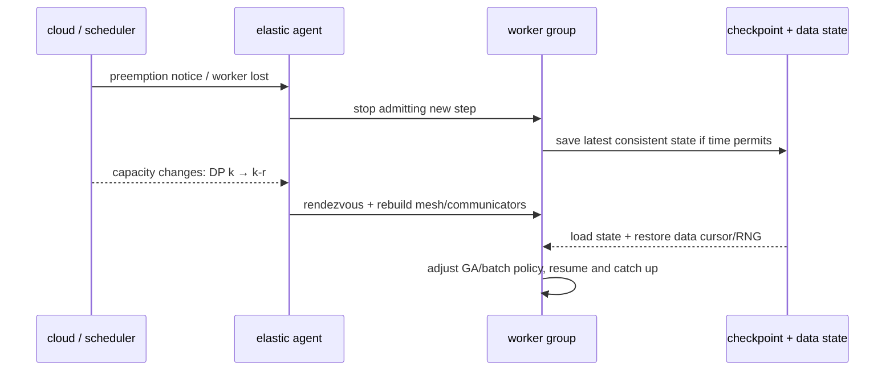

# L66 弹性算力与资源效率：用不稳定的资源做稳定的事

> [!abstract] 本课速览
> 读完你将能够：
> 1. 区分 on-demand、reserved 与 spot 的价格—可用性契约，并用“抢占率 × 恢复成本”判断 spot 是否划算；
> 2. 沿抢占通知、checkpoint、成员重配和数据进度，画出一条可恢复的弹性训练控制链；
> 3. 对照训练与推理的 elasticity，解释 autoscaling、cold start、serverless inference 和错峰填谷的关系；
> 4. 在 MIG、MPS 与 time-slicing 之间按隔离、粒度和干扰选择 GPU 共享方式；
> 5. 用分配率、goodput、条件 MFU、$/token、tokens/J 与 TCO 定位资源效率损失落在哪一层。
>
> 前置：[[L35 GPU集群调度]] · [[L53 大规模训练可靠性]] · [[L61 推理服务框架与集群]] · 预计 60 分钟

## 论文里的这段话，你现在可能读不懂

> [!quote]
> “A cost-efficient training service may place an **elastic training** job on **spot instances**, consume a **preemption notice** to checkpoint, and perform **re-configuration** when worker membership changes. A serving fleet instead follows a **diurnal pattern** with **autoscaling**, while **MIG**, **MPS**, or **time-slicing** trade partition granularity for **interference** isolation. High allocation alone is not the goal: **TCO** and **tokens per joule** must be evaluated after goodput and useful model execution are accounted for.”（改写自典型弹性计算与 GPU 集群系统表述）

这段话在说一件反直觉的事：最贵的卡不一定浪费在“空闲”，也可能被分配满、kernel 跑满，却在故障恢复、重复计算、错误放置或不满足 SLO 的工作上白忙。==资源效率不是把每张卡点亮，而是让不稳定、碎片化的资源持续产出有用工作。==

## 一、算力市场的价格不是折扣券，而是一份风险契约

云上算力可以先按“谁承担供给风险”分成三类：

| 供给方式 | 资源与价格契约 | 适合的工作 | 主要代价 |
|---|---|---|---|
| **on-demand instance**（按需实例） | 需要时按公开按需价申请，不做长期用量承诺 | 突发、短期、需求未知的工作 | 单位时间价格通常最高，容量仍不等于绝对保证 |
| **reserved instance**（预留 / 承诺用量实例） | 用期限或用量承诺换折扣；不同云的产品可能是容量预留或账单折扣 | 稳定基线负载 | 预测错会留下闲置承诺；不能只看折扣、不看条款 |
| **spot instance** / **preemptible instance**（竞价 / 可抢占实例） | 使用云中可回收的剩余容量，价格低但提供方可收回 | 可暂停、可迁移、可重试的弹性工作 | 抢占、供给波动，以及重新找到同构容量的等待 |

AWS 当前官方页面写的是相对 On-Demand “最高可省 90%”，不是任意 GPU、地域和时刻都固定便宜 90%；同一官方最佳实践还强调容量可能被收回。[AWS Spot 定价](https://aws.amazon.com/ec2/spot/pricing/) · [AWS Spot 最佳实践](https://docs.aws.amazon.com/AWSEC2/latest/UserGuide/spot-best-practices.html)

一次 **preemption notice**（抢占通知）是在资源即将被回收前给 workload 的信号。以 AWS EC2 为例，stop/terminate 通常会提前两分钟发事件，但通知是 best effort，hibernate 也不保证两分钟窗口；所以系统可以利用通知加速收尾，却不能把“必有两分钟”当正确性的前提。[AWS 中断通知文档](https://docs.aws.amazon.com/AWSEC2/latest/UserGuide/spot-instance-termination-notices.html)

把 spot 用起来的关键能力叫 **elasticity**（弹性）：供给或负载变化时，系统能改变资源规模与布局，并在可接受时间内恢复目标性能和正确性。它不等于“能重启”。真正的判据是

$$
\text{可行性} = f(\text{价格折扣},\ \text{抢占频率},\ \text{每次损失},\ \text{补容等待},\ \text{性能波动})。
$$

便宜只改变第一项；checkpoint、重配、调度和多容量池组合才改变后四项。

> [!tip] 直觉：spot 像随时可能被收走的共享自习室
> 桌子便宜不是重点。若你的资料能在一分钟内收好、换桌后立刻续上，它才是生产资料；若每次换桌都要从第一章重学，免费也可能昂贵。

## 二、弹性训练：worker 少了，数学和数据进度不能跟着乱

**elastic training**（弹性训练）是在 worker membership 变化后，重新组织训练资源并继续推进同一训练目标。[[L53 大规模训练可靠性]] 已讲过检测、checkpoint 与恢复；spot 把偶发故障变成更频繁的计划外缩容，因此控制链要再补两段：成员重配和数据语义。

### 2.1 通知与 checkpoint：保存“能继续”的状态

快 checkpoint 不只是写 weights。为了避免恢复后重复或跳过一大片数据，至少还要界定 optimizer、scheduler/global step、random state、data sampler/cursor 与已提交 step 的一致性。通知来不及时，必须回到最后一份 durable checkpoint；通知来得及时，也要保证各 rank 保存的是同一个提交边界。

### 2.2 Re-configuration：改的不只是进程数

**re-configuration**（重新配置 / 弹性重配）包括重新 rendezvous、建立 NCCL communicators、重建 DP/TP/PP mesh、恢复或重新切分状态，并让调度器知道新拓扑。缩一个 DP replica 看似简单，但全局 batch 满足

$$
B=b\times \mathrm{DP}\times \mathrm{GA}。
$$

若 $b$ 与 GA 不变，DP 从 16 变 12，$B$ 会变成原来的 $75\%$；若要保持 $B$，就得提高 GA，继而改变 step time。若允许 $B$ 改变，又要明确学习率、scheduler 与统计语义是否跟着调整。系统论文中的“恢复运行”因此不自动等于“与原训练轨迹完全等价”。

数据进度也有同样的问题。静态 sampler 常按 rank 切 shard；rank 数改变后直接重新取模，可能让部分样本重复、部分遗漏。可行做法包括以全局 sample/token ID 记录提交进度、把数据划成可重新分配的小块，或明确采用 at-least-once 并量化重复率。这里的正确性边界必须写进评测，而不能只报 GPU utilization。

### 2.3 三个系统名字，代表三种处理波动的思路

- **Bamboo** 把 **redundant computation**（冗余计算）塞进 pipeline bubbles：节点除自己的 layers 外还执行邻居部分 layers，使流水线在节点被抢占后仍能继续推进。它用健康期的少量额外工作换更快的失效承受能力，适合把“冗余是否值得”放进 goodput 而非只看 failure-free throughput。《Bamboo: Making Preemptible Instances Resilient for Affordable Training of Large DNNs》发表于 NSDI 2023。[USENIX 正式页面](https://www.usenix.org/conference/nsdi23/presentation/thorpe)
- **Oobleck** 预先生成不同节点数与 stage 映射的 pipeline templates，资源变化时从模板组合中切换，不必在故障路径上从零搜索并行计划。《Oobleck: Resilient Distributed Training of Large Models Using Pipeline Templates》发表于 SOSP 2023。[作者公开论文](https://insujang.github.io/assets/pdf/sosp23_oobleck.pdf)
- **Varuna** 面向 commodity networking 与动态资源集，自动选择 pipeline 配置，并展示了利用 low-priority/spot VMs 训练大模型的路径。《Varuna: Scalable, Low-cost Training of Massive Deep Learning Models》发表于 EuroSys 2022。[Microsoft Research 页面](https://www.microsoft.com/en-us/research/publication/varuna-scalable-low-cost-training-of-massive-deep-learning-models/)

它们不是同一个 API 的三个实现：Bamboo 重点用冗余硬扛短期缺员，Oobleck 重点用模板缩短重配决策，Varuna 重点让训练适应变化的资源与普通网络。读论文时要问“它压的是恢复时间线哪一段”。

> [!example] 算一算：spot 训练的等效单价
> 本题的 $30\%$ 价格、平均每 4 h 一次抢占和每次 12 min 损失均来自 L66 设计稿，是教学场景，不是 [[03 约定与符号]] 的硬件规格，也不是当前市场报价。沿用 [[L53 大规模训练可靠性]] 的一阶 goodput 近似，把平均抢占间隔记为 $M=4\ \mathrm{h}=240\ \mathrm{min}$，每次恢复、回滚和追赶损失合计为 $L$：
>
> $$
> g\approx 1-\frac{L}{M}。
> $$
>
> 快恢复方案 $L=12\ \mathrm{min}$：
>
> $$
> g_{fast}=1-\frac{12}{240}=0.95，
> $$
>
> $$
> \frac{C_{spot/useful}}{C_{on-demand}}
> =\frac{0.30}{0.95}=0.3158\approx31.6\%。
> $$
>
> 即每得到 1 个有用 GPU·h，约付按需价的 $31.6\%$，相对节省 $1-31.6\%=68.4\%$，约 68%。
>
> 若朴素 checkpoint 让每次合计损失 $L=60\ \mathrm{min}$：
>
> $$
> g_{slow}=1-\frac{60}{240}=0.75，\qquad
> \frac{0.30}{0.75}=0.40。
> $$
>
> 等效单价升到按需的 $40\%$。名义 spot 价格没变，弹性技术栈却让有效单价从 $31.6\%$ 变成 $40\%$。该近似假设平均间隔稳定、损失已包含回滚/恢复且补容无需额外等待；真实抢占成簇、同构容量短缺时，还要报告分布和尾部，不能只报均值。

## 三、弹性推理：跟着请求潮汐伸缩，但别把状态留在浪里

推理负载常有 **diurnal pattern**（昼夜周期）：用户活跃时段高、夜间低，但不同地域、业务和发布事件会改变相位与峰值。[[L61 推理服务框架与集群]] 的 **autoscaling**（自动扩缩）已经说明，扩容必须预测 token work，并支付拉镜像、载权重、编译和 warmup 的 cold-start 税。

```mermaid
gantt
    title 一个混合集群的 24 小时：前台优先，后台填谷
    dateFormat HH:mm
    axisFormat %H:%M
    section Interactive serving
    基线 ready replicas       :active, 00:00, 24h
    早高峰扩容                 :crit, 08:00, 4h
    晚高峰扩容                 :crit, 18:00, 5h
    section Elastic / batch pool
    夜间训练与离线推理         :00:00, 8h
    白天空闲或被前台抢占       :12:00, 6h
    夜间训练与离线推理恢复     :23:00, 1h
```

一种稳妥模式是：on-demand/reserved 扛最低服务基线，spot 只承载可快速排空、状态外置或可重算的 replicas；通知到来后先停止接新请求，再迁移/完成在飞请求。若 KV 与 session 黏在会被收回的实例上，所谓“无状态 replica”只是 API 层看起来无状态。

**serverless inference**（无服务器推理）把实例生命周期和容量池藏在平台后面，用户按调用或资源使用付费。scale-to-zero 可以降低冷模型的空闲成本，却不能消灭权重加载；共享 warm pool、多模型复用和预测扩容只是把冷启动与闲置容量跨租户摊薄。对 interactive SLO，必须同时报 ready time 与 cold-start hit rate。

错峰填谷则利用 [[L57 连续批处理与调度]] 的 SLO tier：interactive 高峰先拿卡，训练、评测和 offline/batch inference 在低谷吸收空洞。这里的 **colocation**（混部）是把不同 workload 放在同一物理资源池甚至同一 GPU 上；它提高装箱密度，也把推理 p99 与训练 burst 绑在一起。调度器要有 preemption、checkpoint、admission control 和最大暂停时间，不能靠“低优先级自觉让路”。

## 四、GPU 共享：硬切、软共享与轮流用

大 GPU 跑小模型或开发 notebook 时，整卡独占常留下 SM、HBM capacity 或 bandwidth 空洞。[[L35 GPU集群调度]] 提过三种复用方式，本课从隔离与干扰深化：

| 方式 | 资源划分 | 隔离与干扰 | 粒度 / 重配 | 典型场景 |
|---|---|---|---|---|
| **MIG**（Multi-Instance GPU，多实例 GPU） | 物理切分 compute、memory path/cache 等资源为预定义 profile | memory bandwidth QoS 与 fault isolation 较强，跨 slice 干扰更可控 | profile 粒度离散；重配需要管理动作，空闲 slice 不会自动借给邻居 | 多租户小模型推理、需要可预测 SLO 的共享 |
| **MPS**（Multi-Process Service，多进程服务） | 多进程通过共享 runtime 并发提交，逻辑限制 SM 份额 | 灵活，但 memory bandwidth、cache/capacity 等仍可能共享并互扰；新版 static SM partitioning 可增强部分隔离，仍不是 MIG 的完整硬边界 | 启停和份额调整更灵活 | 同一信任域的合作进程、开发与吞吐优先场景 |
| **time-slicing**（分时共享） | 按时间片让 contexts 轮流占用 GPU | 空间争用较少，但排队与 context 切换会把邻居 burst 变成时延抖动 | 最通用，不能保证同时执行 | 交互开发、低 duty-cycle 作业 |

NVIDIA 的 MIG 文档把 MIG 描述为拥有独立 memory-system paths、可提供 QoS 与 fault isolation 的物理划分；同一文档对经典 MPS 的描述则是共享 scheduling hardware、memory bandwidth、cache 与 capacity。[NVIDIA MIG 概念对照](https://docs.nvidia.com/datacenter/tesla/mig-user-guide/concepts.html) 当前 MPS 文档又加入 static SM partitioning 和部分 error isolation，但明确不是所有 GPU/系统级故障的完整保证，因此评测时要写清 driver 与模式。[NVIDIA MPS 文档](https://docs.nvidia.com/deploy/mps/latest/when-to-use-mps.html)

共享不可避免地带来 **interference**（资源干扰）：一个 workload 的 kernel、memory traffic 或 burst 让另一个 workload 的吞吐或 p99 变差。最小测量法不是看平均 GPU utilization，而是固定各自输入，分别测独跑与混跑：

$$
\mathrm{slowdown}_i=\frac{T_{i,\mathrm{co-run}}}{T_{i,\mathrm{solo}}},\qquad
\Delta p99_i=p99_{i,\mathrm{co-run}}-p99_{i,\mathrm{solo}}。
$$

再同时扫描请求 mix、batch、MIG profile/MPS 份额与邻居 workload；对 serving 报 SLO violation，对训练报 useful tokens/s 或 step time。只报告“平均利用率从 40% 到 80%”无法说明合租是否值得。

### 4.1 Over-commitment 与 Harvest：借未来的空闲，但要写回收规则

**over-commitment**（超卖）是调度器接受的名义资源需求超过物理容量，赌的是租户不会同时达到申请峰值。它能消化 reserved-but-idle 的空洞；若预测失误，则会出现 throttling、OOM、排队或 SLO 违约，所以必须有可执行的 reclaim 优先级和 admission guardrail。

**Harvest VM**（资源收割型虚机）代表更连续的思路：它随底层未分配资源增长或缩小，仅当提供方需要其最小资源集时才被驱逐。OSDI 2020《Providing SLOs for Resource-Harvesting VMs in Cloud Platforms》用 “harvest” 专指这种从动态剩余中收割资源的 VM，不是 spot 的同义词。[USENIX 正式页面](https://www.usenix.org/conference/osdi20/presentation/ambati)

> [!warning] 三个常见误区
> 1. **“利用率高就是效率高。”** 重算、错误路由和已经违约的请求都能把 GPU utilization 拉高；先说明分母和“有用”的定义。
> 2. **“MIG 没干扰，MPS 一定没隔离。”** MIG 隔离更强但 profile/共享 I/O 仍有边界；MPS 能做份额或静态 SM 分区，但版本和模式决定保证，必须实测。
> 3. **“spot 不稳定，所以不能做严肃训练。”** 结论取决于抢占过程、checkpoint/重配成本和补容等待；反过来，也不能用一次顺利跑完证明长期可行。

## 五、效率折扣瀑布：卡在哪里，百分点就去哪里抢

本课的交付物是一张统一效率地图。设安装峰值为 $P_{installed}$，分配率为 $a$；在已分配窗口中，真正处于有效运行/恢复后推进的比例为 runtime goodput $g$；在有效运行窗口内，以 dense 峰值为分母的条件 MFU 为 $m$。为了不重复计数，三个量的窗口必须互斥且写清：

$$
P_{useful}\approx P_{installed}\times a\times g\times m。
$$

例如只做量纲清楚的思维实验：若 $a=80\%$、$g=90\%$、条件 $m=50\%$，则 $P_{useful}/P_{installed}=0.8\times0.9\times0.5=36\%$。这三个百分比是题设，不是行业统计；它说明“已分配 80%”离“装机峰值的 80% 都在训练模型”还很远。[[L35 GPU集群调度]] 管前一折，[[L53 大规模训练可靠性]] 管中间一折，[[L22 算力度量与MFU]] 与 [[L52 性能剖析与MFU核算]] 管后一折。

钱账要用 [[L61 推理服务框架与集群]] 的有效吞吐而不是 peak throughput：

$$
\$/\mathrm{M\ tokens}
=\frac{\text{GPU+CPU+memory+network+storage+facility+operations cost per hour}}
{q_{useful}\times3600}\times10^6。
$$

**TCO**（Total Cost of Ownership，总拥有成本）是整个持有/运行周期的总成本，至少包含设备或租赁、供电冷却、网络存储、机房、运维、故障与闲置承诺。spot 只改变其中一项；为了省 GPU-hour 引入大量跨区流量或值班复杂度，也可能把成本挪到别处。

能效用 **tokens per joule**（每焦耳 token 数）表达：

$$
\mathrm{tokens/J}=\frac{N_{useful\ tokens}}{\int P_{facility}(t)\,dt}
\approx\frac{q_{useful}}{P_{facility}}。
$$

分子必须是满足质量与 SLO 口径的 useful tokens；分母要说明只测 GPU board power，还是按 [[03 约定与符号]] 的 PUE 折成设施功率。否则把坏请求和重算 token 也算进分子，会得到“越浪费越节能”的荒唐结论。

**carbon-aware scheduling**（碳感知调度）再把功耗乘上随时间和地域变化的电网碳强度，在 deadline、数据位置与 SLO 允许时把可延迟工作移到更合适的时段或地点。Google 的生产系统论文展示的是推迟时间灵活的工作，而不是为了低碳让 interactive 请求跨洲绕路。[《Carbon-Aware Computing for Datacenters》](https://arxiv.org/abs/2106.11750)

> [!tip] 资源效率研究的问法
> 不先问“GPU utilization 能不能再高 10 个点”，先问“瀑布的哪一层丢了多少、这个点抢回来会不会让另一层或 SLO 更差”。这才是可验证的系统问题。

## 六、与研究的连接：把效率和生存性放进同一个目标函数

这节课直接落在“分布式训练/推理的网络与系统优化”主线上，尤其有四组可做的 open problems：

1. **训练—推理混部**：依据 serving token-work 预测，决定何时借卡给训练、提前多久 checkpoint、用 MIG 还是整卡抢占；目标同时含 p99/SLO violation、训练 JCT 与集群 useful tokens。
2. **spot 供给组合**：跨 instance type、availability zone 甚至多云选择容量池，联合预测价格、抢占相关性、网络拓扑和 checkpoint locality；最便宜的 pool 可能拥有最大的共同 blast radius。
3. **冗余—利用率联合优化**：[[L65 推理服务生存性]] 的 capacity headroom 能救故障，却压低健康期分配率；可让低优先级、可秒级回收的 workload 暂借 headroom，把“闲置保险”变成“可收回生产力”。
4. **能耗与网络联合调度**：跨地域移动训练或离线推理既看碳强度，也要算 WAN 传输、数据驻留、deadline 与故障恢复。它适合用 trace-driven simulation 扫参数，再用小规模 testbed 校准；下一课 [[L67 测量仿真与评测]] 就讲这条证据链。

一个可发表的问题通常可以写成：给定 workload trace、spot/故障模型、拓扑和 SLO，选择 placement、共享方式、checkpoint interval、autoscaling 与 reclaim policy，最小化 TCO/碳或最大化 useful tokens，同时约束 SLO violation 与恢复时间。这样“资源效率”就从口号变成了变量、目标和约束。

## 回到开头那段话

> “A cost-efficient training service may place an **elastic training** job on **spot instances**, consume a **preemption notice** to checkpoint, and perform **re-configuration** when worker membership changes.”

现在你能读出完整控制链：spot 把低价和可抢占绑定在一起；notice 只是尽力而为的收尾窗口；checkpoint 要保存一致训练与数据进度；worker 数变化后还要重建 communicator/mesh，并处理 global batch、学习率和 sampler 语义。

> “A serving fleet instead follows a **diurnal pattern** with **autoscaling**, while **MIG**, **MPS**, or **time-slicing** trade partition granularity for **interference** isolation.”

推理弹性首先跟随 token workload 的昼夜潮汐，但扩容要支付 cold start。MIG 用离散物理 profile 换较强 QoS；MPS 用逻辑并发换灵活粒度；time-slicing 用轮流执行换通用复用。三者都要以 solo/co-run slowdown 与 SLO 实测，不能凭平均 utilization 选型。

> “High allocation alone is not the goal: **TCO** and **tokens per joule** must be evaluated after goodput and useful model execution are accounted for.”

分配率只是第一层。抢占恢复先折一次 goodput，通信/气泡/kernel 再折条件 MFU；之后才把 useful token throughput 分摊到完整成本与设施能量上。你现在能指出一个“GPU 90% 忙”的系统，究竟是在高效产出，还是高效白忙。

## 术语卡片

| 术语 | 中文 | 一句话解释 |
|---|---|---|
| spot instance | spot / 竞价实例 | 使用可回收剩余容量、价格较低但可能被提供方中断的实例。 |
| preemptible instance | 可抢占实例 | 提供方可按契约收回的计算实例；spot 是常见商业形式。 |
| on-demand instance | 按需实例 | 无长期用量承诺、按实际使用支付按需价的实例。 |
| reserved instance | 预留 / 承诺用量实例 | 用期限、用量或容量承诺换取价格或供给安排的实例。 |
| preemption notice | 抢占通知 | 资源回收前尽力发出的信号，用于 drain、checkpoint 或迁移。 |
| elasticity | 弹性 | 随供给或负载改变资源规模/布局，并恢复目标语义与性能的能力。 |
| elastic training | 弹性训练 | worker membership 改变后重组资源并继续推进训练。 |
| re-configuration | 重新配置 / 弹性重配 | 资源变化后重建成员、communicator、mesh、状态布局与 batch/data 语义。 |
| Bamboo | Bamboo 弹性训练系统 | 用 pipeline bubble 中的冗余计算承受频繁抢占。 |
| Oobleck | Oobleck 弹性训练系统 | 用预生成 pipeline templates 在资源变化后快速选择新计划。 |
| Varuna | Varuna 大模型训练系统 | 让大模型训练自动适配动态资源与 commodity networking。 |
| redundant computation | 冗余计算 | 健康期多算一份可接管工作，以降低故障后的停顿或恢复代价。 |
| diurnal pattern | 昼夜周期 | 工作负载随一天时间呈重复峰谷的到达模式。 |
| autoscaling | 自动扩缩 | 依据负载、容量和 SLO 信号调整 ready replicas 数量。 |
| serverless inference | 无服务器推理 | 平台隐藏实例生命周期并按调用/资源计费，通过共享池处理扩缩与冷启动。 |
| over-commitment | 超卖 | 接受的名义资源承诺超过物理容量，依赖峰值错开并配套回收规则。 |
| Harvest VM | 资源收割型虚机 | 随底层未分配资源伸缩、只在最低资源也不可用时被驱逐的 VM 类型。 |
| MIG | 多实例 GPU | 把支持的 GPU 物理切成预定义、隔离较强的 GPU instances。 |
| MPS | 多进程服务 | 让多个 CUDA 进程通过共享 runtime 并发使用一张 GPU。 |
| time-slicing | 分时共享 | 按时间片让多个 contexts 轮流使用同一物理 GPU。 |
| interference | 资源干扰 | 合租 workload 因争用执行、memory/cache 或调度资源而相互拖慢。 |
| colocation | 混部 | 把不同 workload 放在同一资源池、节点或 GPU 上共同运行。 |
| tokens per joule | 每焦耳 token 数 | 满足既定质量/SLO 的有用 token 数除以相应能量。 |
| carbon-aware scheduling | 碳感知调度 | 在约束内依据时空碳强度安排可迁移或可延迟 workload。 |
| TCO | 总拥有成本 | 设备/租赁、能源、设施、网络存储、运维和故障等全周期成本。 |

## 自测

1. 为什么“spot 最高可省 90%”不能直接推出训练成本也省 90%？
2. 弹性训练的 DP 从 16 变 12，若 $b$ 和 GA 不变，global batch 怎样变化？保持 global batch 又会引入什么代价？
3. 教学场景中 spot 价为按需的 30%、平均 4 h 抢占一次。若每次总损失 24 min，一阶 goodput 与等效单价各是多少？
4. 为什么 preemption notice 应用于优化恢复，却不能成为正确性前提？
5. 为一个有严格 p99 SLO 的小模型多租户服务选择 MIG、MPS 或 time-slicing，并说明你还要做哪组干扰实验。
6. 设分配率 $a=75\%$、runtime goodput $g=80\%$、有效运行窗口内条件 MFU $m=60\%$，有用算力占装机峰值多少？为什么三个窗口定义不清会重复扣除？
7. 设计一个“推理波谷借卡给训练”的研究问题：至少写出两个决策变量、两个目标/约束和所需 trace。

> [!note]- 参考答案
> 1. 90% 是特定产品相对按需价的“最高”名义折扣；训练还会损失回滚、checkpoint、重配、补容等待和性能波动。应比较每 useful GPU·h 或完成同一训练目标的总成本。
> 2. $B=b\times\mathrm{DP}\times\mathrm{GA}$，因此变为原来的 $12/16=75\%$。保持 $B$ 需把 GA 提高到原来的 $16/12=4/3$ 倍（若离散可实现），会增加单 step 时间，并仍需处理学习率/scheduler 与数据切分语义。
> 3. $g=1-24/240=0.9$；等效单价为 $0.30/0.90=0.333\ldots$，约按需的 33.3%，即约省 66.7%。
> 4. 云厂商通知可能是 best effort、窗口依行为不同，进程也可能因硬故障在通知前消失。正确性必须由 durable checkpoint、幂等恢复和最后一致提交点保证；notice 只减少丢失量。
> 5. 优先选 MIG，因为它提供更强的 memory bandwidth QoS 与 fault isolation；但 profile 可能浪费碎片。应固定请求 trace，对每个租户测 solo 与 co-run 的 throughput、p50/p99、SLO violation，并扫描邻居负载和 profile；若粒度需求压过隔离，再对 MPS static partition 做同样实验。
> 6. $0.75\times0.80\times0.60=0.36$，即 36%。若 MFU 已用 wall-clock 吞吐计算、其中已经包含恢复停顿，再乘一次 runtime goodput 就会重复扣除；因此本题明确 $m$ 只在有效运行窗口测。
> 7. 例：决策变量为借卡数、checkpoint 触发时刻/MIG profile；目标最小化训练 JCT 和 GPU-hour，约束 interactive p99 与 SLO violation。需要按时间的 prompt/output length、arrival、ready replicas、cold-start、训练 checkpoint/step 和抢占 trace。

## 延伸阅读

- 《Bamboo: Making Preemptible Instances Resilient for Affordable Training of Large DNNs》（NSDI 2023）：重点读 failure model、redundant computation 如何填 pipeline bubble，以及成本评测的分母。
- 《Oobleck: Resilient Distributed Training of Large Models Using Pipeline Templates》（SOSP 2023）：重点读 template generation、资源变化后的 plan selection 与 fault-tolerance 边界。
- 《Varuna: Scalable, Low-cost Training of Massive Deep Learning Models》（EuroSys 2022）：看动态资源、普通网络和 pipeline 配置怎样共同进入系统设计。
- 《Providing SLOs for Resource-Harvesting VMs in Cloud Platforms》（OSDI 2020）：用它区分 spot 的“整机驱逐”与 Harvest VM 的“资源连续伸缩”。
- 《Carbon-Aware Computing for Datacenters》：只需读系统模型与 Virtual Capacity Curves，理解 carbon-aware 先利用可延迟 workload，而不是无条件迁移在线流量。
- AWS Spot 最佳实践：工程侧重点看 interruption notice、capacity pool 多样化与 checkpoint/drain，而不要只看首页折扣。

---
上一课：[[L65 推理服务生存性]] ← · → 下一课：[[L67 测量仿真与评测]]
