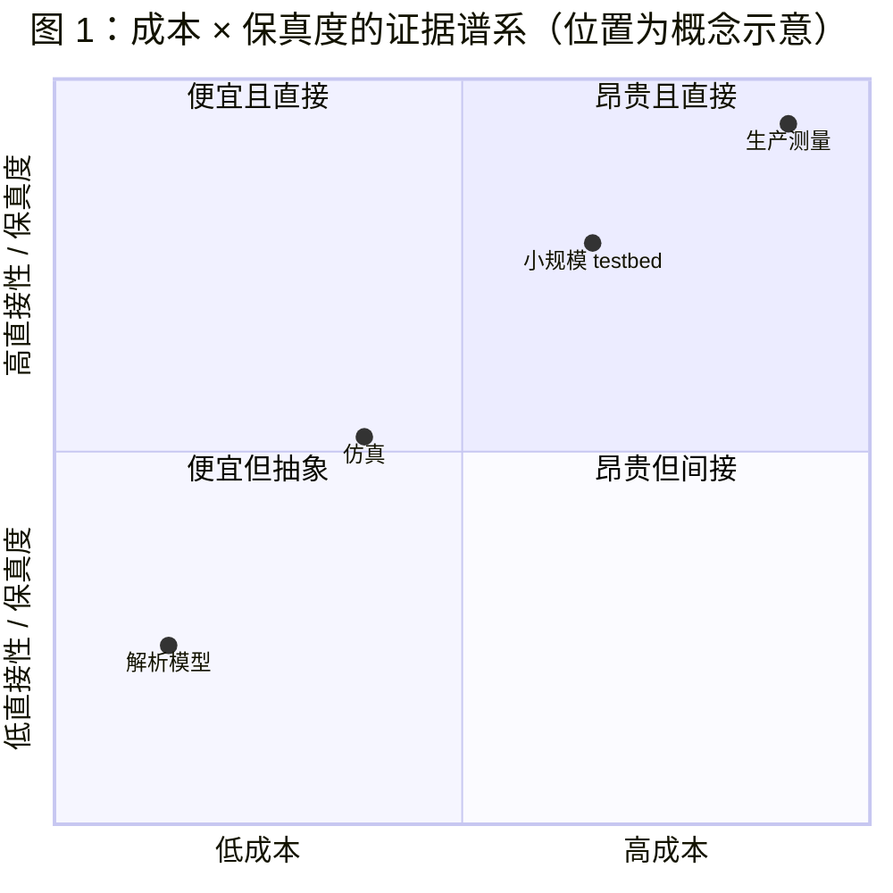
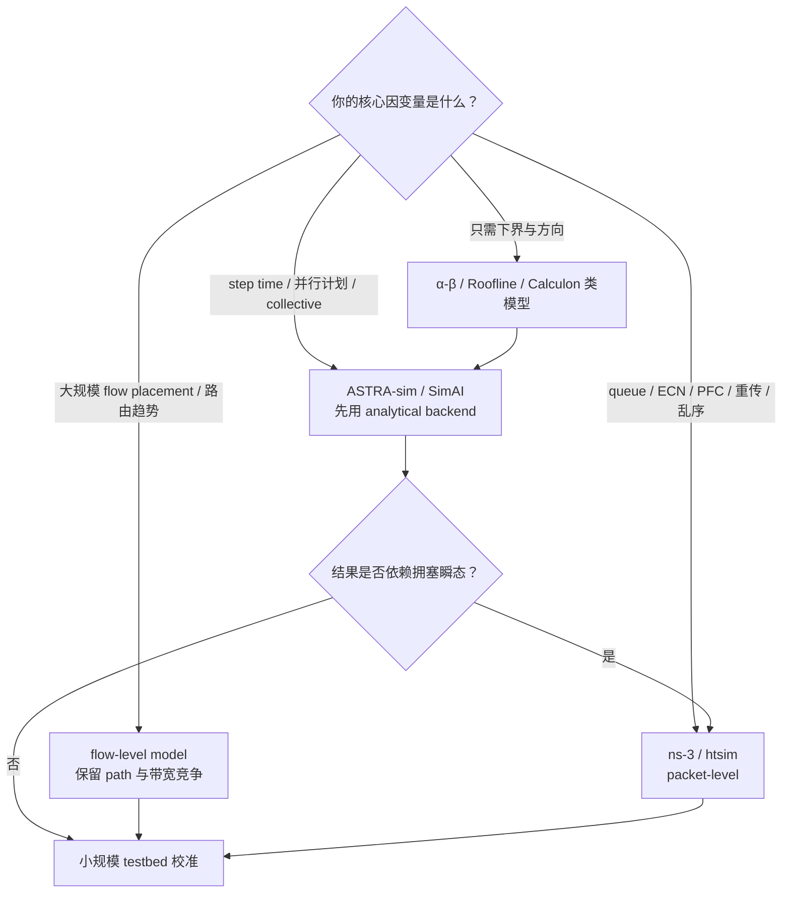
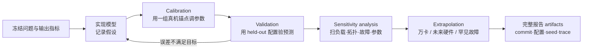

# L67 测量仿真与评测：没有万卡，也能研究万卡

> [!abstract] 本课速览
> 读完你将能够：
> 1. 沿解析模型、仿真、小规模 testbed、生产测量四级证据，判断一个系统结论“证明到了哪一步”；
> 2. 用规模、时间、负载和适用域清单阅读工业 measurement study，并为调度或 serving 研究选择公开 trace；
> 3. 在 analytical、flow-level 与 packet-level 抽象之间选择 ASTRA-sim、SimAI、ns-3 或 htsim；
> 4. 用 calibration、validation、sensitivity analysis 与完整设置报告回答“仿真凭什么可信”；
> 5. 算清万卡包级仿真的事件规模，并把研究问题落成“模型 → 仿真 → testbed → 论文”的证据链。
>
> 前置：[[L52 性能剖析与MFU核算]] · [[L37 通信算法与代价模型]] · [[L47 混合并行组装]] · 预计 65 分钟

## 论文里的这段话，你现在可能读不懂

> [!quote]
> “We conduct a **measurement study** to obtain a **workload characterization** and replay the released **trace** in a **trace-driven simulator**. The simulator combines an **analytical simulation** of computation with a **flow-level** network model; selected congestion and **fault injection** cases are checked using **packet-level simulation**. We establish **fidelity** through **calibration**, held-out **validation**, and **sensitivity analysis**, and report the limits of **extrapolation**.”（改写自典型系统论文表述）

这段话不是在说“我们没有机器，所以编了一组结果”。它在交代一条证据链：先从真实系统抽取负载，再用与问题匹配的抽象做受控实验，最后用真机和稳健性检查约束外推。==没有万卡不是放弃万卡问题的理由，但你必须让每一步的假设都能被检查。==

## 一、证据不是“真 / 假”二选一，而是一条谱系

系统研究常见四级证据。[[L37 通信算法与代价模型]] 的 $\alpha$-$\beta$ 模型属于第一层，[[L52 性能剖析与MFU核算]] 的真机 profiler 属于后三层的取证工具。

| 证据层级 | 回答什么 | 典型成本 | 强项 | 主要盲区 |
|---|---|---|---|---|
| 解析模型 | 方向是否值得、瓶颈下界在哪 | 分钟到天，常可手算 | 快、透明、适合扫大范围 | 忽略队列、调度、协议状态与实现细节时可能出现倍数级偏差 |
| **simulator**（仿真器） | 某个机制在受控条件下怎样变化 | 分钟到小时，取决于抽象与规模 | 可重复、可注入未来硬件和罕见故障 | 结论只对模型覆盖的机制成立 |
| **testbed**（试验床） | 实现能否在一组真实软硬件上工作 | 数卡到数十卡、数天到数周 | 协议栈、runtime 和硬件噪声都是真实的 | 小规模成立不自动推出万卡成立 |
| 生产测量 | 真实部署里究竟发生了什么 | 昂贵，常需工业访问权限 | 代表真实规模、故障和运维复杂度 | 不可随意控制变量，数据常不可公开或难复现 |

这里的 **fidelity**（保真度）不是“代码越多越真”，而是模型能否保留当前研究问题需要的真实行为。研究 ECN/PFC、队列和乱序时，packet state 很重要；研究 TP/PP/DP 组合的 step time 时，把每个 packet 都展开反而可能让实验跑不完。

也不要给四层证据硬贴一个通用误差条。不同工作负载、参数区间和输出指标的误差完全不同：同一 simulator 可能把大消息 collective 时间拟合得很好，却在短消息、故障恢复或拥塞尾部失准。合格论文应报告自己测到的误差分布和适用域，而不是引用“仿真通常误差 10%–30%”当许可证。

### 1.1 三篇论文怎样打“组合拳”

1. Meta 的《RDMA over Ethernet for Distributed AI Training at Meta Scale》（SIGCOMM 2024）先对生产训练作业做 **workload characterization**（工作负载刻画），再用 flow-level network simulator 比较路由方案，随后给出真实 NCCL benchmark 与部署经验。尤其重要的是：生产中多链路故障比仿真假设更常见，反过来修正了部署选择。这是“测量 → 仿真 → benchmark → 生产反馈”的闭环。[论文正式 PDF](https://engineering.fb.com/wp-content/uploads/2024/08/sigcomm24-final246.pdf)
2. 《Alibaba HPN: A Data Center Network for Large Language Model Training》（SIGCOMM 2024）的主要证据是生产流量观察、网络设计、部署经验与真实 benchmark，不应笼统写成“测量 + 仿真”。它适合学习工业论文怎样从 workload 特性推导 topology、可靠性与运维取舍。[论文 DOI](https://doi.org/10.1145/3651890.3672265)
3. 《DistServe: Disaggregating Prefill and Decoding for Goodput-optimized Large Language Model Serving》（OSDI 2024）实现了端到端原型，又把 simulator 的 SLO attainment 与 testbed 实测逐项对表；校准后才用 simulator 搜索真机穷举不起的 placement。这是“原型 + 校准过的仿真外推”。[USENIX 正式论文](https://www.usenix.org/system/files/osdi24-zhong-yinmin.pdf)

> [!tip] 证据组合的心智模型
> 解析模型像地图，仿真像沙盘，testbed 像封闭道路试车，生产测量像真实城市交通。地图不能替代上路，但直接冲进城市也很难安全地比较一百种方案。

## 二、测量论文与公开 trace：免费的生产集群实习

**measurement study**（测量研究）以观测真实系统或工作负载、总结稳定结构和异常为主要贡献。它不等于“画几张 CDF”。你读工业测量论文时，至少做完下面六问：

1. **测的哪张网 / 哪一层？** backend training fabric、frontend、单个 collective，还是端到端 job？
2. **规模多大？** GPU、host、rack、job、request 和 tenant 各多少；抽样是否漏了最大作业？
3. **时间多长？** 一小时、一天还是数月；是否跨版本发布、节假日和故障季节？
4. **什么负载？** 推荐、dense LLM、MoE、训练或推理；collective mix、请求长度和并行策略是什么？
5. **指标怎样采？** scheduler logs、NIC counters、Chakra events、application logs 还是问卷；采样间隔和缺失值怎样处理？
6. **结论适用到哪？** 哪些是该集群事实，哪些能迁移到别的 topology、硬件代际或 workload？

**workload characterization**（工作负载刻画）是把原始观测压成可用于设计的结构，例如 job-size distribution、collective mix、arrival burstiness、prompt/output length、failure category。Meta 的论文统计了生产 collective；Alibaba HPN 从 LLM 训练的周期性 burst 与少量 elephant flows 出发设计网络；《MegaScale: Scaling Large Language Model Training to More Than 10,000 GPUs》（NSDI 2024）则把万卡训练效率、稳定性与可观测性放在同一个生产系统里讨论。[Meta 工程导读](https://engineering.fb.com/2024/08/05/data-center-engineering/roce-network-distributed-ai-training-at-scale/) · [MegaScale 正式页面](https://www.usenix.org/conference/nsdi24/presentation/jiang-ziheng)

### 2.1 Trace 不是流量发生器的 CSV，而是带边界的证据

**trace**（轨迹）是按时间记录的 job、request、resource、network 或 failure 事件序列。把它重放或按其统计模型生成输入来驱动 simulator，叫 **trace-driven simulation**（轨迹驱动仿真）。两者之间还隔着一层语义：字段缺失、匿名化、采样、时间缩放和合成 payload 都会改变你能回答的问题。

| 公开资产 | 内容与可核实规模 | 适合研究 | 不能直接回答 |
|---|---|---|---|
| [Microsoft Philly trace](https://github.com/msr-fiddle/philly-traces) | 2017 年提交的 117,325 个 DNN jobs，含调度尝试和分钟级 GPU/CPU/memory utilization | gang scheduling、locality、failure、fragmentation；复现 [[L35 GPU集群调度]] 问题 | 2026 年 LLM serving 的长度分布、continuous batching 或 KV cache |
| [Alibaba PAI GPU trace 2020](https://github.com/alibaba/clusterdata/tree/master/cluster-trace-gpu-v2020) | 约两个月、超过 6,500 GPUs / 约 1,800 machines，含训练与推理 job/task/instance/resource 表 | 异构 GPU 调度、装箱、资源利用与 trace-driven scheduler evaluation | 新一代大模型并行通信和当前 GPU 性能常数 |
| [Azure LLM Inference Traces](https://github.com/Azure/AzurePublicDataset) | 2023 单日样本与 2024 一周样本，记录两个服务的 timestamp、input/output tokens | arrival、长度分布、PD sizing、autoscaling 与 serving replay | prompt 内容、用户质量、完整内部 queue/KV 状态 |
| [BurstGPT](https://github.com/HPMLL/BurstGPT) | 公开版本含数百万请求、跨连续数月，记录 timestamp、request/response tokens、model、log type 等 | burstiness、request scheduling、容量规划和 SLO 压测 | 任意私有业务的未来到达过程；也不能无条件代表新模型/新产品 |

使用 trace 前写一张“代表性卡片”：采集时间、来源服务、字段、缺失值、匿名化、许可、你做的过滤/缩放，以及目标 workload 与原 trace 的相似和不同。2019 年 Philly 仍能回答 gang scheduling，却不能因为“是真实 trace”就被包装成 2026 年 LLM 请求。**reproducibility**（可复现性）还要求公开预处理脚本、随机种子、派生 trace 的生成规则和版本，而不只是贴下载链接。

> [!warning] 有 trace 不等于有论文
> Trace 只是输入。贡献要来自新问题、可检验机制和严谨评测；否则只是把别人的数据重新画图。尤其不能把 arrival rate 乘 100 后仍称为“真实生产负载”——它已是基于真实形状的构造实验，必须明说。

## 三、仿真器地形图：抽象层要和问题对齐

**analytical simulation**（解析式仿真）用公式或粗粒度事件估计 compute、memory 和 communication；**flow-level simulation**（流级仿真）把一个 flow 当作基本对象，建模 path、共享带宽与完成时间；**packet-level simulation**（包级仿真）展开 packet、queue、ACK/ECN/PFC、drop/retransmission 等状态。越往下信息越密，通常也越慢。

| 研究问题 / 工具 | 解析模型 / Calculon 类 | ASTRA-sim | SimAI | flow-level backend | ns-3 / htsim 包级 |
|---|---:|---:|---:|---:|---:|
| 并行策略、device mesh、collective 组合 | ◎ | ◎ | ◎ | △ | × |
| 计算—通信 overlap、训练 step time | △ | ◎ | ◎ | △ | △ |
| topology / routing 的大规模趋势 | △ | ◎ | ○ | ◎ | ○ |
| queue、incast、ECN/PFC、retransmission | × | 取决于 backend | 取决于网络模型 | △ | ◎ |
| 万卡参数扫描 | ◎ | ◎ | ◎ | ○ | 通常昂贵 |
| 单包乱序、故障瞬态 | × | 取决于 backend | 取决于网络模型 | × | ◎ |

图 2 的符号不是工具排名：◎ 表示天然匹配，○ 表示可做，△ 表示需额外建模或只能答部分问题，× 表示抽象层通常不保留所需状态。

### 3.1 几个名字分别擅长什么

- **ASTRA-sim** 是 distributed AI system simulator：把 workload、collective/system layer 与 compute/memory/network 模型组合起来，适合研究“并行策略 × 集合通信 × topology”的 co-design。官方 2.x 文档提供 analytical 与 ns-3 等网络路径，2026 年官方 tutorial 又列出 HTSim integration；具体 backend、输入格式和可用分支会变化，实验必须固定 commit。[[L68 实践-仿真上手]] 先用 analytical backend 跑通闭环。[官方仓库](https://github.com/astra-sim/astra-sim) · [官方文档](https://astra-sim.github.io/astra-sim-docs/) · [2026 tutorial](https://astra-sim.github.io/tutorials/isca-2026)
- **SimAI** 是阿里开源的大规模 LLM 训练全栈 simulator，选择性接入 training framework、kernel computation 与 collective communication 模型，并在正式论文中用真实集群验证精度与扩展性。认住它，重点学习其 validation 章节怎样写，而不是背某个平均精度数字。《SimAI: Unifying Architecture Design and Performance Tuning for Large-Scale Large Language Model Training with Scalability and Precision》发表于 NSDI 2025。[USENIX 正式页面](https://www.usenix.org/conference/nsdi25/presentation/wang-xizheng-simai)
- **ns-3** 是面向 Internet systems 的开源 discrete-event network simulator。它能展开 packet、queue、protocol 和 link event，是研究 congestion control、failure 和 incast 的显微镜；代价是模型细、事件多，规模与参数扫描速度成为上限。[官方文档](https://www.nsnam.org/documentation/)
- **htsim** 是轻量高性能 discrete-event network simulator，主要用于 congestion-control 行为；当前生态中常见 UEC transport、fat-tree 和 incast 等实验。它比通用 ns-3 更专注，但协议/硬件覆盖面也取决于分支和实现，引用时固定仓库与 commit。[SPCL HTSIM 仓库](https://github.com/spcl/HTSIM)
- FlexFlow 与 Calculon 这类工具也要认名：前者用 execution simulator/cost model 搜索 parallelization strategy，后者用高层解析模型做 LLM—系统 co-design。它们适合快速设计空间探索，不该被当成 packet-network simulator。[FlexFlow 论文与项目](https://flexflow.ai/) · [Calculon 仓库](https://github.com/calculon-ai/calculon)

一句话选型法：==研究 congestion control 别只用 flow-level，研究并行策略别一上来就模拟每个 packet。== 专业性不在“用了最重的工具”，而在抽象恰好保留因果链。

## 四、算一算：万卡满载一秒，为什么包级会跑不动

> [!example] 算一算 A：10K 节点的一秒流量有多少包
> 采用 [[03 约定与符号]] 的单位口径：每个节点一条 400 Gb/s 端口，按每方向 $400\times10^9\ \mathrm{b/s}$。教学场景再假设 10,000 个节点在同一方向满载 1 s，每个 packet 承载 1,500 B；这是规模题设，不是某仿真器的默认 MTU。
>
> 总 bit 数：
>
> $$
> D_{bit}=10^4\times400\times10^9\times1
> =4\times10^{15}\ \mathrm{b}。
> $$
>
> 先按 $1\ \mathrm{B}=8\ \mathrm{b}$ 换成 Byte，再除以 payload：
>
> $$
> N_{pkt}=\frac{4\times10^{15}}{8\times1500}
> =3.33\times10^{11}\ \text{packets}。
> $$
>
> 也就是约 3,333 亿个 packet。若把 $r_e$ 定义为 simulator 每个 wall-clock second 能处理的 packet-event 数，并做最乐观的“每 packet 只产生一个 event”下界：
>
> $$
> T_{sim}\ge\frac{N_{pkt}}{r_e}。
> $$
>
> 教学场景取 $r_e=10^6\ \mathrm{events/s}$：
>
> $$
> T_{sim}\ge3.33\times10^5\ \mathrm{s}
> =92.6\ \mathrm{h}\approx3.86\ \mathrm{days}。
> $$
>
> 若 $r_e=10^7\ \mathrm{events/s}$，下界仍为 $9.26\ \mathrm{h}$。$10^6/10^7$ 是用于展示线性关系的题设，不是 ns-3 或 htsim 的性能承诺；真实 packet 往往触发入队、出队、ACK、timer 等多个 events，所以实际时间可能更长。若按双向同时满载、加入 headers 或重传，事件数还会继续增加。

这就是大规模研究退到 flow-level、analytical 或混合仿真的原因。常见混合方式是：用粗模型扫描 10,000 组配置，筛出几十组候选；再把最可能受 queue/transport 影响的局部 topology 交给 packet-level；最后在 testbed 测少量锚点。抽象不是偷懒，而是把算力花在能改变结论的状态上。

## 五、仿真凭什么可信：校准、验证、敏感性三道关

**calibration**（校准）用真机或可信基准数据估计模型参数，例如 effective bandwidth、collective latency、kernel time；**validation**（验证）则把已经校准的模型拿到未参与调参的消息大小、collective、topology 或 workload 上，看它能否预测。用同一张表既调参又宣称验证，叫拟合，不叫独立证据。

**sensitivity analysis**（敏感性分析）系统扫描不确定参数，检查结论是否只在一个幸运点成立。**extrapolation**（外推）则是把小规模或已见区间的模型用于更大规模、未来硬件或新故障域；外推越远，越要给敏感性、物理约束与交叉证据。

### 5.1 一个明确标注的校准算术示例

> [!example] 算一算 B：ASTRA-sim 与 8 卡 nccl-tests 对表
> 下面的 $0.61\ \mathrm{ms}$ 与 $0.67\ \mathrm{ms}$ 是为了教误差计算而构造的示例，**不是 ASTRA-sim 或某台 8-GPU 机器的公开 benchmark**。假设同一 8-rank、同一 message size、同一 all-reduce 配置下，simulator 预测 $T_s=0.61\ \mathrm{ms}$，`nccl-tests` 多次运行的中位数为 $T_m=0.67\ \mathrm{ms}$。以实测为分母：
>
> $$
> \mathrm{relative\ error}
> =\frac{|T_s-T_m|}{T_m}\times100\%
> =\frac{0.06}{0.67}\times100\%
> \approx8.96\%\approx9.0\%。
> $$
>
> 若把二者比值作为诊断量：
>
> $$
> k=\frac{T_m}{T_s}=\frac{0.67}{0.61}\approx1.098。
> $$
>
> 你可以据此检查 effective bandwidth、固定 $\alpha$、NCCL protocol、channel 数和软件开销是否少建了一层，却不能把所有预测无脑乘 $1.098$。正确做法是用部分 message sizes 校准，再在未参与调参的 sizes、tree/ring 或跨节点配置上 validation；同时报告 median/p99 或 run-to-run variance。`nccl-tests` 同时检查 NCCL operation 的性能与正确性，适合做 collective 锚点。[官方仓库](https://github.com/NVIDIA/nccl-tests)

### 5.2 审稿人会沿这张清单找洞

| 检查项 | 最低合格报告 |
|---|---|
| Workload | model、parallel plan、batch/sequence、execution/communication trace 来源与预处理 |
| Compute | kernel/operation time 来源，是否允许 overlap，未建模的 runtime 开销 |
| Network | physical/logical topology、每方向 bandwidth、latency、queue/buffer、routing、transport、message/packet size |
| Failure | component、failure distribution/correlation、检测延迟、repair/recovery policy、随机种子 |
| Calibration | 真机型号与软件版本、训练点、拟合参数和误差定义 |
| Validation | held-out 配置、误差分布、失败案例，而非只报平均值 |
| Sensitivity | 关键参数范围、趋势是否稳健、结论翻转点 |
| Reproducibility | simulator commit、patch、全部 config、trace/license、运行命令、seed、分析脚本与机器环境 |

**fault injection**（故障注入）是在仿真或 testbed 主动制造 GPU、host、link、switch、控制面或状态异常，测检测、隔离、重路由、重配和恢复；它把 [[L53 大规模训练可靠性]] 与 [[L65 推理服务生存性]] 的时间线接到评测接口。相关故障不能只用独立随机单链路失败：rack power、ToR、共享光路和 control-plane bug 会成组影响参与者。

**digital twin**（数字孪生）可以看作更靠近运营的一种模型：持续吸收 topology、telemetry、workload 和配置状态，用来预测变更或故障影响。名字听起来高级，但可信度标准不变；若输入遥测过期、模型没校准，它只是会自动刷新错误答案的 simulator。

## 六、Benchmark 不是 simulator，也不是 trace

三类资产容易被混在一起：trace 规定“喂什么”，simulator 规定“怎样演化”，benchmark 规定“按什么规则比较”。

- **MLPerf** 是 MLCommons 维护的 training/inference benchmark 家族，用固定 workload、quality target、scenario 与规则提供行业可比口径。它适合跨系统比较，但不能替代你的机制 microbenchmark，也不能把不同 division/version 的数字混在一列。[MLPerf Training](https://mlcommons.org/benchmarks/training/) · [MLPerf Inference](https://docs.mlcommons.org/inference/)
- `nccl-tests` 是 collective 通信体检：按 message size、rank/group 和 operation 输出 latency/bandwidth，并检查 correctness。它既是 [[L38 NCCL解剖]] 的工程工具，也是本课 calibration 的真机锚点。
- GenAI-Perf 与 `vllm bench serve` 用请求率、并发、input/output length 或 dataset 驱动 serving，测 TTFT、inter-token latency、request latency 和 throughput。NVIDIA 当前文档已注明 GenAI-Perf 正在退出积极开发，新实验应同时检查其后继 AIPerf；论文必须固定工具版本。[GenAI-Perf / AIPerf 说明](https://docs.nvidia.com/deeplearning/triton-inference-server/user-guide/docs/perf_analyzer/genai-perf/README.html) · [vLLM serving benchmark](https://docs.vllm.ai/en/stable/api/vllm/benchmarks/serve/)

> [!warning] 三个常见误区
> 1. **“仿真就是造假。”** 未披露假设、只挑有利参数才是问题；经校准的受控外推是系统研究的正常证据。
> 2. **“packet-level 最真实，所以永远最好。”** 若事件规模让你只能跑 16 nodes，它可能回答不了 10K-node placement 问题；保真度必须相对于研究问题定义。
> 3. **“小 testbed 对上一个点，万卡就可信。”** 单点一致可能是参数抵消。必须做 held-out validation、参数扫描和故障/边界案例。

## 七、与研究的连接：把“没有集群”改写成评测设计

面向分布式训练/推理的网络与系统优化，一条可执行的课题组工作流是：

1. **解析模型定方向**：用 $\alpha$-$\beta$、Roofline、queueing 或容量账排除物理上不可能的 idea，明确关键因变量。
2. **ASTRA-sim / flow-level 扫设计空间**：研究 parallel plan、topology、bandwidth allocation、mapping 与故障恢复的主趋势。
3. **ns-3 / htsim 测机制**：只有结论依赖 congestion、queue、ECN/PFC、retransmission 或 packet spray 时才下钻。
4. **8 卡 testbed 校准**：用 `nccl-tests`、step time、serving benchmark 和 fault injection 建锚点；报告真机无法覆盖的规模区间。
5. **组合证据写论文**：主结论至少由两个层级支撑，负结果和适用域一起交代。

这条路径尤其适合四组 open problems：

- **训练网络**：collective schedule 与 routing 联合优化；先在 ASTRA-sim 定规模趋势，再在 ns-3/htsim 看 incast 和拥塞控制。
- **推理服务**：用 Azure/BurstGPT replay 请求，联合优化 routing、batching、KV placement 和 SLO；用小规模 vLLM/GenAI benchmark 校准 latency model。
- **生存性**：对 GPU、link、rack、region 做相关 fault injection，优化 checkpoint、failover、degraded service 与 capacity headroom，指标用恢复时间、任务完成率和 SLO violation。
- **仿真可信度本身**：做 multi-fidelity simulation、自动 calibration、uncertainty propagation，或把生产 telemetry 接成面向 AI workload 的 digital twin。

下一课 [[L68 实践-仿真上手]] 会把这条链缩成第一次可亲手完成的闭环：$\alpha$-$\beta$ 手算 → ASTRA-sim analytical backend → 与锚点对表 → 扫 rank/bandwidth → 写出一段可复现的 simulation setup。

## 回到开头那段话

> “We conduct a **measurement study** to obtain a **workload characterization** and replay the released **trace** in a **trace-driven simulator**.”

现在你能读出：作者先说明真实数据从哪里来，把原始日志提炼成 arrival、length、collective、failure 等结构，再用公开或派生 trace 驱动可重复实验。你还会追问采集规模、时间、字段、预处理与代表性，而不是看到 “production trace” 就默认结论普适。

> “The simulator combines an **analytical simulation** of computation with a **flow-level** network model; selected congestion and **fault injection** cases are checked using **packet-level simulation**.”

这是 multi-fidelity 选型：compute 和大规模路径先用粗抽象，只有 queue、transport、failure transient 需要的局部才展开 packet。三层不是互相竞争，而是各自保留不同状态，用总算力换到更大的可回答问题范围。

> “We establish **fidelity** through **calibration**, held-out **validation**, and **sensitivity analysis**, and report the limits of **extrapolation**.”

校准负责调参数，held-out validation 负责检验预测，敏感性负责证明结论不是幸运点，外推边界负责告诉读者万卡/未来硬件结论离真实锚点有多远。到这里，你已经能把“仿真凭什么可信”拆成可审查的四个动作。

## 术语卡片

| 术语 | 中文 | 一句话解释 |
|---|---|---|
| measurement study | 测量研究 | 以真实系统或 workload 的系统性观测与归纳为主要证据的研究。 |
| workload characterization | 工作负载刻画 | 把原始日志提炼成 arrival、size、collective、resource、failure 等可用于设计的结构。 |
| trace | 轨迹 | 按时间记录 job、request、resource、network 或 failure 事件的序列。 |
| trace-driven simulation | 轨迹驱动仿真 | 用真实或派生 trace 的事件顺序与属性驱动 simulator。 |
| simulator | 仿真器 | 按明确状态、规则和参数重现目标系统行为的程序化模型。 |
| ASTRA-sim | ASTRA-sim 分布式 AI 仿真器 | 联合建模 workload、collective、compute/memory/network 的 distributed AI simulator。 |
| SimAI | SimAI 大模型训练仿真器 | 面向大规模 LLM 训练、组合 framework/kernel/collective 模型的全栈 simulator。 |
| ns-3 | ns-3 网络仿真器 | 面向 Internet systems 的开源 discrete-event network simulator。 |
| htsim | htsim 网络仿真器 | 聚焦 datacenter congestion-control 行为的轻量高性能 discrete-event simulator。 |
| packet-level simulation | 包级仿真 | 展开 packet、queue、ACK/ECN/PFC、drop 与 retransmission 的仿真。 |
| flow-level simulation | 流级仿真 | 以 flow 为基本对象、建模 path、共享带宽与完成时间的仿真。 |
| analytical simulation | 解析式仿真 | 用公式或粗粒度事件近似 compute、memory 与 communication 的仿真。 |
| fidelity | 保真度 | 模型对当前研究问题所需真实行为的保留程度。 |
| calibration | 校准 | 用代表性真机或基准锚点估计并调整模型参数。 |
| validation | 验证 | 在未参与调参的配置或数据上检查模型预测能力与误差。 |
| sensitivity analysis | 敏感性分析 | 扫描关键参数，检查结论稳健性与翻转边界。 |
| fault injection | 故障注入 | 主动制造组件、网络、状态或控制面异常并测量系统反应。 |
| digital twin | 数字孪生 | 持续吸收真实 topology、telemetry 与 workload 状态的运营模型。 |
| MLPerf | MLPerf 行业基准 | 用统一 workload、quality target、scenario 与规则比较 ML 系统的 benchmark 家族。 |
| reproducibility | 可复现性 | 他人能依据 artifacts、配置、版本和随机性说明重新得到相符结果的性质。 |
| testbed | 试验床 | 为可控、可重复实验搭建的一组真实软硬件环境。 |
| extrapolation | 外推 | 把已校准区间的模型用于更大规模、未来配置或未直接测量条件。 |

## 自测

1. 为什么生产测量的 fidelity 高，却不自动拥有最高 reproducibility 和因果识别能力？
2. 你要研究 ECN threshold 对 incast p99 FCT 的影响，应优先选 flow-level 还是 packet-level？若研究 10K-GPU TP/PP/DP mapping 呢？
3. 一个 2,000-node 集群，每节点一条 400 Gb/s 端口，单方向满载 0.5 s，按 1,500 B payload 计算约有多少 packets？若最乐观处理 $5\times10^6$ packet-events/s，wall-clock 下界多久？
4. calibration 与 validation 的区别是什么？为什么不能用同一批 points 完成二者后只报一个平均误差？
5. 使用 2017 Philly trace 研究 2026 LLM serving scheduler，至少有哪三项代表性缺口？它仍适合回答什么问题？
6. 设计一个 fault injection 实验：对象为跨机训练的 ToR failure，写出故障模型、检测/恢复链、输出指标和至少两个 sensitivity parameters。
7. 为“拓扑感知的 collective routing”写一个四级证据计划，并明确哪一项结论只能外推、不能由 8 卡 testbed 直接证明。

> [!note]- 参考答案
> 1. 生产测量看到真实部署，但控制变量受业务与运维限制，数据/代码也可能不可公开；相关性还可能混入 workload、版本和调度变化。高直接性不等于可重复操纵同一条件，也不等于自动建立因果。
> 2. ECN、queue 和 p99 FCT 依赖 packet state，优先 ns-3/htsim 类 packet-level；10K-GPU parallel mapping 先用 ASTRA-sim/SimAI 或 analytical/flow-level，只有候选方案的局部拥塞机制需要下钻包级。
> 3. $D=2000\times400\times10^9\times0.5=4\times10^{14}\ \mathrm{b}$；$N=4\times10^{14}/(8\times1500)=3.33\times10^{10}$ packets。时间下界 $3.33\times10^{10}/(5\times10^6)=6.67\times10^3\ \mathrm{s}\approx1.85\ \mathrm{h}$。多事件/包、双向流量和重传都会增大它。
> 4. calibration 用锚点估参数；validation 用未参与调参的配置检验预测。复用同一点只说明拟合训练数据，平均误差还可能掩盖短消息、尾部或特定 topology 的系统性失败。
> 5. 缺口包括 workload 类型（DNN training job 而非 token request）、模型/runtime 机制（无 continuous batching/KV cache）、硬件和软件代际、时间分布与 SLO 字段。它仍适合研究 gang scheduling、locality、failure retry、GPU fragmentation 等结构问题，但要说明映射。
> 6. 例：在固定 step 注入一个 ToR fail-stop，并另建同 rack 多链路相关 failure；链为 heartbeat/telemetry 检测 → 隔离 → communicator rebuild / reroute → 恢复吞吐。输出 detection time、reconfiguration time、lost work、JCT、MFU/goodput；扫描检测阈值、受影响 workers、checkpoint age、备用带宽与故障持续时间。
> 7. 解析层用 $\alpha$-$\beta$ 和 cut capacity 判断收益上界；ASTRA/flow-level 扫 10K ranks、placement 和 failure；packet-level 验证候选 routing 的 queue/ECN；8 卡/多节点 testbed 用 `nccl-tests` 校准并对照小规模趋势。10K 下的绝对 JCT、故障相关性与控制面扩展性仍是外推，必须给敏感性和适用域。

## 延伸阅读

- ASTRA-sim 官方论文、仓库与 tutorial：先读 architecture 和 network API，再跟 [[L68 实践-仿真上手]] 跑 analytical backend；目标是学会固定 commit 与配置，不是先追求复杂 backend。
- 《SimAI: Unifying Architecture Design and Performance Tuning for Large-Scale Large Language Model Training with Scalability and Precision》（NSDI 2025）：重点精读 evaluation 的 testbed、ground truth、accuracy 与 scalability 分离写法。
- 《RDMA over Ethernet for Distributed AI Training at Meta Scale》（SIGCOMM 2024）：精读 workload characterization、flow-level simulation、NCCL benchmark 与生产决策互相修正的证据链。
- 《Alibaba HPN: A Data Center Network for Large Language Model Training》（SIGCOMM 2024）：重点读 workload observations、deployment 和 operational lessons，练习标注每个结论的适用域。
- 《DistServe: Disaggregating Prefill and Decoding for Goodput-optimized Large Language Model Serving》（OSDI 2024）：读 simulator accuracy 表和 testbed 设置，辨认 calibration/validation 怎样支持 placement search。

---
上一课：[[L66 弹性算力与资源效率]] ← · → 下一课：[[L68 实践-仿真上手]]
