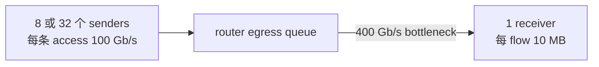

# L68 实践：仿真上手，从手算到 ASTRA-sim 校准闭环

> [!abstract] 本课速览
> 做完本课，你将能够：
> 1. 在没有 GPU 的 Linux、Windows/WSL 或 Apple Silicon 笔记本上，用 Docker 构建并跑通 ASTRA-sim analytical backend；
> 2. 逐字段解释 Chakra workload、system JSON、network YAML 与 simulator 输出；
> 3. 用 $\alpha$-$\beta$ 模型手算 8-rank ring all-reduce，并与 ASTRA-sim 在 1 MB–1 GB 区间逐点对表；
> 4. 扫 TP ranks 与 400G/NVLink 两档带宽，生成可复核的 CSV 和趋势图；
> 5. 可选用 ns-3.47 跑 8→32 发 1 收的 incast，比较 queue trace 与 FCT；
> 6. 按“设置—校准—结果—效度威胁”四段式写出第一份仿真实验报告。
>
> 前置：[[L67 测量仿真与评测]] · [[L37 通信算法与代价模型]] · [[L48 实践-并行策略推演]] · 预计 90–150 分钟

## 本次实践你要亲眼看到什么

1. **ASTRA-sim**（分布式 AI 系统仿真器）是普通 CPU 程序：没有 CUDA、没有 GPU，也能把一个 collective 的执行 trace 跑完。
2. 在同一组 $p,n,\alpha,\beta$ 下，手算曲线与 **analytical simulation**（解析式仿真）应有相同数量级和趋势；两条线不重合时，你必须能指出是哪一层假设不同。
3. 8-rank ring all-reduce 从 1 MB 扫到 1 GB 时，会从固定开销不可忽略逐渐进入带宽项主导；双对数图不是装饰，它让 regime 切换显出来。
4. 同一条 Llama-3-70B activation all-reduce 放在 450 GB/s 单向 NVLink 上限和 400 Gb/s（50 GB/s）网卡上，通信账会拉开明显差距；但这仍不是训练 step time。
5. 可选 ns-3 实验把 collective 粗粒度时间换成 packet/queue/FCT：**incast**（多对一瞬时汇聚）的信息多得多，事件与输出文件也随发送者数迅速增长。

这一课的灵魂不是“安装成功”，而是第一次完成下面这条闭环：


## 〇、环境准备：先把版本钉死

### 0.1 本课固定的工具边界

ASTRA-sim 仍在快速演化。只写“latest”意味着同学下个月可能连示例目录都找不到。本课截至 2026-08-05 核实并固定为：

| 项目 | 本课基线 | 为什么要记录 |
|---|---|---|
| ASTRA-sim 文档 | [官方 2.2 文档](https://astra-sim.github.io/astra-sim-docs/) | 定义 workload/system/network/remote-memory 四类输入 |
| ASTRA-sim 源码 | [`518bd513ae11…`](https://github.com/astra-sim/astra-sim/tree/518bd513ae110428cd62eb60efc0f3993fd53c70) | 当前示例路径、二进制名和配置字段以此 commit 为准 |
| Workload | Chakra ET，文件名 `{prefix}.{rank}.et` | 2.x 不再把旧文本 workload 当主输入 |
| 后端 | congestion-unaware analytical backend | 单 collective 校准先隔离拥塞，问题最小 |
| ASTRA 时间 | 1 cycle = 1 ns | pinned commit 的 `CLOCK_PERIOD=1` ns；报告先换成 ms 再比较 |
| 可选网络实验 | [ns-3.47](https://www.nsnam.org/releases/ns-3-47/) | 本课 `L68_incast.cc` 已按该 release API 编译运行 |

官方文档的 getting-started 页面仍展示旧的 `examples/network_analytical/` 路径，而 pinned commit 已把示例重组到 `examples/run_scripts/`、`examples/workload/`、`examples/system/` 与 `examples/network/`。所以本课优先使用 commit 内实际文件，不把旧截图当接口契约。[官方安装页](https://astra-sim.github.io/astra-sim-docs/getting-started/setup.html)仍推荐 Docker；当前 Dockerfile 只准备依赖、不会 `COPY` 源码，因此下面显式 bind-mount 仓库。

> [!warning] “版本号”还不够
> 论文 artifact 至少记录 release/tag、完整 commit、submodule commits、配置文件和 dirty 状态。ASTRA-sim 主仓库与 analytical/ns-3/Chakra 子模块会分别变化；只写“ASTRA-sim 2.x”无法定位一次实验。

### 0.2 最低硬件与三条路径

| 路径 | 最低环境 | 能完成什么 | 不能声称什么 |
|---|---|---|---|
| 纯 Python | Python 3.9+，任意 CPU | 手算、CSV、SVG、报告模板；任务 B/C 的解析基线 | 没有 ASTRA 曲线，不能说“仿真已校准” |
| Docker 主路径 | Docker Desktop/Engine，建议 8 GB 可用内存 | ASTRA-sim 构建、官方示例、任务 A–C；Intel/Arm Mac 均无需 GPU | Docker 中的预测不是本机 NCCL 实测 |
| Linux bare metal | 官方列出的 C++/CMake/Boost/Protobuf/OpenMPI 依赖 | 与 Docker 同样的 ASTRA 任务 | 依赖版本漂移必须单独记录 |

本课主脚本是 [[L68_sim_lab.py]]。先在课程仓库根目录做不依赖 ASTRA-sim 的离线自检：

```bash
python3 "M9 前沿专题/实践代码/L68_sim_lab.py" --self-test
python3 "M9 前沿专题/实践代码/L68_sim_lab.py" \
  --out-dir results/l68-hand
```

预期输出：

```text
[PASS] alpha-beta accounts and dependency-free SVG rendering
[INFO] --astra-root omitted: generating the hand-model baseline only.
[PASS] wrote L68 artifacts to .../results/l68-hand
```

这三个提示只证明公式、CSV 和 SVG 逻辑能运行，不证明 ASTRA-sim 的数值正确。

### 0.3 Docker 主路径：完整可复制的命令

先在任意工作目录克隆源码并固定 commit：

```bash
git clone https://github.com/astra-sim/astra-sim.git
cd astra-sim
git checkout 518bd513ae110428cd62eb60efc0f3993fd53c70
git submodule update --init --recursive

git rev-parse HEAD
git submodule status
docker build -t astra-sim:l68 -f Dockerfile .
```

把 `COURSE_ROOT` 换成这门课仓库的绝对路径。路径里有空格没有关系，变量使用双引号：

```bash
export COURSE_ROOT="/你的绝对路径/Foundation of Distributed AI Systems"

docker run --rm -it --shm-size=8g \
  -v "$PWD:/app/astra-sim" \
  -v "$COURSE_ROOT:/course" \
  astra-sim:l68 bash
```

进入容器后编译 analytical backend：

```bash
cd /app/astra-sim
bash build/astra_analytical/build.sh -t congestion_unaware

test -x build/astra_analytical/build/bin/AstraSim_Analytical_Congestion_Unaware
```

如果 Apple Silicon 上第一次构建较慢，这是 C++/Protobuf 编译，不是 simulator 需要 GPU。若 Docker 报内存不足，提高 Docker Desktop 的 memory limit；不要把宿主机架构差异写成 ASTRA 模型差异。

## 一、逐步任务

### 任务 A：先跑通官方示例，再读懂每个字段

#### A.1 运行 pinned commit 自带示例

当前仓库提供一个 8-NPU、1 MiB all-reduce 的 H100 validated analytical 示例。它使用 congestion-aware binary，示例脚本会按需再构建对应 target：

```bash
cd /app/astra-sim
bash examples/run_scripts/analytical/congestion_aware/HGX-H100-validated.sh
```

成功标准不是背一个固定 cycle 数，而是看到 8 条类似输出，并且各 rank 在对称配置下完成时间相同：

```text
[workload] [info] sys[0] finished, ... cycles, exposed communication ... cycles.
...
[workload] [info] sys[7] finished, ... cycles, exposed communication ... cycles.
```

官方 2.2 文档页面仍展示另一版 8-NPU 示例的 `64440 cycles`；那可以证明输出长什么样，不能替代当前 commit 的验收值。只要目录、配置或子模块不同，就应该保存自己的 log。[官方 workload 输入说明](https://astra-sim.github.io/astra-sim-docs/getting-started/argument-workload-config.html)

#### A.2 四类输入分别管什么

上面脚本没有魔法，核心就是把四个路径交给 ASTRA-sim：

| 输入 | pinned commit 的示例 | 关键字段 / 语义 | 最常见误读 |
|---|---|---|---|
| workload prefix | `.../all_reduce/8npus_1MB/all_reduce` | 实际读取 `all_reduce.0.et` … `.7.et`；Chakra node 含 `comm_type` 与 `comm_size` | 把 prefix 当单个文件；把官方 generator 的 MiB 当 SI MB |
| system JSON | `HGX-H100-validated.json` | ring collective、`preferred-dataset-splits`、active chunks、endpoint delay、local memory | 只看“ring”，忽略 chunk/scheduler 也会改时间 |
| network YAML | `HGX-H100-validated.yml` | topology、NPU 数、每方向 GB/s、ns 级链路 latency | 把 `400.0` 看成 400 Gb/s；这里单位是 GB/s |
| remote memory JSON | `no_memory_expansion.json` | 本例关闭 remote-memory expansion | 误以为它是网络拓扑文件 |

ASTRA-sim workload layer 读取 Chakra DAG；system layer 把 collective 拆成 send/recv；network backend 决定这些消息何时完成。输出中的 `finished cycles` 是该 rank workload 完成时刻；本例只有 communication node 时，`exposed communication` 应占主导。若 trace 里加入 compute 并允许 overlap，两者就不必相等。

> [!tip] 先画清“谁拥有哪个参数”
> `comm_size` 属于 workload；算法和 chunking 属于 system；带宽、时延和 topology 属于 network。把三层混成一个“网络配置”，遇到偏差时就不知道该改哪一层。

### 任务 B：校准闭环——1 MB 到 1 GB 逐点对表

#### B.1 先手算两个端点

按 [[L37 通信算法与代价模型]] 的 **$\alpha$-$\beta$ model**（$\alpha$-$\beta$ 代价模型），$p$ ranks 的 ring all-reduce 理想时间为

$$
T_{ring}
=2(p-1)\alpha
+2n\frac{p-1}{p}\beta,
\qquad \beta=\frac{1}{B}.
$$

本课的受控配置完全取 [[03 约定与符号]] 的教学口径：

- $p=8$；
- $\alpha=10\ \mu\text{s}$；
- 400 Gb/s 每方向 $=50$ GB/s；
- 容量按 SI，1 MB $=10^6$ B，1 GB $=10^9$ B；
- ASTRA custom lab 把 network YAML 的每个 ring-hop `latency` 设成 10,000 ns、`preferred-dataset-splits=1`，作为“每步 $\alpha$”的受控近似。

> [!example] 算一算：1 MB 与 1 GB 两个锚点
> 固定项为
>
> $$
> T_{\alpha}=2(8-1)\times10\ \mu\text{s}
> =140\ \mu\text{s}.
> $$
>
> 当 $n=1$ MB：
>
> $$
> T_{\beta}
> =\frac{2\times10^6\times7/8}{50\times10^9}\ \text{s}
> =35\ \mu\text{s},
> $$
>
> $$
> \boxed{T_{ring}=140+35=175\ \mu\text{s}=0.175\ \text{ms}}.
> $$
>
> 当 $n=1$ GB：
>
> $$
> T_{\beta}
> =\frac{2\times10^9\times7/8}{50\times10^9}\ \text{s}
> =35\ \text{ms},
> $$
>
> $$
> \boxed{T_{ring}=0.14+35=35.14\ \text{ms}}.
> $$
>
> 1 MB 时固定项占 $140/175=80\%$；1 GB 时只占约 $0.14/35.14\approx0.40\%$。同一套机器参数，消息大小已经把瓶颈从 latency term 推到 bandwidth term。

这里有一个刻意保留的“缝”：ASTRA network `latency` 是每个 modeled hop 的传播/链路项，不是跨系统通用的 $\alpha$；system layer 还有 endpoint delay、切块和调度。我们把它设成 10 µs，只是为了建立第一次可解释的对照，不是在宣称真实链路传播时延等于 collective $\alpha$。

#### B.2 让脚本生成 Chakra ET、运行、解析、画图

仍在 Docker 容器中：

```bash
python3 "/course/M9 前沿专题/实践代码/L68_sim_lab.py" \
  --astra-root /app/astra-sim \
  --task b --splits 1 \
  --out-dir /course/results/l68-s1
```

脚本对 `1, 4, 16, 64, 256, 1000 MB` 做六次实验，每次完成以下动作：

1. 按当前 Chakra schema 为 8 个 ranks 各生成一个 `.et`；
2. 写入 ring / 50 GB/s / 10,000 ns 的 network YAML；
3. 写入 `preferred-dataset-splits=1` 的 system JSON；
4. 调用 `AstraSim_Analytical_Congestion_Unaware`；
5. 取 8 个 ranks 的最大 `finished cycles`，按 1 cycle = 1 ns 转为 ms；
6. 输出 `task_b_calibration.csv` 与双对数 `task_b_calibration.svg`。

CSV 中的误差口径为

$$
\mathrm{relative\ error}
=\frac{|T_{ASTRA}-T_{hand}|}{T_{hand}}\times100\%.
$$

预期看到的不是“每点误差必须小于 5%”，而是三件更有价值的事：

- 两条曲线随 $n$ 单调上升，且大消息端接近斜率 1；
- 小消息端手算的 0.175 ms 不会像大消息那样只按 bytes 缩放；
- 差值能回到 endpoint delay、integer chunk、event ordering 与 ASTRA ring 实现，而不是用一个神秘 correction factor 抹平。

#### B.3 主动制造一次偏差：把 chunks 从 1 改成 4

```bash
python3 "/course/M9 前沿专题/实践代码/L68_sim_lab.py" \
  --astra-root /app/astra-sim \
  --task b --splits 4 \
  --out-dir /course/results/l68-s4
```

手算线仍把 collective 当一整条逻辑消息；ASTRA 则按 system 配置切分 dataset。chunking 可能增加被支付的启动/endpoint 次数，也可能提供 pipeline 机会，最终方向由实现与 active-chunk 调度决定。==校准不是要求 s1/s4 都贴住同一条线，而是解释“哪条模型多保留了一层状态”。==

报告至少并排放 `s1` 与 `s4` 的 CSV；不要只挑更贴线的一组。

### 任务 C：策略实验——70B 的 TP collective 放在哪条链路

[[L48 实践-并行策略推演]] 把 70B parallel plan 的累计通信量列进总账；这里回到 [[L43 张量并行]] 的一个原子事件。取 [[03 约定与符号]] 的 Llama-3-70B 教学形状 $d=8192$，设 $b=1,S=8192$、BF16=2 B。每次普通 TP activation all-reduce 的逻辑消息为

$$
n=bSd\times2
=1\times8192\times8192\times2
=134{,}217{,}728\ \text{B}
\approx134.2\ \text{MB}
=128\ \text{MiB}.
$$

每层 forward 2 次、backward 2 次，共 4 次；80 层共 320 次。现在扫描 $TP\in\{2,4,8\}$，链路取：

- H100 NVLink 单方向硬件上限 450 GB/s；
- 400 Gb/s 网卡每方向 50 GB/s；
- 两档都沿用 $\alpha=10\ \mu\text{s}$ 教学常数，以便只观察 $p$ 与 $B$。这不是在声称 NVLink 和 RDMA 有相同真实启动开销。

先跑解析基线；若带 `--astra-root`，同一命令还会补上 ASTRA 曲线：

```bash
python3 "/course/M9 前沿专题/实践代码/L68_sim_lab.py" \
  --astra-root /app/astra-sim \
  --task c --splits 1 \
  --out-dir /course/results/l68-strategy
```

手算基线如下，所有值都能由同一个 ring 公式复算：

| TP ranks | 链路 | 1 次 all-reduce | 每层 4 次 | 320 次完全串行记账 |
|---:|---|---:|---:|---:|
| 2 | 450 GB/s | 0.318 ms | 1.273 ms | 101.844 ms |
| 4 | 450 GB/s | 0.507 ms | 2.030 ms | 162.366 ms |
| 8 | 450 GB/s | 0.662 ms | 2.648 ms | 211.827 ms |
| 2 | 50 GB/s | 2.704 ms | 10.817 ms | 865.393 ms |
| 4 | 50 GB/s | 4.087 ms | 16.346 ms | 1307.690 ms |
| 8 | 50 GB/s | 4.838 ms | 19.350 ms | 1548.039 ms |

请照论文语言写三句结论。参考结构是：

1. **观察**：固定 134.2 MB 消息时，TP ranks 增大没有让单次 ring all-reduce 消失；$2(p-1)\alpha$ 增长，带宽项只趋近 $2n/B$。
2. **机制**：TP8 下，400G 档的每层四次通信账约 19.35 ms，450 GB/s 档约 2.65 ms；差距来自每方向带宽，而不是模型参数量改变。
3. **边界**：表中 320 次是“完全串行且每次都暴露”的记账场景，不是训练 step time；真实系统会有 compute overlap、sequence parallelism、多个 channels、有效而非峰值带宽与 topology contention。

> [!warning] 不要把 physical link ceiling 当 algorithm bandwidth
> 本表用 ring per-rank 关键路径字节 $2n(p-1)/p$ 除以物理带宽，并单独加 $\alpha$。若你改用 NCCL 报告的 `algbw=n/T`，ring 流量放大已含在测得的 $T$ 中，不能再乘一次 $2(p-1)/p$。

### 任务 D（可选）：ns-3.47 的 8→32 incast

ASTRA 任务回答“collective 在给定抽象下多久完成”；若问题换成“queue 怎样长、TCP flows 谁先完成”，就该下钻 packet-level。`[[L68_incast.cc]]` 构造如下场景：



安装依赖按 [ns-3.47 官方 tutorial](https://www.nsnam.org/docs/release/3.47/tutorial/html/index.html)；无需 GPU。把程序复制到 ns-3 源码的 `scratch/` 后运行：

```bash
git clone --depth 1 --branch ns-3.47 https://gitlab.com/nsnam/ns-3-dev.git ns-3.47
cd ns-3.47

cp "/课程绝对路径/M9 前沿专题/实践代码/L68_incast.cc" scratch/L68_incast.cc
./ns3 configure --build-profile=optimized --disable-examples --disable-tests
mkdir -p results

./ns3 run "scratch/L68_incast --senders=8 --outputPrefix=results/incast-8"
./ns3 run "scratch/L68_incast --senders=32 --outputPrefix=results/incast-32"
```

程序输出两类证据：

- `*-queue.csv`：每次 egress queue bytes 变化的时间戳；画 `time_ns → new_bytes`；
- `*-fct.csv`：每条 flow 的已收 bytes、是否完成，以及从同步启动到最后一 byte 到达的 **flow completion time (FCT)**（流完成时间）代理值。

本课源码在 ns-3.47、Apple Silicon CPU 上做过 smoke test：默认参数下 8 flows 全部完成，mean FCT 约 1.85 ms；32 flows 全部完成，约 7.26 ms。它们只是“代码和趋势能跑通”的本次输出，不是数据中心 TCP 的通用 benchmark。queue trace 行数也大致随发送者数放大 4 倍，这正是 [[L67 测量仿真与评测]] 所说的 packet-level 信息密度与速度/存储代价。

> [!warning] 这个 incast 不是 RoCE/PFC 实验
> 程序使用 ns-3 默认 TCP、DropTail queue 与 point-to-point links，没有建模 RoCE RC、ECN、PFC、NIC offload 或交换机 shared buffer。它只负责让你看到同步汇聚→排队→FCT 的因果链；研究无损网络要换匹配模型并重新 validation。

## 二、观察与解释：对上和对不上分别说明什么

### 2.1 对上数量级，是最低门槛，不是毕业证

手算与 ASTRA 接近，说明 message bytes、bandwidth 单位、rank 数和时间换算大概率没有写反。它不证明真实 NCCL 也会落在这条线上，因为当前闭环没有真机锚点、protocol/channel 选择、GPU kernel 与 congestion。

反过来，差 20% 也不自动说明 simulator 错。先按顺序查：

1. **对象一致吗？** Chakra `comm_size` 是 logical tensor bytes，还是已经除过 rank 的 chunk？
2. **单位一致吗？** ASTRA network 是 GB/s，400G NIC 是 Gb/s；cycle 在本 commit 是 ns。
3. **算法一致吗？** 手算是 ring，system 是否实际选了 ring；splits 和 active chunks 是否相同？
4. **时间边界一致吗？** 比的是最大 rank completion、平均 rank、exposed communication，还是 workload total？
5. **抽象一致吗？** network latency、endpoint delay、local reduction、queue 与 overlap 哪些被哪一边保留？

### 2.2 曲线形状比单点误差更能暴露模型问题

若 1 MB 贴得很好、1 GB 偏差持续放大，优先怀疑 effective bandwidth 或字节口径；若大消息贴合、小消息偏差大，优先怀疑启动/endpoint/chunking。若某个中间点突然跳变，检查算法切换、integer split、配置被覆盖或程序异常，而不是先做全局线性缩放。

这就是 **calibration**（校准）的正确姿势：用不同 regime 的多个点识别参数和缺失机制。只用 1 GB 一个点反推 $B_{eff}$，再拿同一个 1 GB 宣称“误差为零”，只是把答案写回题目。

### 2.3 Task C 研究的是通信杠杆，不是完整 parallel plan

TP8 的单卡 GEMM、权重切分和 activation 显存都不同于 TP2；任务 C 刻意只保留 all-reduce，才能看清 $p$ 与 $B$。真正选方案时要把结果送回 [[L48 实践-并行策略推演]]：先检查容量与 degree 合法性，再看 TP group 是否跨高速域、每层同步是否暴露、PP/DP/CP 是否竞争同一网络。

同理，ASTRA analytical 适合大范围扫 topology/bandwidth/collective；ns-3 的 queue/FCT 只在研究因变量依赖 packet state 时值得支付成本。工具越细不是越专业，抽象与问题对齐才是。

## 三、挑战题：把第一次作业长成研究雏形

### 挑战 1：Ring 与 Switch，不改 workload

取任务 B 生成的一个 case，复制其目录，把 `network.yml` 的 `topology: [ Ring ]` 改为 `topology: [ Switch ]`，其余字段不变，然后直接调用同一个 binary。先画出路径假设，再解释变化；不要把 ASTRA 的抽象 `Switch` 等同于某台真实交换机 ASIC。

### 挑战 2：把“故障”收紧成可支持的降速敏感性

当前 analytical 配置没有在本课验证瞬态 link-down/failover 接口，所以不编造故障注入命令。把 50 GB/s 改成 25 GB/s，重跑任务 B/C，把它准确命名为“持久带宽降级敏感性”；若 completion time 没有接近带宽项预期变化，追查哪个项主导。要研究故障检测、重路由和恢复瞬态，应换版本明确支持的 backend，并回收 [[L53 大规模训练可靠性]] 与 [[L65 推理服务生存性]] 的指标。

### 挑战 3：加一组真机 held-out points

在 8 卡 testbed 上用 `nccl-tests` 测 1/16/256 MB，其中 1/16 MB 用于 calibration，256 MB 留作 validation。拟合 effective $\alpha,B$ 后，报告 held-out relative error；不要把全部点都用于调参。然后讨论：ASTRA 的 topology、NCCL channels、协议与 GPU synchronization 还缺哪层。

## 回到本次实践

逐条回看开场目标：第一，Docker 中的 official example 让你看到 8 个 ranks 真正完成 Chakra workload，而纯 Python 路径保证没有 GPU也能先做解析账；第二，任务 B 的 0.175 ms 与 35.14 ms 两个手算锚点把 $\alpha$ 和 $B$ 固定下来，脚本再让 ASTRA 对同一组输入逐点回答；第三，双对数 sweep 把小消息固定项与大消息带宽项分开，`splits=1/4` 则故意暴露 chunking 的模型差异；第四，任务 C 把 70B 每层四次 collective 放到 450/50 GB/s 两档，得出可复算但不冒充 step time 的趋势；第五，可选 ns-3 用 queue 与 FCT 让你亲手感到 packet-level 的信息量和代价。

最重要的是最后一步：你没有用“误差不大”结束报告，而是写清了 workload、commit、配置、校准点、结果曲线与不能外推的边界。到这里，“我跑通了一个 simulator”才第一次变成“我有一条可审查的系统研究证据”。

## 术语卡片：仿真实验报告模板

L68 不新增必收术语；frontmatter 复用的 ASTRA-sim、analytical simulation、$\alpha$-$\beta$ model、calibration、incast 与 FCT 已分别在 [[L67 测量仿真与评测]]、[[L37 通信算法与代价模型]] 和 [[L28 数据中心网络基础]] 主讲。本课把术语卡改成后续课题组可复用的四段式报告。

| 段落 | 必须写什么 | 本课最低交付 |
|---|---|---|
| 设置（Setup） | 问题/因变量、工具 commit+submodules、workload、system、network、单位、硬件/OS、脚本命令 | `environment.json`、四类配置、原始 log；$p,n,\alpha,B,splits$ 齐全 |
| 校准（Calibration） | 手算/真机锚点、用于调参和 held-out 的点、误差定义、参数怎样得到 | 1 MB–1 GB 手算 vs ASTRA CSV；解释 s1/s4 差值 |
| 结果（Results） | 原始数据、聚合方法、趋势图、效应量与三句机制解释 | Task B 双对数图；Task C TP×带宽图；可选 queue/FCT |
| 效度威胁（Threats to validity） | 未建模机制、输入代表性、外推范围、版本漂移、随机性/重复次数 | 没有 NCCL/testbed；物理峰值≠有效带宽；TCP incast≠RoCE/PFC；commit 漂移 |

可直接复制下面这段填写，空白不能用网上 benchmark 代填：

> [!note] 仿真实验报告
> **设置**：我们在 commit `________`（submodules `________`）上，用 ________ backend 模拟 $p=__、n=__、B=__、\alpha=__$ 的 ________；输入与命令归档于 ________。
>
> **校准**：解析基线采用公式 ________。用 ________ 点估计/核对参数，用 ________ 点做 held-out validation；误差定义为 ________。
>
> **结果**：当 ________ 从 __ 扫到 __ 时，指标 ________ 从 __ 变为 __；图/CSV 为 ________。最可能机制是 ________。
>
> **效度威胁**：模型未包含 ________，workload 不代表 ________，因此结论只适用于 ________，不能外推到 ________。

## 自测

1. 为什么 pinned commit 下可以把 ASTRA 的 `finished cycles` 除以 $10^6$ 得到 ms？换 commit 后为什么仍要重新核实？
2. **计算题**：$p=8,n=64$ MB、$\alpha=10\ \mu\text{s}$、$B=50$ GB/s。求 ring all-reduce 的固定项、带宽项与总时间。
3. 为什么把 network YAML 的 `latency=10000 ns` 写成“受控的 $\alpha$ 近似”，而不能写成“400G 网络传播时延就是 10 µs”？
4. `splits=4` 后 ASTRA 与单消息手算偏差扩大，列出三个可能原因；为什么不能直接乘一个 correction factor？
5. Task C 中 TP8/400G 的每层四次手算约 19.35 ms。若只把带宽从 50 提到 100 GB/s，$\alpha$ 不变，时间会严格减半吗？说明理由。
6. ns-3 实验从 8 个发送者改成 32 个时，为什么 queue/FCT 有意义，而 ASTRA 的单 collective completion time 不能回答同一个 packet-level 问题？
7. 为任务 B 写两条 internal validity threats 和两条 external validity threats。

> [!note]- 参考答案
> 1. pinned commit 的 `Common.hh` 定义 `CLOCK_PERIOD=1` ns，$10^6$ ns = 1 ms。代码、backend 或时间基准可能随 commit 变化，所以报告必须把换算与版本绑定，而不是把“1 cycle=1 ns”当跨版本定律。
> 2. $T_\alpha=2\times7\times10\ \mu s=140\ \mu s=0.14$ ms。$T_\beta=2\times64\times10^6\times7/8/(50\times10^9)$ s $=2.24$ ms。总时间 $T=0.14+2.24=\boxed{2.38\ \text{ms}}$。
> 3. $\alpha$ 吸收 software launch、同步、endpoint、协议与可能的传播/排队等固定开销；YAML `latency` 是 backend 对每个 modeled hop 的一个输入。二者在本实验中被人为对齐，只为校准教学，物理语义并不相同。
> 4. chunk 数让固定启动/endpoint 被支付多次；scheduler 可能 pipeline 或串行 chunks；integer division、active chunks、local reduction 与 event ordering 也会变化。单一 factor 可能只拟合这一组 size/splits，无法解释别的 message regime 或 topology。
> 5. 不会严格减半。TP8 的固定项仍为 0.14 ms；带宽项减半，所以新的一次 all-reduce 约 $0.14+(4.6976/2)=2.4888$ ms，每层四次约 9.96 ms，略高于 19.35/2。
> 6. incast 的因变量依赖多个 flows 同时到达同一 egress、queue occupancy、TCP feedback/drop/retransmission 和完成顺序；单 collective analytical 结果不保留这些 packet states。ASTRA 可回答通信 DAG 与 topology 趋势，不能凭一个 completion scalar 还原 queue/FCT 分布。
> 7. Internal：手算与 ASTRA 的 bytes/时间边界可能没对齐；chunk/endpoint 参数可能混杂目标变量。External：单个 ring microbenchmark 不代表真实训练 DAG；50/450 GB/s 峰值与统一 $\alpha$ 不代表其他硬件、NCCL 版本或拥塞域。

## 延伸阅读

- [ASTRA-sim 2.2 官方文档](https://astra-sim.github.io/astra-sim-docs/)：先读 getting started、workload/system/network 三层与 validation 页面；目标是知道每个配置属于哪层。
- [ASTRA-sim pinned repository](https://github.com/astra-sim/astra-sim/tree/518bd513ae110428cd62eb60efc0f3993fd53c70)：复现实验以 commit 内 `examples/README.md` 与 run scripts 为准；遇到文档路径漂移先看源码。
- 《[ASTRA-sim2.0: Modeling Hierarchical Networks and Disaggregated Systems for Large-model Training at Scale](https://arxiv.org/abs/2303.14006)》（ISPASS 2023）：读 architecture 与 validation，不用背某个平均误差数字。
- [ns-3.47 Tutorial](https://www.nsnam.org/docs/release/3.47/tutorial/html/index.html)：可选任务读 first script、tracing、queues 与 data collection；下一步再加入 FlowMonitor/ECN，而不是先堆复杂 topology。

---
上一课：[[L67 测量仿真与评测]] ← · → 下一课：[[L69 研究地图与论文清单]]
