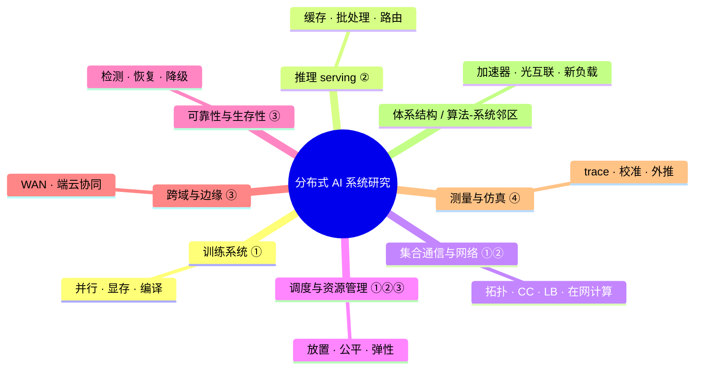
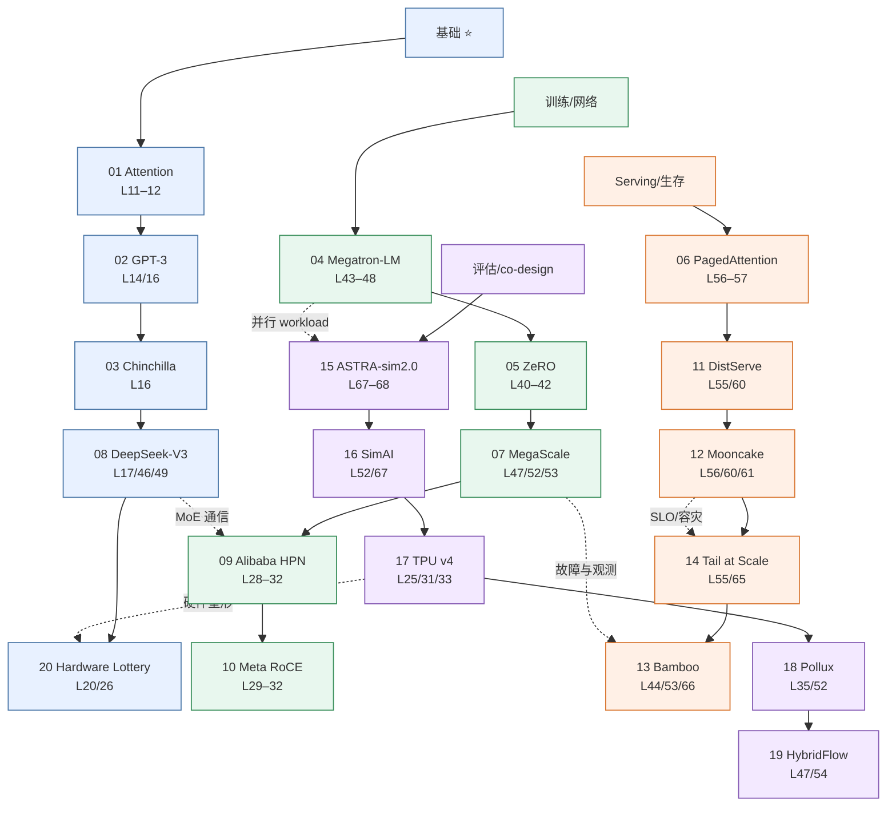
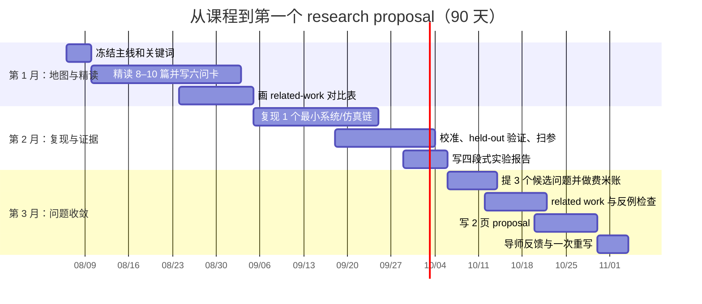

# L69 研究地图与论文清单：从课程终点到第一个 idea

> [!abstract] 本课速览
> 读完你将能够：
> 1. 把分布式 AI 系统划成八个相连的研究社区，并说清每块的核心问题、主 venue 与课程入口；
> 2. 在 20 篇分级论文中为自己的方向选出一条 8–10 篇阅读线，而不是无差别追 arXiv；
> 3. 用证据类型、CPU·h、GPU·h 与人月做选题的费米估算，识别“硬件够但证据不够”的题目；
> 4. 建立会议、论文数据库、工业博客、开源仓库与术语表组成的信息流；
> 5. 用 90 天完成“精读—复现—proposal”的第一次研究闭环。
>
> 前置：完成你选择的方向路线即可；默认路线读者已完成 L01–L68。未修模块先把本课对应内容当索引。预计 70–90 分钟。

## 论文里的这段话，你现在应该能拆开了

> [!quote]
> We co-design model parallelism, collective communication, and topology-aware placement for a distributed AI workload. We evaluate the design with trace-driven simulation, a calibrated testbed, and failure injection, reporting goodput and tail-latency under explicit SLOs. Our results hold within the measured workload and fault model; extrapolation to multi-region deployment requires additional validation.
>
> （改写自分布式 AI 系统论文的典型表述，不对应某一篇论文原句。）

在 L01，这种段落像把模型、网络、调度、评测和可靠性压进一只黑箱。现在你应该能指出：第一句在选联合优化变量，第二句在组织证据链，第三句在限定结论的适用域。本课不再引入新术语，而是把前 68 课的词汇重新排成一张“研究地铁图”。

## 一、领域版图：研究社区按什么切

切研究版图不能只看论文标题里的 “LLM”。更有用的切法是问四件事：系统控制什么变量，优化什么目标，依赖哪层机制，用什么证据说服人。下面这张图是 [[L01 全景图]] 的高配回声：L01 按技术栈分层，这里按会互相审稿、引用和争论的研究社区分区。

图中 ①–④ 对应课题组四条主线：①分布式训练的网络与系统优化，②分布式推理与大模型服务，③生存性、可靠性与故障恢复，④仿真器与评估方法。八块不是八座孤岛。例如“拓扑感知的 MoE 推理调度”同时踩中推理 serving、集合通信与网络、调度资源管理；“KV 容灾放置”同时踩中 serving、可靠性与跨域；“跨域流水线切分”则连接训练系统、WAN 与仿真。==好选题常在社区交界处，但好论文必须说清自己的主问题属于哪一块。==

| 研究社区 | 核心问题（一句话） | 主战场 venue | 锚点工作 | 课程入口 |
|---|---|---|---|---|
| 训练系统 | 怎样组合并行、显存与执行计划，让超大模型高效且可运行？ | MLSys、OSDI、SOSP、SC | Megatron-LM、ZeRO、MegaScale | [[L40 训练显存全解剖]]–[[L54 RL后训练系统]] |
| 推理 serving | 怎样在动态请求与 SLO 下管理计算、KV 缓存和批次？ | OSDI、SOSP、EuroSys、FAST、MLSys | PagedAttention、DistServe、Mooncake | [[L55 推理性能模型]]–[[L62 实践-跑起来一个推理服务]] |
| 集合通信与网络 | 怎样让 collective 与 topology、routing、CC、LB 对齐？ | SIGCOMM、NSDI、INFOCOM、SC | Alibaba HPN、Meta RoCE、TPU v4 | [[L27 走进AI数据中心]]–[[L39 实践-动手集合通信]] |
| 调度与资源管理 | 怎样在放置、碎片、公平、弹性与成本之间取舍？ | OSDI、SOSP、EuroSys、SoCC、MLSys | Pollux、Bamboo、MegaScale | [[L35 GPU集群调度]]、[[L48 实践-并行策略推演]]、[[L66 弹性算力与资源效率]] |
| 可靠性与生存性 | 故障一定发生时，怎样限制 blast radius 并恢复有用进度或服务？ | DSN、NSDI、OSDI、EuroSys、SoCC | The Tail at Scale、Bamboo、MegaScale | [[L53 大规模训练可靠性]]、[[L65 推理服务生存性]] |
| 跨域与边缘 | 带宽低、RTT 高、资源异构时，任务放哪、多久同步一次？ | NSDI、SIGCOMM、MobiSys、MobiCom、SEC | DiLoCo、Neurosurgeon、Edgent | [[L63 跨域与跨集群训练]]、[[L64 边缘与端云协同]] |
| 测量与仿真 | 没有目标规模机器时，怎样取得可信、可校准、可外推的证据？ | NSDI、SIGCOMM、IMC、ISPASS、SC | ASTRA-sim2.0、SimAI、Alibaba HPN | [[L67 测量仿真与评测]]、[[L68 实践-仿真上手]] |
| 体系结构与 co-design（邻区） | 硬件、互联和模型结构怎样互相塑造可行设计空间？ | ISCA、MICRO、ASPLOS、HPCA、MLSys | Attention Is All You Need、TPU v4、The Hardware Lottery | [[L17 MoE混合专家]]、[[L20 GPU体系结构入门]]–[[L26 加速器生态与软件栈]] |

> [!tip] 判断“这是不是我的方向”
> 先问它优化的是模型精度本身，还是训练/推理任务在真实分布式基础设施上的运行。若至少控制网络、调度、资源或故障中的一项，并把目标落到性能、资源效率或生存性，它就在本课程核心区；纯模型结构或只比精度的工作通常是邻区输入，不是主线终点。

### 1.1 课题组定位与武器库

| 主线 | 直接邻居社区 | 常用优化变量 → 目标 | 优先补课 |
|---|---|---|---|
| 分布式训练的网络与系统优化 | 训练系统、集合通信与网络、调度 | parallel plan、collective、placement、routing、bandwidth allocation → step time、MFU、JCT、goodput | [[L28 数据中心网络基础]]–[[L38 NCCL解剖]]、[[L41 数据并行与DDP]]–[[L53 大规模训练可靠性]] |
| 分布式推理与大模型服务 | serving、网络、调度、存储 | batching、request routing、KV placement、model placement → TTFT、TPOT、throughput、SLO violation | [[L55 推理性能模型]]–[[L65 推理服务生存性]] |
| 生存性、可靠性与故障恢复 | 可靠性、跨域、调度 | replica、checkpoint、failover、load shedding、migration → availability、RTO、恢复时间、任务完成率 | [[L34 存储与数据供给]]、[[L53 大规模训练可靠性]]、[[L65 推理服务生存性]]–[[L66 弹性算力与资源效率]] |
| 仿真器与评估方法 | 测量、网络、训练/推理系统 | abstraction、calibration、fault model、sweep → fidelity、误差、可复现性、结论边界 | [[L02 如何读系统论文]]、[[L37 通信算法与代价模型]]、[[L67 测量仿真与评测]]–[[L68 实践-仿真上手]] |

## 二、20 篇分级必读：不是收藏夹，是阅读顺序

下面严格列 20 篇。题名与 venue 按截至 2026-08-05 可核验的正式发表版填写；DeepSeek-V3 明确标为 technical report。⭐ 先建立共同语言，⭐⭐ 按研究主线下钻，⭐⭐⭐ 用来培养跨栈判断。每篇都先用 [[L02 如何读系统论文|L02 的六问法]] 读图和问题，再决定是否第三遍复现。

### 2.1 ⭐ 入门必读：共同底座（8 篇）

| # | 论文与正式来源 | 一句话贡献 | 读法提示 | 对应课程 |
|---:|---|---|---|---|
| 1 | 《[Attention Is All You Need](https://proceedings.neurips.cc/paper/7181-attention-is-all-you-need.pdf)》（NeurIPS 2017） | 用纯 attention 架构替代序列递归，奠定此后训练与推理 workload 的基本形状。 | 先追 QKV 张量形状与可并行性，不必陷进模型精度表。 | [[L11 注意力机制]]–[[L12 Transformer全解剖]] |
| 2 | 《[Language Models are Few-Shot Learners](https://proceedings.neurips.cc/paper_files/paper/2020/hash/1457c0d6bfcb4967418bfb8ac142f64a-Abstract.html)》（NeurIPS 2020） | GPT-3 展示规模化 autoregressive LM 的 few-shot 能力，也把训练规模与服务成本推到系统前台。 | 把 model/data/compute 规模、并行限制和可复现性单独记账。 | [[L14 预训练]]、[[L16 Scaling Law与算力账]] |
| 3 | 《[Training Compute-Optimal Large Language Models](https://proceedings.neurips.cc/paper_files/paper/2022/hash/c1e2faff6f588870935f114ebe04a3e5-Abstract.html)》（NeurIPS 2022） | 用经验 scaling law 讨论固定计算预算下模型参数与训练 token 的分配。 | 重点读问题设定、拟合范围与外推边界，不把 Chinchilla 比例当永恒常数。 | [[L16 Scaling Law与算力账]] |
| 4 | 《[Efficient Large-Scale Language Model Training on GPU Clusters Using Megatron-LM](https://doi.org/10.1145/3458817.3476209)》（SC 2021） | 系统化组合 tensor、pipeline 与 data parallelism，并讨论大规模映射权衡。 | 对照每种并行的通信张量和拓扑域画一遍 device mesh。 | [[L43 张量并行]]–[[L48 实践-并行策略推演]] |
| 5 | 《[ZeRO: Memory Optimizations Toward Training Trillion Parameter Models](https://doi.org/10.1109/SC41405.2020.00024)》（SC 2020） | 通过切分冗余训练状态突破 data parallel 的显存瓶颈。 | 手算三阶段每 rank 状态量与通信量，别只记“省显存”。 | [[L40 训练显存全解剖]]–[[L42 ZeRO与FSDP]] |
| 6 | 《[Efficient Memory Management for Large Language Model Serving with PagedAttention](https://doi.org/10.1145/3600006.3613165)》（SOSP 2023） | 把虚拟内存分页思想迁移到 KV cache 管理，并构建 vLLM。 | 先读 fragmentation 与 block table，再核对 throughput 的 workload/SLO。 | [[L56 KV缓存与PagedAttention]]–[[L57 连续批处理与调度]] |
| 7 | 《[MegaScale: Scaling Large Language Model Training to More Than 10,000 GPUs](https://www.usenix.org/conference/nsdi24/presentation/jiang-ziheng)》（NSDI 2024） | 展示万卡训练的全栈效率、可观测性、故障与 straggler 工程。 | 把“优化机制”和“规模化后才出现的运维问题”分两栏读。 | [[L47 混合并行组装]]、[[L52 性能剖析与MFU核算]]–[[L53 大规模训练可靠性]] |
| 8 | 《[DeepSeek-V3 Technical Report](https://arxiv.org/abs/2412.19437)》（technical report 2024） | 给出 MoE、FP8、通信重叠与训练基础设施的跨栈设计样本。 | 明确它是 technical report；重点追“模型选择怎样改变系统通信”。 | [[L17 MoE混合专家]]、[[L46 专家并行与MoE训练]]、[[L49 混合精度与FP8训练]] |

### 2.2 ⭐⭐ 方向进阶：四条主线（8 篇）

每条主线先读这里的 2 篇，再从上面的共同底座补 1–2 篇：训练网络加 #4/#7，推理加 #6，可靠性加 #7/#8，仿真加 #4/#9。这样每条实际阅读线都有 3–4 个锚点，而总清单仍保持 20 篇。

| # | 主线 | 论文与正式来源 | 一句话贡献与读法 | 对应课程 |
|---:|---|---|---|---|
| 9 | 训练网络 | 《[Alibaba HPN: A Data Center Network for Large Language Model Training](https://doi.org/10.1145/3651890.3672265)》（SIGCOMM 2024） | 从生产 workload 出发重做 topology、routing 与运维；读 measurement→design decision→deployment evidence 的因果链。 | [[L28 数据中心网络基础]]–[[L32 路由与负载均衡]]、[[L67 测量仿真与评测]] |
| 10 | 训练网络 | 《[RDMA over Ethernet for Distributed AI Training at Meta Scale](https://doi.org/10.1145/3651890.3672233)》（SIGCOMM 2024） | 给出 Meta RoCE 训练网络的拓扑、路由、拥塞与运营经验；重点读哪些机制来自 workload characterization。 | [[L29 RDMA原理]]–[[L32 路由与负载均衡]] |
| 11 | 推理 serving | 《[DistServe: Disaggregating Prefill and Decoding for Goodput-optimized Large Language Model Serving](https://www.usenix.org/conference/osdi24/presentation/zhong-yinmin)》（OSDI 2024） | 分离 prefill/decode，解耦两阶段干扰与资源配置；按 TTFT/TPOT SLO 重画 goodput。 | [[L55 推理性能模型]]、[[L60 分布式推理与PD分离]] |
| 12 | 推理 serving | 《[Mooncake: Trading More Storage for Less Computation — A KVCache-centric Architecture for Serving LLM Chatbot](https://www.usenix.org/conference/fast25/presentation/qin)》（FAST 2025） | 用分层存储与 RDMA 组织全局 KV cache；注意这是正式会议版题名，不是 arXiv 版标题。 | [[L56 KV缓存与PagedAttention]]、[[L60 分布式推理与PD分离]]–[[L61 推理服务框架与集群]] |
| 13 | 可靠性 | 《[Bamboo: Making Preemptible Instances Resilient for Affordable Training of Large DNNs](https://www.usenix.org/conference/nsdi23/presentation/thorpe)》（NSDI 2023） | 用流水线气泡承载冗余计算，面向频繁抢占而非偶发故障；读 failure model 与冗余代价。 | [[L44 流水线并行]]、[[L53 大规模训练可靠性]]、[[L66 弹性算力与资源效率]] |
| 14 | 可靠性 | 《[The Tail at Scale](https://research.google/pubs/the-tail-at-scale/)》（Communications of the ACM 2013） | 解释大规模 fan-out 如何放大尾时延，并整理 hedging 等 tail-tolerant 技术。 | [[L02 如何读系统论文]]、[[L55 推理性能模型]]、[[L65 推理服务生存性]] |
| 15 | 仿真评估 | 《[ASTRA-sim2.0: Modeling Hierarchical Networks and Disaggregated Systems for Large-model Training at Scale](https://doi.org/10.1109/ISPASS57527.2023.00035)》（ISPASS 2023） | 以 graph workload、多维拓扑与内存模型支持分布式训练 design-space exploration；优先读抽象边界。 | [[L37 通信算法与代价模型]]、[[L67 测量仿真与评测]]–[[L68 实践-仿真上手]] |
| 16 | 仿真评估 | 《[SimAI: Unifying Architecture Design and Performance Tuning for Large-Scale Large Language Model Training with Scalability and Precision](https://www.usenix.org/conference/nsdi25/presentation/wang-xizheng-simai)》（NSDI 2025） | 联合训练框架、kernel 与 collective 层做大规模仿真；重点审查 calibration/validation 如何覆盖不同规模。 | [[L52 性能剖析与MFU核算]]、[[L67 测量仿真与评测]] |

### 2.3 ⭐⭐⭐ 品味之选：学会跨栈（4 篇）

| # | 论文与正式来源 | 为什么值得读 | 对应课程 |
|---:|---|---|---|
| 17 | 《[TPU v4: An Optically Reconfigurable Supercomputer for Machine Learning with Hardware Support for Embeddings](https://doi.org/10.1145/3579371.3589350)》（ISCA 2023） | 看 OCS、拓扑可重构、可用性与 workload co-design 怎样一起进入一台 supercomputer。 | [[L25 节点内互联]]、[[L31 AI集群网络拓扑]]、[[L33 在网计算与智能网卡]] |
| 18 | 《[Pollux: Co-adaptive Cluster Scheduling for Goodput-Optimized Deep Learning](https://www.usenix.org/conference/osdi21/presentation/qiao)》（OSDI 2021） | 看 scheduler 如何把资源分配与训练统计效率联合优化，而不只追 raw throughput。 | [[L35 GPU集群调度]]、[[L52 性能剖析与MFU核算]] |
| 19 | 《[HybridFlow: A Flexible and Efficient RLHF Framework](https://doi.org/10.1145/3689031.3696075)》（EuroSys 2025） | 看 RLHF 多模型 dataflow、placement 与通信怎样形成新的系统执行问题；项目后来以 veRL 生态延续。 | [[L47 混合并行组装]]、[[L54 RL后训练系统]] |
| 20 | 《[The Hardware Lottery](https://doi.org/10.1145/3467017)》（Communications of the ACM 2021） | 提醒你：某个算法赢，可能因为它恰好适配现有软硬件；做 co-design 时要主动寻找被平台遮蔽的方案。 | [[L20 GPU体系结构入门]]、[[L26 加速器生态与软件栈]] |

### 2.4 论文地铁线路图

这张图不是引用关系，而是阅读路线。圆括号内是建议停靠的课程站；虚线是跨线换乘点。

> [!warning] 三个常见误区
> 1. **“课程读完就该有 idea。”** 中间通常还隔着本方向精读约 10 篇和复现 1 个系统；没走这段路，所谓 idea 多半只是没搜到 related work。
> 2. **“追最新 arXiv 才叫前沿。”** 经典锚点决定你能不能识别新论文真正新增了什么；发布日期新不等于问题新。
> 3. **“方向定了就不用看邻区。”** 网络里的在网计算、体系结构里的 OCS、OS 里的 paging 都曾迁移进 AI 系统。邻区不是绕路，是工具仓库。

## 三、算一算：选题算力可行性费米估算

这里不预测论文能否发表，只回答更朴素的问题：三个月内能不能取得足以支撑主张的证据。统一记账：

$$
N_{case}=N_{policy}N_{workload}N_{scale}N_{seed},
$$

$$
H_{CPU}=N_{case}t_{case}/60,
\qquad
H_{GPU}=N_{config}N_{repeat}t_{run}N_{GPU}.
$$

题设资源边界是“1 台多核 CPU 工作站 + 1 个 8×A100 SXM 80 GB 节点”。A100 的 80 GB 显存、BF16 dense 312 TFLOPS 等硬件口径来自 [[03 约定与符号]]；下面的 case 数、分钟数和人月都是==研究规划的构造输入==，不是 simulator 或集群 benchmark。GPU·h 是 GPU 数乘运行小时，不能和 8 卡节点小时混写。

> [!example] 算一算：三个候选 idea 的证据与资源账
> **A. 拓扑感知的 MoE 推理调度**
>
> 证据计划：先做 trace-driven simulation，扫描 5 种 topology/mapping、4 种 routing、3 档到达负载、5 个 seeds：
>
> $$
> N_{case}=5\times4\times3\times5=300.
> $$
>
> 若每 case 的构造时间取 10 min，则
>
> $$
> H_{CPU}=300\times10/60=50\ \text{CPU·h}.
> $$
>
> 再选 4 个配置 × 3 档负载 × 3 次重复，每次占满 8 卡、运行 0.5 h：
>
> $$
> H_{GPU}=4\times3\times3\times0.5\times8=144\ \text{GPU·h}
> =18\ \text{个 8 卡节点·h}.
> $$
>
> 人力约 1.5 人月，交付 trace、simulator 配置、testbed 结果与 p50/p99/throughput。判定：并发度不超过 8 卡，证据链能在单节点上缩小验证，**可行**；但不能声称验证了多机拥塞。
>
> **B. KV 容灾放置策略**
>
> 证据计划：4 种 placement × 5 种 failure regime × 3 种 workload × 5 个 seeds，共
>
> $$
> N_{case}=4\times5\times3\times5=300.
> $$
>
> 若每 case 5 min，$H_{CPU}=25\ \text{CPU·h}$。选 4 个故障场景 × 2 种模型配置 × 2 次重复，每次 0.5 h、8 卡：
>
> $$
> H_{GPU}=4\times2\times2\times0.5\times8=64\ \text{GPU·h}.
> $$
>
> 人力约 1.5 人月，指标必须含正常态 SLO、故障时 violation、恢复时间与额外副本开销。判定：**可行**，但单机 fault injection 只能验证进程/GPU/链路仿真故障；region outage 需要另找证据。
>
> **C. 跨域流水线切分**
>
> 解析与仿真可扫 6 个 split × 4 档 WAN × 3 个 workload × 5 seeds，共 360 cases；若每 case 10 min：
>
> $$
> H_{CPU}=360\times10/60=60\ \text{CPU·h}.
> $$
>
> 本地用 traffic shaping 做 6 个 split × 2 档网络 × 2 次重复，每次 0.5 h、8 卡：
>
> $$
> H_{GPU}=6\times2\times2\times0.5\times8=96\ \text{GPU·h}.
> $$
>
> 人力约 2 人月。计算资源看似够，但 8 卡单站点没有两个独立故障域、真实 WAN 路由和跨域资源波动。判定：**只能做“仿真 + 本地仿真网络”的机制论文雏形**；若主张真实 multi-region 效果，证据不可行，必须缩题或争取双站点 testbed/公开 trace。

三笔账揭示一个很容易忽略的事实：A/B/C 的 GPU·h 都不大，C 仍然最危险。它缺的不是算力，而是与主张匹配的现实环境。==可行性估算的最小单位不是“卡”，而是“能否取得审稿人认可的证据”。==

可复制的选题模板：

| 项目 | 你的填写 |
|---|---|
| 一句话主张 | 我改变 ______，希望改善 ______，适用条件是 ______。 |
| 必要证据 | analytical / simulation / trace / testbed / production 中哪些不可缺？ |
| case 数 | policy × workload × scale × seed = ______。 |
| CPU 预算 | case × min/case ÷ 60 = ______ CPU·h。 |
| GPU 预算 | config × repeat × h/run × GPU = ______ GPU·h。 |
| 人力与外部依赖 | ______ 人月；还需要 ______ trace / 第二站点 / 专用网络。 |
| 结论 | 可行 / 缩题后可行 / 当前证据不可行；最大风险是 ______。 |

## 四、信息流基建：让论文自己流进来

### 4.1 会议日历不是常量

deadline 每届都会变，下面只给截至 2026-08-05 的官方页面快照，目的是教你维护日历，不是提供永久月份口诀。已过去的 deadline 明确标注，未公布的下一届不做外推。

| Venue | 与本方向最相关的题 | 已核实的最近 deadline | 举办时间 | 使用方式 |
|---|---|---|---|---|
| [NSDI 2027](https://www.usenix.org/conference/nsdi27/call-for-papers) | networked/distributed systems、AI network、serving、可靠性 | Fall full paper：2026-09-17 | 2027-05-11–13 | 8 月把 idea 收敛到可评估主张，9 月交完整稿。 |
| [FAST 2027](https://www.usenix.org/conference/fast27/call-for-papers) | checkpoint、KV cache、AI storage | Fall paper：2026-09-15 | 2027-02-23–25 | 存储是主问题时投；别因用了 SSD 就硬贴 FAST。 |
| [OSDI 2027](https://www.usenix.org/conference/osdi27/call-for-papers) | 系统设计实现、ML systems、operational systems | full paper：2026-12-08 | 2027-07-07–09 | 预留足够时间做 prototype 与端到端 evaluation。 |
| [SIGCOMM 2026](https://conferences.sigcomm.org/sigcomm/2026/cfp/) | 网络架构、传输、路由、测量、deployment | 2026-02-06（已过） | 2026-08-17–21 | 先在会后更新 2027 CFP；不要把 2026 日期平移一年。 |
| [MLSys 2026](https://mlsys.org/Conferences/2026) | ML 与 systems 交界、训练/推理/编译/硬件 | 2025-10-30（已过） | 2026-05-18–22（已过） | 关注下一届官网；算法贡献必须落到系统证据。 |

每月一次把目标 venue 的 CFP、scope、page limit、artifact policy 和 submission policy 重新读一遍。日历只回答“何时交”，不能替你回答“这项工作属于谁的社区”。

### 4.2 三层订阅，不被信息洪流淹没

1. **arXiv 雷达**：订阅 [cs.DC](https://arxiv.org/list/cs.DC/recent)、[cs.NI](https://arxiv.org/list/cs.NI/recent)、[cs.LG](https://arxiv.org/list/cs.LG/recent)。cs.DC/NI 是系统与网络主入口；cs.LG 噪声更大，只保留含 distributed training、serving、KV cache、collective、scheduling、fault tolerance、simulation 等系统词的条目。
2. **文献图谱**：用 [OpenAlex](https://openalex.org/) 做可编程检索与 venue/author/citation 过滤，用 [Semantic Scholar](https://www.semanticscholar.org/) 沿关键锚点的 references/citations 扩图。每个新方向先找 3 篇锚点，再向前补经典、向后追增量。
3. **一手工程流**：长期看 [vLLM](https://github.com/vllm-project/vllm)、[SGLang](https://github.com/sgl-project/sglang)、[DeepSeek](https://github.com/deepseek-ai)、[NCCL](https://github.com/NVIDIA/nccl)、[ASTRA-sim](https://github.com/astra-sim/astra-sim) 的 release/issue/PR；训练全栈可配合 [The Ultra-Scale Playbook](https://huggingface.co/spaces/nanotron/ultrascale-playbook) 查机制。issue 是问题线索，不是论文证据；release note 是版本事实，不是机制因果。

### 4.3 术语总表接力

课程结束后，[[02 术语总表]] 不该封存。每读一篇论文只做三步：

1. 新术语按 `英文—统一中文—一句话—主讲论文/课程` 记入对应字母节；已有词只补链接，不重复造译名。
2. 为术语加“它控制什么变量、影响什么指标”的系统语义，避免字典式释义。
3. 每月清理一次“只见过名字但不会算/不会画”的词，把它们变成下一轮补课清单。

## 五、从课程到研究的 90 天

三个月不是“保证出论文”，而是把你送到一个更诚实的里程碑：能写出有 related work、有可行证据路径、能被导师具体批评的 proposal。

| 阶段 | 每周动作 | 验收标准 |
|---|---|---|
| 第 1 月：精读 | 每周 2–3 篇；用 L02 六问法写一页卡片，周末做横向对比 | 8–10 张读书卡；一张“问题—变量—指标—证据—局限”表；能口头讲 15 分钟 |
| 第 2 月：复现 | 从官方 artifact/开源仓库跑最小配置，再增加一个自选变量 | 命令、commit、环境、原始数据齐全；至少 1 个手算/真机校准点和 1 个 held-out 点；按 [[L68 实践-仿真上手|L68 四段式]] 写报告 |
| 第 3 月：proposal | 先列 3 个候选问题，各做费米估算和反例检索，只保留 1 个 | 2 页：问题与重要性、related work gap、方法、评估矩阵、资源/风险；能明确说出“什么结果会推翻我” |

导师沟通建议很简单：固定每 1–2 周一次短同步，会前发一页“本周期证据、卡点、下周期决策”，带着数据和具体选择题来，而不是只说“我还在看论文”。

## 回到开头那段话

> **“We co-design model parallelism, collective communication, and topology-aware placement for a distributed AI workload.”**

现在你会把它翻成：作者同时控制 parallel plan、collective 和 placement，跨过训练/推理系统、网络与调度三个社区；下一步必须检查优化目标和哪些变量真的被实现，而不是被一句 co-design 带过去。

> **“We evaluate the design with trace-driven simulation, a calibrated testbed, and failure injection, reporting goodput and tail-latency under explicit SLOs.”**

这句话给出三层证据：trace 决定 workload 是否像真的，simulation 负责规模扫描，testbed 负责 calibration/validation，fault injection 负责生存性；goodput、tail latency、SLO 把结果从 raw throughput 拉回用户目标。你也会追问 seed、baseline、故障模型和 testbed 是否覆盖主张。

> **“Our results hold within the measured workload and fault model; extrapolation to multi-region deployment requires additional validation.”**

最后一句不是示弱，而是合格的效度边界：已测 workload/fault model 内可以下结论，multi-region 因 RTT、带宽、相关故障和运维环境改变而不能直接外推。这正是第三节 C 题“GPU·h 够、证据仍不够”的论文语言。

> [!success] 最终验收：回到 L01
> 重新打开 [[L01 全景图#论文里的这段话，你现在可能读不懂|L01 开头那段话]]：frontier model、GPU cluster、pretraining/serving、scale-up/scale-out、model weights 与 checkpoint 已经不再是散落名词。请先逐句翻译，再为每句补上“瓶颈指标—控制变量—证据方法”；能独立完成，才算把 L01 的卫星地图走成了自己的研究地图。

L01 的黑箱已经打开了。毕业验收不是背下 20 篇题名，而是随便抽一篇本方向论文，你能在 30 分钟内把它放回地图、找到前置课、手算一个数量级、指出证据链的缺口，并提出下一步可验证的问题。

## 术语卡片：版图术语索引

本课不新增术语；frontmatter `terms` 仅复用 `collective communication`、`goodput`、`topology-aware placement`、`trace-driven simulation` 四个既有导航锚点，以满足课程元数据校验，[[02 术语总表]] 无需重复登记。下面是“子方向 → 高频词 → 主讲课”的导航卡。

| 子方向 | 高频术语 | 去哪一课查 |
|---|---|---|
| 模型与 workload | Transformer、attention、prefill/decode、KV cache、MoE、scaling law | [[L10 Token与嵌入]]–[[L18 注意力变体与长上下文]] |
| GPU、显存与 kernel | HBM、Tensor Core、MFU、roofline、mixed precision、kernel fusion、FlashAttention | [[L20 GPU体系结构入门]]–[[L26 加速器生态与软件栈]]、[[L49 混合精度与FP8训练]]–[[L52 性能剖析与MFU核算]] |
| 网络与 collective | RDMA、RoCE、PFC/ECN、topology、routing、all-reduce、all-to-all、NCCL、α-β model | [[L27 走进AI数据中心]]–[[L39 实践-动手集合通信]] |
| 训练并行与调度 | DP/TP/PP/CP/EP、ZeRO/FSDP、device mesh、topology-aware placement、goodput | [[L35 GPU集群调度]]、[[L40 训练显存全解剖]]–[[L54 RL后训练系统]] |
| 推理 serving | TTFT、TPOT、SLO、PagedAttention、continuous batching、admission control、PD disaggregation、request routing | [[L55 推理性能模型]]–[[L62 实践-跑起来一个推理服务]] |
| 可靠性与资源效率 | checkpoint、MTBF、failover、error budget、degraded service、spot、elasticity、TCO | [[L53 大规模训练可靠性]]、[[L65 推理服务生存性]]–[[L66 弹性算力与资源效率]] |
| 跨域与边缘 | WAN、local SGD、DiLoCo、gradient compression、edge inference、offloading、split inference | [[L63 跨域与跨集群训练]]–[[L64 边缘与端云协同]] |
| 测量与仿真 | trace-driven simulation、ASTRA-sim、ns-3、fidelity、calibration、validation、sensitivity analysis | [[L67 测量仿真与评测]]–[[L68 实践-仿真上手]] |

## 自测

1. 为什么 L01 的分层图和本课的研究社区图都正确，却不能互相替代？
2. “拓扑感知的 MoE 推理调度”横跨哪三个社区？请为它写出两个优化变量、两个目标指标和三类证据。
3. 20 篇清单里为什么同时保留 Attention/Chinchilla 这类模型论文和 HPN/DistServe 这类系统论文？
4. **计算题**：你的 simulator 扫 6 个 policies、4 个 workloads、3 个 scales、5 个 seeds，每 case 8 min。随后选 3 个配置，每个重复 4 次，每次使用 8 GPU 跑 45 min。求 case 数、CPU·h、GPU·h 与 8 卡节点·h。
5. 某同学只有单机 8 GPU，却要声称方案能抵抗 region outage。算力可行性账为什么不能只看 GPU·h？
6. 为“KV cache 跨节点复用”设计一个 90 天验收路线：第 1/2/3 月各交什么？
7. 从开头段落中找出一个 internal validity 问题和一个 external validity 问题。

> [!note]- 参考答案
> 1. L01 按模型—软件—硬件—网络—数据中心的技术栈解释一次执行路径；L69 按核心问题、优化变量、证据与 venue 划研究社区。前者回答“系统由什么组成”，后者回答“论文在和谁对话”。
> 2. serving、集合通信与网络、调度与资源管理。变量可取 expert placement、request routing/dispatch policy；指标可取 p99 TPOT、SLO goodput/网络拥塞；证据可取 production/公开 trace、校准仿真、8 卡 testbed。
> 3. 系统问题由 workload 形状驱动。Attention 决定张量依赖，Chinchilla 影响 model/token 预算；系统论文则展示怎样控制资源与机制。只读一边会看不见“需求从哪来”或“需求怎样落地”。
> 4. $N_{case}=6\times4\times3\times5=360$。$H_{CPU}=360\times8/60=48\ \text{CPU·h}$。每次 45 min $=0.75$ h，$H_{GPU}=3\times4\times0.75\times8=72\ \text{GPU·h}$，即 $72/8=9$ 个 8 卡节点·h。
> 5. region outage 的关键是独立站点、WAN、相关故障与控制平面切换。单机 fault injection 可验证局部机制，却不能提供真实多地域外部效度；缺的是证据环境，不是算力总量。
> 6. 第 1 月精读 PagedAttention、Mooncake、DistServe 等并做对比表；第 2 月固定版本复现缓存/传输最小链路，完成手算—testbed 校准和一次策略 sweep；第 3 月比较三个候选 gap，做资源账，写含主张、方法、评估矩阵和失败判据的 2 页 proposal。
> 7. Internal：trace/simulator/testbed 的 workload、时间边界或参数可能没对齐，failure injection 可能混入其他变量。External：单个 testbed 与故障模型未必能外推到别的模型、规模、网络或 multi-region 环境。

## 延伸阅读与下一步

- S. Keshav，《[How to Read a Paper](https://cs.uwaterloo.ca/~Brecht/courses/856/readings/how-to-read/keshav-paper-reading.pdf)》（ACM SIGCOMM CCR 2007）：回收三遍阅读法；下一篇论文先限时做第一遍，再决定是否精读。
- Richard Hamming，《[You and Your Research](https://www.cs.virginia.edu/~robins/YouAndYourResearch.html)》：不要当成功学背诵；把“什么问题重要”改写成你每月一次的研究盘点问题。
- 本课 20 篇清单：先按主线选 8–10 篇，不要求一次读完全部；每读完一篇就更新对比表和 [[02 术语总表]]。
- [[L70 选修-多模态与新负载]]：当你的问题涉及 VLM、video generation、Agent 或 RAG 的 workload 变化时再读；它不是完成主线的必修门槛。

---
上一课：[[L68 实践-仿真上手]] ← · → 下一课（选修）：[[L70 选修-多模态与新负载]]
