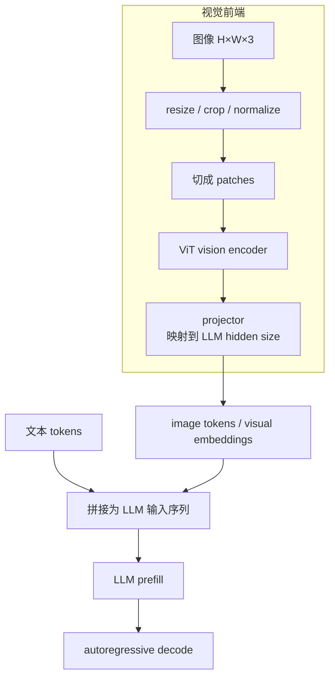
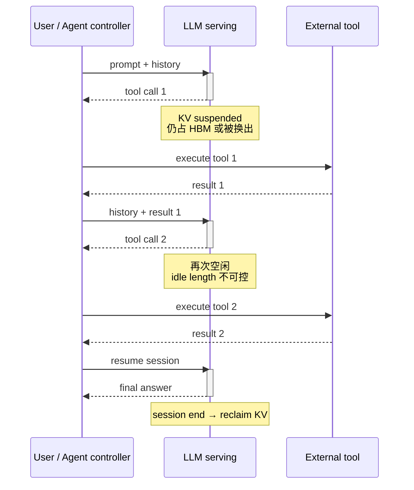

# L70 选修-多模态与新负载：当请求不再只是文本续写

> [!abstract] 本课速览
> 读完你将能够：
> 1. 画出 VLM 把图像接入 LLM 的最小管线，并由 patch 几何估算视觉 token 与 prefill 增量；
> 2. 从执行阶段、状态、瓶颈和时延公式对照 LLM 自回归生成与扩散去噪；
> 3. 解释 Agent 为什么把 serving 从“请求处理”改造成“会话托管”，并手算 KV 挂起与换出的取舍；
> 4. 拆开 RAG 的 embedding、ANN、rerank 与生成关键路径，为检索分配时延预算；
> 5. 用统一的 workload 画像审视下一种新模型，而不是见一个框架背一套名词。
>
> 前置：[[L13 自回归生成与KV缓存]] · [[L55 推理性能模型]] · [[L61 推理服务框架与集群]] · 预计 55–70 分钟

## 论文里的这段话，你现在可能读不懂

> [!quote]
> “A **VLM** maps image **patches** into **image tokens** with a **ViT**-based **vision encoder** and a **projector**, making multimodal prefill highly variable. A **diffusion model** instead repeats full-tensor **denoising steps** with a U-Net or **DiT**, so its latency scales with the sampling schedule rather than output-token decode. An **agentic workload** interleaves LLM segments and **tool calls**, leaving session KV state idle but resident. A **RAG** pipeline adds an embedding model, **ANN** retrieval from a vector database, reranking, and a retrieval latency budget before generation.”
>
> （改写自多模态、生成模型与 serving 系统资料的典型表述，不对应某一篇论文原句。）

如果仍用“每个请求是一段文本，prefill 一次、decode 到结束”的画像，这四句话会把调度器带沟里：图像让输入成本难以只按文本长度估；扩散没有逐 token decode；Agent 的一次用户任务会跨越许多有空洞的模型调用；RAG 甚至把另一个在线检索系统放进了首 token 关键路径。本课只补负载侧的最小机制，重点始终是：==机制一变，计算阶段、状态生命周期、网络流量与 SLO 怎样跟着变。==

## 一、VLM：图像不是附件，而是一段昂贵前缀

### 1. 从像素到 LLM 序列

**multimodal**（多模态）表示一个模型或应用共同处理文本、图像、视频、音频等不同信号；“多”不只意味着 API 多一个字段，还意味着各模态的预处理、长度分布与计算阶段不同。**VLM**（Vision-Language Model，视觉语言模型）是其中把视觉信息与语言理解或生成连接起来的一类模型。

最小 VLM 管线可以画成下面这样：

**ViT**（Vision Transformer，视觉 Transformer）的关键动作，是把图像切成固定大小的 **patch**（图像小块），再把每个 patch 线性映射成一项序列表示：可以把它理解成“视觉的 tokenize”。若预处理后的分辨率为 $H'\times W'$，patch 边长为 $P$，忽略额外 special token，则

$$
N_{patch}=\frac{H'}{P}\times\frac{W'}{P}。
$$

**vision encoder**（视觉编码器）让这些 patch 表示彼此交互，提取物体、文字与空间关系；它可以是 ViT，也可能是其他视觉骨干。随后 **projector**（投影连接器）把视觉特征维度和分布接到 LLM 的 hidden space。projector 常比主模型小，但它不是“改文件格式”：维度没有对齐，LLM 就无法把视觉表示当作序列输入。

这里的 **image token**（图像 token / 视觉 token）通常指占据 LLM 序列位置的视觉 embedding。它不一定像文本 token 那样对应词表中的离散 ID；系统记账时关心的是它仍会增加 prefill 序列长度、attention 工作与 KV 状态。

**CLIP**（Contrastive Language-Image Pre-training）需要认名：它用图像编码器与文本编码器学习匹配的图文表示。CLIP 本身不等于“能对话的 VLM”，但它说明如何把图像和文本拉到可比较的表示空间，也长期充当 VLM 的视觉骨干或概念祖先。[CLIP 论文](https://arxiv.org/abs/2103.00020)

> [!tip] 直觉
> 文本 tokenizer 像把一句话装进若干信封；ViT 则把图片裁成方格，再让每格交一只“视觉信封”。LLM 不在乎信封原来装的是词还是图，只会看到序列突然变长了。

### 2. 图文混批为什么不均匀

同样是一条 API 请求，纯文本可能直接进入 LLM；图文请求还要做媒体下载/解码、视觉编码与 projector，然后才进入 prefill。两张原始分辨率相同的图片，也可能因为 resize、crop、动态分辨率或多图输入得到不同视觉 token 数。于是调度器至少要同时估计：

- 视觉编码器工作量与放置位置；
- 文本 token + image token 的总 prefill 长度；
- 不同模态能否混批、在哪个阶段混批；
- 媒体获取失败、超时和超大输入的准入策略。

把纯文本和多图请求只按“request 数”轮转，就像把一封明信片和一箱档案都记成“一件快递”。这会制造 head-of-line blocking、TTFT 长尾和 GPU 阶段间负载不平衡。

> [!example] 算一算 1：一张 1024×1024 图像给 prefill 加多少料
> 先声明口径：视觉 token 数由具体预处理器决定，不存在“1024 像素固定换多少 token”的全行业常数。这里对照两个代表性 patch 管线。
>
> - 固定分辨率管线：把原图预处理到 $336\times336$，使用 $P=14$ 的 encoder，则 $N_v=(336/14)^2=24^2=576$。LLaVA-1.5 的公开配置使用 CLIP ViT-L/14 336px；其 patch features 正好提供这个教学锚点。[LLaVA 官方仓库](https://github.com/haotian-liu/LLaVA)
> - 保留 $1024\times1024$、使用 $P=32$ 的几何场景：$N_v=(1024/32)^2=32^2=1024$。
>
> 因此本题把一张图记为 $\Delta S=576$–$1024$ 个视觉 token。它们占用与同数文本 token 相同数量的序列位置；按 [[03 约定与符号]] 的 $1$ 个英文单词约 $1.3$ token，约等于 $576/1.3\approx443$ 到 $1024/1.3\approx788$ 个英文单词的 token 预算。
>
> 沿用 [[L55 推理性能模型]] 的 Llama-3-70B、TP8×H100 教学场景：只算参数主项 $F\approx2N\Delta S$，并显式假设 8 张 H100 各达到 BF16 dense 峰值的 50%。按 [[03 约定与符号]]，有效算力为
> $$
> P_{eff}=8\times989\times10^{12}\times50\%
> =3.956\times10^{15}\ \mathrm{FLOPS}。
> $$
> 两端的额外参数计算量为
> $$
> F_{576}=2\times70\times10^9\times576
> =80.64\times10^{12}\ \mathrm{FLOPs}，
> $$
> $$
> F_{1024}=2\times70\times10^9\times1024
> =143.36\times10^{12}\ \mathrm{FLOPs}。
> $$
> 对应隔离的 LLM prefill 增量是
> $$
> \Delta T_{576}=\frac{80.64\times10^{12}}{3.956\times10^{15}}
> \approx\boxed{20.4\ \mathrm{ms}}，
> $$
> $$
> \Delta T_{1024}=\frac{143.36\times10^{12}}{3.956\times10^{15}}
> \approx\boxed{36.2\ \mathrm{ms}}。
> $$
> 这是“参数主项 + 50% dense 峰值”的教学估算，不是 VLM benchmark。真实 TTFT 还要加图像获取/解码、vision encoder、projector、attention 的序列长度项、TP 通信、排队与返回；若多图输入，视觉 token 与相关成本还会继续累加。

视频只是把问题沿时间轴再复制一遍。**video generation**（视频生成）或视频理解会面对“帧数 × 每帧 patch 数”，实际系统常用时间采样、时空 patch、压缩 latent 或 token pruning 控制规模；若不压，视频就是视觉 token 洪水。

## 二、扩散模型：不是逐 token，而是整张状态反复去噪

### 1. 迭代去噪的最小直觉

**diffusion model**（扩散模型）在生成时通常从随机噪声状态开始，反复预测“怎样往更干净的样本走一步”。一次 **denoising step**（去噪步）会读取当前整张 latent、时间步与条件信息，运行一遍 denoiser，再更新出下一步 latent；做多少步，由 sampler 或采样 schedule 决定。

经典 denoiser 常用 **U-Net**（U 形编码器—解码器骨干）：下采样提取大范围语义，上采样恢复空间细节，并用 skip connection 连接同尺度特征。**DiT**（Diffusion Transformer，扩散 Transformer）则把扩散骨干换成处理 latent patches 的 Transformer。它“长得像 Transformer”不等于“像 LLM 一样逐 token decode”：每个去噪步里的空间 token 会整体更新。[DiT 论文](https://arxiv.org/abs/2212.09748)

### 2. LLM 与扩散是两种相反的 serving 画像

| 画像维度 | 自回归 LLM | 扩散 / DiT |
|---|---|---|
| 串行轴 | 输出 token：一次追加一个或少量 token | 去噪时间步：整张 latent 反复更新 |
| 单步输入 | 当前 token + 历史 KV | 当前完整 latent + timestep + condition |
| 跨步状态 | KV cache 随序列增长 | 保存当前 latent；没有可直接复用的 autoregressive KV cache |
| 单步主要工作 | 小 batch decode 常需反复扫描权重与历史 KV | 对完整空间 token/feature map 做一遍 U-Net 或 DiT forward |
| 典型瓶颈 | batch 较小时常 memory-bound | 足够大的 backbone、latent 或 batch 下常更偏 compute-bound |
| 时延主式 | $TTFT+(O-1)\times TPOT$ | $T_{setup}+\sum_{k=1}^{K}T_{denoise,k}+T_{\mathrm{decode\ image}}$ |
| 主要长度旋钮 | prompt/output tokens、并发与 batch | denoising steps、分辨率、图片/视频帧数、batch |
| 缓存机会 | exact prefix/KV reuse | 相邻步近似特征复用，通常要承担质量误差 |

表里的“典型”不是硬件定律：小图、低 batch 或访存差的 kernel 也可能受带宽/launch 限制；大 batch LLM decode 也可能走向 compute-bound。真正该做的是像 [[L23 Roofline模型]] 那样量 operational intensity，而不是按模型名字贴标签。

扩散 serving 的优化线索也由画像直接长出来：

1. **step distillation**（步数蒸馏）把教师的多步生成轨迹压进学生的少数步骤，用训练与可能的质量代价换线上时延；它是一类方法，不是某一个固定算法。
2. approximate caching 尝试复用相邻去噪步的部分中间结果。因为 latent 每一步都变，这不是文本前缀的 exact cache hit，必须把误差和生成质量纳入 SLO。
3. “并行去噪”试图打破或近似跨步依赖，但相邻步骤在算法上本来串行，不能像把互不相关请求丢进 batch 那样免费并行。

**video generation** 让 latent 再多一个时间维；时空 patch 数、去噪步数和模型深度相乘，计算、activation、跨卡 attention/通信都会膨胀。系统论文若只写“支持 image 与 video”，你应立刻追问它怎样切分时空 token、如何做 parallelism、首帧/整段视频 SLO 分别是什么。

> [!warning] 三个常见误区
> 1. **“多模态只是换个输入格式。”** 错：vision encoder 阶段、视觉 token 数和图文混批已经改变 token 经济与排队画像。
> 2. **“DiT 是 Transformer，所以能直接套 LLM KV cache。”** 错：denoising step 更新整张 latent，各步的 Q/K/V 随状态变化，不是固定历史前缀。
> 3. **“扩散总是 compute-bound，LLM decode 总是 memory-bound。”** 这是常见工作区，不是免测定律；batch、shape、量化与 kernel 都能改变瓶颈。

## 三、Agent：serving 从请求处理变成会话托管

### 1. 请求不再独立，也不再连续

**agent**（智能体）在本课不是拟人化标签，而是一个反复选择“继续生成、调用工具、读取结果还是结束”的应用控制循环。它产生的 **agentic workload**（智能体式工作负载）通常长这样：LLM 生成结构化动作 → 外部工具执行 → 工具结果拼回历史 → LLM 再推理，直到任务完成或触发预算上限。

**function calling**（函数调用能力）是模型/API 按给定 schema 选择函数并生成参数的接口机制；一次实际生成的函数名、参数和调用 ID 是 **tool call**（工具调用）。工具可能是搜索、数据库、编译器、浏览器或远端业务 API，执行期间 GPU 未必为这个会话计算。

多轮消息、tool results、system prompt、授权与 KV 状态共同构成一个 **session**（会话）。于是调度对象不再只是一次连续 request，而是一个会暂停、恢复、迁移、超时和失败的长期状态机。

对在线系统冲击最大的不是“多调了一次 API”，而是四个分布变化：

- 会话变长，历史前缀和 KV 持续增长；
- 工具期间歇空闲，KV 可能占着 HBM 不做计算；
- system prompt 与历史高度可复用，prefix caching 价值上升；
- tool latency、失败重试和循环次数让尾部长度难以预测，单请求 `max_tokens` 不再是完整预算。

系统因此需要 **KV lifecycle**（KV 生命周期管理）：为 active、suspended、resuming、expired/finished 等状态规定保留、换出、预取、迁移与回收动作。[[L56 KV缓存与PagedAttention]] 的 tiering 在这里从容量优化升级成会话策略；[[L61 推理服务框架与集群]] 的 session affinity 要尽量让恢复请求回到有热 KV 的实例；[[L54 RL后训练系统]] 的 agentic RL rollout 还会把大量长短不一的工具轨迹带进训练侧。

> [!example] 算一算 2：15 轮 Agent 的 KV 是挂着，还是搬走
> 构造一个可复算场景：Llama-3-70B 使用 BF16 KV、TP8；会话在每次工具执行期间平均已有 $S=8192$ token，共 15 次工具等待，每次 3 s。模型参数来自 [[03 约定与符号]]：$L=80$、$h_{kv}=8$、$d_{head}=8192/64=128$、BF16 为 2 B。
>
> 每 token KV 跨 TP group 合计为
> $$
> c_{KV/token}=2\times80\times8\times128\times2
> =327{,}680\ \mathrm{B}。
> $$
> 一份 8K 会话 KV 为
> $$
> C_{KV}=8192\times327{,}680
> =2{,}684{,}354{,}560\ \mathrm{B}
> \approx2.684\ \mathrm{GB}，
> $$
> 跨 8 个 KV heads 均匀切到 TP8 时，每 rank 约
> $$
> C_{rank}=2.684/8\approx0.3355\ \mathrm{GB}。
> $$
> 总工具空闲时间为
> $$
> T_{idle}=15\times3=45\ \mathrm{s}。
> $$
> 若始终挂在 HBM，容量—时间积分为
> $$
> I_{HBM}=2.684\times45
> \approx\boxed{120.8\ \mathrm{GB\cdot s}}
> $$
> （跨 TP group 合计；每 rank 约 $15.1\ \mathrm{GB\cdot s}$）。这个量不是费用，而是“占了多少容量、占了多久”，可用于比较并发会话的机会成本。
>
> 若每次工具调用都把 KV 换到 CPU，再换回 GPU，按 [[03 约定与符号]] 的 PCIe Gen4 x16 约 32 GB/s 单向口径，假设 8 个 ranks 可各自并行搬运，则一次 out+in 的 payload 线速下界为
> $$
> T_{swap,cycle}\ge
> \frac{2\times0.3355}{32}
> \approx0.02097\ \mathrm{s}=20.97\ \mathrm{ms}。
> $$
> 15 次累计 wall-clock 下界为
> $$
> T_{swap,total}\ge15\times20.97\ \mathrm{ms}
> \approx\boxed{314.6\ \mathrm{ms}}，
> $$
> 跨 TP group 的端点传输量合计为 $15\times2\times2.684\approx\boxed{80.5\ \mathrm{GB}}$。在这个隔离题里，单次 3 s idle 远大于约 21 ms 的 payload 下界，内存紧张时“搬”有吸引力；但真实选择还要加入 PCIe 争用、pinned DRAM、块粒度、prefetch 命中、恢复 TTFT 与 session affinity。内存富余或下一轮很快回来时，留在 HBM 仍可能更好。

一句话收口：==Agent 把 serving 从“尽快做完一个请求”改成“长期托管一段会反复睡醒的会话”。==

## 四、RAG：把检索系统塞进首 token 关键路径

**RAG**（Retrieval-Augmented Generation，检索增强生成）在生成前从外部知识库找材料，把命中的文档片段加入 prompt，再交给 LLM 回答。它把模型参数里的“记忆”与可独立更新的外部数据分开；好处是知识可以增量更新，代价是 serving 多了一条跨服务关键路径。[RAG 原始论文](https://arxiv.org/abs/2005.11401)

最小管线是：

1. **embedding model**（嵌入模型）把 query 和文档映射成向量，使语义相近的内容在向量空间里靠近；
2. **vector database**（向量数据库）保存向量、元数据与索引，并负责更新、过滤、分片、复制和检索；
3. **ANN**（Approximate Nearest Neighbor，近似最近邻）用少量召回损失换更低时延与更大规模；精确扫描不是唯一选择；
4. **HNSW**（Hierarchical Navigable Small World，分层可导航小世界图）是常见 ANN 索引：查询从稀疏高层快速接近目标区域，再在更密低层细搜。搜索更深通常提高 recall，也增加访问和时延；它是需认名的代表算法，不等于 vector database 的全部；
5. **rerank**（重排序）用更贵、但更精细的模型对第一阶段候选重新打分，减少无关片段进入 prompt；
6. 把选中文档拼进上下文，执行 LLM prefill 与 decode。

因此端到端时延至少要按路径拆成

$$
T_{E2E}=T_{queue}+T_{embed}+T_{ANN}+T_{rerank}
+T_{prefill}+T_{decode}+T_{other}。
$$

**retrieval latency budget**（检索时延预算）是从端到端 SLO 中留给 embedding、向量检索、过滤、取文档与 rerank 的时间份额。若它们吞掉 TTFT 预算，LLM 再快也救不回来。预算不能只看均值：索引分片 fan-out、冷文档、跨区访问与热点过滤都会抬高尾时延；分量 p99 也不能机械相加冒充真实端到端 p99，最终必须在真实并发与相关性下测整条路径。

RAG 的经典系统权衡是 recall–latency：扩大候选、提高 HNSW 搜索深度或使用更贵 reranker，可能提高找对材料的概率，却增加时延和计算。另一个争论是“RAG 还是长上下文”：

| 选择 | 省下什么 | 新付出什么 |
|---|---|---|
| RAG | 不必把整个知识库塞进 prompt；知识更新不必重训练主模型 | 检索/数据工程、索引新鲜度、跨服务尾时延、召回错误 |
| 长上下文 | 省去一部分显式检索编排，模型可直接看完整材料 | 更重 prefill、更大 KV、更难调度；材料仍需获取与选择 |

这不是模型技术与系统技术二选一。RAG 里至少 embedding serving、vector database、rerank、文档存储、路由与可观测性都属于系统和数据工程；模型质量只是最终链条的一部分。

## 五、用同一张画像表迎接下一种新负载

L70 不可能列完未来模型。更耐用的方法，是回收 [[L55 推理性能模型]] 的 workload 思维，对任何新负载依次问七件事：

| 画像问题 | VLM | 扩散 / 视频 | Agent | RAG |
|---|---|---|---|---|
| 输入怎样变成系统工作量？ | 文本 + 视觉 token + encoder | latent/时空 patches × steps | 多轮历史 + tool results | query + retrieved chunks |
| 串行依赖在哪？ | prefill 后自回归 decode | denoising schedule | LLM→tool→LLM 循环 | retrieve→rerank→generate |
| 长期状态是什么？ | image features、KV | 当前 latent | session history、KV、tool state | index、document version、prompt KV |
| 主要资源是谁？ | encoder compute、LLM compute/HBM | denoiser compute、activation、跨卡通信 | HBM 容量、恢复计算、外部服务 | CPU/GPU、内存/SSD、网络、LLM |
| 到达与长度怎样分布？ | 图数/分辨率高度异质 | 分辨率、帧数、steps | 轮数与 idle 极长尾 | fan-out、候选数、文档长度 |
| SLO 怎样定义？ | TTFT/TPOT + 媒体失败 | 首图/整图或首帧/整段完成时间 | 任务完成时间、成功率、单轮响应 | 检索+生成 E2E、recall、freshness |
| 故障后哪些状态必须活着？ | 媒体与会话 KV | sampling progress | session/tool side effects | index/document version 与引用来源 |

这张表直接长出本方向的 open problems：

- **多模态 serving**：怎样联合预测 vision encoder 与 LLM 成本，做 modality-aware batching、阶段放置和跨节点路由？
- **扩散 / 视频系统**：怎样把 model/sequence/pipeline parallelism 映射到时空 patches，并让 approximate cache 的质量损失可测、可控？
- **Agentic serving**：怎样根据 idle 分布、恢复 SLO 与 HBM 压力联合决定 KV 保留、换出、迁移和 session routing？
- **RAG 基础设施**：向量索引分片、知识更新与 LLM 路由怎样共同满足端到端 tail latency、recall、freshness 和故障恢复目标？

它们分别连接分布式推理、网络/存储、资源调度、生存性与 trace-driven evaluation。研究起点不是“某模型很火”，而是画出 workload trace：输入大小、阶段依赖、状态生命周期、流量矩阵、失败模式和 SLO，然后问现有系统的哪条假设先失效。

## 回到开头那段话

> **“A VLM maps image patches into image tokens with a ViT-based vision encoder and a projector, making multimodal prefill highly variable.”**

现在你会翻译：图像先按具体预处理规则切 patch，经 vision encoder 编码，再由 projector 对齐到 LLM hidden space；image token 占据序列位置。图数、分辨率与预处理不同，所以不能只按 request 数估算 prefill。第一笔账说明，一张图在代表性管线下就可能增加 576–1024 个序列位置，而 vision encoder 成本还没算进去。

> **“A diffusion model instead repeats full-tensor denoising steps with a U-Net or DiT, so its latency scales with the sampling schedule rather than output-token decode.”**

扩散生成沿 denoising steps 串行，每一步更新完整 latent；U-Net 与 DiT 是两类骨干。它没有 LLM 那种固定历史前缀的 autoregressive KV cache，时延首先随步数、分辨率/帧数与单步成本变化。

> **“An agentic workload interleaves LLM segments and tool calls, leaving session KV state idle but resident.”**

Agent 的 session 在 LLM 与外部工具之间反复暂停和恢复。暂停不等于状态消失：KV lifecycle 要决定留 HBM、换到 CPU/远端、迁移或回收。第二笔账把“3 s 等工具”与“约 21 ms 的 PCIe payload 往返下界”放到同一张决策账上。

> **“A RAG pipeline adds an embedding model, ANN retrieval from a vector database, reranking, and a retrieval latency budget before generation.”**

RAG 在 LLM prefill 前串入 embedding、ANN/HNSW、文档访问和 rerank。retrieval latency budget 是 TTFT/E2E SLO 的一部分；检索 recall、索引新鲜度、fan-out 尾时延与生成成本必须端到端联调，而不是各团队只报自己的平均数。

## 术语卡片

| 术语 | 中文 | 一句话解释 |
|---|---|---|
| multimodal | 多模态 | 共同处理文本、图像、视频、音频等信号，系统上意味着不同预处理、阶段与长度分布。 |
| VLM | 视觉语言模型 | 把视觉表示接入语言理解或生成的一类模型。 |
| ViT | 视觉 Transformer | 把图像 patch 当序列项交给 Transformer 编码。 |
| patch | 图像小块 | 视觉 tokenizer 的基本空间单元，数量由预处理分辨率与 patch size 决定。 |
| vision encoder | 视觉编码器 | 把像素/patch 编成包含视觉语义与空间关系的特征。 |
| projector | 投影连接器 | 把视觉特征对齐到 LLM hidden space 的连接模块。 |
| CLIP | 对比式图文预训练 | 用成对图文的对比目标学习可比较的图像与文本表示。 |
| image token | 图像 token / 视觉 token | 占据 LLM 序列位置的视觉 embedding，不一定对应文本词表 ID。 |
| diffusion model | 扩散模型 | 从噪声状态经过多步去噪生成样本的模型家族。 |
| denoising step | 去噪步 | 根据当前完整 latent、时间步与条件预测并更新下一状态的一次 forward。 |
| U-Net | U 形编码器—解码器 | 通过下采样、上采样和同尺度 skip connections 处理空间特征的经典扩散骨干。 |
| DiT | 扩散 Transformer | 用 Transformer 处理 latent patches 的扩散模型骨干。 |
| step distillation | 步数蒸馏 | 把教师的多步生成轨迹压缩成学生的少数在线步骤。 |
| video generation | 视频生成 | 生成带时间维的视觉序列，工作量受时空 token、步数与模型规模共同影响。 |
| agent | 智能体 | 在循环中选择生成、调用工具、读取结果或结束的应用控制实体。 |
| agentic workload | 智能体式工作负载 | LLM 段与工具段交替、会话长且 idle/长度长尾明显的 workload。 |
| tool call | 工具调用 | 模型产出并由控制器执行的一次工具名、参数与调用标识。 |
| function calling | 函数调用能力 | 让模型按给定 schema 选择函数并生成结构化参数的接口机制。 |
| session | 会话 | 跨多轮请求持续存在的 history、KV、工具与控制状态集合。 |
| KV lifecycle | KV 生命周期 | KV 从 active、suspended、resuming 到 expired/finished 的保留、搬运与回收过程。 |
| RAG | 检索增强生成 | 先从外部知识库取材料，再把材料加入上下文进行生成。 |
| embedding model | 嵌入模型 | 把 query/文档映射成便于相似度检索的向量。 |
| vector database | 向量数据库 | 保存向量、元数据与 ANN 索引，并提供更新、过滤、分片和查询。 |
| ANN | 近似最近邻 | 以可控召回损失换低时延和大规模的相似向量搜索。 |
| HNSW | 分层可导航小世界图 | 用多层近邻图从粗到细导航的常见 ANN 索引。 |
| rerank | 重排序 | 用更精细的模型重新打分首阶段候选，再选择进入 prompt 的材料。 |
| retrieval latency budget | 检索时延预算 | 端到端 SLO 中分给 embedding、检索、取文档与 rerank 的时间份额。 |

## 自测

1. 为什么 image token 不能简单解释成“图像在文本词表里的 token ID”？
2. 一张图经预处理得到 $448\times448$ 输入，patch size 为 14，忽略 special token。它产生多少 patch tokens？若是 4 张图呢？
3. 为什么 DiT 使用 Transformer block，却不能直接复用 LLM 的 autoregressive KV cache？
4. LLM decode 与扩散去噪的串行轴分别是什么？各自最直接的在线时延旋钮是什么？
5. **计算题**：沿用本课 Agent 场景，但每次暂停时上下文增到 16K token，工具等待变为 10 次×2 s。求跨 TP8 合计 KV、HBM 容量—时间积分，以及 PCIe Gen4 x16 下每次 out+in 的 per-rank payload 线速下界。
6. 为什么 session affinity 与 KV offload 必须联合设计，而不能各自只优化本地命中率或搬运带宽？
7. 为一个 RAG 服务写出 E2E 关键路径，并解释提高 HNSW 搜索深度为什么可能同时改善和损害服务目标。
8. 任选一种本课未讲的新负载，用第五节七问画像表列出至少四项，并提出一个可测的系统研究问题。

> [!note]- 参考答案
> 1. image token 通常是视觉 encoder 输出经 projector 对齐后的连续 embedding；它占 LLM 序列位置，但未必来自文本 tokenizer 的离散词表。系统上仍要把它计入 prefill、attention 和 KV。
> 2. 单图为 $(448/14)^2=32^2=1024$ tokens；4 图为 $4\times1024=4096$ tokens。真实模型还可能加入 special tokens、merge 或动态 resize，必须查 processor 配置。
> 3. LLM 的历史 token 表示固定，decode 可缓存其 K/V；扩散每个 denoising step 都更新完整 latent，下一步各空间 token 的 Q/K/V 随之变化，因此旧一步不是固定前缀。近似缓存可以做，但要承担并评估误差。
> 4. LLM 沿输出 token 串行，直接旋钮包括输出长度、TPOT 与投机等；扩散沿 denoising steps 串行，直接旋钮包括步数、单步成本、分辨率/帧数与 step distillation。
> 5. 16K 是 8K 的 2 倍，所以跨 TP8 KV 为 $2\times2.684=5.369$ GB，每 rank 约 $0.6711$ GB。总 idle 为 $10\times2=20$ s，容量—时间积分约 $5.369\times20=107.4\ \mathrm{GB\cdot s}$。per-rank out+in 下界为 $2\times0.6711/32\approx0.04194$ s，即约 $41.9$ ms；真实时间更长。
> 6. affinity 提高热 KV 命中，却可能把请求压到热点实例；offload 释放 HBM，却会增加恢复 TTFT。联合策略要同时看目的实例、KV 所在层级、负载、带宽和恢复 SLO，否则一个优化会把代价推给另一个组件。
> 7. 路径可写为 queue→embedding→ANN/filter→document fetch→rerank→prompt construction→LLM prefill→decode。提高搜索深度可能提高 ANN recall，让最终答案有更相关材料；也会增加索引访问和尾时延、占用检索资源，挤压 TTFT 预算。
> 8. 示例：语音交互负载可列音频长度、流式 encoder、首音频/首 token SLO、跨轮会话状态、网络抖动与中断恢复。研究问题可以是“在带宽波动下，怎样联合切音频 chunk 与调度 LLM，使 p99 首 token 时延达标且不降低转写完整率”；评价需同时报告时延、吞吐、质量与恢复行为。

## 延伸阅读

- Alexey Dosovitskiy 等，《[An Image is Worth 16x16 Words: Transformers for Image Recognition at Scale](https://arxiv.org/abs/2010.11929)》：读 patch embedding 与序列形状，建立 ViT 的最小机制感；分类精度表可以略读。
- LLaVA [官方仓库与模型说明](https://github.com/haotian-liu/LLaVA)：重点看 vision tower、projector 与图文数据接口，核对“VLM 是怎样拼出来的”；具体性能数字只在匹配版本与硬件时使用。
- William Peebles、Saining Xie，《[Scalable Diffusion Models with Transformers](https://arxiv.org/abs/2212.09748)》：读 latent patches、timestep conditioning 与 DiT 计算规模，不必在本课深挖生成质量指标。
- Patrick Lewis 等，《[Retrieval-Augmented Generation for Knowledge-Intensive NLP Tasks](https://arxiv.org/abs/2005.11401)》与 HNSW [原论文](https://doi.org/10.1109/TPAMI.2018.2889473)：前者看 parametric/non-parametric memory，后者只需读多层图与 recall–latency 旋钮。
- vLLM 当前的 [multimodal inputs](https://docs.vllm.ai/en/stable/features/multimodal_inputs/) 与 [tool calling](https://docs.vllm.ai/en/stable/features/tool_calling/) 文档：看工程接口与模型相关 parser；功能、参数和支持矩阵变化快，实验必须固定版本。视频负载可再用 [Sora 公开技术报告](https://openai.com/index/video-generation-models-as-world-simulators/) 建立时空 patch 直觉，但不要从未披露的实现细节反推基础设施数字。

---
上一课：[[L69 研究地图与论文清单]] ← · → 课程终点
